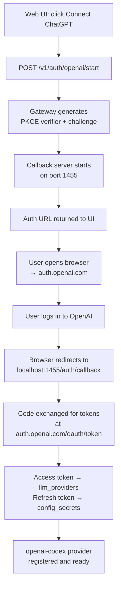

# Authentication

> Connect GoClaw to ChatGPT via OAuth — no API key needed, uses your existing OpenAI account.

## Overview

GoClaw supports OAuth 2.0 PKCE authentication for the OpenAI/Codex provider. This lets you use ChatGPT (the `openai-codex` provider) without a paid API key by authenticating through your OpenAI account via browser. Tokens are stored securely in the database and refreshed automatically before expiry.

This flow is distinct from standard API key providers — it is only needed if you want to use the `openai-codex` provider type.

---

## How It Works



The gateway starts a temporary HTTP server on port **1455** to receive the OAuth callback. This port must be reachable from the browser (i.e. accessible on localhost when using the web UI locally, or via port forwarding for remote servers).

---

## Starting the OAuth Flow

### Via Web UI

1. Open the GoClaw web dashboard
2. Navigate to **Providers** → **ChatGPT OAuth**
3. Click **Connect** — the gateway calls `POST /v1/auth/openai/start` and returns an auth URL
4. Your browser opens `auth.openai.com` — log in and approve access
5. The callback lands on `localhost:1455/auth/callback` — tokens are saved automatically

### Remote / VPS Environments

If the browser callback can't reach port 1455 on the server, use the **manual redirect URL** fallback:

1. Start the flow via web UI — copy the auth URL
2. Open the auth URL in your local browser
3. After approving, your browser tries to redirect to `localhost:1455/auth/callback` and fails (since the server is remote)
4. Copy the full redirect URL from the browser address bar (it starts with `http://localhost:1455/auth/callback?code=...`)
5. Paste it into the web UI's manual callback field — the UI calls `POST /v1/auth/openai/callback` with the URL
6. The gateway extracts the code, completes the exchange, and saves the tokens

---

## CLI Commands

The `./goclaw auth` subcommand talks to the running gateway to check and manage OAuth state.

### Check Status

```bash
./goclaw auth status
```

Output when authenticated:

```
OpenAI OAuth: active (provider: openai-codex)
Use model prefix 'openai-codex/' in agent config (e.g. openai-codex/gpt-4o).
```

Output when not authenticated:

```
No OAuth tokens found.
Use the web UI to authenticate with ChatGPT OAuth.
```

The command hits `GET /v1/auth/openai/status` on the running gateway. The gateway URL is resolved from environment variables:

| Variable | Default |
|----------|---------|
| `GOCLAW_GATEWAY_URL` | — (overrides host+port) |
| `GOCLAW_HOST` | `127.0.0.1` |
| `GOCLAW_PORT` | `3577` |

Set `GOCLAW_TOKEN` to authenticate the CLI request if the gateway requires a token.

### Logout

```bash
./goclaw auth logout
# or explicitly:
./goclaw auth logout openai
```

This calls `POST /v1/auth/openai/logout`, which:

1. Deletes the `openai-codex` provider row from `llm_providers`
2. Deletes the refresh token from `config_secrets`
3. Unregisters the `openai-codex` provider from the in-memory registry

---

## Gateway OAuth Endpoints

All endpoints require `Authorization: Bearer <GOCLAW_TOKEN>`.

| Method | Path | Description |
|--------|------|-------------|
| `GET` | `/v1/auth/openai/status` | Check if OAuth is active and token is valid — returns `{ authenticated, provider_name? }` |
| `POST` | `/v1/auth/openai/start` | Start OAuth flow — returns `{ auth_url }` or `{ status: "already_authenticated" }` |
| `POST` | `/v1/auth/openai/callback` | Submit redirect URL for manual exchange — body: `{ redirect_url }` — returns `{ authenticated, provider_name, provider_id }` |
| `POST` | `/v1/auth/openai/logout` | Remove stored tokens and unregister provider — returns `{ status: "logged out" }` |

---

## Token Storage and Refresh

GoClaw stores OAuth tokens across two tables:

| Storage | What is stored |
|---------|---------------|
| `llm_providers` | Access token (as `api_key`), expiry timestamp in `settings` JSONB |
| `config_secrets` | Refresh token under key `oauth.openai-codex.refresh_token` |

The `DBTokenSource` handles the full lifecycle:

- **Cache**: the access token is cached in memory and reused until within 5 minutes of expiry
- **Auto-refresh**: when the token is about to expire, the refresh token is retrieved from `config_secrets` and a new token is fetched from `auth.openai.com/oauth/token`
- **Persistence**: both the new access token (in `llm_providers`) and new refresh token (in `config_secrets`) are written back to the database after refresh
- **Graceful degradation**: if refresh fails but a token still exists, the existing token is returned and a warning is logged — the provider stays usable until the token actually expires

The OAuth scopes requested during login are:

```
openid profile email offline_access api.connectors.read api.connectors.invoke
```

`offline_access` is what grants the refresh token for long-lived sessions.

---

## Using the Provider in Agent Config

Once authenticated, reference the provider with the `openai-codex/` prefix:

```json
{
  "agent": {
    "key": "my-agent",
    "provider": "openai-codex/gpt-4o"
  }
}
```

The `openai-codex` provider name is fixed — it matches the `DefaultProviderName` constant in the oauth package.

---

## Examples

**Check status after onboarding:**

```bash
source .env.local
./goclaw auth status
```

**Force re-authentication (logout then reconnect via UI):**

```bash
./goclaw auth logout
# then open web UI → Providers → Connect ChatGPT
```

---

## Common Issues

| Issue | Cause | Fix |
|-------|-------|-----|
| `cannot reach gateway at http://127.0.0.1:3577` | Gateway not running | Start gateway first: `./goclaw` |
| `failed to start OAuth flow (is port 1455 available?)` | Port 1455 in use | Stop whatever is using port 1455 |
| Callback fails on remote server | Browser can't reach server port 1455 | Use the manual redirect URL flow (paste URL into web UI) |
| `token invalid or expired` from status endpoint | Refresh failed | Run `./goclaw auth logout` then re-authenticate |
| `unknown provider: xyz` from logout | Unsupported provider name | Only `openai` is supported: `./goclaw auth logout openai` |
| Agent gets 401 from ChatGPT | Token expired and refresh failed | Re-authenticate via web UI |

---

## What's Next

- [Providers Overview](/providers-overview) — all supported LLM providers and how to configure them
- [Hooks & Quality Gates](/hooks-quality-gates) — add validation to agent outputs

<!-- goclaw-source: 57754a5 | updated: 2026-03-18 -->
