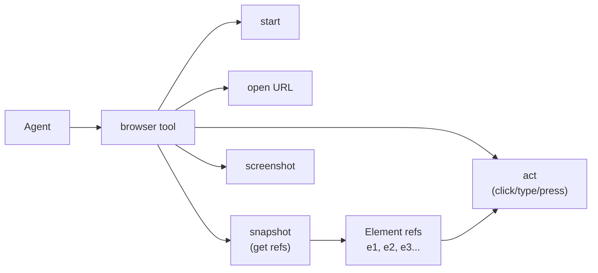

# Browser Automation

> Give your agents a real browser — navigate pages, take screenshots, scrape content, and fill forms.

## Overview

GoClaw includes a built-in browser automation tool powered by [Rod](https://github.com/go-rod/rod) and the Chrome DevTools Protocol (CDP). Agents can open URLs, interact with elements, capture screenshots, and read page content — all through a structured tool interface.

Two operating modes are supported:

- **Local Chrome**: Rod launches a local Chrome process automatically
- **Remote Chrome sidecar**: Connect to a headless Chrome container via CDP (recommended for servers and Docker)

---

## Docker Setup (Recommended)

For production or server deployments, run Chrome as a sidecar container using `docker-compose.browser.yml`:

```bash
docker compose \
  -f docker-compose.yml \
  -f docker-compose.postgres.yml \
  -f docker-compose.browser.yml \
  up -d --build
```

This starts a `zenika/alpine-chrome:124` container exposing CDP on port 9222. GoClaw connects to it automatically via the `GOCLAW_BROWSER_REMOTE_URL` environment variable, which the compose file sets to `ws://chrome:9222`.

```yaml
# docker-compose.browser.yml (excerpt)
services:
  chrome:
    image: zenika/alpine-chrome:124
    command:
      - --no-sandbox
      - --remote-debugging-address=0.0.0.0
      - --remote-debugging-port=9222
      - --remote-allow-origins=*
      - --disable-gpu
      - --disable-dev-shm-usage
    ports:
      - "${CHROME_CDP_PORT:-9222}:9222"
    shm_size: 2gb
    healthcheck:
      test: ["CMD-SHELL", "wget -qO- http://127.0.0.1:9222/json/version >/dev/null 2>&1"]
      interval: 5s
      timeout: 3s
      retries: 5
    deploy:
      resources:
        limits:
          memory: 2G
          cpus: '2.0'
    restart: unless-stopped

  goclaw:
    environment:
      - GOCLAW_BROWSER_REMOTE_URL=ws://chrome:9222
    depends_on:
      chrome:
        condition: service_healthy
```

The Chrome container has a healthcheck that confirms CDP is ready before GoClaw starts.

---

## Local Chrome (Dev Only)

Without `GOCLAW_BROWSER_REMOTE_URL`, Rod launches a local Chrome process. Chrome must be installed on the host. This is suitable for local development but not recommended for servers.

---

## How the Browser Tool Works

Agents interact with the browser via a single `browser` tool with an `action` parameter:



The standard workflow is:

1. `start` — launch or connect to browser (auto-triggered by most actions)
2. `open` — open a URL in a new tab, get `targetId`
3. `snapshot` — get the page accessibility tree with element refs (`e1`, `e2`, ...)
4. `act` — interact with elements using refs
5. `snapshot` again to verify changes

---

## Available Actions

| Action | Description | Required params |
|--------|-------------|----------------|
| `status` | Browser running state and tab count | — |
| `start` | Launch or connect browser | — |
| `stop` | Close local browser or disconnect from remote sidecar (sidecar container keeps running) | — |
| `tabs` | List open tabs with URLs | — |
| `open` | Open URL in new tab | `targetUrl` |
| `close` | Close a tab | `targetId` |
| `snapshot` | Get accessibility tree with element refs | `targetId` (optional) |
| `screenshot` | Capture PNG screenshot | `targetId`, `fullPage` |
| `navigate` | Navigate existing tab to URL | `targetId`, `targetUrl` |
| `console` | Get browser console messages (buffer is cleared after each call) | `targetId` |
| `act` | Interact with an element | `request` object |

### Act Request Kinds

| Kind | What it does | Required fields | Optional fields |
|------|-------------|----------------|----------------|
| `click` | Click an element | `ref` | `doubleClick` (bool), `button` (`"left"`, `"right"`, `"middle"`) |
| `type` | Type text into an element | `ref`, `text` | `submit` (bool — press Enter after), `slowly` (bool — character-by-character) |
| `press` | Press a keyboard key | `key` (e.g. `"Enter"`, `"Tab"`, `"Escape"`) | — |
| `hover` | Hover over an element | `ref` | — |
| `wait` | Wait for condition | one of: `timeMs`, `text`, `textGone`, `url`, or `fn` | — |
| `evaluate` | Run JavaScript and return result | `fn` | — |

---

## Use Cases

### Screenshot a Page

```json
{ "action": "open", "targetUrl": "https://example.com" }
```
```json
{ "action": "screenshot", "targetId": "<id from open>", "fullPage": true }
```

The screenshot is saved to a temp file and returned as `MEDIA:/tmp/goclaw_screenshot_*.png` — the media pipeline delivers it as an image (e.g. Telegram photo).

### Scrape Page Content

```json
{ "action": "open", "targetUrl": "https://example.com" }
```
```json
{ "action": "snapshot", "targetId": "<id>", "compact": true, "maxChars": 8000 }
```

The snapshot returns an accessibility tree. Use `interactive: true` to see only clickable/typeable elements. Use `depth` to limit tree depth.

### Fill and Submit a Form

```json
{ "action": "open", "targetUrl": "https://example.com/login" }
```
```json
{ "action": "snapshot", "targetId": "<id>" }
```
```json
{
  "action": "act",
  "targetId": "<id>",
  "request": { "kind": "type", "ref": "e3", "text": "user@example.com" }
}
```
```json
{
  "action": "act",
  "targetId": "<id>",
  "request": { "kind": "type", "ref": "e4", "text": "mypassword", "submit": true }
}
```

`submit: true` presses Enter after typing.

### Run JavaScript

```json
{
  "action": "act",
  "targetId": "<id>",
  "request": { "kind": "evaluate", "fn": "document.title" }
}
```

---

## Snapshot Options

| Parameter | Type | Default | Description |
|-----------|------|---------|-------------|
| `maxChars` | number | 8000 | Max characters in snapshot output |
| `interactive` | boolean | false | Show only interactive elements |
| `compact` | boolean | false | Remove empty structural nodes |
| `depth` | number | unlimited | Max tree depth |

---

## Security Considerations

- **SSRF protection**: GoClaw applies SSRF filtering to tool inputs — agents cannot be trivially directed to internal network addresses.
- **No-sandbox flag**: The Docker compose config passes `--no-sandbox` which is required inside containers. Do not use this on the host without container isolation.
- **Shared memory**: Chrome is memory-intensive. The sidecar is configured with `shm_size: 2gb` and a 2GB memory limit. Tune this for your workload.
- **Exposed CDP port**: By default, port 9222 is only accessible within the Docker network. Do not expose it publicly — CDP allows full browser control with no authentication.

---

## Examples

**Agent prompt to trigger browser use:**

```
Take a screenshot of https://news.ycombinator.com and show me the top 5 stories.
```

The agent will call `browser` with `open`, then `screenshot` or `snapshot` depending on the task.

**Check browser status in agent conversation:**

```
Are you connected to a browser?
```

The agent calls:

```json
{ "action": "status" }
```

Returns:

```json
{ "running": true, "tabs": 1, "url": "https://example.com" }
```

---

## Common Issues

| Issue | Cause | Fix |
|-------|-------|-----|
| `failed to start browser: launch Chrome` | Chrome not installed locally | Use Docker sidecar instead |
| `resolve remote Chrome at ws://chrome:9222` | Sidecar not healthy yet | Wait for `service_healthy` or increase startup timeout |
| `snapshot failed` | Page not loaded | Add a `wait` action after `open` |
| Screenshots are blank | GPU rendering issue | Ensure `--disable-gpu` flag is set (already in compose) |
| High memory usage | Many open tabs | Call `close` on tabs when done |
| CDP port exposed publicly | Misconfigured ports | Remove `9222` from host port mappings in production |

---

## What's Next

- [Exec Approval](/exec-approval) — require human sign-off before running commands
- [Hooks & Quality Gates](/hooks-quality-gates) — add pre/post checks to agent actions

<!-- goclaw-source: 57754a5 | updated: 2026-03-18 -->
