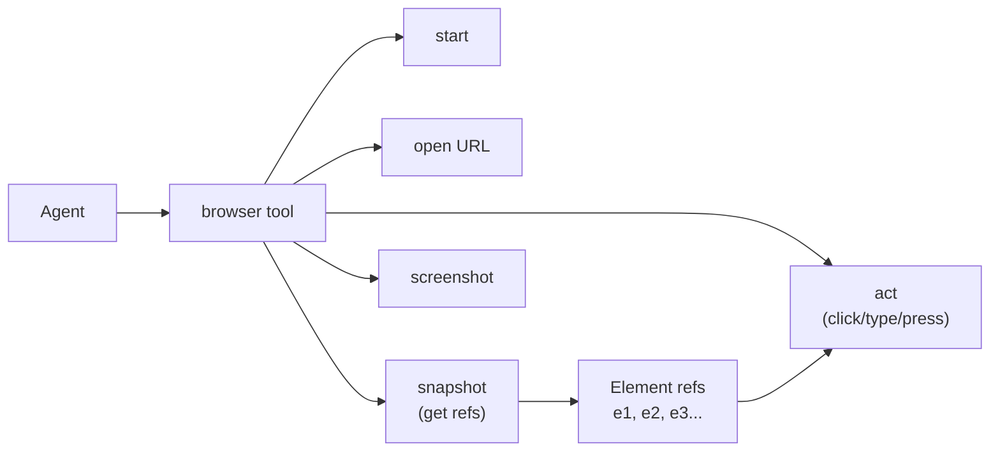
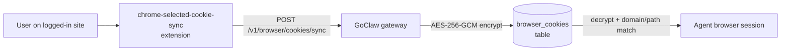

# Browser Automation

> Give your agents a real browser — navigate pages, take screenshots, scrape content, and fill forms.

## Overview

GoClaw includes a built-in browser automation tool powered by [Rod](https://github.com/go-rod/rod) and the Chrome DevTools Protocol (CDP). Agents can open URLs, interact with elements, capture screenshots, and read page content — all through a structured tool interface.

Two operating modes are supported:

- **Local Chrome**: Rod launches a local Chrome process automatically
- **Remote Chrome sidecar**: Connect to a headless Chrome container via CDP (recommended for servers and Docker)

---

## Docker Setup (Recommended)

For production or server deployments, run Chrome as a sidecar container using `docker-compose.browser.yml`:

```bash
docker compose \
  -f docker-compose.yml \
  -f docker-compose.postgres.yml \
  -f docker-compose.browser.yml \
  up -d --build
```

This starts a `zenika/alpine-chrome:124` container exposing CDP on port 9222. GoClaw connects to it automatically via the `GOCLAW_BROWSER_REMOTE_URL` environment variable, which the compose file sets to `ws://chrome:9222`.

```yaml
# docker-compose.browser.yml (excerpt)
services:
  chrome:
    image: zenika/alpine-chrome:124
    command:
      - --no-sandbox
      - --remote-debugging-address=0.0.0.0
      - --remote-debugging-port=9222
      - --remote-allow-origins=*
      - --disable-gpu
      - --disable-dev-shm-usage
    ports:
      - "${CHROME_CDP_PORT:-9222}:9222"
    shm_size: 2gb
    healthcheck:
      test: ["CMD-SHELL", "wget -qO- http://127.0.0.1:9222/json/version >/dev/null 2>&1"]
      interval: 5s
      timeout: 3s
      retries: 5
    deploy:
      resources:
        limits:
          memory: 2G
          cpus: '2.0'
    restart: unless-stopped

  goclaw:
    environment:
      - GOCLAW_BROWSER_REMOTE_URL=ws://chrome:9222
    depends_on:
      chrome:
        condition: service_healthy
```

The Chrome container has a healthcheck that confirms CDP is ready before GoClaw starts.

---

## Local Chrome (Dev Only)

Without `GOCLAW_BROWSER_REMOTE_URL`, Rod launches a local Chrome process. Chrome must be installed on the host. This is suitable for local development but not recommended for servers.

---

## How the Browser Tool Works

Agents interact with the browser via a single `browser` tool with an `action` parameter:


```mermaid
flowchart LR
    AGENT["Agent"] --> TOOL["browser tool"]
    TOOL --> START["start"]
    TOOL --> OPEN["open URL"]
    TOOL --> SNAP["snapshot\n(get refs)"]
    TOOL --> ACT["act\n(click/type/press)"]
    TOOL --> SHOT["screenshot"]
    SNAP --> REFS["Element refs\ne1, e2, e3..."]
    REFS --> ACT
```

The standard workflow is:

1. `start` — launch or connect to browser (auto-triggered by most actions)
2. `open` — open a URL in a new tab, get `targetId`
3. `snapshot` — get the page accessibility tree with element refs (`e1`, `e2`, ...)
4. `act` — interact with elements using refs
5. `snapshot` again to verify changes

---

## Available Actions

| Action | Description | Required params |
|--------|-------------|----------------|
| `status` | Browser running state and tab count | — |
| `start` | Launch or connect browser | — |
| `stop` | Close local browser or disconnect from remote sidecar (sidecar container keeps running) | — |
| `tabs` | List open tabs with URLs | — |
| `open` | Open URL in new tab | `targetUrl` |
| `close` | Close a tab | `targetId` |
| `snapshot` | Get accessibility tree with element refs | `targetId` (optional) |
| `screenshot` | Capture PNG screenshot | `targetId`, `fullPage` |
| `navigate` | Navigate existing tab to URL | `targetId`, `targetUrl` |
| `console` | Get browser console messages (buffer is cleared after each call) | `targetId` |
| `act` | Interact with an element | `request` object |

### Act Request Kinds

| Kind | What it does | Required fields | Optional fields |
|------|-------------|----------------|----------------|
| `click` | Click an element | `ref` | `doubleClick` (bool), `button` (`"left"`, `"right"`, `"middle"`) |
| `type` | Type text into an element | `ref`, `text` | `submit` (bool — press Enter after), `slowly` (bool — character-by-character) |
| `press` | Press a keyboard key | `key` (e.g. `"Enter"`, `"Tab"`, `"Escape"`) | — |
| `hover` | Hover over an element | `ref` | — |
| `wait` | Wait for condition | one of: `timeMs`, `text`, `textGone`, `url`, or `fn` | — |
| `evaluate` | Run JavaScript and return result | `fn` | — |

---

## Use Cases

### Screenshot a Page

```json
{ "action": "open", "targetUrl": "https://example.com" }
```
```json
{ "action": "screenshot", "targetId": "<id from open>", "fullPage": true }
```

The screenshot is saved to a temp file and returned as `MEDIA:/tmp/goclaw_screenshot_*.png` — the media pipeline delivers it as an image (e.g. Telegram photo).

### Scrape Page Content

```json
{ "action": "open", "targetUrl": "https://example.com" }
```
```json
{ "action": "snapshot", "targetId": "<id>", "compact": true, "maxChars": 8000 }
```

The snapshot returns an accessibility tree. Use `interactive: true` to see only clickable/typeable elements. Use `depth` to limit tree depth.

### Fill and Submit a Form

```json
{ "action": "open", "targetUrl": "https://example.com/login" }
```
```json
{ "action": "snapshot", "targetId": "<id>" }
```
```json
{
  "action": "act",
  "targetId": "<id>",
  "request": { "kind": "type", "ref": "e3", "text": "user@example.com" }
}
```
```json
{
  "action": "act",
  "targetId": "<id>",
  "request": { "kind": "type", "ref": "e4", "text": "mypassword", "submit": true }
}
```

`submit: true` presses Enter after typing.

### Run JavaScript

```json
{
  "action": "act",
  "targetId": "<id>",
  "request": { "kind": "evaluate", "fn": "document.title" }
}
```

---

## Snapshot Options

| Parameter | Type | Default | Description |
|-----------|------|---------|-------------|
| `maxChars` | number | 8000 | Max characters in snapshot output |
| `interactive` | boolean | false | Show only interactive elements |
| `compact` | boolean | false | Remove empty structural nodes |
| `depth` | number | unlimited | Max tree depth |

---

## Selected Cookie Sync

Server-side browser sessions start with no login state. **Selected cookie sync** lets a user pick specific cookies from a site they are logged into and copy them into GoClaw, so an agent's browser can act as that signed-in session — without sharing a password.

A small Chrome extension (`chrome-selected-cookie-sync`) does the picking. There is **no automatic background sync**: the user opens the extension on the active tab, checks the exact cookies to share, and clicks **Sync**. GoClaw stores the values encrypted and replays them into the agent's browser only for matching domains and paths.


```mermaid
flowchart LR
    USER["User on logged-in site"] --> EXT["chrome-selected-cookie-sync\nextension"]
    EXT -->|"POST /v1/browser/cookies/sync"| GW["GoClaw gateway"]
    GW -->|"AES-256-GCM encrypt"| DB[("browser_cookies\ntable")]
    DB -->|"decrypt + domain/path match"| AGENT["Agent browser session"]
```

### Endpoints

All three endpoints require **operator** auth (gateway token, API key, or paired-browser auth).

| Method | Path | Purpose |
|--------|------|---------|
| `POST` | `/v1/browser/cookies/sync` | Upsert selected cookies for an agent |
| `GET` | `/v1/browser/cookies?agent_id=&domain=&name=&path=` | List synced cookie **metadata** (never values) |
| `DELETE` | `/v1/browser/cookies?agent_id=&domain=&name=&path=` | Revoke synced cookies |

The client only ever chooses `agent_id`. **Tenant and user are derived from the auth context**, not from the request body — a client cannot spoof another user's cookies. Sync is rejected when the auth context has no user, or when no `agent_id` is supplied.

**Sync request body:**

```json
{
  "agent_id": "default",
  "source": "chrome-selected-cookie-sync",
  "cookies": [
    {
      "domain": "example.com",
      "name": "session",
      "path": "/",
      "value": "REDACTED",
      "secure": true,
      "httpOnly": true,
      "sameSite": "lax",
      "expirationDate": 1789999999
    }
  ]
}
```

**Response:** `{ "synced": 1 }`. Limits: max 200 cookies per request, 16 KB per cookie value, 1 MB total body.

The `GET` response returns metadata only — `domain`, `name`, `path`, `secure`, `httpOnly`, `sameSite`, `expiresAt`, `source`, `updatedAt`. Cookie **values are never returned**.

### Scope and uniqueness

Each stored cookie is keyed by `(tenant_id, user_id, agent_id, domain, path, name)`. Re-syncing the same cookie updates the existing row (upsert). This scope is what keeps one user's cookies from leaking into another user's or another agent's browser session.

### Security

- **Encrypted at rest**: cookie values are encrypted with AES-256-GCM before being written to the `browser_cookies` table. Requires the `GOCLAW_ENCRYPTION_KEY` environment variable — **sync and list fail closed (HTTP 503) when it is unset**, so cookies are never persisted in plaintext.
- **Write-only values**: the list endpoint and audit logs return metadata only. Cookie values never appear in API responses or logs.
- **Scoped replay**: the agent browser receives a cookie only when the requested URL's host and path match the stored cookie's domain/path, the cookie has not expired, and the tenant/user/agent scope matches.
- **Explicit selection**: the extension reads cookies only after the user grants host permission for the active site, and sends only the cookies the user checked.
- **Revocation**: delete from the extension or call `DELETE /v1/browser/cookies?agent_id=<agent>&domain=<domain>` to remove synced cookies. Omitting `domain` removes all cookies for that agent.

### How the agent consumes synced cookies

When the agent's browser navigates to an `http(s)` URL, GoClaw's cookie provider looks up cookies for the current browser scope (`tenant_id` / `user_id` / `agent_id`), decrypts them, and injects only those whose domain and path match the target URL (and that have not expired). Non-HTTP schemes get no cookies. The agent never sees raw values — they are applied directly to the Chrome session via CDP.

### Install the extension

The extension lives in the GoClaw repo at `extensions/chrome-selected-cookie-sync/`.

1. Open `chrome://extensions`, enable **Developer mode**, click **Load unpacked**, and select the `extensions/chrome-selected-cookie-sync/` folder.
2. Open a tab on the site you are logged into, then click the extension icon.
3. Fill in the popup:
   - **Gateway URL** — e.g. `http://localhost:18790`
   - **Token** — an operator token (sent as `Authorization: Bearer <token>`)
   - **User ID** — sent as the `X-GoClaw-User-Id` header
   - **Agent ID** — e.g. `default`
4. Click **Grant access** to give the extension host permission for the current site, then **Refresh** to list the site's cookies.
5. Check the cookies you want to share (or **Select all**), then click **Sync**. The popup confirms `Synced N cookies.`

Settings are saved in `chrome.storage.local`. The extension requests gateway-origin permission before sending, and asks for active-tab host permission before reading cookies.

---

## Security Considerations

- **SSRF protection**: GoClaw applies SSRF filtering to tool inputs — agents cannot be trivially directed to internal network addresses.
- **No-sandbox flag**: The Docker compose config passes `--no-sandbox` which is required inside containers. Do not use this on the host without container isolation.
- **Shared memory**: Chrome is memory-intensive. The sidecar is configured with `shm_size: 2gb` and a 2GB memory limit. Tune this for your workload.
- **Exposed CDP port**: By default, port 9222 is only accessible within the Docker network. Do not expose it publicly — CDP allows full browser control with no authentication.

---

## Examples

**Agent prompt to trigger browser use:**

```
Take a screenshot of https://news.ycombinator.com and show me the top 5 stories.
```

The agent will call `browser` with `open`, then `screenshot` or `snapshot` depending on the task.

**Check browser status in agent conversation:**

```
Are you connected to a browser?
```

The agent calls:

```json
{ "action": "status" }
```

Returns:

```json
{ "running": true, "tabs": 1, "url": "https://example.com" }
```

---

## Common Issues

| Issue | Cause | Fix |
|-------|-------|-----|
| `failed to start browser: launch Chrome` | Chrome not installed locally | Use Docker sidecar instead |
| `resolve remote Chrome at ws://chrome:9222` | Sidecar not healthy yet | Wait for `service_healthy` or increase startup timeout |
| `snapshot failed` | Page not loaded | Add a `wait` action after `open` |
| Screenshots are blank | GPU rendering issue | Ensure `--disable-gpu` flag is set (already in compose) |
| High memory usage | Many open tabs | Call `close` on tabs when done |
| CDP port exposed publicly | Misconfigured ports | Remove `9222` from host port mappings in production |

---

## What's Next

- [Exec Approval](/exec-approval) — require human sign-off before running commands
- [Hooks & Quality Gates](/hooks-quality-gates) — add pre/post checks to agent actions

<!-- goclaw-source: d85bf171 | updated: 2026-06-07 -->
