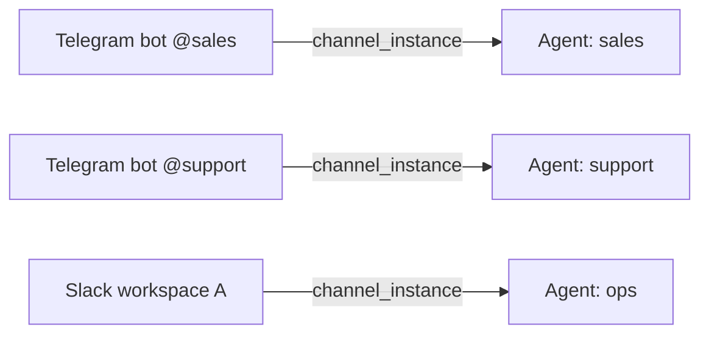

# Channel Instances

> Run multiple accounts per channel type — each with its own credentials, agent binding, and writer permissions.

## Overview

A **channel instance** is a named connection between one messaging account and one agent. It stores the account credentials (encrypted at rest), an optional channel-specific config, and the ID of the agent that owns it.

Because instances are stored in the database and identified by UUID, you can:

- Connect multiple Telegram bots to different agents on the same server
- Add a second Slack workspace without touching the first
- Disable a channel without deleting it or its credentials
- Rotate credentials with a single `PUT` call

Every instance belongs to exactly one agent. When a message arrives on that channel account, GoClaw routes it to the bound agent.



### Default instances

Instances whose `name` equals a bare channel type (`telegram`, `discord`, `feishu`, `zalo_oa`, `whatsapp`) or ends with `/default` are **default** (seeded) instances. Default instances **cannot be deleted** via the API — they are managed by GoClaw at startup.

---

## Supported channel types

| `channel_type` | Description |
|---|---|
| `telegram` | Telegram bot (Bot API token) |
| `discord` | Discord bot (bot token + application ID) |
| `slack` | Slack workspace (OAuth bot token + app token) |
| `whatsapp` | WhatsApp Business (via Meta Cloud API) |
| `zalo_oa` | Zalo Official Account |
| `zalo_personal` | Zalo personal account |
| `feishu` | Feishu / Lark bot |

---

## Instance object

All API responses return an instance object with credentials masked:

```json
{
  "id": "3f2a1b4c-0000-0000-0000-000000000001",
  "name": "telegram/sales-bot",
  "display_name": "Sales Bot",
  "channel_type": "telegram",
  "agent_id": "a1b2c3d4-...",
  "credentials": { "token": "***" },
  "has_credentials": true,
  "config": {},
  "enabled": true,
  "is_default": false,
  "created_by": "admin",
  "created_at": "2025-01-01T00:00:00Z",
  "updated_at": "2025-01-01T00:00:00Z"
}
```

| Field | Type | Notes |
|---|---|---|
| `id` | UUID | Auto-generated |
| `name` | string | Unique identifier slug (e.g. `telegram/sales-bot`) |
| `display_name` | string | Human-readable label (optional) |
| `channel_type` | string | One of the supported types above |
| `agent_id` | UUID | Agent that owns this instance |
| `credentials` | object | Credential keys are shown; values are always `"***"` |
| `has_credentials` | bool | `true` if credentials are stored |
| `config` | object | Channel-specific config (optional) |
| `enabled` | bool | `false` disables the instance without deleting it |
| `is_default` | bool | `true` for seeded instances — cannot be deleted |

---

## REST API

All endpoints require `Authorization: Bearer <token>`.

### List instances

```bash
GET /v1/channels/instances
```

Query parameters: `search`, `limit` (max 200, default 50), `offset`.

```bash
curl http://localhost:8080/v1/channels/instances \
  -H "Authorization: Bearer $GOCLAW_TOKEN"
```

Response:

```json
{
  "instances": [...],
  "total": 4,
  "limit": 50,
  "offset": 0
}
```

---

### Get instance

```bash
GET /v1/channels/instances/{id}
```

```bash
curl http://localhost:8080/v1/channels/instances/3f2a1b4c-... \
  -H "Authorization: Bearer $GOCLAW_TOKEN"
```

---

### Create instance

```bash
POST /v1/channels/instances
```

Required fields: `name`, `channel_type`, `agent_id`.

```bash
curl -X POST http://localhost:8080/v1/channels/instances \
  -H "Authorization: Bearer $GOCLAW_TOKEN" \
  -H "Content-Type: application/json" \
  -d '{
    "name": "telegram/sales-bot",
    "display_name": "Sales Bot",
    "channel_type": "telegram",
    "agent_id": "a1b2c3d4-...",
    "credentials": {
      "token": "7123456789:AAF..."
    },
    "enabled": true
  }'
```

Returns `201 Created` with the new instance object (credentials masked).

---

### Update instance

```bash
PUT /v1/channels/instances/{id}
```

Send only the fields you want to change. Credential updates are **merged** into existing credentials — partial updates do not wipe other credential keys.

```bash
# Rotate just the bot token, keep other credentials intact
curl -X PUT http://localhost:8080/v1/channels/instances/3f2a1b4c-... \
  -H "Authorization: Bearer $GOCLAW_TOKEN" \
  -H "Content-Type: application/json" \
  -d '{
    "credentials": { "token": "7999999999:BBG..." }
  }'
```

```bash
# Disable an instance without deleting it
curl -X PUT http://localhost:8080/v1/channels/instances/3f2a1b4c-... \
  -H "Authorization: Bearer $GOCLAW_TOKEN" \
  -H "Content-Type: application/json" \
  -d '{ "enabled": false }'
```

Returns `{ "status": "updated" }`.

---

### Delete instance

```bash
DELETE /v1/channels/instances/{id}
```

Returns `403 Forbidden` if the instance is a default (seeded) instance.

```bash
curl -X DELETE http://localhost:8080/v1/channels/instances/3f2a1b4c-... \
  -H "Authorization: Bearer $GOCLAW_TOKEN"
```

---

## Channel Health

Each channel instance exposes a runtime health snapshot. GoClaw tracks the current lifecycle state, failure classification, failure counters, and an operator remediation hint.

### Health states

| State | Meaning |
|---|---|
| `registered` | Instance created but not yet started |
| `starting` | Channel is initializing (connecting to upstream) |
| `healthy` | Channel is running and accepting messages |
| `degraded` | Channel is running but experiencing issues |
| `failed` | Channel failed to start or crashed |
| `stopped` | Channel was intentionally stopped |

### Failure classification

When a channel enters `failed` or `degraded` state, GoClaw classifies the error into one of four kinds:

| Kind | Examples | Retryable |
|---|---|---|
| `auth` | 401 Unauthorized, invalid token | No |
| `config` | Missing credentials, invalid proxy URL, agent not found | No |
| `network` | Timeout, connection refused, DNS failure, EOF | Yes |
| `unknown` | Unexpected errors | Yes |

### Remediation hints

Each failed channel includes a `remediation` object with a `code`, `headline`, and `hint` pointing to the relevant UI surface (`credentials`, `advanced`, `reauth`, or `details`). For example, a Zalo Personal auth failure suggests re-opening the sign-in flow rather than checking credentials.

Health data is available in the channel instance detail view in the Web UI and via the `GET /v1/channels/instances/{id}` endpoint.

---

## Group file writers

Each channel instance exposes writer-management endpoints that delegate to its bound agent. Writers control who can upload files through the group file feature.

```bash
# List writer groups for a channel instance
GET /v1/channels/instances/{id}/writers/groups

# List writers in a group
GET /v1/channels/instances/{id}/writers?group_id=<group_id>

# Add a writer
POST /v1/channels/instances/{id}/writers
{
  "group_id": "...",
  "user_id": "123456789",
  "display_name": "Alice",
  "username": "alice"
}

# Remove a writer
DELETE /v1/channels/instances/{id}/writers/{userId}?group_id=<group_id>
```

---

## Credentials security

- Credentials are **AES-encrypted** before storage in PostgreSQL.
- API responses **never return plaintext credentials** — all values are replaced with `"***"`.
- `has_credentials: true` in the response confirms credentials are stored.
- Partial credential updates are safe: GoClaw merges the new keys into the existing (decrypted) object before re-encrypting.

---

## Common issues

| Issue | Cause | Fix |
|---|---|---|
| `403` on delete | Instance is a default/seeded instance | Default instances cannot be deleted; disable them with `enabled: false` instead |
| `400 invalid channel_type` | Typo or unsupported type | Use one of: `telegram`, `discord`, `slack`, `whatsapp`, `zalo_oa`, `zalo_personal`, `feishu` |
| Messages not routing to agent | Instance is disabled or `agent_id` is wrong | Verify `enabled: true` and the correct `agent_id` |
| Credentials not persisted | `GOCLAW_ENCRYPTION_KEY` not set | Set the encryption key env var; credentials require it |
| Cache stale after update | In-memory cache not yet refreshed | GoClaw broadcasts a cache-invalidate event on every write; cache refreshes within seconds |

---

## What's Next

- [Channel Overview](/channels-overview)
- [Multi-Channel Setup](/recipe-multi-channel)
- [Multi-Tenancy](/multi-tenancy)

<!-- goclaw-source: 050aafc9 | updated: 2026-04-09 -->
