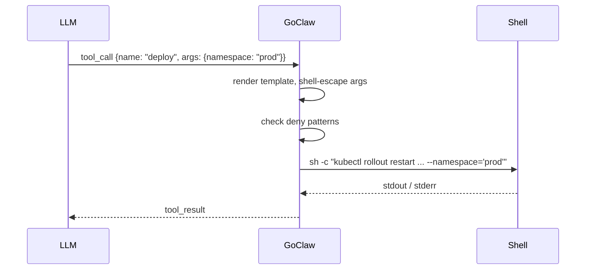

# Custom Tools

> Give your agents new shell-backed capabilities at runtime — no recompile, no restart.

## Overview

Custom tools let you extend any agent with commands that run on your server. You define a name, a description the LLM uses to decide when to call the tool, a JSON Schema for the parameters, and a shell command template. GoClaw stores the definition in PostgreSQL, loads it at request time, and handles shell-escaping so the LLM cannot inject arbitrary shell syntax.

Tools can be **global** (available to all agents) or **scoped to a single agent** by setting `agent_id`.



## Creating a Tool

### Via the HTTP API

```bash
curl -X POST http://localhost:8080/v1/tools/custom \
  -H "Authorization: Bearer $GOCLAW_TOKEN" \
  -H "Content-Type: application/json" \
  -d '{
    "name": "deploy",
    "description": "Roll out the latest image to a Kubernetes namespace. Use when the user asks to deploy or restart a service.",
    "parameters": {
      "type": "object",
      "properties": {
        "namespace": {
          "type": "string",
          "description": "Target Kubernetes namespace (e.g. production, staging)"
        },
        "deployment": {
          "type": "string",
          "description": "Name of the Kubernetes deployment"
        }
      },
      "required": ["namespace", "deployment"]
    },
    "command": "kubectl rollout restart deployment/{{.deployment}} --namespace={{.namespace}}",
    "timeout_seconds": 120,
    "agent_id": "3f2a1b4c-0000-0000-0000-000000000000"
  }'
```

**Required fields:** `name` and `command`. The name must be a slug (lowercase letters, numbers, hyphens only) and cannot conflict with a built-in or MCP tool name.

### Field reference

| Field | Type | Default | Description |
|---|---|---|---|
| `name` | string | — | Unique slug identifier |
| `description` | string | — | Shown to the LLM to trigger the tool |
| `parameters` | JSON Schema | `{}` | Parameters the LLM must provide |
| `command` | string | — | Shell command template |
| `working_dir` | string | agent workspace | Override working directory |
| `timeout_seconds` | int | 60 | Execution timeout |
| `agent_id` | UUID | null | Scope to one agent; omit for global |
| `enabled` | bool | true | Disable without deleting |

### Command templates

Use `{{.paramName}}` placeholders. GoClaw replaces them with shell-escaped values using simple string replacement — not Go's `text/template` engine, so template functions and pipelines are not supported. Every substituted value is single-quoted with embedded single-quotes escaped, so even a malicious LLM cannot break out of the argument.

```bash
# These placeholders are always treated as literal strings — no template logic
kubectl rollout restart deployment/{{.deployment}} --namespace={{.namespace}}
git -C {{.repo_path}} pull origin {{.branch}}
```

### Adding environment variables (secrets)

Secrets must be set via a separate `PUT` after creation — they cannot be included in the initial `POST`. They are encrypted with AES-256-GCM before storage and are **never returned by the API**.

```bash
curl -X PUT http://localhost:8080/v1/tools/custom/{id} \
  -H "Authorization: Bearer $GOCLAW_TOKEN" \
  -H "Content-Type: application/json" \
  -d '{
    "env": {
      "KUBE_TOKEN": "eyJhbGc...",
      "SLACK_WEBHOOK": "https://hooks.slack.com/services/..."
    }
  }'
```

The variables are injected only into the child process — they are not visible to the LLM or written to logs.

## Managing Tools

```bash
# List (paginated) — returns only enabled tools
GET /v1/tools/custom?limit=50&offset=0

# Filter by agent — returns only enabled tools for that agent
GET /v1/tools/custom?agent_id=<uuid>

# Search by name or description (case-insensitive)
GET /v1/tools/custom?search=deploy

# Get single tool
GET /v1/tools/custom/{id}

# Update (partial — any field)
PUT /v1/tools/custom/{id}

# Delete
DELETE /v1/tools/custom/{id}
```

## Security

Every custom tool command is checked against the same **deny pattern list** as the built-in `exec` tool. Blocked categories include:

- Destructive file ops (`rm -rf`, `rm --recursive`, `dd if=`, `mkfs`, `shutdown`, `reboot`, fork bombs)
- Data exfiltration (`curl | sh`, `curl` with POST/PUT flags, `wget --post-data`, DNS tools: `nslookup`, `dig`, `host`, `/dev/tcp/` redirects)
- Reverse shells (`nc -e`, `ncat`, `socat`, `openssl s_client`, `telnet`, `mkfifo`, scripting language socket imports)
- Dangerous eval / code injection (`eval $`, `base64 -d | sh`)
- Privilege escalation (`sudo`, `su -`, `nsenter`, `unshare`, `mount`, `capsh`, `setcap`)
- Dangerous path operations (`chmod` on `/` paths, `chmod +x` in `/tmp`, `/var/tmp`, `/dev/shm`)
- Environment variable injection (`LD_PRELOAD=`, `DYLD_INSERT_LIBRARIES=`, `LD_LIBRARY_PATH=`, `BASH_ENV=`)
- Environment dumping (`printenv`, bare `env`, `env | ...`, `env > file`, `set`/`export -p`/`declare -x` dumps, `/proc/PID/environ`, `/proc/self/environ`)
- Container escape (`/var/run/docker.sock`, `/proc/sys/`, `/sys/kernel/`)
- Crypto mining (`xmrig`, `cpuminer`, stratum protocol)
- Filter bypass patterns (`sed /e`, `sort --compress-program`, `git --upload-pack=`, `grep --pre=`)
- Network reconnaissance (`nmap`, `masscan`, outbound `ssh`/`scp` with `@`)
- Persistence (`crontab`, writing to shell RC files like `.bashrc`, `.zshrc`)
- Process manipulation (`kill -9`, `killall`, `pkill`)

The check runs on the **fully rendered command** after all `{{.param}}` substitutions.

## Examples

### Check disk usage

```json
{
  "name": "check-disk",
  "description": "Report disk usage for a directory on the server.",
  "parameters": {
    "type": "object",
    "properties": {
      "path": { "type": "string", "description": "Directory path to check" }
    },
    "required": ["path"]
  },
  "command": "df -h {{.path}}"
}
```

### Tail application logs

```json
{
  "name": "tail-logs",
  "description": "Show the last N lines of an application log file.",
  "parameters": {
    "type": "object",
    "properties": {
      "service": { "type": "string", "description": "Service name, e.g. api, worker" },
      "lines":   { "type": "integer", "description": "Number of lines to show" }
    },
    "required": ["service", "lines"]
  },
  "command": "tail -n {{.lines}} /var/log/app/{{.service}}.log"
}
```

## Common Issues

| Issue | Cause | Fix |
|---|---|---|
| `name must be a valid slug` | Name has uppercase or spaces | Use lowercase, numbers, hyphens only |
| `tool name conflicts with existing built-in or MCP tool` | Clashes with `exec`, `read_file`, or MCP | Choose a different name |
| `command denied by safety policy` | Matches a deny pattern | Restructure command to avoid blocked ops |
| Tool not visible to agent | Wrong `agent_id` or `enabled: false` | Verify agent ID; re-enable if disabled |
| Execution timeout | Default 60 s too short for the task | Increase `timeout_seconds` |

## Built-in Tool: send_file

The `send_file` tool delivers an existing file in the workspace as an attachment — it does **not** create or modify files, only deliver them.

| Parameter | Required | Description |
|-----------|----------|-------------|
| `path` | Yes | File path (relative to workspace or absolute) |
| `caption` | No | Message to accompany the file |

**Example:** An agent has generated a report at `reports/summary.pdf` and then calls:

```json
{ "path": "reports/summary.pdf", "caption": "Here's this week's report" }
```

### DeliveredMedia Cross-Tool Dedup Contract

GoClaw maintains a `DeliveredMedia` tracker for the lifetime of an agent run. When the `message` tool sends `MEDIA:<path>`, that path is marked as delivered. If the agent subsequently calls `send_file` on the same path, the call is a **no-op** — the file is not sent again.

This prevents duplicate delivery in the common pattern where an agent reflexively calls both `write_file(deliver=true)` (which auto-sends via `message`) and `send_file` on the same file.

> Source: `internal/tools/send_file.go`, `internal/tools/message.go`

---

## Built-in Vault Tools

In addition to custom shell tools, GoClaw includes built-in vault tools for knowledge management. These are always available when the vault store is enabled.

### `vault_link` — link vault documents

Creates an explicit link between two vault documents, similar to `[[wikilinks]]` in Obsidian or Roam.

| Parameter | Required | Description |
|---|---|---|
| `from` | Yes | Source document path (workspace-relative) |
| `to` | Yes | Target document path (workspace-relative) |
| `context` | No | Note describing the relationship |
| `link_type` | No | `wikilink` (default) or `reference` |

**Doc-type inference**: If either document is not already registered in the vault, GoClaw auto-registers it as a stub, inferring `doc_type` from the file path (e.g., `.md` → `note`, media extensions → `media`). Cross-team links are blocked — both documents must belong to the same team.

```json
{
  "from": "projects/goclaw/overview.md",
  "to": "projects/goclaw/architecture.md",
  "context": "Architecture details expand on the overview",
  "link_type": "reference"
}
```

### `vault_backlinks` — find documents linking to a doc

Returns all documents that link to the specified path. Respects team boundaries — team context only shows same-team documents; personal context only shows personal documents.

| Parameter | Required | Description |
|---|---|---|
| `path` | Yes | Document path to find backlinks for |

## What's Next

- [MCP Integration](/mcp-integration) — connect external tool servers instead of writing shell commands
- [Exec Approval](/exec-approval) — require human approval before commands run
- [Sandbox](/sandbox) — run commands inside Docker for extra isolation

<!-- goclaw-source: 29457bb3 | updated: 2026-04-25 -->
