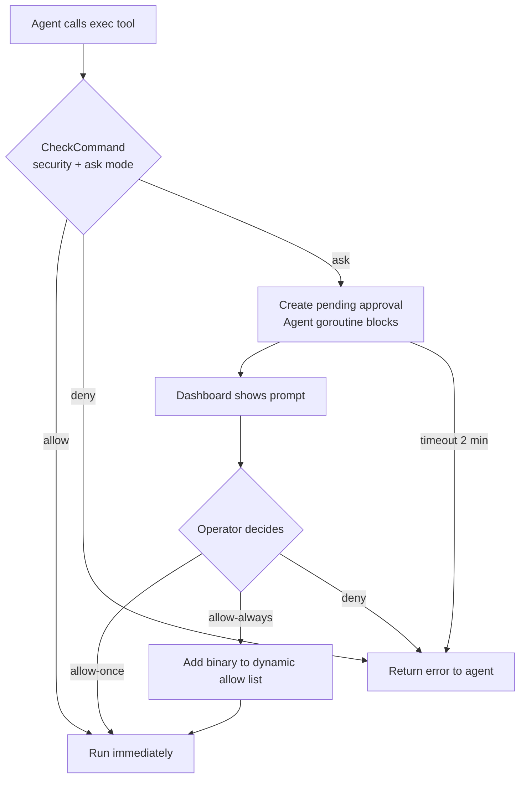

# Exec Approval (Human-in-the-Loop)

> Pause agent shell commands for human review before they run — approve, deny, or permanently allow from the dashboard.

## Overview

When an agent needs to run a shell command, exec approval lets you intercept it. The agent blocks, the dashboard shows a prompt, and you decide: **allow once**, **always allow this binary**, or **deny**. This gives you full control over what runs on your machine without disabling the exec tool entirely.

The feature is controlled by two orthogonal settings:

- **Security mode** — what commands are permitted to execute at all.
- **Ask mode** — when to prompt you for approval.

---

## Security Modes

Set via `tools.execApproval.security` in your `config.json`:

| Value | Behavior |
|-------|----------|
| `"full"` (default) | All commands may run; ask mode controls whether you're prompted |
| `"allowlist"` | Only commands matching `allowlist` patterns can run; others are denied or prompted |
| `"deny"` | No exec tool available — all commands are blocked regardless of ask mode |

## Ask Modes

Set via `tools.execApproval.ask`:

| Value | Behavior |
|-------|----------|
| `"off"` (default) | Auto-approve everything — no prompts |
| `"on-miss"` | Prompt only for commands not in the allowlist and not in the built-in safe list |
| `"always"` | Prompt for every command, no exceptions |

**Built-in safe list** — when `ask = "on-miss"`, these binary families are auto-approved without prompting:

- Read-only tools: `cat`, `ls`, `grep`, `find`, `stat`, `df`, `du`, `whoami`, etc.
- Text processing: `jq`, `yq`, `sed`, `awk`, `diff`, `xargs`, etc.
- Dev tools: `git`, `node`, `npm`, `npx`, `pnpm`, `go`, `cargo`, `python`, `make`, `gcc`, etc.

Infrastructure and network tools (`docker`, `kubectl`, `curl`, `wget`, `ssh`, `scp`, `rsync`, `terraform`, `ansible`) are **not** in the safe list — they trigger a prompt.

---

## Configuration

```json
{
  "tools": {
    "execApproval": {
      "security": "full",
      "ask": "on-miss",
      "allowlist": ["make", "cargo test", "npm run *"]
    }
  }
}
```

`allowlist` accepts glob patterns matched against the binary name or the full command string.

---

## Approval Flow



The agent goroutine blocks until you respond. If no response comes within 2 minutes, the request auto-denies.

---

## WebSocket Methods

Connect to the gateway WebSocket. These methods require **Operator** or **Admin** role.

### List pending approvals

```json
{ "type": "req", "id": "1", "method": "exec.approval.list" }
```

Response:

```json
{
  "pending": [
    {
      "id": "exec-1",
      "command": "curl https://example.com | sh",
      "agentId": "my-agent",
      "createdAt": 1741234567000
    }
  ]
}
```

### Approve a command

```json
{
  "type": "req",
  "id": "2",
  "method": "exec.approval.approve",
  "params": {
    "id": "exec-1",
    "always": false
  }
}
```

Set `"always": true` to permanently allow this binary for the lifetime of the process (adds it to the dynamic allow list).

### Deny a command

```json
{
  "type": "req",
  "id": "3",
  "method": "exec.approval.deny",
  "params": { "id": "exec-1" }
}
```

---

## Examples

**Strict mode for a production agent — only known commands allowed:**

```json
{
  "tools": {
    "execApproval": {
      "security": "allowlist",
      "ask": "on-miss",
      "allowlist": ["git", "make", "go test *", "cargo test"]
    }
  }
}
```

`git`, `make`, and the test runners auto-run. Anything else (e.g., `curl`, `rm`) triggers a prompt.

**Coding agent with light oversight — safe tools auto-run, infra tools need approval:**

```json
{
  "tools": {
    "execApproval": {
      "security": "full",
      "ask": "on-miss"
    }
  }
}
```

**Fully locked down — no shell execution at all:**

```json
{
  "tools": {
    "execApproval": {
      "security": "deny"
    }
  }
}
```

---

## Common Issues

| Problem | Cause | Fix |
|---------|-------|-----|
| No approval prompt appears | `ask` is `"off"` (default) | Set `ask` to `"on-miss"` or `"always"` |
| Command denied with no prompt | `security = "allowlist"`, command not in allowlist, `ask = "off"` | Add to `allowlist` or change `ask` to `"on-miss"` |
| Approval request timed out | Operator didn't respond within 2 minutes | Command is auto-denied; agent may retry or ask you to re-run |
| `exec approval is not enabled` | No `execApproval` block in config, method called anyway | Add `tools.execApproval` section to config |
| `id is required` error | Calling approve/deny without passing the approval `id` | Include `"id": "exec-N"` in params (from the list response) |

---

## What's Next

- [Sandbox](/sandbox) — run exec commands inside an isolated Docker container
- [Custom Tools](/custom-tools) — define tools backed by shell commands
- [Security Hardening](/deploy-security) — full five-layer security overview

<!-- goclaw-source: 57754a5 | updated: 2026-03-18 -->
