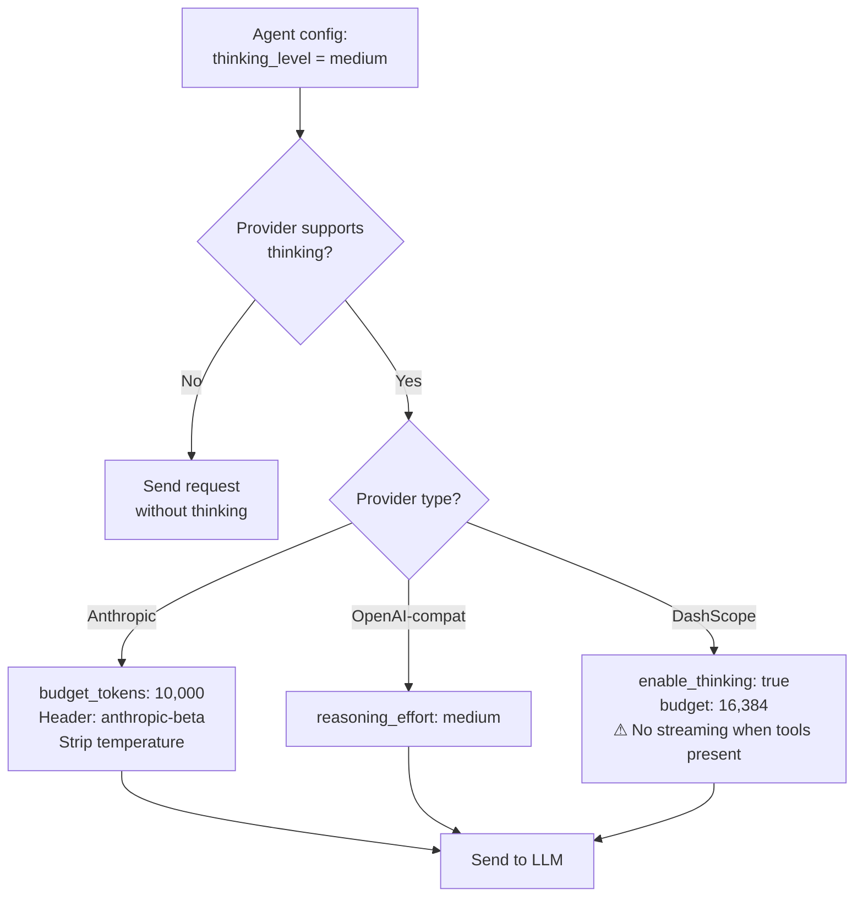
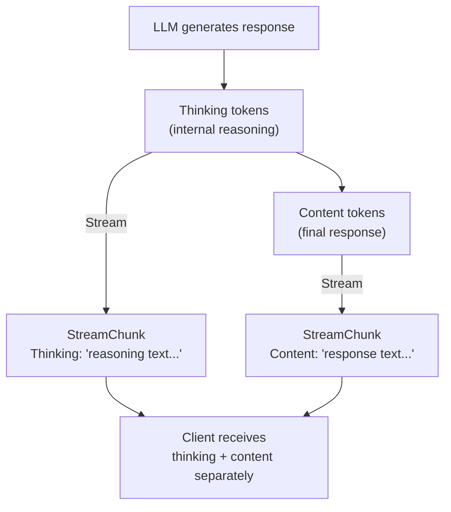
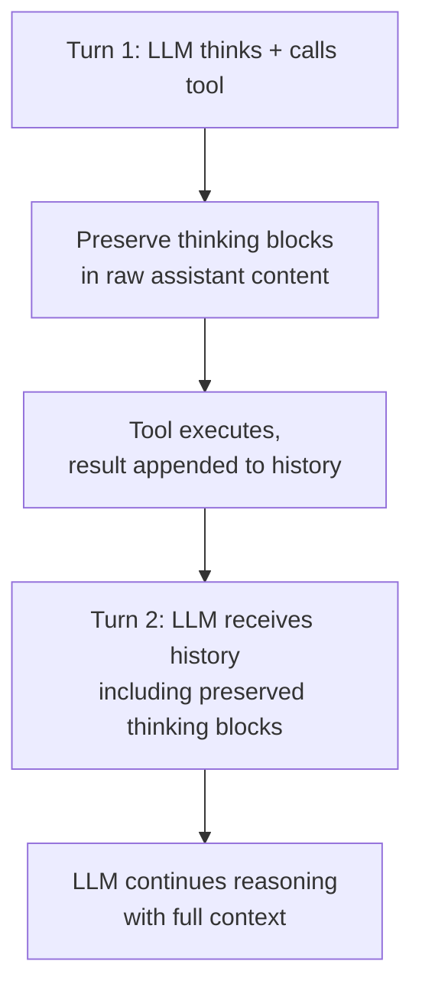

# Extended Thinking

> Let your agent "think out loud" before answering — better results on complex tasks, at the cost of extra tokens and latency.

## Overview

Extended thinking lets a supported LLM reason through a problem before producing its final reply. The model generates internal reasoning tokens that are not part of the visible response but improve the quality of complex analysis, multi-step planning, and decision-making.

GoClaw supports extended thinking across four provider families — Anthropic, OpenAI-compatible, DashScope (Alibaba Qwen), and Codex (Alibaba AI Reasoning) — through a single unified `thinking_level` setting per agent.

---

## Configuration

Set `thinking_level` in an agent's config:

| Level | Behavior |
|-------|----------|
| `off` | Thinking disabled (default) |
| `low` | Minimal thinking — fast, light reasoning |
| `medium` | Moderate thinking — balanced quality and cost |
| `high` | Maximum thinking — deep reasoning for hard tasks |

This is configured per-agent and applies to all users of that agent.

---

## Provider Mapping

Each provider translates `thinking_level` differently:



### Anthropic

| Level | Budget tokens |
|-------|:---:|
| `low` | 4,096 |
| `medium` | 10,000 |
| `high` | 32,000 |

When thinking is active, GoClaw:

- Adds `thinking: { type: "enabled", budget_tokens: N }` to the request body
- Sets the `anthropic-beta: interleaved-thinking-2025-05-14` header
- **Strips the `temperature` parameter** — Anthropic rejects thinking requests that include temperature
- Auto-adjusts `max_tokens` to `budget_tokens + 8,192` to accommodate thinking overhead

### OpenAI-Compatible (OpenAI, Groq, DeepSeek, etc.)

Maps `thinking_level` directly to `reasoning_effort`:

- `low` → `reasoning_effort: "low"`
- `medium` → `reasoning_effort: "medium"`
- `high` → `reasoning_effort: "high"`

Reasoning content arrives in `reasoning_content` during streaming and does not require special passback handling between turns.

### DashScope (Alibaba Qwen)

| Level | Budget tokens |
|-------|:---:|
| `low` | 4,096 |
| `medium` | 16,384 |
| `high` | 32,768 |

Thinking is enabled via `enable_thinking: true` plus a `thinking_budget` parameter.

**Important limitation**: DashScope cannot stream responses when tools are present — this is a provider-level constraint independent of thinking. Whenever an agent has tools defined, GoClaw automatically falls back to non-streaming mode (single `Chat()` call) and synthesizes chunk callbacks so the event flow remains consistent for clients.

---

## Streaming

When thinking is active, reasoning content streams alongside the regular reply content. Clients receive both separately:



| Provider | Thinking event | Content event |
|----------|---------------|---------------|
| Anthropic | `thinking_delta` in content blocks | `text_delta` in content blocks |
| OpenAI-compat | `reasoning_content` in delta | `content` in delta |
| DashScope | No streaming with tools (falls back to non-streaming) | Same |
| Codex | `OutputTokensDetails.ReasoningTokens` tracked | Standard content |

Thinking tokens are estimated as `character_count / 4` for context window tracking.

---

## Tool Loop Handling

When an agent uses tools, thinking must survive across multiple turns. GoClaw handles this automatically — but the mechanics differ by provider.



**Anthropic**: Thinking blocks include cryptographic `signature` fields that must be echoed back exactly in subsequent turns. GoClaw accumulates raw content blocks during streaming (including `thinking` type blocks) and re-sends them on the next turn. Dropping or modifying these blocks causes the API to reject the request or produce degraded responses.

**OpenAI-compatible**: Reasoning content is treated as metadata. Each turn's reasoning is independent — no passback is needed.

---

## Limitations

| Provider | Limitation |
|----------|-----------|
| DashScope | Cannot stream when tools are present (provider-level, not thinking-specific) — falls back to non-streaming |
| Anthropic | `temperature` is stripped when thinking is enabled |
| All | Thinking tokens count against the context window budget |
| All | Thinking increases latency and cost proportional to the budget level |

---

## Examples

**Enable medium thinking on an Anthropic agent:**

```json
{
  "agent": {
    "key": "analyst",
    "provider": "claude-opus-4-5",
    "thinking_level": "medium"
  }
}
```

At `medium`, Anthropic gets `budget_tokens: 10,000`. The agent's visible reply is unchanged — thinking happens internally.

**High thinking for a complex research agent:**

```json
{
  "agent": {
    "key": "researcher",
    "provider": "claude-opus-4-5",
    "thinking_level": "high"
  }
}
```

This sets `budget_tokens: 32,000`. Use this for tasks that require deep multi-step analysis. Expect higher latency and token cost.

**OpenAI o-series agent with low reasoning:**

```json
{
  "agent": {
    "key": "quick-reviewer",
    "provider": "o4-mini",
    "thinking_level": "low"
  }
}
```

Maps to `reasoning_effort: "low"` on the OpenAI API.

---

## Common Issues

| Issue | Cause | Fix |
|-------|-------|-----|
| `temperature` stripped unexpectedly | Anthropic thinking enabled | Expected behavior — Anthropic requires no temperature with thinking |
| DashScope agent slow with tools | Streaming always disabled when tools present | Expected — DashScope provider limitation; reduce tool count if latency matters |
| High context usage | Thinking tokens fill the window | Use `low` or `medium` level; monitor context % in logs |
| No visible thinking output | Thinking is internal by default | Reasoning chunks stream separately; check client WebSocket events |
| Thinking has no effect | Provider doesn't support thinking | Check provider type — only Anthropic, OpenAI-compat, and DashScope are supported |

---

## What's Next

- [Agents Overview](/agents-explained) — per-agent configuration reference
- [Hooks & Quality Gates](/hooks-quality-gates) — validate agent outputs after reasoning

<!-- goclaw-source: 57754a5 | updated: 2026-03-18 -->
