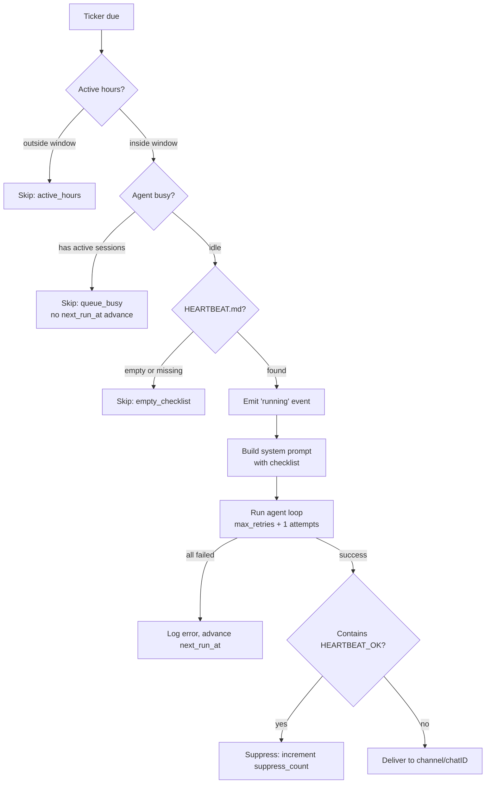

# Heartbeat

> Proactive periodic check-ins — agents execute a configurable checklist on a timer and report results to your channels.

## Overview

Heartbeat is an application-level monitoring feature: your agent wakes up on a schedule, runs through a HEARTBEAT.md checklist, and delivers results to a messaging channel (Telegram, Discord, Feishu). If everything looks fine, the agent can suppress delivery entirely using a `HEARTBEAT_OK` token — keeping your channels quiet when there's nothing to report.

This is **not** a WebSocket keep-alive. It's a user-facing proactive monitoring system with smart suppression, active-hours windows, and per-heartbeat model overrides.

## Quick Setup

### Via the Dashboard

1. Open **Agent Detail** → **Heartbeat** tab
2. Click **Configure** (or **Setup** if not yet configured)
3. Set interval, delivery channel, and write your HEARTBEAT.md checklist
4. Click **Save** — the agent will run on schedule

### Via the agent tool

Agents can self-configure heartbeat during a conversation:

```json
{
  "action": "set",
  "enabled": true,
  "interval": 1800,
  "channel": "telegram",
  "chat_id": "-100123456789",
  "active_hours": "08:00-22:00",
  "timezone": "Asia/Ho_Chi_Minh"
}
```

## HEARTBEAT.md Checklist

HEARTBEAT.md is an agent context file that defines what the agent should do during each heartbeat run. It lives alongside your other context files (BOOTSTRAP.md, SKILLS.md, etc.).

**How to write one:**

- List concrete tasks using your agent's tools — not just reading the list back
- Use `HEARTBEAT_OK` at the end when all checks pass and there's nothing to deliver
- Keep it focused: short checklists run faster and cost less

**Example HEARTBEAT.md:**

```markdown
# Heartbeat Checklist

1. Check https://api.example.com/health — if non-200, alert immediately
2. Query the DB for any failed jobs in the last 30 minutes — summarize if any
3. If all clear, respond with: HEARTBEAT_OK
```

The agent receives your checklist in its system prompt with explicit instructions to execute the tasks using its tools, not just repeat the checklist text.

## Configuration

| Field | Type | Default | Description |
|---|---|---|---|
| `enabled` | bool | `false` | Master on/off switch |
| `interval_sec` | int | 1800 | Seconds between runs (minimum: 300) |
| `prompt` | string | — | Custom check-in message (default: "Execute your heartbeat checklist now.") |
| `provider_id` | UUID | — | LLM provider override for heartbeat runs |
| `model` | string | — | Model override (e.g. `gpt-4o-mini`) |
| `isolated_session` | bool | `true` | Fresh session per run, auto-deleted after |
| `light_context` | bool | `false` | Skip context files, inject only HEARTBEAT.md |
| `max_retries` | int | 2 | Retry attempts on failure (0–10, exponential backoff) |
| `active_hours_start` | string | — | Window start in `HH:MM` format |
| `active_hours_end` | string | — | Window end in `HH:MM` format (supports midnight wrap) |
| `timezone` | string | — | IANA timezone for active hours (default: UTC) |
| `channel` | string | — | Delivery channel: `telegram`, `discord`, `feishu` |
| `chat_id` | string | — | Target chat or group ID |
| `ack_max_chars` | int | — | Reserved for future threshold logic (not yet active) |

## Scheduling & Wake Modes

The heartbeat ticker polls for due agents every 30 seconds. There are four ways a heartbeat run is triggered:

| Mode | Trigger |
|---|---|
| **Ticker poll** | Background goroutine runs `ListDue(now)` every 30s |
| **Manual test** | "Test" button in Dashboard UI or `{"action": "test"}` agent tool call |
| **RPC test** | `heartbeat.test` WebSocket RPC call |
| **Cron wake** | Cron job with `wake_heartbeat: true` completes → triggers immediate run |

**Stagger mechanism:** When you first enable a heartbeat, the initial `next_run_at` is offset by a deterministic amount (FNV-1a hash of the agent UUID, capped at 10% of `interval_sec`). This prevents multiple agents enabled at the same time from all firing at once. Subsequent runs advance by a flat interval without stagger.

## Execution Flow



**Steps:**

1. **Active hours filter** — If outside the configured window, skip and advance `next_run_at`
2. **Queue-aware check** — If agent has active chat sessions, skip *without* advancing `next_run_at` (retried on next 30s poll)
3. **Checklist load** — Reads HEARTBEAT.md from agent context files; skips if empty
4. **Emit event** — Broadcasts `heartbeat: running` to all WebSocket clients
5. **Build prompt** — Injects checklist + suppression rules into the agent's extra system prompt
6. **Run agent loop** — Exponential backoff: immediate → 1s → 2s → ... up to `max_retries + 1` total attempts
7. **Suppression check** — If response contains `HEARTBEAT_OK` anywhere, delivery is cancelled
8. **Deliver** — Publishes to the configured `channel` + `chat_id` via the message bus

## Smart Suppression

When the agent's response contains the token `HEARTBEAT_OK` anywhere, the **entire response is suppressed** — nothing is sent to the channel. This keeps your chat quiet during routine "all clear" runs.

**Use `HEARTBEAT_OK` when:**
- All monitoring checks passed
- No anomalies detected
- The checklist doesn't ask you to send content

**Do NOT use `HEARTBEAT_OK` when:**
- The checklist explicitly asks for a report, summary, joke, greeting, etc.
- Any check failed or needs attention

The `suppress_count` field tracks how often suppression fires, giving you a signal-to-noise ratio for your checklist quality.

## Provider & Model Override

You can run heartbeats on a cheaper model than your agent's default:

```json
{
  "action": "set",
  "provider_name": "openai",
  "model": "gpt-4o-mini"
}
```

This is applied only during heartbeat runs. Your agent's regular conversations continue using its configured model. The override is useful when heartbeat frequency is high and you want to manage costs.

## Light Context Mode

By default, the agent loads all its context files (BOOTSTRAP.md, SKILLS.md, INSTRUCTIONS.md, etc.) before each run. Enabling `light_context` skips all of them and injects only HEARTBEAT.md:

```json
{ "action": "set", "light_context": true }
```

This reduces context size, speeds up execution, and lowers token costs — ideal when the checklist is self-contained and doesn't rely on general agent instructions.

## Delivery Targets

The heartbeat delivers results to the `channel` + `chat_id` pair you configure. GoClaw can suggest targets automatically by inspecting your agent's session history:

- In the Dashboard → **Delivery** tab → click **Fetch targets**
- Via RPC: `heartbeat.targets` returns known `(channel, chatId, title, kind)` tuples

When an agent self-configures heartbeat using the `set` action from within a real channel conversation, the delivery target is auto-filled from the current conversation context.

## Agent Tool

The `heartbeat` built-in tool lets agents read and manage their own heartbeat configuration:

| Action | Requires Permission | Description |
|---|---|---|
| `status` | No | One-line status: enabled, interval, run counts, last/next times |
| `get` | No | Full configuration as JSON |
| `set` | Yes | Create or update config (upsert) |
| `toggle` | Yes | Enable or disable |
| `set_checklist` | Yes | Write HEARTBEAT.md content |
| `get_checklist` | No | Read HEARTBEAT.md content |
| `test` | No | Trigger an immediate run |
| `logs` | No | View paginated run history |

Permission for mutation actions (`set`, `toggle`, `set_checklist`) falls back to: deny list → allow list → agent owner → always allowed in system context (cron, subagent).

## RPC Methods

| Method | Description |
|---|---|
| `heartbeat.get` | Fetch heartbeat config for an agent |
| `heartbeat.set` | Create or update config (upsert) |
| `heartbeat.toggle` | Enable or disable (`agentId` + `enabled: bool`) |
| `heartbeat.test` | Trigger immediate run via wake channel |
| `heartbeat.logs` | Paginated run history (`limit`, `offset`) |
| `heartbeat.checklist.get` | Read HEARTBEAT.md content |
| `heartbeat.checklist.set` | Write HEARTBEAT.md content |
| `heartbeat.targets` | List known delivery targets from session history |

## Dashboard UI

**HeartbeatCard** (Agent Detail → overview) — Quick status overview: enabled toggle, interval, active hours, delivery target, model override badge, last run time, next run countdown, run/suppress counts, and last error.

**HeartbeatConfigDialog** — Five sections:
1. **Basic** — Enable switch, interval slider (5–300 min), custom prompt
2. **Schedule** — Active hours start/end (HH:MM), timezone selector
3. **Delivery** — Channel dropdown, chat ID, fetch-targets button
4. **Model & Context** — Provider/model selectors, isolated session toggle, light context toggle, max retries
5. **Checklist** — HEARTBEAT.md editor with character count, load/save buttons

**HeartbeatLogsDialog** — Paginated run history table: timestamp, status badge (ok / suppressed / error / skipped), duration, token usage, summary or error text.

## Heartbeat vs Cron

| Aspect | Heartbeat | Cron |
|---|---|---|
| Purpose | Health monitoring + proactive check-in | General-purpose scheduled tasks |
| Schedule types | Fixed interval only | `at`, `every`, `cron` (5-field expr) |
| Minimum interval | 300 seconds | No minimum |
| Checklist source | HEARTBEAT.md context file | `message` field in job |
| Suppression | `HEARTBEAT_OK` token | None |
| Queue-aware | Skips if agent busy (no advance) | Runs regardless |
| Model override | Configurable per-heartbeat | Not available |
| Light context | Configurable | Not available |
| Active hours | Built-in HH:MM + timezone | Not built-in |
| Cardinality | One per agent | Many per agent |

## Common Issues

| Issue | Cause | Fix |
|---|---|---|
| Heartbeat never fires | `enabled: false` or no `next_run_at` | Enable via Dashboard or `{"action": "toggle", "enabled": true}` |
| Runs but nothing delivered | `HEARTBEAT_OK` in all responses | Check checklist logic; use HEARTBEAT_OK only when truly silent |
| Skipped every time | Agent is always busy | Heartbeat waits for idle; reduce user conversation load or check session leaks |
| Outside active hours | `active_hours` window misconfigured | Verify `timezone` matches your IANA zone and HH:MM values |
| `interval_sec < 300` error | Minimum is 5 minutes | Set `interval_sec` to 300 or higher |
| No delivery targets | No session history for agent | Start a conversation in the target channel first; targets are auto-discovered |
| Error status, no detail | All retries failed | Check `heartbeat.logs` for `error` field; verify tools and provider are reachable |

## What's Next

- [Scheduling & Cron](scheduling-cron.md) — general-purpose scheduled tasks and cron expressions
- [Custom Tools](custom-tools.md) — give your agent shell commands and APIs to call during heartbeat runs
- [Sandbox](sandbox.md) — isolate code execution during agent runs

<!-- goclaw-source: 050aafc9 | updated: 2026-04-09 -->
