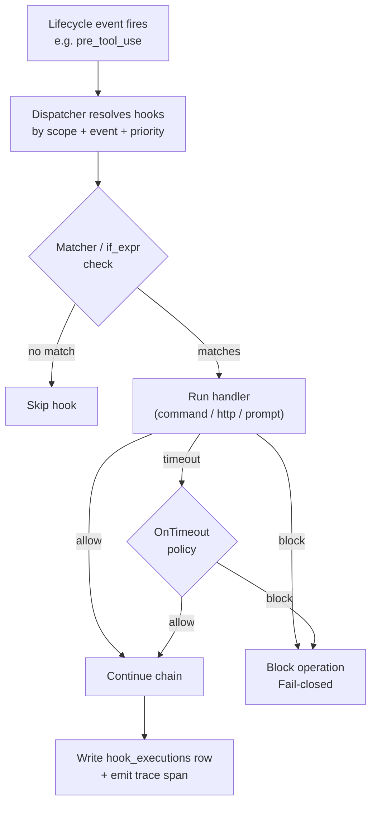

# Agent Hooks

> Intercept, observe, or inject behavior at defined points in the agent loop — block unsafe tool calls, auto-audit after writes, inject session context, or notify on stop.

## Overview

GoClaw's hook system attaches lifecycle handlers to agent sessions. Each hook targets a specific **event**, runs a **handler** (shell command, HTTP webhook, or LLM evaluator), and returns an **allow/block** decision for blocking events.

Hooks are stored in the `agent_hooks` DB table (migration `000052`) and managed via the `hooks.*` WebSocket methods or the **Hooks** panel in the Web UI.

---

## Concepts

### Events

Seven lifecycle events fire during an agent session:

| Event | Blocking | When it fires |
|---|---|---|
| `session_start` | no | A new session is established |
| `user_prompt_submit` | **yes** | Before the user's message enters the pipeline |
| `pre_tool_use` | **yes** | Before any tool call executes |
| `post_tool_use` | no | After a tool call completes |
| `stop` | no | The agent session terminates normally |
| `subagent_start` | **yes** | A sub-agent is spawned |
| `subagent_stop` | no | A sub-agent finishes |

**Blocking** events wait for the full hook chain to return an allow/block decision before the pipeline continues. Non-blocking events fire asynchronously for observation only.

### Handler Types

| Handler | Editions | Notes |
|---|---|---|
| `command` | Lite only | Local shell command; exit 2 → block, exit 0 → allow |
| `http` | Lite + Standard | POST to endpoint; JSON body → decision. SSRF-protected |
| `prompt` | Lite + Standard | LLM-based evaluation with structured tool-call output. Budget-bounded, requires `matcher` or `if_expr` |

### Scopes

- **global** — applies to all tenants. Master scope required to create.
- **tenant** — applies to one tenant (any agent).
- **agent** — applies to a specific agent within a tenant.

Hooks resolve in priority order (highest first). A single `block` decision short-circuits the chain.

---

## Execution Flow



---

## Handler Reference

### command

```json
{
  "handler_type": "command",
  "event": "pre_tool_use",
  "scope": "tenant",
  "config": {
    "command": "bash /path/to/script.sh",
    "allowed_env_vars": ["MY_VAR"],
    "cwd": "/workspace"
  }
}
```

- **Stdin**: JSON-encoded event payload.
- **Exit 0**: allow (optional `{"continue": false}` → block).
- **Exit 2**: block.
- **Other non-zero**: error → fail-closed for blocking events.
- **Env allowlist**: only keys listed in `allowed_env_vars` are passed; prevents secret leakage.

### http

```json
{
  "handler_type": "http",
  "event": "user_prompt_submit",
  "scope": "tenant",
  "config": {
    "url": "https://example.com/webhook",
    "headers": { "Authorization": "<AES-encrypted>" }
  }
}
```

- Method: POST, body = event JSON.
- Authorization header values stored AES-256-GCM encrypted; decrypted at dispatch.
- 1 MiB response cap. Retries once on 5xx with 1 s backoff; 4xx fail-closed.
- Expected response body:
  ```json
  { "decision": "allow", "additionalContext": "...", "updatedInput": {}, "continue": true }
  ```
- Non-JSON 2xx → allow.

### prompt

```json
{
  "handler_type": "prompt",
  "event": "pre_tool_use",
  "scope": "tenant",
  "matcher": "^(exec|shell|write_file)$",
  "config": {
    "prompt_template": "Evaluate safety of this tool call.",
    "model": "haiku",
    "max_invocations_per_turn": 5
  }
}
```

- `prompt_template` — system-level instruction the evaluator receives.
- `matcher` or `if_expr` — required; prevents firing the LLM on every event.
- Evaluator MUST call a `decide(decision, reason, injection_detected, updated_input)` tool. Free-text responses fail-closed.
- Only `tool_input` reaches the evaluator (anti-injection sandboxing); raw user message is never included.

---

## Matchers

| Field | Description |
|---|---|
| `matcher` | POSIX-ish regex applied to `tool_name`. Example: `^(exec|shell|write_file)$` |
| `if_expr` | [cel-go](https://github.com/google/cel-go) expression over `{tool_name, tool_input, depth}`. Example: `tool_name == "exec" && size(tool_input.cmd) > 80` |

Both optional for `command`/`http`. At least one required for `prompt`.

---

## Config Fields Reference

| Field | Type | Required | Description |
|---|---|---|---|
| `event` | string | yes | Lifecycle event name |
| `handler_type` | string | yes | `command`, `http`, or `prompt` |
| `scope` | string | yes | `global`, `tenant`, or `agent` |
| `name` | string | no | Human-readable label |
| `matcher` | string | no | Tool name regex filter |
| `if_expr` | string | no | CEL expression filter |
| `timeout_ms` | int | no | Per-hook timeout (default 5000, max 10000) |
| `on_timeout` | string | no | `block` (default) or `allow` |
| `priority` | int | no | Higher = runs first (default 0) |
| `enabled` | bool | no | Default true |
| `config` | object | yes | Handler-specific sub-config |
| `agent_ids` | array | no | Restrict to specific agent UUIDs (scope=agent) |

---

## Security Model

- **Edition gating**: `command` handler blocked on Standard at both config-time and dispatch-time (defense in depth).
- **Tenant isolation**: all reads/writes scope by `tenant_id` unless caller is in master scope. Global hooks use a sentinel tenant id.
- **SSRF protection**: HTTP handler validates URLs before request, pins resolved IP, blocks loopback/link-local/private ranges.
- **PII redaction**: audit rows truncate error text to 256 chars; full error encrypted (AES-256-GCM) in `error_detail`.
- **Fail-closed**: any unhandled error in a blocking event yields `block`. Timeouts respect `on_timeout` (default `block` for blocking events).
- **Circuit breaker**: 5 consecutive blocks/timeouts in a 1-minute rolling window auto-disables the hook (`enabled=false`).
- **Loop detection**: sub-agent hook chains bounded at depth 3.

---

## Safeguards Summary

| Safeguard | Default | Overridable per hook |
|---|---|---|
| Per-hook timeout | 5 s | yes (`timeout_ms`, max 10 s) |
| Chain budget | 10 s | no |
| Circuit threshold | 5 blocks in 1 minute | no |
| Prompt per-turn cap | 5 invocations | yes (`max_invocations_per_turn`) |
| Prompt decision cache TTL | 60 s | no |
| Tenant monthly token budget | 1,000,000 tokens | seeded per tenant in `tenant_hook_budget` |

---

## Managing Hooks via WebSocket

All CRUD is available over the `hooks.*` WS methods (see [WebSocket Protocol](/websocket-protocol#hooks)).

**Create a hook:**
```json
{
  "type": "req", "id": "1", "method": "hooks.create",
  "params": {
    "event": "pre_tool_use",
    "handler_type": "http",
    "scope": "tenant",
    "name": "Safety webhook",
    "matcher": "^exec$",
    "config": { "url": "https://safety.internal/check" }
  }
}
```

Response:
```json
{ "type": "res", "id": "1", "ok": true, "payload": { "hookId": "uuid..." } }
```

**Toggle a hook on/off:**
```json
{ "type": "req", "id": "2", "method": "hooks.toggle",
  "params": { "hookId": "uuid...", "enabled": false } }
```

**Dry-run test (no audit row written):**
```json
{
  "type": "req", "id": "3", "method": "hooks.test",
  "params": {
    "config": { "event": "pre_tool_use", "handler_type": "command",
                "scope": "tenant", "config": { "command": "cat" } },
    "sampleEvent": { "toolName": "exec", "toolInput": { "cmd": "ls" } }
  }
}
```

---

## Web UI Walkthrough

Navigate to **Hooks** in the sidebar.

1. **Create** — pick event, handler type (`command` greyed out on Standard edition), scope, matcher, then fill the handler-specific sub-form.
2. **Test panel** — fires the hook with a sample event (`dryRun=true`, no audit row written). Shows decision badge, duration, stdout/stderr (command), status code (http), reason (prompt). If the response includes `updatedInput`, a side-by-side JSON diff is rendered.
3. **History tab** — paginated executions from `hook_executions`.
4. **Overview tab** — summary card with event, type, scope, matcher.

---

## Database Schema

Three tables land with migration `000052_agent_hooks`:

**`agent_hooks`** — hook definitions:

| Column | Type | Notes |
|---|---|---|
| `id` | UUID PK | — |
| `tenant_id` | UUID FK | sentinel UUID for global scope |
| `agent_ids` | UUID[] | empty = applies to all agents in scope |
| `event` | VARCHAR(32) | one of the 7 event names |
| `handler_type` | VARCHAR(16) | `command`, `http`, `prompt` |
| `scope` | VARCHAR(16) | `global`, `tenant`, `agent` |
| `config` | JSONB | handler sub-config |
| `matcher` | TEXT | tool name regex (optional) |
| `if_expr` | TEXT | CEL expression (optional) |
| `timeout_ms` | INT | default 5000 |
| `on_timeout` | VARCHAR(16) | `block` or `allow` |
| `priority` | INT | higher fires first |
| `enabled` | BOOL | circuit breaker writes false here |
| `version` | INT | increments on update; busts prompt cache |
| `source` | VARCHAR(16) | `builtin` (read-only) or `user` |

**`hook_executions`** — audit log:

| Column | Notes |
|---|---|
| `hook_id` | `ON DELETE SET NULL` — executions preserved after hook deletion |
| `dedup_key` | Unique index prevents double rows on retry |
| `error` | Truncated to 256 chars |
| `error_detail` | BYTEA, AES-256-GCM encrypted full error |
| `metadata` | JSONB: `matcher_matched`, `cel_eval_result`, `stdout_len`, `http_status`, `prompt_model`, `prompt_tokens`, `trace_id` |

**`tenant_hook_budget`** — per-tenant monthly token limits (prompt handler only).

---

## Observability

Every hook execution emits a trace span named `hook.<handler_type>.<event>` (e.g. `hook.prompt.pre_tool_use`) with fields: `status`, `duration_ms`, `metadata.decision`, `parent_span_id`.

Slog keys:
- `security.hook.circuit_breaker` — breaker tripped.
- `security.hook.audit_write_failed` — audit row write error.
- `security.hook.loop_depth_exceeded` — `MaxLoopDepth` violation.
- `security.hook.prompt_parse_error` — evaluator returned malformed structured output.
- `security.hook.budget_deduct_failed` / `budget_precheck_failed` — budget store error.

---

## Troubleshooting

| Symptom | Likely cause | Fix |
|---|---|---|
| HTTP hook always returns `error` | SSRF block on loopback | Use a public/internal URL accessible from the gateway process |
| Prompt hook blocks everything | Evaluator returning free-text (no tool call) | Review `prompt_template`; keep it short + imperative |
| Hook stopped firing | Circuit breaker tripped (5 blocks/min) | Fix upstream cause, then re-enable: `hooks.toggle { enabled: true }` |
| UI `command` radio greyed out | Standard edition | Use `http` or `prompt`, or upgrade to Lite |
| Per-turn cap hit | `max_invocations_per_turn` too low | Raise in hook config; tighten `matcher` to reduce LLM calls |
| Budget exceeded | Tenant spent monthly token budget | Raise `tenant_hook_budget.budget_total` or wait for rollover |
| `handler_type, event, and scope are required` | Missing fields in create payload | Include all three required fields |

---

## Migration from Old Quality Gates

Prior to the hooks system, delegation quality gates were configured inline in the source agent's `other_config.quality_gates` array. That system supported only `delegation.completed` events and two handler types (`command`, `agent`).

The new hooks system replaces it with:

| Old | New |
|---|---|
| `other_config.quality_gates[].event: "delegation.completed"` | `subagent_stop` (non-blocking) or `subagent_start` (blocking) |
| `other_config.quality_gates[].type: "command"` | `handler_type: "command"` (Lite) or `handler_type: "http"` (Standard) |
| `other_config.quality_gates[].type: "agent"` | `handler_type: "prompt"` with an LLM evaluator |
| `block_on_failure: true` + `max_retries` | Built-in blocking semantics; no retry loop needed (block is immediate) |

No data migration required when upgrading from a pre-hooks release. Migration `000052_agent_hooks` creates all three tables cleanly.

---

## What's Next

- [WebSocket Protocol](/websocket-protocol) — full `hooks.*` method reference
- [Exec Approval](/exec-approval) — human-in-the-loop approval for shell commands
- [Extended Thinking](/extended-thinking) — deeper reasoning before producing output

<!-- goclaw-source: hooks-rewrite | updated: 2026-04-17 -->
