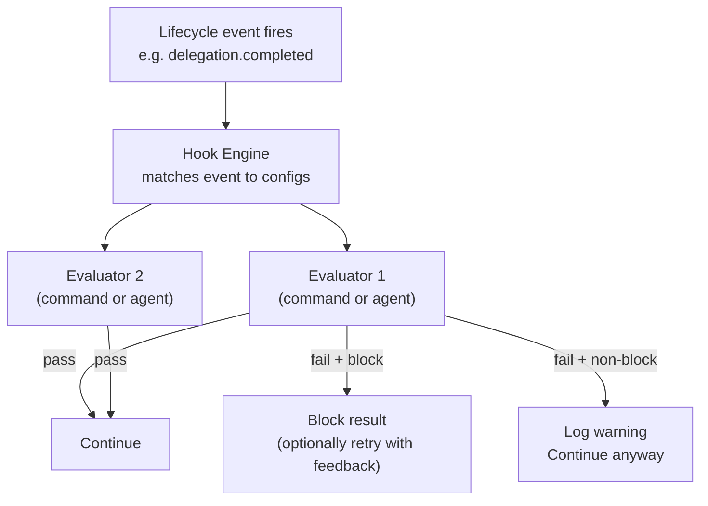

# Hooks & Quality Gates

> Run automatic checks before or after agent actions — block bad output, require approval, or trigger custom validation logic.

## Overview

GoClaw's hook system lets you attach quality gates to agent lifecycle events. A hook is a check that runs at a specific event. Currently the only supported event is `delegation.completed`, which fires after a subagent finishes a delegated task. If the check fails, GoClaw can block the result and optionally retry with feedback.

Quality gates are configured in the **source agent's** `other_config` JSON under the `quality_gates` key. The source agent is the one that initiates the delegation (the orchestrator), not the target.

Two evaluator types are available:

| Type | How it validates |
|------|-----------------|
| `command` | Runs a shell command — exit 0 = pass, non-zero = fail |
| `agent` | Delegates to a reviewer agent — `APPROVED` = pass, `REJECTED: ...` = fail |

---

## Hook Config Fields

Quality gates are placed inside the source agent's `other_config` under the `quality_gates` array:

```json
{
  "quality_gates": [
    {
      "event": "delegation.completed",
      "type": "command",
      "command": "./scripts/check-output.sh",
      "block_on_failure": true,
      "max_retries": 2,
      "timeout_seconds": 60
    }
  ]
}
```

| Field | Type | Description |
|-------|------|-------------|
| `event` | string | Lifecycle event that triggers this hook — only `"delegation.completed"` is currently supported |
| `type` | string | `"command"` or `"agent"` |
| `command` | string | Shell command to run (type=command only) |
| `agent` | string | Reviewer agent key (type=agent only) |
| `block_on_failure` | bool | If `true`, a failing hook triggers retries; if `false`, failure is logged but execution continues |
| `max_retries` | int | How many times to retry the target agent after a blocking failure (0 = no retry) |
| `timeout_seconds` | int | Per-hook timeout (default 60s) |

---

## Engine Architecture



The engine evaluates quality gates in order. A **blocking** failure triggers the retry loop for that gate (up to `max_retries`). If all retries are exhausted, GoClaw logs a warning and accepts the last result — it does not hard-fail the delegation. Non-blocking failures are logged but do not interrupt the flow. If all hooks pass (or none match the event), execution continues normally.

---

## Command Evaluator

The command evaluator runs a shell command via `sh -c`. The content being validated is passed via **stdin**. Exit 0 means the hook passed; any other exit code means it failed. The stderr output becomes the feedback shown to the agent on retry.

Environment variables available inside the command:

| Variable | Value |
|----------|-------|
| `HOOK_EVENT` | The event name |
| `HOOK_SOURCE_AGENT` | Key of the agent that produced the output |
| `HOOK_TARGET_AGENT` | Key of the delegated-to agent |
| `HOOK_TASK` | The original task string |
| `HOOK_USER_ID` | User ID who triggered the request |

**Example — basic content length check:**

```bash
#!/bin/sh
# check-output.sh: fail if output is too short
content=$(cat)
length=${#content}
if [ "$length" -lt 100 ]; then
  echo "Output is too short ($length chars). Provide a more complete response." >&2
  exit 1
fi
exit 0
```

Hook config:

```json
{
  "event": "delegation.completed",
  "type": "command",
  "command": "./scripts/check-output.sh",
  "block_on_failure": true,
  "max_retries": 1,
  "timeout_seconds": 10
}
```

---

## Agent Evaluator

The agent evaluator delegates to a reviewer agent. GoClaw sends a structured prompt with the original task, source/target agent keys, and the output to review. The reviewer must reply with exactly:

- `APPROVED` (optionally followed by comments) — hook passes
- `REJECTED: <specific feedback>` — hook fails; the feedback is used as the retry prompt

The evaluation runs with hooks skipped (`WithSkipHooks`) to prevent infinite recursion.

**Example — code review gate:**

```json
{
  "event": "delegation.completed",
  "type": "agent",
  "agent": "code-reviewer",
  "block_on_failure": true,
  "max_retries": 2,
  "timeout_seconds": 120
}
```

The `code-reviewer` agent receives a prompt like:

```
[Quality Gate Evaluation]
You are reviewing the output of a delegated task for quality.

Original task: Write a Go function to parse JSON...
Source agent: orchestrator
Target agent: backend-dev

Output to evaluate:
<agent output here>

Respond with EXACTLY one of:
- "APPROVED" if the output meets quality standards
- "REJECTED: <specific feedback>" with actionable improvement suggestions
```

---

## Use Cases

**Content filtering** — block replies containing prohibited content using a command hook that greps for banned patterns.

**Length/format validation** — reject outputs that are too short, missing required sections, or have wrong formatting.

**Approval workflows** — use an `agent` hook wired to a strict reviewer agent that checks correctness before a result is accepted.

**Security scanning** — run a script that checks generated code or shell commands for dangerous patterns before execution.

**Non-blocking audit** — set `block_on_failure: false` to log all outputs to an audit system without blocking the flow.

---

## Examples

**Two-gate setup: format check then agent review** (source agent's `other_config`):

```json
{
  "quality_gates": [
    {
      "event": "delegation.completed",
      "type": "command",
      "command": "python3 ./scripts/validate-format.py",
      "block_on_failure": true,
      "max_retries": 0,
      "timeout_seconds": 15
    },
    {
      "event": "delegation.completed",
      "type": "agent",
      "agent": "quality-reviewer",
      "block_on_failure": true,
      "max_retries": 2,
      "timeout_seconds": 90
    }
  ]
}
```

**Non-blocking audit logger** (source agent's `other_config`):

```json
{
  "quality_gates": [
    {
      "event": "delegation.completed",
      "type": "command",
      "command": "curl -s -X POST https://audit.internal/log -d @-",
      "block_on_failure": false,
      "timeout_seconds": 5
    }
  ]
}
```

---

## Common Issues

| Issue | Cause | Fix |
|-------|-------|-----|
| `hooks: unknown hook type, skipping` | Typo in `type` field | Use `"command"` or `"agent"` exactly |
| Command always passes even with exit 1 | Wrapper script swallows exit code | Ensure script doesn't have `|| true` masking failures |
| Agent evaluator hangs | Reviewer agent slow or stuck | Set `timeout_seconds` to a reasonable value |
| Retries exhaust but flow continues | Expected behavior — GoClaw accepts the last result after max retries and logs a warning | Lower `max_retries` or fix the quality gate condition |
| Hooks fire on reviewer agent itself | Recursion | GoClaw injects `WithSkipHooks` for agent evaluator calls automatically |
| Non-blocking hook blocks anyway | `block_on_failure: true` set accidentally | Check config; set to `false` for observe-only hooks |

---

## What's Next

- [Extended Thinking](/extended-thinking) — deeper reasoning before producing output
- [Exec Approval](/exec-approval) — human-in-the-loop approval for shell commands

<!-- goclaw-source: 57754a5 | updated: 2026-03-18 -->
