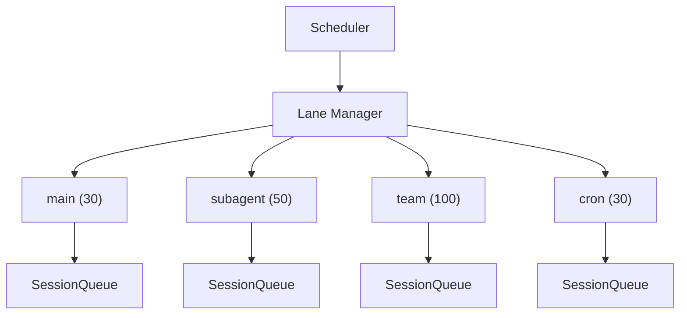
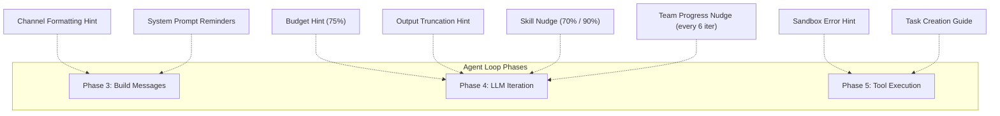
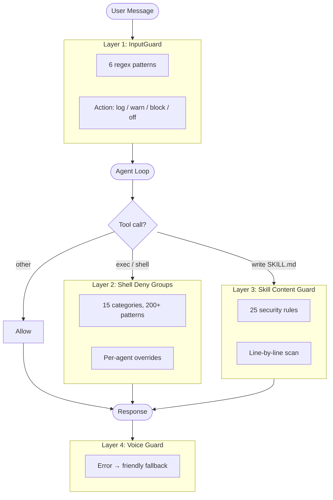
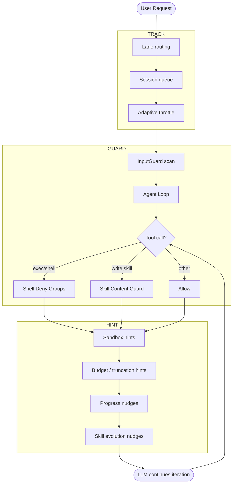

# Model Steering

> How GoClaw guides small models through 3 control layers: Track (scheduling), Hint (contextual nudges), and Guard (safety boundaries).

## Overview

Small models (< 70B params) running agent loops commonly hit three problems:

| Problem | Symptom |
|---------|---------|
| **Losing direction** | Uses up iteration budget without answering, loops on meaningless tool calls |
| **Forgetting context** | Doesn't report progress, ignores existing information |
| **Safety violations** | Runs dangerous commands, falls to prompt injection, writes malicious code |

GoClaw addresses these with **3 steering layers** that run concurrently on every request:

```mermaid
flowchart LR
    REQ([Request]) --> TRACK

    subgraph TRACK["Track — Where to run?"]
        direction TB
        T1[Lane routing]
        T2[Concurrency control]
        T3[Session serialization]
    end

    TRACK --> GUARD

    subgraph GUARD["Guard — What's allowed?"]
        direction TB
        G1[Input validation]
        G2[Shell deny patterns]
        G3[Skill content scan]
    end

    GUARD --> HINT

    subgraph HINT["Hint — What should it do?"]
        direction TB
        H1[Budget warnings]
        H2[Error guidance]
        H3[Progress nudges]
    end

    HINT --> LOOP([Agent Loop])
```



**Design principles:**
- **Track** — infrastructure layer; the model has no visibility into which lane it runs on
- **Guard** — hard boundary; blocks dangerous behavior regardless of which model is running
- **Hint** — soft guidance; injected as messages into the conversation; the model can ignore hints (but usually doesn't)

---

## Track System (Lane-based Scheduling)

Track routes each request by work type. Every lane has its own concurrency limit so different workload types don't compete for resources.

### Lane Architecture



### Lane Assignment

| Lane | Max Concurrent | Request Source | Purpose |
|------|:--------------:|---------------|---------|
| `main` | 30 | User chat (WebSocket / channel) | Primary conversation sessions |
| `subagent` | 50 | Subagent announce | Child agents spawned by a main agent |
| `team` | 100 | Team task dispatch | Members inside agent teams |
| `cron` | 30 | Cron scheduler | Scheduled periodic jobs |

Lane assignment is **deterministic** — based on the request type, not agent config. An agent cannot choose its lane.

### Per-session Queue

Each session within a lane gets its own queue:

- **DM sessions** — `maxConcurrent = 1` (serial, no overlap)
- **Group sessions** — `maxConcurrent = 3` (parallel replies allowed)
- **Adaptive throttle** — when session history exceeds 60% of the context window, concurrency drops to 1

The adaptive throttle exists specifically to protect small models: when context is nearly full, processing more messages in parallel would cause the model to lose track of the conversation.

---

## Hint System (Contextual Guidance Injection)

Hints are **messages injected into the conversation** at strategic points during the agent loop. Small models benefit most from hints because they tend to forget initial instructions as conversations grow long.

### When Hints Are Injected



### 8 Hint Types

#### 1. Budget Hints — Preventing Directionless Looping

Fires when the model uses up its iteration budget without producing a text response:

| Trigger | Injected Message |
|---------|-----------------|
| 75% of iterations used, no text response yet | "You've used 75% of your budget. Start synthesizing results." |
| Max iterations reached | Loop stops and returns final result |

This is especially effective with small models — instead of letting them loop indefinitely, it forces early summarization.

#### 2. Output Truncation Hints — Error Recovery

When the LLM response is cut off due to `max_tokens`:

> `[System] Output was truncated. Tool call arguments are incomplete. Retry with shorter content — split writes or reduce text.`

Small models often don't recognize that their output was truncated. This hint explains the cause and prompts them to adjust.

#### 3. Skill Evolution Nudges — Encouraging Self-Improvement

| Trigger | Content |
|---------|---------|
| 70% of iteration budget used | Suggests creating a skill to reuse the current workflow |
| 90% of iteration budget used | Stronger reminder about skill creation |

These hints are **ephemeral** (not persisted to session history) and support **i18n** (en/vi/zh).

#### 4. Team Progress Nudges — Progress Reporting Reminders

Every 6 iterations when the agent is working on a team task:

> `[System] You're at iteration 12/20 (~60% budget) for task #3: 'Implement auth module'. Report progress now: team_tasks(action="progress", percent=60, text="...")`

Without this, small models tend to forget to call progress reporting → the lead agent doesn't know the status → bottleneck.

#### 5. Sandbox Error Hints — Explaining Environment Errors

When a command in a Docker sandbox encounters an error, the hint is **attached directly to the error output**:

| Error Pattern | Hint |
|--------------|------|
| Exit code 127 / "command not found" | Binary not installed in sandbox image |
| "permission denied" / EACCES | Workspace mounted read-only |
| "network is unreachable" / DNS fail | `--network none` is enabled |
| "read-only file system" / EROFS | Writing outside workspace volume |
| "no space left" / ENOSPC | Disk/memory exhausted in container |
| "no such file" | File doesn't exist in sandbox |

Hint priority: exit code 127 is checked first, then pattern-matched in priority order.

#### 6. Channel Formatting Hints — Platform-Specific Guidance

Injected into the system prompt based on the channel type:

- **Zalo** — "Use plain text, no markdown, no HTML"
- **Group chat** — Instructions on using the `NO_REPLY` token when a message doesn't require a response

#### 7. Task Creation Guidance — Lead Agent Help

When the model lists or searches team tasks, the response includes:
- List of team members + their models
- 4 rules: write self-contained descriptions, split complex tasks, match task complexity to model capability, ensure task independence

Especially useful when small models (MiniMax, Qwen) act as lead agents — they tend to create vague tasks or misassign complexity.

#### 8. System Prompt Reminders — Recency Zone Reinforcement

Injected at the end of the system prompt (the "recency zone" — the part the model pays most attention to):
- Reminder to search memory before answering
- Persona/character reinforcement if the agent has a custom identity
- Onboarding nudges for new users

### Hint Summary Table

| Hint | Trigger | Ephemeral? | Injection Point |
|------|---------|:----------:|-----------------|
| Budget 75% | iteration == max×¾, no text yet | Yes | Message list (Phase 4) |
| Output Truncation | `finish_reason == "length"` | Yes | Message list (Phase 4) |
| Skill Nudge 70% | iteration/max ≥ 0.70 | Yes | Message list (Phase 4) |
| Skill Nudge 90% | iteration/max ≥ 0.90 | Yes | Message list (Phase 4) |
| Team Progress | iteration % 6 == 0 and has TeamTaskID | Yes | Message list (Phase 4) |
| Sandbox Error | Pattern match on stderr/exit code | No | Tool result suffix (Phase 5) |
| Channel Format | Channel type == "zalo" etc. | No | System prompt (Phase 3) |
| Task Creation | `team_tasks` list/search response | No | Tool result JSON (Phase 5) |
| Memory/Persona | Config flags | No | System prompt (Phase 3) |

---

## Guard System (Safety Boundaries)

Guards create **hard boundaries** — they don't depend on model compliance. Even if a small model is tricked by a prompt injection attack, guards block dangerous behavior at the infrastructure level.

### 4-Layer Guard Architecture



### Layer 1: InputGuard — Prompt Injection Detection

Scans **every user message** before it enters the agent loop, plus injected messages and web fetch/search results.

| Pattern | Detects |
|---------|---------|
| `ignore_instructions` | "Ignore all previous instructions…" |
| `role_override` | "You are now a…", "Pretend you are…" |
| `system_tags` | `<system>`, `[SYSTEM]`, `[INST]`, `<<SYS>>`, `<\|im_start\|>system` |
| `instruction_injection` | "New instructions:", "Override:", "System prompt:" |
| `null_bytes` | `\x00` characters (null byte injection) |
| `delimiter_escape` | "End of system", `</instructions>`, `</prompt>` |

**4 action modes** (config: `gateway.injection_action`):

| Mode | Behavior |
|------|---------|
| `log` | Log info, do not block |
| `warn` | Log warning (default) |
| `block` | Reject message, return error to user |
| `off` | Disable scanning entirely |

**3 scan points:** incoming user message (Phase 2), mid-run injected messages, and tool results from `web_fetch`/`web_search`.

### Layer 2: Shell Deny Groups — Command Safety

15 deny groups, all **ON by default**. Admin must explicitly allow a group to disable it.

| Group | Example Patterns |
|-------|-----------------|
| `destructive_ops` | `rm -rf`, `mkfs`, `dd if=`, `shutdown`, fork bomb |
| `data_exfiltration` | `curl \| sh`, `wget POST`, DNS lookup, `/dev/tcp/` |
| `reverse_shell` | `nc`, `socat`, `openssl s_client`, Python/Perl socket |
| `code_injection` | `eval $()`, `base64 -d \| sh` |
| `privilege_escalation` | `sudo`, `su`, `doas`, `pkexec`, `runuser`, `nsenter` |
| `dangerous_paths` | `chmod`/`chown` on system paths |
| `env_injection` | `LD_PRELOAD`, `BASH_ENV`, `GIT_EXTERNAL_DIFF` |
| `container_escape` | Docker socket, `/proc/sys/`, `/sys/` |
| `crypto_mining` | `xmrig`, `cpuminer`, `stratum+tcp://` |
| `filter_bypass` | `sed -e`, `git --exec`, `rg --pre` |
| `network_recon` | `nmap`, `ssh`/`scp`/`sftp`, tunneling |
| `package_install` | `pip install`, `npm install`, `apk add` |
| `persistence` | `crontab`, shell RC file writes |
| `process_control` | `kill -9`, `killall`, `pkill` |
| `env_dump` | `env`, `printenv`, `/proc/*/environ`, `GOCLAW_*` |

**Special case:** `package_install` triggers an approval flow (not a hard deny) — the agent pauses and asks the user for permission. All other groups are hard-blocked.

**Per-agent override:** Admins can allow specific deny groups for specific agents via DB config.

### Layer 3: Skill Content Guard

Scans **SKILL.md content** before writing the file. 25 regex rules detect:

- Shell injection and destructive operations
- Code obfuscation (`base64 -d`, `eval`, `curl | sh`)
- Credential theft (`/etc/passwd`, `.ssh/id_rsa`, `AWS_SECRET_ACCESS_KEY`)
- Path traversal (`../../..`)
- SQL injection (`DROP TABLE`, `TRUNCATE`)
- Privilege escalation (`sudo`, `chmod 777`)

Any violation results in a **hard reject** — the file is not written and the model receives an error.

### Layer 4: Voice Guard

Specialized for Telegram voice agents. When voice/audio processing encounters a technical error, Voice Guard replaces the raw error message with a friendly fallback for end users. This is a UX guard, not a security guard.

### Guard Summary

| Guard | Scope | Default Action | Configurable? |
|-------|-------|:--------------:|:-------------:|
| InputGuard | All user messages + injected + tool results | warn | Yes (log/warn/block/off) |
| Shell Deny | All `exec`/`shell` tool calls | hard block | Yes (per-agent group override) |
| Skill Content | SKILL.md file writes | hard reject | No |
| Voice Guard | Telegram voice error replies | friendly fallback | No |

---

## How the 3 Layers Work Together



| Layer | Question answered | Mechanism | Nature |
|-------|------------------|-----------|--------|
| **Track** | Where to run? | Lane + Queue + Semaphore | Infrastructure, invisible to model |
| **Guard** | What's allowed? | Regex pattern matching, hard deny | Security boundary, model-agnostic |
| **Hint** | What should it do? | Message injection into conversation | Soft guidance, model can ignore |

**When using large models** (Claude, GPT-4): Guard is still necessary. Hint is less critical because large models track context better.

**When using small models** (MiniMax, Qwen, Gemini Flash): all 3 layers are critical.

---

## Mode Prompt System

Beyond the runtime steering layers, GoClaw applies **prompt-level steering** by varying which system prompt sections are included based on context. This reduces token cost for background tasks while keeping full guidance for user-facing interactions.

### Prompt Modes

| Mode | Who gets it | Sections included |
|------|-------------|------------------|
| `full` | Main user-facing agents | All sections — persona, skills, MCP, memory, spawn guidance, recency reinforcements |
| `task` | Enterprise automation agents | Lean but capable — execution bias, skills search, memory slim, safety slim |
| `minimal` | Subagents spawned via `spawn` | Reduced — tooling, safety, workspace, pinned skills only |
| `none` | Identity-only (rare) | Identity line only, no tooling guidance |

**3-layer resolution** (highest priority wins):

1. **Runtime override** — caller passes explicit mode (e.g. subagent dispatch sets `minimal`)
2. **Auto-detect** — heartbeat sessions → `minimal`; subagent/cron sessions → `task` (capped)
3. **Agent config** — `prompt_mode` field in agent config
4. **Default** — `full`

```go
// Priority: runtime > auto-detect > config > default
func resolvePromptMode(runtimeOverride, sessionKey, configMode PromptMode) PromptMode
```

### Orchestration Modes

Each agent is assigned an orchestration mode based on its capabilities. This determines which inter-agent tools are available and which sections appear in the system prompt:

| Mode | How assigned | Tools available | Prompt section |
|------|-------------|----------------|----------------|
| `spawn` | Default (no links or team) | `spawn` only | Sub-Agent Spawning |
| `delegate` | Agent has AgentLink targets | `spawn` + `delegate` | Delegation Targets |
| `team` | Agent is in a team | `spawn` + `delegate` + `team_tasks` | Team Workspace + Team Members |

Resolution priority: team > delegate > spawn.

The `delegate` and `team_tasks` tools are hidden from the LLM unless the agent's mode explicitly enables them (`orchModeDenyTools`).

### Prompt Cache Boundary

For Anthropic providers, GoClaw splits the system prompt at a cache boundary marker:

```
<!-- GOCLAW_CACHE_BOUNDARY -->
```

Content above the marker = **stable** (agent config, persona, skills, safety — rarely changes). Anthropic applies `cache_control` to this block, so repeated calls reuse the cached prefix without re-tokenizing.

Content below the marker = **dynamic** (current date/time, channel formatting hints, per-user context, extra prompt). This is regenerated on every turn.

**Sections placed above the boundary:** Identity, Persona, Tooling, Safety, Skills, MCP Tools, Workspace, Team sections, Sandbox, User Identity, Project Context (stable files like AGENTS.md, AGENTS_CORE.md, CAPABILITIES.md).

**Sections placed below the boundary:** Time, Channel Formatting Hints, Group Chat Reply Hint, Extra Prompt, Project Context (dynamic files like USER.md, BOOTSTRAP.md).

This split is transparent to the model — it sees one continuous system prompt.

### Provider-Specific Prompt Customizations

Providers can contribute section overrides via `PromptContribution`:

- **`SectionOverrides`** — replace specific sections by ID (e.g. override `execution_bias` for OpenAI)
- **`StablePrefix`** — appended before the cache boundary (e.g. reasoning format instructions for GPT models)
- **`DynamicSuffix`** — appended after the cache boundary

GoClaw also applies **SOUL echo** for GPT/ChatGPT providers: a compact `## Style` + `## Vibe` extract from SOUL.md is appended in the recency zone to combat persona drift in long conversations. This is not applied to Claude (which follows early system prompt instructions reliably).

---

## Common Issues

| Issue | Cause | Fix |
|-------|-------|-----|
| Agent loops without answering | Budget hint not firing or model ignoring it | Verify `max_iterations` is set; check if model responds to injected messages |
| Shell command silently rejected | Hit a deny group | Check agent logs for `shell_deny` block; admin can add per-agent override if needed |
| SKILL.md write fails with guard error | Content matched a security rule | Review SKILL.md for obfuscated commands, credential references, or path traversal |
| Prompt injection warning in logs | User message matched an `injection_action: warn` pattern | Expected behavior; upgrade to `block` if you want hard rejection |
| Small model forgets to report team progress | Team progress nudge requires `TeamTaskID` to be set | Ensure the task was assigned via the `team_tasks` tool |

---

## What's Next

- [Sandbox](sandbox.md) — isolate shell command execution for agents
- [Agent Teams](../agent-teams/what-are-teams.md) — multi-agent coordination where Track and Hint are most active
- [Scheduling & Cron](scheduling-cron.md) — how cron lane requests are routed through Track

<!-- goclaw-source: 1296cdbf | updated: 2026-04-11 -->
