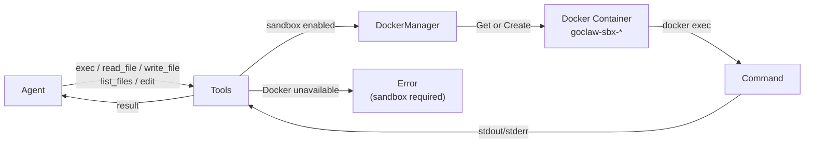

# Sandbox

> Run agent shell commands inside an isolated Docker container so untrusted code never touches your host.

## Overview

When sandbox mode is enabled, every tool call that touches the filesystem or runs a command (`exec`, `read_file`, `write_file`, `list_files`, `edit`) is routed into a Docker container instead of running directly on the host. The container is ephemeral, network-isolated, and heavily restricted by default — dropped capabilities, read-only root filesystem, tmpfs for `/tmp`, and a 512 MB memory cap.

If Docker is unavailable at runtime, GoClaw returns an error and refuses to execute — it will **not** fall back to unsandboxed host execution.



## Sandbox Modes

Set `GOCLAW_SANDBOX_MODE` (or `agents.defaults.sandbox.mode` in config) to one of:

| Mode | Which agents are sandboxed |
|---|---|
| `off` | None — all commands run on host (default) |
| `non-main` | All agents except `main` and `default` |
| `all` | Every agent |

## Container Scope

Scope controls how containers are reused across requests:

| Scope | Container lifetime | Best for |
|---|---|---|
| `session` | One container per session | Maximum isolation (default) |
| `agent` | One container shared across all sessions for an agent | Persistent state within an agent |
| `shared` | One container for all agents | Lowest overhead |

## Default Security Profile

Out of the box, every sandbox container runs with:

| Setting | Value |
|---|---|
| Root filesystem | Read-only (`--read-only`) |
| Capabilities | All dropped (`--cap-drop ALL`) |
| New privileges | Blocked (`--security-opt no-new-privileges`) |
| tmpfs mounts | `/tmp`, `/var/tmp`, `/run` |
| Network | Disabled (`--network none`) |
| Memory limit | 512 MB |
| CPUs | 1.0 |
| Execution timeout | 300 seconds |
| Max output | 1 MB (stdout + stderr combined) |
| Container prefix | `goclaw-sbx-` |
| Working directory | `/workspace` |

If a command produces more than 1 MB of output, the output is truncated and `...[output truncated]` is appended.

## Configuration

All settings can be provided as environment variables or in `config.json` under `agents.defaults.sandbox`.

### Environment variables

```bash
GOCLAW_SANDBOX_MODE=all
GOCLAW_SANDBOX_IMAGE=goclaw-sandbox:bookworm-slim
GOCLAW_SANDBOX_WORKSPACE_ACCESS=rw   # none | ro | rw
GOCLAW_SANDBOX_SCOPE=session         # session | agent | shared
GOCLAW_SANDBOX_MEMORY_MB=512
GOCLAW_SANDBOX_CPUS=1.0
GOCLAW_SANDBOX_TIMEOUT_SEC=300
GOCLAW_SANDBOX_NETWORK=false
```

### config.json

```json
{
  "agents": {
    "defaults": {
      "sandbox": {
        "mode": "all",
        "image": "goclaw-sandbox:bookworm-slim",
        "workspace_access": "rw",
        "scope": "session",
        "memory_mb": 512,
        "cpus": 1.0,
        "timeout_sec": 300,
        "network_enabled": false,
        "read_only_root": true,
        "max_output_bytes": 1048576,
        "idle_hours": 24,
        "max_age_days": 7,
        "prune_interval_min": 5
      }
    }
  }
}
```

### Full config reference

| Field | Type | Default | Description |
|---|---|---|---|
| `mode` | string | `off` | `off`, `non-main`, or `all` |
| `image` | string | `goclaw-sandbox:bookworm-slim` | Docker image to use |
| `workspace_access` | string | `rw` | Mount workspace as `none`, `ro`, or `rw` |
| `scope` | string | `session` | Container reuse: `session`, `agent`, or `shared` |
| `memory_mb` | int | 512 | Memory limit in MB |
| `cpus` | float | 1.0 | CPU quota |
| `timeout_sec` | int | 300 | Per-command timeout in seconds |
| `network_enabled` | bool | false | Enable container networking |
| `read_only_root` | bool | true | Mount root filesystem read-only |
| `tmpfs_size_mb` | int | 0 | Default size for tmpfs mounts (0 = Docker default) |
| `user` | string | — | Container user, e.g. `1000:1000` or `nobody` |
| `max_output_bytes` | int | 1048576 | Max stdout+stderr capture per exec (1 MB) |
| `setup_command` | string | — | Shell command run once after container creation |
| `env` | object | — | Extra environment variables injected into the container |
| `idle_hours` | int | 24 | Prune containers idle longer than N hours |
| `max_age_days` | int | 7 | Prune containers older than N days |
| `prune_interval_min` | int | 5 | Background prune check interval (minutes) |

Security hardening defaults (`--cap-drop ALL`, `--tmpfs /tmp:/var/tmp:/run`, `--security-opt no-new-privileges`) are applied automatically and are not overridable via config.

## Workspace Access

The workspace directory is mounted at `/workspace` inside the container:

- `none` — no filesystem mount; container has no access to your project files
- `ro` — read-only mount; agent can read files but cannot write
- `rw` — read-write mount (default); agent can read and write project files

## Container Lifecycle

1. **Creation** — on first exec call for a scope key, `docker run -d ... sleep infinity` starts a long-lived container.
2. **Execution** — each command runs via `docker exec` inside the running container.
3. **Pruning** — a background goroutine checks every `prune_interval_min` minutes and destroys containers that have been idle longer than `idle_hours` or exist longer than `max_age_days`.
4. **Destruction** — `docker rm -f <id>` is called on pruning, session end, or `ReleaseAll` at shutdown.

Container names follow the pattern `goclaw-sbx-<sanitized-scope-key>`, where the scope key is derived from the session key, agent ID, or `"shared"` depending on the configured scope.

## Setup with docker-compose

Build the sandbox image first:

```bash
docker build -t goclaw-sandbox:bookworm-slim -f Dockerfile.sandbox .
```

Then add the sandbox overlay to your compose command:

```bash
docker compose \
  -f docker-compose.yml \
  -f docker-compose.postgres.yml \
  -f docker-compose.sandbox.yml \
  up
```

The `docker-compose.sandbox.yml` overlay mounts the Docker socket and sets sandbox environment variables:

```yaml
services:
  goclaw:
    build:
      args:
        ENABLE_SANDBOX: "true"
    volumes:
      - /var/run/docker.sock:/var/run/docker.sock
    environment:
      - GOCLAW_SANDBOX_MODE=all
      - GOCLAW_SANDBOX_IMAGE=goclaw-sandbox:bookworm-slim
      - GOCLAW_SANDBOX_WORKSPACE_ACCESS=rw
      - GOCLAW_SANDBOX_SCOPE=session
      - GOCLAW_SANDBOX_MEMORY_MB=512
      - GOCLAW_SANDBOX_CPUS=1.0
      - GOCLAW_SANDBOX_TIMEOUT_SEC=300
      - GOCLAW_SANDBOX_NETWORK=false
    # Allow Docker socket access from the goclaw container
    cap_drop: []
    cap_add:
      - NET_BIND_SERVICE
    security_opt: []
    group_add:
      - ${DOCKER_GID:-999}
```

> **Security note:** Mounting the Docker socket gives the GoClaw container control over the host Docker daemon. Only use sandbox mode in environments where you trust the GoClaw process itself.

## Examples

### Sandbox only sub-agents, not the main agent

```bash
GOCLAW_SANDBOX_MODE=non-main
```

The `main` and `default` agents run commands on the host. All other agents (sub-agents, specialized workers) are sandboxed.

### Read-only workspace with custom setup

```json
{
  "agents": {
    "defaults": {
      "sandbox": {
        "mode": "all",
        "workspace_access": "ro",
        "setup_command": "pip install -q pandas numpy",
        "memory_mb": 1024,
        "timeout_sec": 120
      }
    }
  }
}
```

The `setup_command` runs once after the container is created. Use it to pre-install dependencies so they are available on every subsequent `exec`.

### Check active sandbox containers

GoClaw does not expose a public HTTP endpoint for sandbox stats. You can inspect running containers directly with Docker:

```bash
docker ps --filter "label=goclaw.sandbox=true"
```

## Common Issues

| Issue | Cause | Fix |
|---|---|---|
| `docker not available` in logs | Docker daemon not running or socket not mounted | Start Docker; ensure socket is mounted in compose |
| Commands fail with sandbox error | Docker unavailable at exec time | Start Docker; ensure socket is mounted in compose; sandbox mode does not fall back to host |
| `docker run failed` on container creation | Image not found or insufficient permissions | Build the sandbox image; check `DOCKER_GID` |
| Output truncated at 1 MB | Command produced very large output | Increase `max_output_bytes` or pipe output to a file |
| Container not cleaned up after session | Pruner not running or `idle_hours` too high | Lower `idle_hours`; check `sandbox pruning started` in logs |
| Write fails inside container | `workspace_access: ro` or `read_only_root: true` with no tmpfs | Switch to `rw` or add a tmpfs mount for the target path |

## What's Next

- [Custom Tools](/custom-tools) — define shell tools that also benefit from sandbox isolation
- [Exec Approval](/exec-approval) — require human approval before any command runs, sandboxed or not
- [Scheduling & Cron](/scheduling-cron) — run sandboxed agent turns on a schedule

<!-- goclaw-source: 941a965 | updated: 2026-03-19 -->
