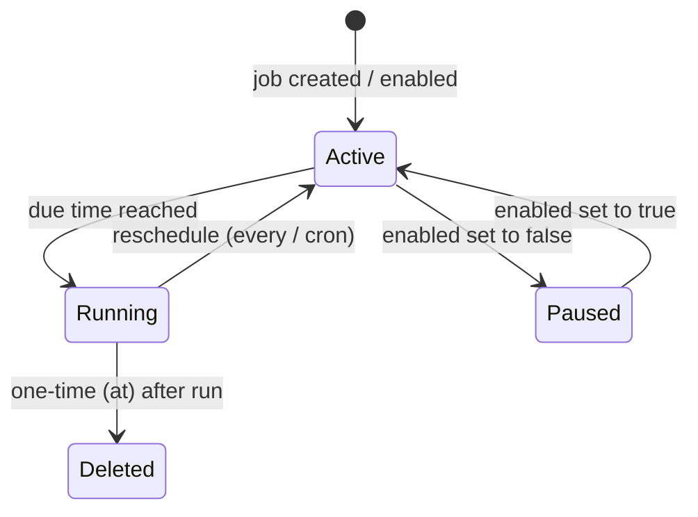

# Scheduling & Cron

> Trigger agent turns automatically — once, on a repeating interval, or on a cron expression.

## Overview

GoClaw's cron service lets you schedule any agent to run a message on a fixed schedule. Jobs are persisted to a JSON file on disk, so they survive restarts. The scheduler checks for due jobs every second and executes them in parallel goroutines.

Three schedule types are available:

| Type | Field | Description |
|---|---|---|
| `at` | `atMs` | One-time execution at a specific Unix timestamp (ms) |
| `every` | `everyMs` | Repeating interval in milliseconds |
| `cron` | `expr` | Standard 5-field cron expression (parsed by gronx) |

One-time (`at`) jobs are automatically deleted after they run.



## Creating a Job

### Via the Dashboard

Go to **Cron → New Job**, fill in the schedule, the message the agent should process, and (optionally) a delivery channel.

### Via the HTTP API

```bash
curl -X POST http://localhost:8080/v1/cron/jobs \
  -H "Authorization: Bearer $GOCLAW_TOKEN" \
  -H "Content-Type: application/json" \
  -d '{
    "name": "daily-standup-summary",
    "schedule": {
      "kind": "cron",
      "expr": "0 9 * * 1-5",
      "tz": "Asia/Ho_Chi_Minh"
    },
    "message": "Summarize yesterday'\''s GitHub activity and post a standup update.",
    "deliver": true,
    "channel": "telegram",
    "to": "123456789",
    "agentId": "3f2a1b4c-0000-0000-0000-000000000000"
  }'
```

### Via the `cron` built-in tool (agent-created jobs)

Agents can schedule their own follow-up tasks during a conversation:

```
# Agent calls this tool internally
cron_add(
  name="check-server-health",
  schedule={"kind": "every", "everyMs": 300000},
  message="Check if the API server is responding and alert me if it's down."
)
```

## Job Fields

| Field | Type | Description |
|---|---|---|
| `name` | string | Human-readable label |
| `agentId` | string | Agent to run the job (omit for default agent) |
| `enabled` | bool | `true` = active, `false` = paused |
| `schedule.kind` | string | `at`, `every`, or `cron` |
| `schedule.atMs` | int64 | Unix timestamp in ms (for `at`) |
| `schedule.everyMs` | int64 | Interval in ms (for `every`) |
| `schedule.expr` | string | 5-field cron expression (for `cron`) |
| `schedule.tz` | string | IANA timezone for cron, e.g. `America/New_York` |
| `message` | string | Text the agent receives as its input |
| `deliver` | bool | `true` = deliver directly to a channel; `false` = agent processes silently |
| `channel` | string | Target channel: `telegram`, `discord`, etc. |
| `to` | string | Chat ID or recipient identifier |
| `deleteAfterRun` | bool | Auto-set to `true` for `at` jobs; can be set manually |

## Schedule Expressions

### `at` — run once at a specific time

```json
{
  "kind": "at",
  "atMs": 1741392000000
}
```

The job is deleted after it fires. If `atMs` is already in the past when the job is created, it will never run.

### `every` — repeating interval

```json
{ "kind": "every", "everyMs": 3600000 }
```

Common intervals:

| Expression | Interval |
|---|---|
| `60000` | Every minute |
| `300000` | Every 5 minutes |
| `3600000` | Every hour |
| `86400000` | Every 24 hours |

### `cron` — 5-field cron expression

```json
{ "kind": "cron", "expr": "30 8 * * *", "tz": "UTC" }
```

5-field format: `minute hour day-of-month month day-of-week`

| Expression | Meaning |
|---|---|
| `0 9 * * 1-5` | 09:00 on weekdays |
| `30 8 * * *` | 08:30 every day |
| `0 */4 * * *` | Every 4 hours |
| `0 0 1 * *` | Midnight on the 1st of each month |
| `*/15 * * * *` | Every 15 minutes |

Expressions are validated at creation time using [gronx](https://github.com/adhocore/gronx). Invalid expressions are rejected with an error.

## Managing Jobs

```bash
# List all jobs
GET /v1/cron/jobs

# Get a single job
GET /v1/cron/jobs/{id}

# Update (partial patch)
PATCH /v1/cron/jobs/{id}
{
  "schedule": { "kind": "cron", "expr": "0 10 * * *" }
}

# Pause
PATCH /v1/cron/jobs/{id}
{ "enabled": false }

# Delete
DELETE /v1/cron/jobs/{id}

# Manual trigger (force = run regardless of schedule)
POST /v1/cron/jobs/{id}/run?force=true

# View run history (last 20 by default)
GET /v1/cron/jobs/{id}/log
```

## Job Lifecycle

- **Active** — `enabled: true`, `nextRunAtMs` is set; will fire when due.
- **Paused** — `enabled: false`, `nextRunAtMs` is cleared; skipped by the scheduler.
- **Running** — executing the agent turn; `nextRunAtMs` is cleared until execution completes to prevent duplicate runs.
- **Completed (one-time)** — `at` jobs are deleted from the store after firing.

The scheduler checks jobs every 1 second. Due jobs are dispatched in parallel goroutines. The last 200 run log entries are kept in memory and accessible via the run-log endpoint.

Failed jobs record `lastStatus: "error"` and `lastError` with the message. The job stays enabled and will retry on its next scheduled tick (unless it was a one-time `at` job).

## Examples

### Daily news briefing via Telegram

```json
{
  "name": "morning-briefing",
  "schedule": { "kind": "cron", "expr": "0 7 * * *", "tz": "Asia/Ho_Chi_Minh" },
  "message": "Give me a brief summary of today's tech news headlines.",
  "deliver": true,
  "channel": "telegram",
  "to": "123456789"
}
```

### Periodic health check (silent — agent decides whether to alert)

```json
{
  "name": "api-health-check",
  "schedule": { "kind": "every", "everyMs": 300000 },
  "message": "Check https://api.example.com/health and alert me on Telegram if it returns a non-200 status.",
  "deliver": false
}
```

### One-time reminder

```json
{
  "name": "meeting-reminder",
  "schedule": { "kind": "at", "atMs": 1741564200000 },
  "message": "Remind me that the quarterly review meeting starts in 15 minutes.",
  "deliver": true,
  "channel": "telegram",
  "to": "123456789"
}
```

## Common Issues

| Issue | Cause | Fix |
|---|---|---|
| Job never runs | `enabled: false` or `atMs` is in the past | Check job state; re-enable or update schedule |
| `invalid cron expression` on create | Malformed expr (e.g. 6-field Quartz syntax) | Use standard 5-field cron |
| `invalid timezone` | Unknown IANA zone string | Use a valid zone from the IANA tz database, e.g. `America/New_York` |
| Job runs but agent gets no message | `message` field is empty | Set a non-empty `message` |
| Duplicate executions | Clock skew between restarts (edge case) | Check `lastRunAtMs`; the scheduler clears `nextRunAtMs` before dispatch to prevent this |
| Run log is empty | Job hasn't fired yet | Trigger manually with `POST /v1/cron/jobs/{id}/run?force=true` |

## What's Next

- [Custom Tools](../advanced/custom-tools.md) — give agents shell commands to run during scheduled turns
- [Skills](../advanced/skills.md) — inject domain knowledge so scheduled agents are more effective
- [Sandbox](../advanced/sandbox.md) — isolate code execution during scheduled agent runs
