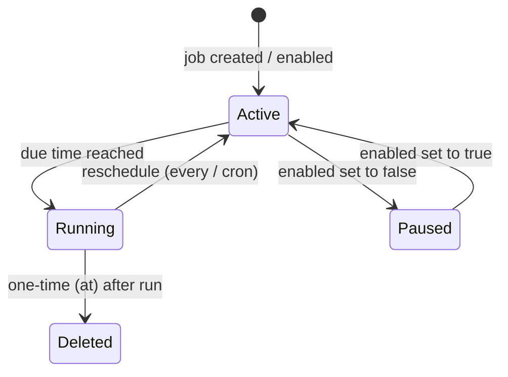

# Scheduling & Cron

> Trigger agent turns automatically — once, on a repeating interval, or on a cron expression.

## Overview

GoClaw's cron service lets you schedule any agent to run a message on a fixed schedule. Jobs are persisted to PostgreSQL, so they survive restarts. The scheduler checks for due jobs every second and executes them in parallel goroutines.

Three schedule types are available:

| Type | Field | Description |
|---|---|---|
| `at` | `atMs` | One-time execution at a specific Unix timestamp (ms) |
| `every` | `everyMs` | Repeating interval in milliseconds |
| `cron` | `expr` | Standard 5-field cron expression (parsed by gronx) |

One-time (`at`) jobs are automatically deleted after they run.



## Creating a Job

### Via the Dashboard

Go to **Cron → New Job**, fill in the schedule, the message the agent should process, and (optionally) a delivery channel.

### Via the Gateway WebSocket API

GoClaw uses WebSocket RPC. Send a `cron.create` method call:

```json
{
  "method": "cron.create",
  "params": {
    "name": "daily-standup-summary",
    "schedule": {
      "kind": "cron",
      "expr": "0 9 * * 1-5",
      "tz": "Asia/Ho_Chi_Minh"
    },
    "message": "Summarize yesterday's GitHub activity and post a standup update.",
    "deliver": true,
    "channel": "telegram",
    "to": "123456789",
    "agentId": "3f2a1b4c-0000-0000-0000-000000000000"
  }
}
```

### Via the `cron` built-in tool (agent-created jobs)

Agents can schedule their own follow-up tasks during a conversation using the `cron` tool with `action: "add"`. GoClaw automatically strips leading tab indentation from the `description` field and validates parameters to prevent malformed job creation.

```json
{
  "action": "add",
  "job": {
    "name": "check-server-health",
    "schedule": { "kind": "every", "everyMs": 300000 },
    "message": "Check if the API server is responding and alert me if it's down."
  }
}
```

### Via the CLI

```bash
# List jobs (active only)
goclaw cron list

# List all jobs including disabled
goclaw cron list --all

# List as JSON
goclaw cron list --json

# Enable or disable a job
goclaw cron toggle <jobId> true
goclaw cron toggle <jobId> false

# Delete a job
goclaw cron delete <jobId>
```

## Job Fields

| Field | Type | Description |
|---|---|---|
| `name` | string | Slug label — lowercase letters, numbers, hyphens only (e.g. `daily-report`) |
| `agentId` | string | Agent UUID to run the job (omit for default agent) |
| `enabled` | bool | `true` = active, `false` = paused |
| `schedule.kind` | string | `at`, `every`, or `cron` |
| `schedule.atMs` | int64 | Unix timestamp in ms (for `at`) |
| `schedule.everyMs` | int64 | Interval in ms (for `every`) |
| `schedule.expr` | string | 5-field cron expression (for `cron`) |
| `schedule.tz` | string | IANA timezone for cron expressions; omit to use the gateway default timezone |
| `message` | string | Text the agent receives as its input |
| `deliver` | bool | `true` = deliver result to a channel; `false` = agent processes silently. Auto-defaults to `true` when the job is created from a real channel (Telegram, etc.) |
| `channel` | string | Target channel: `telegram`, `discord`, etc. Auto-filled from context when `deliver` is `true` |
| `to` | string | Chat ID or recipient identifier. Auto-filled from context when `deliver` is `true` |
| `deleteAfterRun` | bool | Auto-set to `true` for `at` jobs; can be set manually on any job |
| `wakeHeartbeat` | bool | When `true`, triggers an immediate [Heartbeat](heartbeat.md) run after the cron job completes. Useful for jobs that should report status via the heartbeat system |

## Schedule Expressions

### `at` — run once at a specific time

```json
{
  "kind": "at",
  "atMs": 1741392000000
}
```

The job is deleted after it fires. If `atMs` is already in the past when the job is created, it will never run.

### `every` — repeating interval

```json
{ "kind": "every", "everyMs": 3600000 }
```

Common intervals:

| Expression | Interval |
|---|---|
| `60000` | Every minute |
| `300000` | Every 5 minutes |
| `3600000` | Every hour |
| `86400000` | Every 24 hours |

### `cron` — 5-field cron expression

```json
{ "kind": "cron", "expr": "30 8 * * *", "tz": "UTC" }
```

5-field format: `minute hour day-of-month month day-of-week`

| Expression | Meaning |
|---|---|
| `0 9 * * 1-5` | 09:00 on weekdays |
| `30 8 * * *` | 08:30 every day |
| `0 */4 * * *` | Every 4 hours |
| `0 0 1 * *` | Midnight on the 1st of each month |
| `*/15 * * * *` | Every 15 minutes |

Expressions are validated at creation time using [gronx](https://github.com/adhocore/gronx). Invalid expressions are rejected with an error.

## Managing Jobs

GoClaw exposes cron management via WebSocket RPC methods. The available methods are:

| Method | Description |
|---|---|
| `cron.list` | List jobs (`includeDisabled: true` to include disabled) |
| `cron.create` | Create a new job |
| `cron.update` | Update a job (`jobId` + `patch` object) |
| `cron.delete` | Delete a job (`jobId`) |
| `cron.toggle` | Enable or disable a job (`jobId` + `enabled: bool`) |
| `cron.run` | Trigger a job manually (`jobId` + `mode: "force"` or `"due"`) |
| `cron.runs` | View run history (`jobId`, `limit`, `offset`) |
| `cron.status` | Scheduler status (active job count, running flag) |

**Examples:**

```json
// Pause a job
{ "method": "cron.toggle", "params": { "jobId": "<id>", "enabled": false } }

// Update schedule
{ "method": "cron.update", "params": { "jobId": "<id>", "patch": { "schedule": { "kind": "cron", "expr": "0 10 * * *" } } } }

// Manual trigger (run regardless of schedule)
{ "method": "cron.run", "params": { "jobId": "<id>", "mode": "force" } }

// View run history (last 20 entries by default)
{ "method": "cron.runs", "params": { "jobId": "<id>", "limit": 20, "offset": 0 } }
```

## Job Lifecycle

- **Active** — `enabled: true`, `nextRunAtMs` is set; will fire when due.
- **Paused** — `enabled: false`, `nextRunAtMs` is cleared; skipped by the scheduler.
- **Running** — executing the agent turn; `nextRunAtMs` is cleared until execution completes to prevent duplicate runs.
- **Completed (one-time)** — `at` jobs are deleted from the store after firing.

The scheduler checks jobs every 1 second. Due jobs are dispatched in parallel goroutines. Run logs are persisted to the `cron_run_logs` PostgreSQL table and accessible via the `cron.runs` method.

Failed jobs record `lastStatus: "error"` and `lastError` with the message. The job stays enabled and will retry on its next scheduled tick (unless it was a one-time `at` job).

## Retry — Exponential Backoff

When a cron job execution fails, GoClaw automatically retries with exponential backoff before logging it as an error.

| Parameter | Default |
|-----------|---------|
| Max retries | 3 |
| Base delay | 2 seconds |
| Max delay | 30 seconds |
| Jitter | ±25% |

**Formula:** `delay = min(base × 2^attempt, max) ± 25% jitter`

Example sequence: fail → 2s → retry → fail → 4s → retry → fail → 8s → retry → fail → logged as error.

## Scheduler Lanes & Queue Behavior

GoClaw routes all requests — cron jobs, user chats, delegations — through named scheduler lanes with configurable concurrency.

### Lane defaults

| Lane | Concurrency | Purpose |
|------|:-----------:|---------|
| `main` | 30 | Primary user chat sessions |
| `subagent` | 50 | Sub-agents spawned by the main agent |
| `team` | 100 | Agent team/delegation executions |
| `cron` | 30 | Scheduled cron jobs |

All values are configurable via environment variables (`GOCLAW_LANE_MAIN`, `GOCLAW_LANE_SUBAGENT`, `GOCLAW_LANE_TEAM`, `GOCLAW_LANE_CRON`).

### Session queue defaults

Each session maintains its own message queue. When the queue is full, the oldest message is dropped to make room for the new one.

| Parameter | Default | Description |
|-----------|---------|-------------|
| `mode` | `queue` | Queue mode (see below) |
| `cap` | 10 | Max messages in the queue |
| `drop` | `old` | Drop oldest on overflow |
| `debounce_ms` | 800 | Collapse rapid messages within this window |

### Queue modes

| Mode | Behavior |
|------|----------|
| `queue` | FIFO — messages wait until a run slot is available |
| `followup` | Same as `queue` — messages are queued as follow-ups |
| `interrupt` | Cancel the active run, drain the queue, start the new message immediately |

### Adaptive throttle

When a session's conversation history exceeds **60% of the context window**, the scheduler automatically reduces concurrency to 1 for that session. This prevents context window overflow during high-throughput periods.

### /stop and /stopall

`/stop` and `/stopall` commands are intercepted **before** the 800ms debouncer so they are never merged with an incoming user message.

| Command | Behavior |
|---------|----------|
| `/stop` | Cancel the oldest active task; others continue |
| `/stopall` | Cancel all active tasks and drain the queue |

## Examples

### Daily news briefing via Telegram

```json
{
  "name": "morning-briefing",
  "schedule": { "kind": "cron", "expr": "0 7 * * *", "tz": "Asia/Ho_Chi_Minh" },
  "message": "Give me a brief summary of today's tech news headlines.",
  "deliver": true,
  "channel": "telegram",
  "to": "123456789"
}
```

### Periodic health check (silent — agent decides whether to alert)

```json
{
  "name": "api-health-check",
  "schedule": { "kind": "every", "everyMs": 300000 },
  "message": "Check https://api.example.com/health and alert me on Telegram if it returns a non-200 status.",
  "deliver": false
}
```

### One-time reminder

```json
{
  "name": "meeting-reminder",
  "schedule": { "kind": "at", "atMs": 1741564200000 },
  "message": "Remind me that the quarterly review meeting starts in 15 minutes.",
  "deliver": true,
  "channel": "telegram",
  "to": "123456789"
}
```

## Common Issues

| Issue | Cause | Fix |
|---|---|---|
| Job never runs | `enabled: false` or `atMs` is in the past | Check job state; re-enable or update schedule |
| `invalid cron expression` on create | Malformed expr (e.g. 6-field Quartz syntax) | Use standard 5-field cron |
| `invalid timezone` | Unknown IANA zone string | Use a valid zone from the IANA tz database, e.g. `America/New_York` |
| Job runs but agent gets no message | `message` field is empty | Set a non-empty `message` |
| `name` validation error | Name not a valid slug | Use lowercase letters, numbers, and hyphens only (e.g. `daily-report`) |
| Duplicate executions | Clock skew between restarts (edge case) | The scheduler clears `next_run_at` in the DB before dispatch; on restart, stale jobs are recomputed automatically |
| Run log is empty | Job hasn't fired yet | Trigger manually via `cron.run` method with `mode: "force"` |

## What's Next

- [Heartbeat](heartbeat.md) — proactive periodic check-ins with smart suppression
- [Custom Tools](#custom-tools) — give agents shell commands to run during scheduled turns
- [Skills](#skills) — inject domain knowledge so scheduled agents are more effective
- [Sandbox](#sandbox) — isolate code execution during scheduled agent runs

<!-- goclaw-source: 941a965 | updated: 2026-03-19 -->
