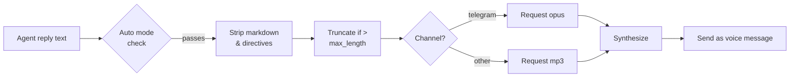

# TTS Voice

> Add voice replies to your agents — pick from four providers and control exactly when audio fires.

## Overview

GoClaw's TTS system converts agent text replies into audio and delivers them as voice messages on supported channels (e.g. Telegram voice bubbles). You configure a primary provider, set an auto-apply mode, and GoClaw handles the rest — stripping markdown, truncating long text, and choosing the right audio format per channel.

Four providers are available:

| Provider | Key | Requires |
|----------|-----|---------|
| OpenAI | `openai` | API key |
| ElevenLabs | `elevenlabs` | API key |
| Microsoft Edge TTS | `edge` | `edge-tts` CLI (free) — always available as fallback |
| MiniMax | `minimax` | API key + Group ID |

---

## Auto-apply Modes

The `auto` field controls when TTS fires:

| Mode | When audio is sent |
|------|--------------------|
| `off` | Never (default) |
| `always` | Every eligible reply |
| `inbound` | Only when the user sent a voice/audio message |
| `tagged` | Only when the reply contains `[[tts]]` |

The `mode` field narrows which reply types qualify:

| Value | Behavior |
|-------|----------|
| `final` | Only final replies (default) |
| `all` | All replies including tool results |

Text shorter than 10 characters or containing a `MEDIA:` path is always skipped. Text over `max_length` (default 1500) is truncated with `...`.

---

## Provider Setup

### OpenAI

```json
{
  "tts": {
    "provider": "openai",
    "auto": "inbound",
    "openai": {
      "api_key": "sk-...",
      "model": "gpt-4o-mini-tts",
      "voice": "alloy"
    }
  }
}
```

Available voices: `alloy`, `echo`, `fable`, `onyx`, `nova`, `shimmer`. Default model: `gpt-4o-mini-tts`.

---

### ElevenLabs

```json
{
  "tts": {
    "provider": "elevenlabs",
    "auto": "always",
    "elevenlabs": {
      "api_key": "xi-...",
      "voice_id": "pMsXgVXv3BLzUgSXRplE",
      "model_id": "eleven_multilingual_v2"
    }
  }
}
```

Find voice IDs in your [ElevenLabs voice library](https://elevenlabs.io/voice-library). Default model: `eleven_multilingual_v2`.

#### ElevenLabs Model Variants

| Model ID | Characteristic | Best For |
|----------|---------------|---------|
| `eleven_v3` | Latest flagship (Nov 2025), highest quality | Premium voice, complex speech |
| `eleven_multilingual_v2` | High-quality, 29 languages | Default; multilingual content |
| `eleven_turbo_v2_5` | Cost-optimized, fast | High-volume, budget-conscious |
| `eleven_flash_v2_5` | Lowest latency, 32 languages | Real-time / interactive use |

Only these four model IDs are accepted — unknown IDs are rejected at the gateway boundary.

---

### Edge TTS (Free)

Edge TTS uses Microsoft's neural voices via the `edge-tts` Python CLI — no API key needed.

```bash
pip install edge-tts
```

```json
{
  "tts": {
    "provider": "edge",
    "auto": "tagged",
    "edge": {
      "enabled": true,
      "voice": "en-US-MichelleNeural",
      "rate": "+0%"
    }
  }
}
```

The `enabled` field must be `true` to activate the Edge provider — it has no API key to detect automatically.

Browse available voices:

```bash
edge-tts --list-voices
```

Popular voices: `en-US-MichelleNeural`, `en-GB-SoniaNeural`, `vi-VN-HoaiMyNeural`. The `rate` field adjusts speed (e.g. `+20%` faster, `-10%` slower). Output is always MP3.

---

### MiniMax

MiniMax's T2A API supports 300+ system voices and 40+ languages.

```json
{
  "tts": {
    "provider": "minimax",
    "auto": "always",
    "minimax": {
      "api_key": "...",
      "group_id": "your-group-id",
      "model": "speech-02-hd",
      "voice_id": "Wise_Woman"
    }
  }
}
```

Models: `speech-02-hd` (high quality), `speech-02-turbo` (faster). Supported output formats: `mp3`, `opus`, `pcm`, `flac`, `wav`.

---

## Full Config Reference

```json
{
  "tts": {
    "provider": "openai",
    "auto": "inbound",
    "mode": "final",
    "max_length": 1500,
    "timeout_ms": 30000,
    "openai": { "api_key": "sk-...", "voice": "nova" },
    "edge":   { "enabled": true, "voice": "en-US-MichelleNeural" }
  }
}
```

When the primary provider fails, GoClaw automatically tries the other registered providers.

---

## Channel Integration

### Telegram Voice Bubbles

When the originating channel is `telegram`, GoClaw automatically requests `opus` format (Ogg/Opus container) instead of MP3 — Telegram requires this for voice messages. No extra config is needed.



### Tagged Mode

Add `[[tts]]` anywhere in an agent reply to trigger synthesis in `tagged` mode:

```
Here's your daily briefing. [[tts]]
```

---

## Examples

**Minimal free setup with Edge TTS:**

```bash
pip install edge-tts
```

```json
{
  "tts": {
    "provider": "edge",
    "auto": "inbound",
    "edge": { "enabled": true, "voice": "en-US-JennyNeural" }
  }
}
```

**OpenAI primary with ElevenLabs fallback:**

```json
{
  "tts": {
    "provider": "openai",
    "auto": "always",
    "openai":     { "api_key": "sk-...", "voice": "alloy" },
    "elevenlabs": { "api_key": "xi-...", "voice_id": "pMsXgVXv3BLzUgSXRplE" }
  }
}
```

---

## Agent-Level Voice Config

Each agent can override the global TTS voice and model via its `other_config` JSONB field. This lets different agents use different voices without changing the system-wide config.

| Key | Type | Description |
|-----|------|-------------|
| `tts_voice_id` | string | ElevenLabs voice ID for this agent |
| `tts_model_id` | string | ElevenLabs model ID for this agent (must be an [allowed model](#elevenlabs-model-variants)) |

**Resolution order:** CLI args → agent `other_config` → tenant override → provider default.

**Example** — set a distinct voice per agent via the Web UI or API:

```json
{
  "other_config": {
    "tts_voice_id": "pMsXgVXv3BLzUgSXRplE",
    "tts_model_id": "eleven_flash_v2_5"
  }
}
```

---

## STT Builtin Tool

The `stt` builtin tool (seeded by migration 050) enables agents to transcribe voice/audio input using ElevenLabs Scribe or a compatible proxy — see [Tools Overview](/tools-overview) for how to enable and configure it.

---

## Common Issues

| Issue | Cause | Fix |
|-------|-------|-----|
| `tts provider not found: edge` | `enabled` not set | Add `"enabled": true` to `edge` section |
| `edge-tts failed` | CLI not installed | `pip install edge-tts` |
| `all tts providers failed` | All providers errored | Check API keys; inspect gateway logs |
| No voice in Telegram | `auto` is `off` | Set `auto: "inbound"` or `"always"` |
| Voice fires on tool results | `mode` is `all` | Set `mode: "final"` |
| MiniMax returns empty audio | Missing `group_id` | Add `group_id` from MiniMax console |
| Text cut off with `...` | Over `max_length` | Increase `max_length` in config |

---

## What's Next

- [Scheduling & Cron](/scheduling-cron) — trigger agents on a schedule
- [Extended Thinking](/extended-thinking) — deeper reasoning for complex replies

<!-- goclaw-source: 050aafc9 | updated: 2026-04-17 -->
