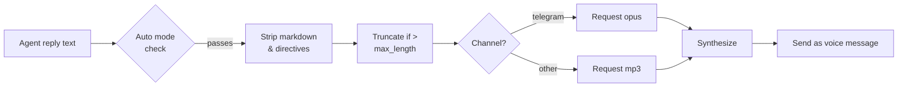
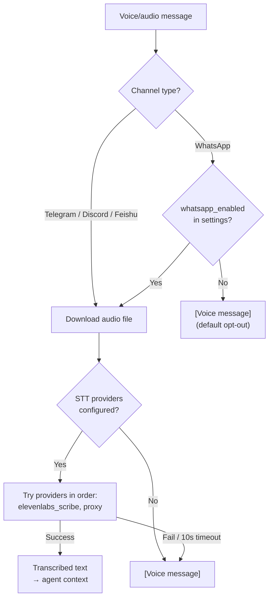

# TTS Voice

> Add voice replies to your agents — pick from five providers and control exactly when audio fires.

## Overview

GoClaw's TTS system converts agent text replies into audio and delivers them as voice messages on supported channels (e.g. Telegram voice bubbles). You configure a primary provider, set an auto-apply mode, and GoClaw handles the rest — stripping markdown, truncating long text, and choosing the right audio format per channel.

Five providers are available:

| Provider | Key | Requires |
|----------|-----|---------|
| OpenAI | `openai` | API key |
| ElevenLabs | `elevenlabs` | API key |
| Microsoft Edge TTS | `edge` | `edge-tts` CLI (free) — always available as fallback |
| MiniMax | `minimax` | API key + Group ID |
| Google Gemini TTS | `gemini` | API key |

---

## Auto-apply Modes

The `auto` field controls when TTS fires:

| Mode | When audio is sent |
|------|--------------------|
| `off` | Never (default) |
| `always` | Every eligible reply |
| `inbound` | Only when the user sent a voice/audio message |
| `tagged` | Only when the reply contains `[[tts]]` |

The `mode` field narrows which reply types qualify:

| Value | Behavior |
|-------|----------|
| `final` | Only final replies (default) |
| `all` | All replies including tool results |

Text shorter than 10 characters or containing a `MEDIA:` path is always skipped. Text over `max_length` (default 1500) is truncated with `...`.

---

## Provider Setup

### OpenAI

```json
{
  "tts": {
    "provider": "openai",
    "auto": "inbound",
    "openai": {
      "api_key": "sk-...",
      "model": "gpt-4o-mini-tts",
      "voice": "alloy"
    }
  }
}
```

Available voices: `alloy`, `ash`, `ballad`, `coral`, `echo`, `fable`, `onyx`, `nova`, `sage`, `shimmer`, `verse`, `marin`, `cedar`. Note: `ballad`, `verse`, `marin`, `cedar` are only compatible with `gpt-4o-mini-tts`.

Supported models: `tts-1`, `tts-1-hd`, `gpt-4o-mini-tts` (default).

#### OpenAI Advanced Params

| Param | Type | Default | Notes |
|-------|------|---------|-------|
| `speed` | range | 1.0 | 0.25–4.0; agent-overridable |
| `response_format` | enum | `mp3` | mp3, opus, aac, flac, wav, pcm |
| `instructions` | text | — | Style prompt; `gpt-4o-mini-tts` only (advanced) |

---

### ElevenLabs

```json
{
  "tts": {
    "provider": "elevenlabs",
    "auto": "always",
    "elevenlabs": {
      "api_key": "xi-...",
      "voice_id": "pMsXgVXv3BLzUgSXRplE",
      "model_id": "eleven_multilingual_v2"
    }
  }
}
```

Find voice IDs in your [ElevenLabs voice library](https://elevenlabs.io/voice-library). Default model: `eleven_multilingual_v2`.

#### ElevenLabs Model Variants

| Model ID | Characteristic | Best For |
|----------|---------------|---------|
| `eleven_v3` | Latest flagship (Nov 2025), highest quality | Premium voice, complex speech |
| `eleven_multilingual_v2` | High-quality, 29 languages | Default; multilingual content |
| `eleven_turbo_v2_5` | Cost-optimized, fast | High-volume, budget-conscious |
| `eleven_flash_v2_5` | Lowest latency, 32 languages | Real-time / interactive use |

Only these four model IDs are accepted — unknown IDs are rejected at the gateway boundary.

#### ElevenLabs Advanced Params

| Param | Type | Default | Notes |
|-------|------|---------|-------|
| `voice_settings.stability` | range | 0.5 | 0–1; voice consistency |
| `voice_settings.similarity_boost` | range | 0.75 | 0–1; closeness to original |
| `voice_settings.style` | range | 0.0 | 0–1; agent-overridable as `style` |
| `voice_settings.use_speaker_boost` | boolean | true | — |
| `voice_settings.speed` | range | 1.0 | 0.7–1.2; agent-overridable as `speed` |
| `apply_text_normalization` | enum | auto | auto / on / off |
| `seed` | integer | 0 | Reproducible output (advanced) |
| `optimize_streaming_latency` | range | 0 | 0–4 (advanced) |
| `language_code` | string | — | ISO 639-1 hint (advanced) |
| `output_format` | enum | `mp3_44100_128` | Codec + bitrate; higher tiers need Creator+/Pro+ (advanced) |

---

### Edge TTS (Free)

Edge TTS uses Microsoft's neural voices via the `edge-tts` Python CLI — no API key needed.

```bash
pip install edge-tts
```

```json
{
  "tts": {
    "provider": "edge",
    "auto": "tagged",
    "edge": {
      "enabled": true,
      "voice": "en-US-MichelleNeural",
      "rate": "+0%"
    }
  }
}
```

The `enabled` field must be `true` to activate the Edge provider — it has no API key to detect automatically.

Browse available voices:

```bash
edge-tts --list-voices
```

Popular voices: `en-US-MichelleNeural`, `en-GB-SoniaNeural`, `vi-VN-HoaiMyNeural`. The `rate` field adjusts speed (e.g. `+20%` faster, `-10%` slower). Output is always MP3.

#### Edge TTS Params

| Param | Type | Default | Notes |
|-------|------|---------|-------|
| `rate` | integer | 0 | Speed offset −50 to +100 (%) |
| `pitch` | integer | 0 | Pitch offset −50 to +50 (Hz) |
| `volume` | integer | 0 | Volume offset −50 to +100 (%) |

---

### MiniMax

MiniMax's T2A API supports 300+ system voices and 40+ languages. Voices are fetched dynamically — use the [Voices API](#voices-api) with `?provider=minimax`.

```json
{
  "tts": {
    "provider": "minimax",
    "auto": "always",
    "minimax": {
      "api_key": "...",
      "group_id": "your-group-id",
      "model": "speech-02-hd",
      "voice_id": "Wise_Woman"
    }
  }
}
```

Supported models: `speech-02-hd` (high quality), `speech-02-turbo` (faster), `speech-01-hd`, `speech-01-turbo`.

#### MiniMax Advanced Params

| Param | Type | Default | Notes |
|-------|------|---------|-------|
| `speed` | range | 1.0 | 0.5–2.0; agent-overridable as `speed` |
| `vol` | range | 1.0 | Volume 0.01–10.0 |
| `pitch` | integer | 0 | Pitch in semitones −12 to +12 |
| `emotion` | enum | — | happy/sad/angry/fearful/disgusted/surprised/neutral/excited/anxious; agent-overridable |
| `text_normalization` | boolean | — | Omitted when not set |
| `audio.format` | enum | `mp3` | mp3, pcm, flac, wav |
| `language_boost` | enum | Auto | 18 languages; improves pronunciation |
| `subtitle_enable` | boolean | — | Returns word-level timing data |
| `audio.sample_rate` | enum | Default | 8k–44.1 kHz (advanced) |
| `audio.bitrate` | enum | Default | 32–256 kbps; MP3 only (advanced) |
| `audio.channel` | enum | Default | Mono / Stereo (advanced) |
| `pronunciation_dict` | text | — | JSON array of `"word/phoneme"` rules, max 8 KB (advanced) |

Voice metadata (gender + language) is parsed automatically from MiniMax naming conventions and displayed as labels in the voice picker.

---

### Google Gemini TTS

Gemini TTS uses Google's latest preview models. An API key is required.

```json
{
  "tts": {
    "provider": "gemini",
    "auto": "always",
    "gemini": {
      "api_key": "AIza...",
      "model": "gemini-2.5-flash-preview-tts",
      "voice": "Kore"
    }
  }
}
```

Supported models (all preview-stage — UI shows a **Preview** badge):

| Model | Notes |
|-------|-------|
| `gemini-2.5-flash-preview-tts` | Default; fast + cost-efficient |
| `gemini-2.5-pro-preview-tts` | Highest quality |
| `gemini-3.1-flash-tts-preview` | Experimental |

#### Gemini Voices (30 prebuilt)

Each voice has a style character label shown as a badge in the UI:

| Voice | Style | Voice | Style |
|-------|-------|-------|-------|
| Zephyr | Bright | Puck | Upbeat |
| Charon | Informative | Kore | Firm |
| Fenrir | Excitable | Leda | Youthful |
| Orus | Firm | Aoede | Breezy |
| Callirrhoe | Easy-going | Autonoe | Bright |
| Enceladus | Breathy | Iapetus | Clear |
| Umbriel | Easy-going | Algieba | Smooth |
| Despina | Smooth | Erinome | Clear |
| Algenib | Gravelly | Rasalgethi | Informative |
| Laomedeia | Upbeat | Achernar | Soft |
| Alnilam | Firm | Schedar | Even |
| Gacrux | Mature | Pulcherrima | Forward |
| Achird | Friendly | Zubenelgenubi | Casual |
| Vindemiatrix | Gentle | Sadachbia | Lively |
| Sadaltager | Knowledgeable | Sulafat | Warm |

#### Gemini Params

| Param | Type | Default | Group |
|-------|------|---------|-------|
| `temperature` | range | API default (1.0) | Basic — subtle effect; primary expressiveness via audio tags |
| `seed` | integer | — | Advanced |
| `presencePenalty` | range | — | Advanced — experimental |
| `frequencyPenalty` | range | — | Advanced — experimental |

#### Gemini Multi-Speaker Mode

Up to 2 speakers per request. Each speaker has a `name` and a `voice` from the 30 prebuilt voices. Configure via the portal's Voice Picker — stored as `tts.gemini.speakers` JSON blob.

#### Gemini Audio Tags

Inject expressive markers directly into the text:

```
Hello [laughs] world [sighs] how are you?
```

Categories: Emotion, Pacing, Effect, Voice quality. Full tag list is in the frontend tag picker.

#### Gemini Language Support

70+ languages — no explicit language parameter needed. Gemini detects language from input text automatically.

#### Gemini Validation Errors (422)

| Error | When |
|-------|------|
| `ErrInvalidVoice` | Voice ID not in the 30 prebuilt set |
| `ErrSpeakerLimit` | More than 2 speakers in multi-speaker mode |
| `ErrInvalidModel` | Model ID not in the allowed list |

---

## Agent-Level Voice Override

Each agent can override TTS params via its `other_config` JSONB field without changing the system-wide config.

### Voice and Model (ElevenLabs)

| Key | Type | Description |
|-----|------|-------------|
| `tts_voice_id` | string | ElevenLabs voice ID for this agent |
| `tts_model_id` | string | ElevenLabs model ID (must be an [allowed model](#elevenlabs-model-variants)) |

### Per-Agent Params Override (v3.10.0+)

Agents can override a subset of provider params stored in `other_config.tts_params`. Only these generic keys are allowed:

| Generic key | Maps to (OpenAI) | Maps to (ElevenLabs) | Maps to (MiniMax) | Edge / Gemini |
|-------------|------------------|----------------------|-------------------|---------------|
| `speed` | `speed` | `voice_settings.speed` | `speed` | not mapped |
| `emotion` | not mapped | not mapped | `emotion` | not mapped |
| `style` | not mapped | `voice_settings.style` | not mapped | not mapped |

Keys outside this allow-list are rejected at write time. The adapter runs per-attempt inside the provider fallback loop, so each attempt uses the correct mapping for that provider.

**Resolution order:** CLI args → agent `other_config` → tenant override → provider default.

**Example:**

```json
{
  "other_config": {
    "tts_voice_id": "pMsXgVXv3BLzUgSXRplE",
    "tts_model_id": "eleven_flash_v2_5",
    "tts_params": {
      "speed": 1.1,
      "style": 0.3
    }
  }
}
```

---

## Full Config Reference

```json
{
  "tts": {
    "provider": "openai",
    "auto": "inbound",
    "mode": "final",
    "max_length": 1500,
    "timeout_ms": 30000,
    "openai": { "api_key": "sk-...", "voice": "nova" },
    "edge":   { "enabled": true, "voice": "en-US-MichelleNeural" }
  }
}
```

When the primary provider fails, GoClaw automatically tries the other registered providers.

---

## Voices API

GoClaw exposes HTTP endpoints for discovering available TTS voices. These are tenant-scoped and require tenant admin or operator role.

| Method | Path | Description |
|--------|------|-------------|
| `GET` | `/v1/voices` | List available voices (in-memory cached, TTL 1h) |
| `GET` | `/v1/voices?provider=minimax` | List MiniMax dynamic voices |
| `POST` | `/v1/voices/refresh` | Force-invalidate the voice cache (admin only) |

### `GET /v1/voices`

Returns the voice list for the current tenant's configured provider. Results are cached in-memory per tenant with a 1-hour TTL. For ElevenLabs, voices are user-account-specific. For MiniMax, the `?provider=minimax` query parameter fetches that provider's voice list at runtime.

```json
[
  {
    "voice_id": "pMsXgVXv3BLzUgSXRplE",
    "name": "Alice",
    "labels": {
      "use_case": "conversational",
      "accent": "american"
    }
  }
]
```

A cache miss triggers an immediate fetch from the provider. Returns `500` if the provider is unreachable.

### `POST /v1/voices/refresh`

Invalidates the voice cache for the current tenant so the next `GET /v1/voices` request fetches a fresh list. Returns `202 Accepted`.

---

## Capabilities API

```
GET /v1/tts/capabilities
```

Returns the full `ProviderCapabilities` schema for all registered providers — models, static voices, param schemas, and custom feature flags. The portal uses this to render dynamic per-provider settings forms and the agent override UI.

---

## Channel Integration

### Telegram Voice Bubbles

When the originating channel is `telegram`, GoClaw automatically requests `opus` format (Ogg/Opus container) instead of MP3 — Telegram requires this for voice messages. No extra config is needed.



### Tagged Mode

Add `[[tts]]` anywhere in an agent reply to trigger synthesis in `tagged` mode:

```
Here's your daily briefing. [[tts]]
```

---

## Examples

**Minimal free setup with Edge TTS:**

```bash
pip install edge-tts
```

```json
{
  "tts": {
    "provider": "edge",
    "auto": "inbound",
    "edge": { "enabled": true, "voice": "en-US-JennyNeural" }
  }
}
```

**OpenAI primary with ElevenLabs fallback:**

```json
{
  "tts": {
    "provider": "openai",
    "auto": "always",
    "openai":     { "api_key": "sk-...", "voice": "alloy" },
    "elevenlabs": { "api_key": "xi-...", "voice_id": "pMsXgVXv3BLzUgSXRplE" }
  }
}
```

**Gemini multi-speaker with audio tags:**

```json
{
  "tts": {
    "provider": "gemini",
    "auto": "always",
    "gemini": {
      "api_key": "AIza...",
      "model": "gemini-2.5-flash-preview-tts"
    }
  }
}
```

Configure speakers in the portal Voice Picker — up to 2 speakers, each with a name and one of the 30 Gemini prebuilt voices.

---

## Speech-to-Text (STT)

GoClaw routes all voice/audio transcription through a unified `audio.Manager` with a provider chain. Channels (Telegram, Discord, Feishu, WhatsApp) share the same STT infrastructure.

### Unified Transcription Flow



### WhatsApp Opt-In

WhatsApp STT is **off by default** (`whatsapp_enabled: false`). Rationale: WhatsApp voice messages are end-to-end encrypted. Sending audio bytes to an external STT provider breaks E2E encryption. Admins must explicitly enable it in **Config → Audio → STT** and acknowledge the E2E breaking change.

When disabled (default): voice messages appear in agent context as `[Voice message]` — no audio leaves the device.
When enabled: audio is transcribed via the configured STT chain; falls back to `[Voice message]` on failure or timeout (10 s wall clock).

### STT Provider Chain

| Setting | Behavior |
|---------|----------|
| `providers: ["elevenlabs_scribe", "proxy_stt"]` | Try ElevenLabs Scribe first; fall back to legacy proxy |
| `providers: []` (empty) | Skip all STT; voice → `[Voice message]` |
| `providers` missing (nil) | Check for legacy `STTProxyURL` bridge at startup |

Configure via **Config → Audio → STT** in the web UI (stored in `builtin_tools[stt].settings.providers`). When this list is present it overrides all legacy channel-specific STT configs.

---

## STT Builtin Tool

The `stt` builtin tool (seeded by migration 050) enables agents to transcribe voice/audio input using ElevenLabs Scribe or a compatible proxy — see [Tools Overview](/tools-overview) for how to enable and configure it.

---

## Common Issues

| Issue | Cause | Fix |
|-------|-------|-----|
| `tts provider not found: edge` | `enabled` not set | Add `"enabled": true` to `edge` section |
| `edge-tts failed` | CLI not installed | `pip install edge-tts` |
| `all tts providers failed` | All providers errored | Check API keys; inspect gateway logs |
| No voice in Telegram | `auto` is `off` | Set `auto: "inbound"` or `"always"` |
| Voice fires on tool results | `mode` is `all` | Set `mode: "final"` |
| MiniMax returns empty audio | Missing `group_id` | Add `group_id` from MiniMax console |
| Text cut off with `...` | Over `max_length` | Increase `max_length` in config |
| Gemini 422 `ErrInvalidVoice` | Voice not in 30 prebuilt set | Use a valid voice ID from the table above |
| Gemini 422 `ErrSpeakerLimit` | More than 2 speakers | Reduce to ≤ 2 speakers in Voice Picker |
| `tts_params` key rejected | Key not in allow-list | Use only `speed`, `emotion`, `style` |

---

## What's Next

- [Scheduling & Cron](/scheduling-cron) — trigger agents on a schedule
- [Extended Thinking](/extended-thinking) — deeper reasoning for complex replies

<!-- goclaw-source: 1b862707 | updated: 2026-04-20 -->
