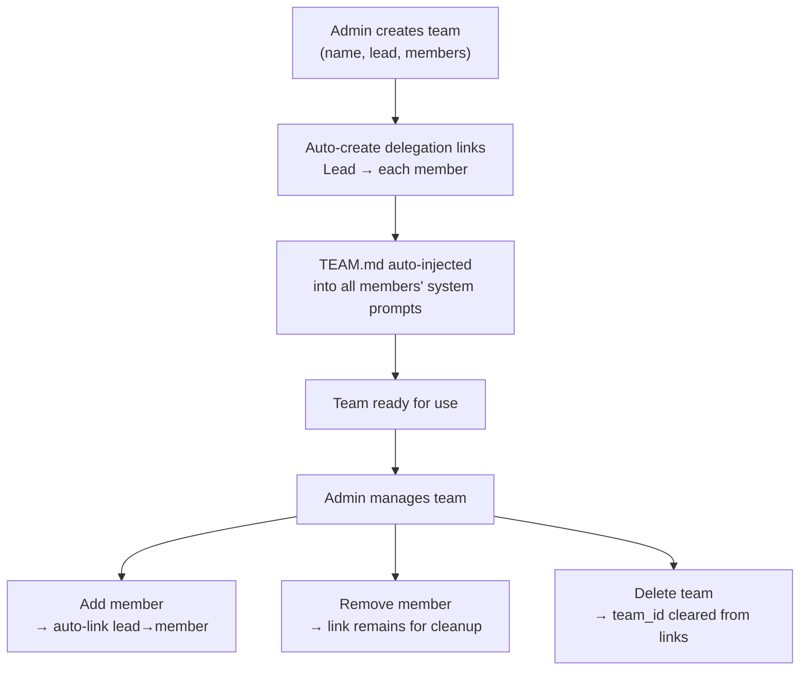

# Creating & Managing Teams

Create teams via API, Dashboard, or CLI. The system automatically establishes delegation links between the lead and all members, injects `TEAM.md` into their system prompts, and wires up task board access.

## Quick Start

**Create a team** with lead agent and members:

```bash
# CLI
./goclaw team create \
  --name "Research Team" \
  --lead researcher_agent \
  --members analyst_agent,writer_agent \
  --description "Parallel research and writing"
```

**Via HTTP API**:

```bash
POST /v1/teams
{
  "name": "Research Team",
  "lead_agent_key": "researcher_agent",
  "member_agent_keys": ["analyst_agent", "writer_agent"],
  "description": "Parallel research and writing"
}
```

**Dashboard**: Teams → Create Team → Select Lead → Add Members → Save

## What Happens on Creation

When you create a team, the system:

1. **Validates** lead and member agents exist
2. **Creates team record** with `status=active`
3. **Adds lead as a member** with `role=lead`
4. **Adds each member** with `role=member`
5. **Auto-creates delegation links** from lead → each member:
   - Direction: `outbound` (lead can delegate to members)
   - Max concurrent delegations per link: `3`
   - Marked with `team_id` (system knows these are team-managed)
6. **Injects TEAM.md** into all members' system prompts
7. **Enables task board** for all team members

## Team Lifecycle



## Managing Team Membership

**Add a member**:

```bash
./goclaw team add-member \
  --team-id 550e8400-e29b-41d4-a716-446655440000 \
  --agent analyst_agent

# When added, a delegation link is automatically created
# from lead → new member
```

**Remove a member**:

```bash
./goclaw team remove-member \
  --team-id 550e8400-e29b-41d4-a716-446655440000 \
  --agent analyst_agent

# Link remains; it's not automatically deleted
# (manual cleanup to preserve history)
```

**List team members**:

```bash
./goclaw team list-members --team-id 550e8400-e29b-41d4-a716-446655440000

# Output:
# Agent Key        Role        Display Name
# researcher_agent lead        Research Expert
# analyst_agent    member      Data Analyst
# writer_agent     member      Content Writer
```

## Team Settings & Access Control

Teams support fine-grained access control via settings JSON:

```json
{
  "allow_user_ids": ["user_123", "user_456"],
  "deny_user_ids": [],
  "allow_channels": ["telegram", "slack"],
  "deny_channels": [],
  "progress_notifications": true
}
```

**Fields**:
- `allow_user_ids`: Only these users can trigger team work (empty = open)
- `deny_user_ids`: Block these users (deny takes priority)
- `allow_channels`: Only these channels trigger team work (empty = open)
- `deny_channels`: Block these channels
- `progress_notifications`: Send periodic updates during async delegations

**Set team settings**:

```bash
./goclaw team update \
  --team-id 550e8400-e29b-41d4-a716-446655440000 \
  --settings '{
    "allow_user_ids": ["user_123"],
    "allow_channels": ["telegram"]
  }'
```

System channels (`delegate`, `system`) always pass access checks.

## Team Status

Teams have a `status` field:

- `active`: Team is operational
- `archived`: Team exists but disabled
- `deleted`: Team marked for deletion

**Change team status**:

```bash
./goclaw team update \
  --team-id 550e8400-e29b-41d4-a716-446655440000 \
  --status archived
```

## TEAM.md Injection

When a team is created or modified, `TEAM.md` is generated and injected into members' system prompts. It contains:

**Lead's TEAM.md** includes:
- Team name and description
- Teammate list with roles and expertise
- **Mandatory workflow**: create task first, then delegate with task ID
- **Orchestration patterns**: sequential, iterative, parallel, mixed

**Members' TEAM.md** includes:
- Team name and teammate list
- Instructions to focus on delegated work
- How to send progress updates via mailbox
- Task board actions available (list, get, search — no create/delegate)

The context is wrapped in `<system_context>` tags and refreshed automatically when team configuration changes.

## Next Steps

- [Task Board](./task-board.md) - Create and manage tasks
- [Team Messaging](./team-messaging.md) - Communicate between members
- [Delegation & Handoff](./delegation-and-handoff.md) - Orchestrate work
