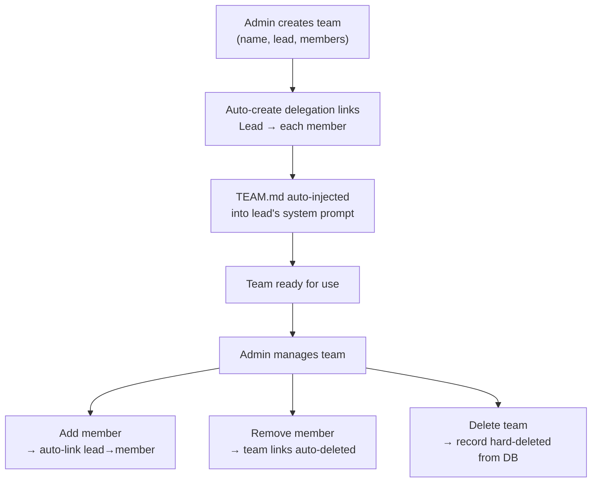

# Creating & Managing Teams

Create teams via API, Dashboard, or CLI. The system automatically establishes delegation links between the lead and all members, injects `TEAM.md` into the lead's system prompt, and wires up task board access for all members.

## Quick Start

**Create a team** with lead agent and members:

```bash
# CLI
./goclaw team create \
  --name "Research Team" \
  --lead researcher_agent \
  --members analyst_agent,writer_agent \
  --description "Parallel research and writing"
```

**Via WebSocket RPC** (`teams.create`):

```json
{
  "name": "Research Team",
  "lead": "researcher_agent",
  "members": ["analyst_agent", "writer_agent"],
  "description": "Parallel research and writing"
}
```

**Dashboard**: Teams → Create Team → Select Lead → Add Members → Save

The Teams list page supports a **card/list toggle** for switching between visual card layout and a compact list view.

## What Happens on Creation

When you create a team, the system:

1. **Validates** lead and member agents exist
2. **Creates team record** with `status=active`
3. **Adds lead as a member** with `role=lead`
4. **Adds each member** with `role=member`
5. **Auto-creates delegation links** from lead → each member:
   - Direction: `outbound` (lead can delegate to members)
   - Max concurrent delegations per link: `3`
   - Marked with `team_id` (system knows these are team-managed)
6. **Injects TEAM.md** into the lead's system prompt with full orchestration instructions
7. **Enables task board** for all team members

## Team Lifecycle



## Managing Team Membership

**Add a member** (role is `member` by default):

```bash
./goclaw team add-member \
  --team-id 550e8400-e29b-41d4-a716-446655440000 \
  --agent analyst_agent \
  --role member

# When added, a delegation link is automatically created
# from lead → new member
```

**Remove a member**:

```bash
./goclaw team remove-member \
  --team-id 550e8400-e29b-41d4-a716-446655440000 \
  --agent-id <agent-uuid>

# Team-specific delegation links are automatically cleaned up on removal
```

**List team members**:

```bash
./goclaw team list-members --team-id 550e8400-e29b-41d4-a716-446655440000

# Output:
# Agent Key        Role        Display Name
# researcher_agent lead        Research Expert
# analyst_agent    member      Data Analyst
# writer_agent     member      Content Writer
```

Member info returned by the API is enriched with full **agent metadata** (display name, emoji, description, model) so the dashboard can render rich member cards.

## Lead vs Member Roles

| Capability | Lead | Member |
|-----------|------|--------|
| Receives full TEAM.md (orchestration instructions) | Yes | No (discovers context via tools) |
| Creates tasks on board | Yes | No |
| Delegates tasks to members | Yes | No |
| Executes delegated tasks | No | Yes |
| Reports progress via task board | No | Yes |
| Sends/receives mailbox messages | Yes | Yes |
| Spawn / delegate access | Yes | No |
| Self-assign tasks | No | N/A |

> **Note**: The lead agent cannot self-assign tasks. Attempting to do so is rejected to prevent a dual-session loop where the lead acts as both coordinator and executor.

Members work within the team structure. They do not have spawn or delegate capabilities — their role is to execute assigned tasks and report results.

## Team Settings & Access Control

Teams support fine-grained access control and behavior configuration via settings JSON:

```json
{
  "allow_user_ids": ["user_123", "user_456"],
  "deny_user_ids": [],
  "allow_channels": ["telegram", "slack"],
  "deny_channels": [],
  "progress_notifications": true,
  "followup_interval_minutes": 30,
  "followup_max_reminders": 3,
  "escalation_mode": "notify_lead",
  "escalation_actions": [],
  "workspace_scope": "isolated",
  "workspace_quota_mb": 500,
  "blocker_escalation": {
    "enabled": true
  }
}
```

**Access control fields**:
- `allow_user_ids`: Only these users can trigger team work (empty = open access)
- `deny_user_ids`: Block these users (deny takes priority over allow)
- `allow_channels`: Only messages from these channels trigger team work (empty = open)
- `deny_channels`: Block messages from these channels

System channels (`teammate`, `system`) always pass access checks regardless of settings.

**Follow-up & escalation fields**:
- `followup_interval_minutes`: Minutes between auto follow-up reminders on in-progress tasks
- `followup_max_reminders`: Maximum number of follow-up reminders per task
- `escalation_mode`: How to handle stale tasks — `"notify_lead"` (send notification) or `"fail_task"` (auto-fail the task)
- `escalation_actions`: Additional actions to take on escalation

**Blocker escalation**:
- `blocker_escalation.enabled`: Whether blocker comments auto-fail tasks and escalate to lead (default: `true`)

When `blocker_escalation` is enabled (default), if a member posts a blocker comment on a task, the task is auto-failed and the lead receives an escalation message with the blocker reason and retry instructions. Set `enabled: false` to save blocker comments without triggering auto-fail.

**Workspace fields**:
- `workspace_scope`: `"isolated"` (default, per-conversation folders) or `"shared"` (all members share one folder)
- `workspace_quota_mb`: Disk quota for team workspace in megabytes

**Other fields**:
- `progress_notifications`: Send periodic updates during async delegations

**Set team settings**:

```bash
./goclaw team update \
  --team-id 550e8400-e29b-41d4-a716-446655440000 \
  --settings '{
    "allow_user_ids": ["user_123"],
    "allow_channels": ["telegram"],
    "blocker_escalation": {"enabled": true},
    "escalation_mode": "notify_lead"
  }'
```

## Team Status

Teams have a `status` field:

- `active`: Team is operational
- `archived`: Team exists but disabled

To fully remove a team, use the delete operation — it hard-deletes the record from the database. There is no `deleted` status.

**Change team status**:

```bash
./goclaw team update \
  --team-id 550e8400-e29b-41d4-a716-446655440000 \
  --status archived
```

## Team Members in System Prompt

When a team is active, GoClaw injects a `## Team Members` section into the lead agent's system prompt listing all teammates. Each entry is enriched with agent metadata including emoji icon (from `other_config`):

```
## Team Members
- agent_key: analyst_agent | display_name: 🔍 Data Analyst | role: member | expertise: Data analysis and visualization...
- agent_key: writer_agent | display_name: ✍️ Content Writer | role: member | expertise: Technical writing...
```

This lets the lead assign tasks to the correct agent by key without guessing. The section updates automatically when members are added or removed.

## Lead Workspace Resolution

When a team task is dispatched, the lead agent resolves the per-team workspace directory for both lead and member agents. This resolution is transparent — agents use normal file paths and the **WorkspaceInterceptor** rewrites requests to the correct team workspace context automatically.

For isolated scope (`workspace_scope: "isolated"`), each conversation gets its own folder. For shared scope, all members read and write to the same team directory.

## Media Auto-Copy

When a task is created from a conversation that includes media files (images, documents), GoClaw automatically copies those files to the team workspace at `{team_workspace}/attachments/`. Hard links are used when possible for efficiency, with a copy fallback. Files are validated and saved with restrictive permissions (0640).

## TEAM.md Injection

`TEAM.md` is a virtual file generated dynamically at agent resolution time — not stored on disk. It is injected into the system prompt wrapped in `<system_context>` tags.

**Lead's TEAM.md** includes:
- Team name and description
- Teammate list with roles and expertise
- **Mandatory workflow**: create task first, then delegate with task ID — delegations without a valid `team_task_id` are rejected
- **Orchestration patterns**: sequential, iterative, parallel, mixed
- Communication guidelines

**Members' TEAM.md** includes:
- Team name and teammate list
- Instructions to focus on delegated work
- How to report progress via `team_tasks(action="progress", percent=50, text="...")`
- Task board actions available: `claim`, `complete`, `list`, `get`, `search`, `progress`, `comment`, `attach`, `retry` (no `create`, `cancel`, `approve`, `reject`)

The context refreshes automatically when team configuration changes (members added/removed, settings updated).

## Next Steps

- [Task Board](./task-board.md) - Create and manage tasks
- [Team Messaging](./team-messaging.md) - Communicate between members
- [Delegation & Handoff](./delegation-and-handoff.md) - Orchestrate work

<!-- goclaw-source: 050aafc9 | updated: 2026-04-09 -->
