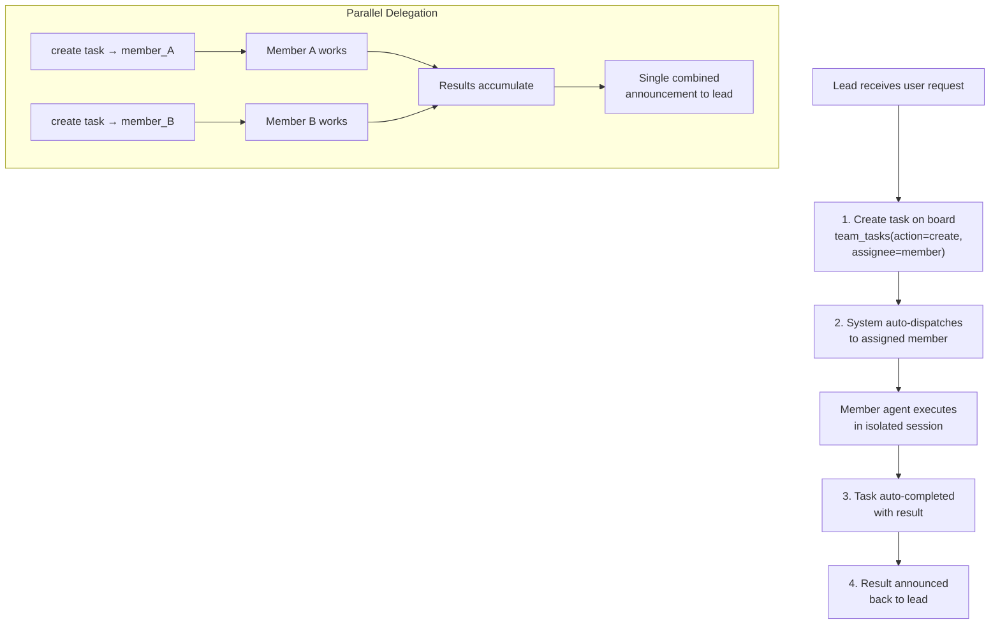

# Delegation & Handoff

Delegation allows the lead to assign work to member agents via the task board. Handoff transfers conversation control between agents without interrupting the user's session.

## Agent Delegation Flow

Delegation works through the `team_tasks` tool — the lead creates a task with an assignee, and the system auto-dispatches it to the assigned member:



> **Note**: The `spawn` tool is for **self-clone subagents only** — it does not accept an `agent` parameter. To delegate to a team member, always use `team_tasks(action="create", assignee=...)`.

## Creating a Delegation Task

Use the `team_tasks` tool with `action: "create"` and a required `assignee`:

```json
{
  "action": "create",
  "subject": "Analyze the market trends in the Q1 report",
  "description": "Focus on Q1 revenue data and competitor analysis",
  "assignee": "analyst_agent"
}
```

The system validates and auto-dispatches:
- **`assignee` is required** — every task must be assigned to a team member
- **Assignee must be a team member** — non-members are rejected
- **Lead cannot self-assign** — prevents dual-session execution loops
- **Auto-dispatch**: after the lead's turn ends, pending tasks are dispatched to their assigned agents

**Guards enforced**:
- Max **3 dispatches** per task — auto-fails after 3 attempts to prevent infinite loops
- Task dispatched to lead agent is blocked and auto-failed
- Member requests (non-lead) can optionally require leader approval before dispatch

## Parallel Delegation

Create multiple tasks in the same turn — they dispatch simultaneously after the turn:

```json
// Lead creates 2 tasks in one turn
{"action": "create", "subject": "Extract facts", "assignee": "analyst1"}
{"action": "create", "subject": "Extract opinions", "assignee": "analyst2"}
```

Results are collected and announced together when all complete.

## Auto-Completion & Artifacts

When a delegation finishes:

1. Linked task is marked `completed` with delegation result
2. Result summary is persisted
3. Media files (images, documents) are forwarded
4. Delegation artifacts stored with team context
5. Session cleaned up

**Announcement includes**:
- Results from each member agent
- Deliverables and media files
- Elapsed time statistics
- Guidance: present results to user, delegate follow-ups, or ask for revisions

## Delegation Search

When an agent has too many targets for static `AGENTS.md` (>15), use delegation search:

```json
{
  "query": "data analysis and visualization",
  "max_results": 5
}
```

Call the `delegate_search` tool with the above parameters.

**What it searches**:
- Agent name and key (full-text search)
- Agent description (full-text search)
- Semantic similarity (if embedding provider available)

**Result**:
```json
{
  "agents": [
    {
      "agent_key": "analyst_agent",
      "display_name": "Data Analyst",
      "frontmatter": "Analyzes data and creates visualizations"
    }
  ],
  "count": 1
}
```

**Hybrid search**: Uses both keyword matching (FTS) and semantic embeddings for best results.

## Access Control: Agent Links

Each delegation link (lead → member) can have its own access control:

```json
{
  "user_allow": ["user_123", "user_456"],
  "user_deny": []
}
```

**Concurrency limits**:
- Per-link: configurable via `max_concurrent` on the agent link
- Per-agent: default 5 total concurrent delegations targeting any single member (configurable via agent's `max_delegation_load`)

When limits hit, error message: `"Agent at capacity. Try a different agent or handle it yourself."`

## Handoff: Conversation Transfer

Transfer conversation control to another agent without interrupting the user:

```json
{
  "action": "transfer",
  "agent": "specialist_agent",
  "reason": "You need specialist expertise for the next part of your request",
  "transfer_context": true
}
```

Call the `handoff` tool with the above parameters.

### What Happens

1. Routing override set: future messages from user go to target agent
2. Conversation context (summary) passed to target agent
3. Target agent receives handoff notification with context
4. Event broadcast to UI
5. User's next message routes to new agent
6. Deliverable workspace files copied to the target agent's team workspace

### Handoff Parameters

- `action`: `transfer` (default) or `clear`
- `agent`: Target agent key (required for `transfer`)
- `reason`: Why the handoff (required for `transfer`)
- `transfer_context`: Pass conversation summary (default true)

### Clear a Handoff

```json
{
  "action": "clear"
}
```

Messages will route to default agent for this chat.

### Handoff Messaging

Handoff notification sent to the target agent:
```
[Handoff from researcher_agent]
Reason: You need specialist expertise for the next part of your request

Conversation context:
[summary of recent conversation]

Please greet the user and continue the conversation.
```

### Use Cases

- User's question becomes specialized → handoff to expert
- Agent reaches capacity → handoff to another instance
- Complex problem needs multiple specialties → handoff after partial solution
- Shift from research to implementation → handoff to engineer

## Evaluate Loop (Generator-Evaluator)

For iterative work, use the evaluate pattern with task creation:

```json
{"action": "create", "subject": "Generate initial proposal", "assignee": "generator_agent"}

// Wait for result, then:

{"action": "create", "subject": "Review proposal and provide feedback", "assignee": "evaluator_agent"}

// Generator refines based on feedback...
```

**Note**: The system does not enforce a maximum number of iterations for this pattern. Set your own limit in the lead's instructions to avoid infinite loops.

## Progress Notifications

For async delegations, the lead receives periodic grouped updates (if progress notifications are enabled for the team):

```
🏗 Your team is working on it...
- Data Analyst (analyst_agent): 2m15s
- Report Writer (writer_agent): 45s
```

**Interval**: 30 seconds. Enabled/disabled via team settings (`progress_notifications`).

## Best Practices

1. **Use `team_tasks` to delegate**: create tasks with `assignee` — system auto-dispatches
2. **Don't use `spawn` for delegation**: `spawn` is self-clone only, not for team members
3. **Create multiple tasks in one turn**: they dispatch in parallel after the turn ends
4. **Use `blocked_by`**: coordinate task ordering with dependencies
5. **Link dependencies**: Use `blocked_by` on task board to coordinate order
6. **Handle handoffs gracefully**: Notify user of transfer; pass context
7. **Set iteration limits in instructions**: Prevent infinite evaluate loops

<!-- goclaw-source: 0dab087f | updated: 2026-03-27 -->
