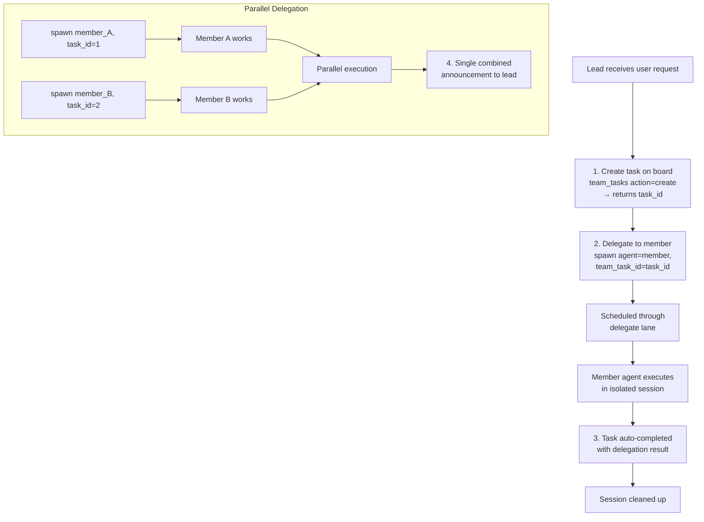

# Delegation & Handoff

Delegation allows the lead to spawn work on member agents. Handoff transfers conversation control between agents without interrupting the user's session.

## Agent Delegation Flow



## Mandatory Task Linking

**Every delegation must link to a team task**. The system enforces this:

```json
{
  "action": "spawn",
  "agent": "analyst_agent",
  "task": "Analyze the market trends in the Q1 report",
  "team_task_id": "550e8400-e29b-41d4-a716-446655440000"
}
```

**If task_id is missing**:
- Delegation is rejected with error message
- Error includes pending tasks to help LLM self-correct
- Lead must create task first, then retry delegation

**If task_id is invalid** or from wrong team:
- Delegation rejected
- Helpful error with list of valid tasks

This ensures every piece of work is tracked on the task board.

## Sync vs Async Delegation

### Sync Delegation (Default)

Parent waits for result before continuing:

```json
{
  "action": "spawn",
  "agent": "analyst_agent",
  "task": "Quick analysis",
  "team_task_id": "550e8400-e29b-41d4-a716-446655440000",
  "mode": "sync"
}
```

- Lead blocks until member finishes
- Result returned directly to lead
- Best for quick tasks (< 2 minutes)
- Task auto-claimed and auto-completed

**Timing**: If task takes >30 seconds, lead receives periodic progress notifications.

### Async Delegation

Parent spawns work in background, gets a delegation ID, polls for result:

```json
{
  "action": "spawn",
  "agent": "analyst_agent",
  "task": "Deep research into market trends",
  "team_task_id": "550e8400-e29b-41d4-a716-446655440000",
  "mode": "async"
}
```

- Lead gets delegation ID immediately
- Lead can continue with other work
- Periodic progress updates (30-second intervals)
- Result announced when complete

**Response**:
```
Delegation started: d-abc123def456
You will receive progress updates while the agent works.
Task: Deep research into market trends
Agent: analyst_agent
Status: running
```

## Parallel Delegation Batching

When lead delegates to multiple members simultaneously, results are collected:

1. Each delegation runs independently in the delegate lane
2. Intermediate completions accumulate results (artifacts)
3. When **last sibling** finishes, all results are collected
4. Single combined announcement delivered to lead

**Example**:

```json
// Lead creates 2 tasks and delegates to 2 members simultaneously
{"action": "create", "subject": "Extract facts"} → task_1
{"action": "create", "subject": "Extract opinions"} → task_2

{"action": "spawn", "agent": "analyst1", "team_task_id": "task_1"}
{"action": "spawn", "agent": "analyst2", "team_task_id": "task_2"}

// Results announced together:
// "analyst1 (facts extraction): ..."
// "analyst2 (opinions extraction): ..."
```

## Auto-Completion & Artifacts

When a delegation finishes:

1. Linked task is marked `completed` with delegation result
2. Result summary is persisted
3. Media files (images, documents) are forwarded
4. Delegation artifacts stored with team context
5. Session cleaned up

**Announcement includes**:
- Results from each member agent
- Deliverables and media files
- Elapsed time statistics
- Guidance: present results to user, delegate follow-ups, or ask for revisions

## Delegation Search

When an agent has too many targets for static `AGENTS.md` (>15), use delegation search:

```json
{
  "action": "delegate_search",
  "query": "data analysis and visualization",
  "max_results": 5
}
```

**What it searches**:
- Agent name and key (full-text search)
- Agent description (full-text search)
- Semantic similarity (if embedding provider available)

**Result**:
```json
{
  "agents": [
    {
      "agent_key": "analyst_agent",
      "agent_name": "Data Analyst",
      "description": "Analyzes data and creates visualizations",
      "can_delegate": true
    }
  ]
}
```

**Hybrid search**: Uses both keyword matching (FTS) and semantic embeddings for best results.

## Access Control: Agent Links

Each delegation link (lead → member) can have its own access control:

```json
{
  "user_allow": ["user_123", "user_456"],
  "user_deny": []
}
```

**Concurrency limits**:
- Per-link: 3 simultaneous delegations from lead to one member
- Per-agent: 5 total concurrent delegations targeting any single member

When limits hit, error message: `"Agent at capacity (5/5). Try a different agent or handle it yourself."`

## Handoff: Conversation Transfer

Transfer conversation control to another agent without interrupting the user:

```json
{
  "action": "handoff",
  "agent": "specialist_agent",
  "reason": "You need specialist expertise for the next part of your request",
  "transfer_context": true
}
```

### What Happens

1. Routing override set: future messages from user go to target agent
2. Conversation context (summary) passed to target agent
3. Target agent receives handoff notification with context
4. Event broadcast to UI
5. User's next message routes to new agent

### Handoff Parameters

- `action`: `transfer` (default) or `clear`
- `agent`: Target agent key (required)
- `reason`: Why the handoff (required)
- `transfer_context`: Pass conversation summary (default true)

### Clear a Handoff

```json
{
  "action": "clear"
}
```

Messages will route to default agent for this chat.

### Handoff Messaging

Handoff notification includes:
```
[Handoff from researcher_agent]
Reason: You need specialist expertise for the next part of your request

Conversation context:
[summary of recent conversation]

Please greet the user and continue the conversation.
```

### Use Cases

- User's question becomes specialized → handoff to expert
- Agent reaches capacity → handoff to another instance
- Complex problem needs multiple specialties → handoff after partial solution
- Shift from research to implementation → handoff to engineer

## Evaluate Loop (Generator-Evaluator)

For iterative work, use the evaluate pattern:

```json
{
  "action": "spawn",
  "agent": "generator_agent",
  "task": "Generate initial proposal",
  "team_task_id": "task_1",
  "mode": "async"
}

// Wait for result, then:

{
  "action": "spawn",
  "agent": "evaluator_agent",
  "task": "Review proposal and provide feedback",
  "team_task_id": "task_2",
  "context": "[previous result from generator]"
}

// Generator refines based on feedback...
```

**Max rounds**: 5 iterations (prevent infinite loops). After 5 rounds, ask user for direction.

## Progress Notifications

For async delegations, receive periodic updates:

```
Progress update: analyst_agent still working on task
Task: Deep research into market trends
Started: 2 minutes ago
Status: running
```

**Interval**: 30 seconds (configurable via team settings)

## Best Practices

1. **Create task before delegating**: Task board must have task first
2. **Use sync for quick tasks**: < 2 minutes
3. **Use async for long tasks**: > 2 minutes, parallel work
4. **Batch parallel work**: Delegate to multiple members simultaneously
5. **Link dependencies**: Use `blocked_by` on task board to coordinate order
6. **Handle handoffs gracefully**: Notify user of transfer; pass context
7. **Set max iterations**: Prevent infinite evaluate loops
