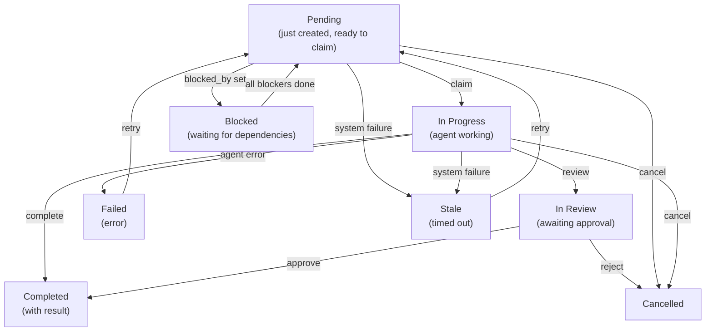
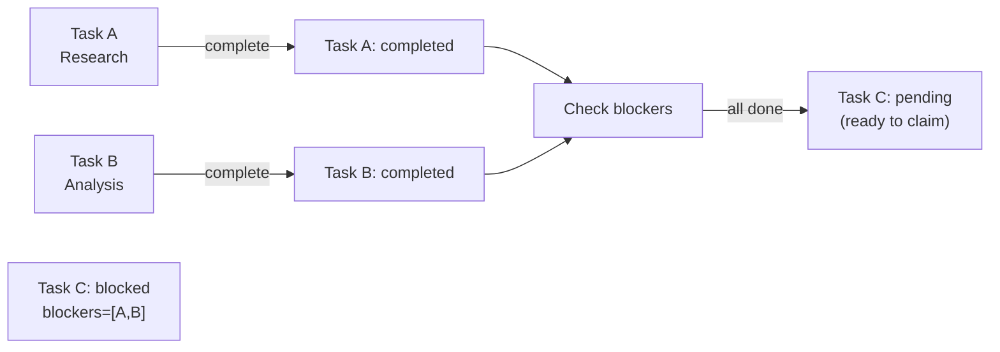

# Task Board

The task board is a shared work tracker accessible to all team members. Tasks can be created with priorities, dependencies, and blocking constraints. Members claim pending tasks, work independently, and mark them complete with results.

The dashboard renders the board as a **Kanban layout** with columns per status. The board toolbar includes a workspace button and agent emoji display for quick identification of who owns each task.

## Task Lifecycle



## Core Tool: `team_tasks`

All team members access the task board via the `team_tasks` tool. Available actions:

| Action | Required Params | Description |
|--------|-----------------|-------------|
| `list` | `action` | Show tasks (default filter: all statuses; page size: 30) |
| `get` | `action`, `task_id` | Get full task detail with comments, events, attachments (result: 8,000 char limit) |
| `create` | `action`, `subject`, `assignee` | Create new task (lead only); `assignee` is **mandatory**; optional: `description`, `priority`, `blocked_by`, `require_approval` |
| `claim` | `action`, `task_id` | Atomically claim a pending task |
| `complete` | `action`, `task_id`, `result` | Mark task done with result summary |
| `cancel` | `action`, `task_id` | Cancel task (lead only); optional: `text` (reason) |
| `assign` | `action`, `task_id`, `assignee` | Admin-assign a pending task to an agent |
| `search` | `action`, `query` | Full-text search over subject + description (check before creating to avoid duplicates) |
| `review` | `action`, `task_id` | Submit in-progress task for review; transitions to `in_review` (owner only) |
| `approve` | `action`, `task_id` | Approve a task in review → `completed` (lead/admin only) |
| `reject` | `action`, `task_id` | Reject a task in review → `cancelled` with reason injected to lead (lead/admin only); optional: `text` |
| `comment` | `action`, `task_id`, `text` | Add a comment; use `type="blocker"` to flag a blocker (triggers auto-fail + lead escalation) |
| `progress` | `action`, `task_id`, `percent` | Update progress 0-100 (owner only); optional: `text` (step description) |
| `update` | `action`, `task_id` | Update task subject or description (lead only) |
| `attach` | `action`, `task_id`, `file_id` | Attach a workspace file to a task |
| `ask_user` | `action`, `task_id`, `text` | Set a periodic follow-up reminder sent to user (owner only) |
| `clear_followup` | `action`, `task_id` | Clear ask_user reminders (owner or lead) |
| `retry` | `action`, `task_id` | Re-dispatch a `stale` or `failed` task back to `pending` (admin/lead) |
| `delete` | `action`, `task_id` | Hard-delete a task in terminal status (completed/cancelled/failed) from the board |

## Create a Task

**Lead creates a task** for members to work on:

> **Note**: The `assignee` field is **mandatory** at task creation. Omitting it returns an error: `"assignee is required — specify which team member should handle this task"`.

> **Note**: Agents must call `search` before `create` to avoid duplicate tasks. Creating without checking first returns an error prompting the search.

> **Note**: Team V2 leads cannot manually create tasks before a spawn has been issued in the current turn — this prevents premature task creation that breaks the structured orchestration flow.

```json
{
  "action": "create",
  "subject": "Extract key points from research paper",
  "description": "Read the PDF and summarize main findings in bullet points",
  "priority": 10,
  "assignee": "researcher",
  "blocked_by": []
}
```

**Response**:
```
Task created: Extract key points from research paper (id=<uuid>, identifier=TSK-1, status=pending)
```

The `identifier` field (e.g. `TSK-1`) is a short human-readable reference generated from the team name prefix and task number.

**With dependencies** (blocked_by):

```json
{
  "action": "create",
  "subject": "Write summary",
  "priority": 5,
  "assignee": "writer_agent",
  "blocked_by": ["<first-task-uuid>"]
}
```

This task stays `blocked` until the first task is `completed`. When you complete the blocker, this task automatically transitions to `pending` and becomes claimable.

**With approval required** (require_approval):

```json
{
  "action": "create",
  "subject": "Deploy to production",
  "assignee": "devops_agent",
  "require_approval": true
}
```

Task starts in `pending` status with `require_approval` flag set. After the member calls `review`, it enters `in_review` and must be approved before completing.

## Claim & Complete a Task

**Member claims a pending task**:

```json
{
  "action": "claim",
  "task_id": "550e8400-e29b-41d4-a716-446655440000"
}
```

**Atomic claiming**: Database ensures only one agent succeeds. If two agents try to claim the same task, one gets `claimed successfully`; the other gets `failed to claim task` (someone else beat you).

**Member completes the task**:

```json
{
  "action": "complete",
  "task_id": "550e8400-e29b-41d4-a716-446655440000",
  "result": "Extracted 12 key findings:\n1. Main hypothesis confirmed\n2. Data suggests..."
}
```

**Auto-claim**: You can skip the claim step. Calling `complete` on a pending task auto-claims it (one API call instead of two).

> **Note**: Delegate agents cannot call `complete` directly — their results are auto-completed when delegation finishes.

## Task Delete

Terminal-status tasks (completed, cancelled, failed) can be hard-deleted from the board:

```json
{
  "action": "delete",
  "task_id": "550e8400-e29b-41d4-a716-446655440000"
}
```

Delete is only permitted when the task is in a terminal state. Attempting to delete an active task returns an error. The dashboard also exposes a delete button in the task detail view. A `team.task.deleted` WebSocket event is emitted on success.

## Task Dependencies & Auto-Unblock

When you create a task with `blocked_by: [task_A, task_B]`:
- Task status is set to `blocked`
- Task remains unclaimable
- When **all** blockers are `completed`, task automatically transitions to `pending`
- Members are notified the task is ready



**Blocked_by validation**: The system validates that `blocked_by` references do not create circular dependencies or reference tasks in terminal states that would make the block unresolvable.

## Blocker Escalation

When a member is stuck, they post a blocker comment:

```json
{
  "action": "comment",
  "task_id": "550e8400-...",
  "text": "Cannot find API documentation",
  "type": "blocker"
}
```

What happens automatically:
1. Comment saved with `comment_type='blocker'`
2. Task **auto-fails** (`in_progress` → `failed`)
3. Member's session is cancelled; UI dashboard updates in real-time
4. **Lead receives an escalation message** from `system:escalation` with the blocked member name, task number, blocker reason, and a `retry` instruction

The lead can then fix the issue and re-dispatch:

```json
{
  "action": "retry",
  "task_id": "550e8400-..."
}
```

Blocker escalation is enabled by default. Disable per-team via settings: `{"blocker_escalation": {"enabled": false}}`.

## Review Workflow

For tasks requiring human approval, set `require_approval: true` at creation:

1. **Member submits**: `action="review"` → task moves to `in_review`
2. **Human approves** (dashboard): `action="approve"` → task moves to `completed`
3. **Human rejects** (dashboard): `action="reject"` → task moves to `cancelled`; lead receives notification with reason

Without `require_approval`, tasks move directly to `completed` after `complete` (no in_review stage).

**Filtering**: The dashboard supports filtering by all task statuses including `in_review`, `cancelled`, and `failed`. The default status filter shows **all** tasks (page size: 30).

## Task Snapshots

Completed tasks automatically store snapshots in their `metadata` field for board visualization:

```json
{
  "snapshot": {
    "completed_at": "2026-03-16T12:34:56Z",
    "result_preview": "First 100 chars of result...",
    "final_status": "completed",
    "ai_summary": "Brief AI-generated summary of what was accomplished"
  }
}
```

The Kanban board displays these snapshots as cards, allowing users to review completed work at a glance without opening the full task detail.

## List & Search

**List tasks** (default shows all statuses, 30 per page):

```json
{
  "action": "list"
}
```

**Filter by status**:

```json
{
  "action": "list",
  "status": "in_review"
}
```

Valid `status` filter values:

| Value | Returns |
|-------|---------|
| `""` or `"all"` (default) | All tasks regardless of status |
| `"active"` | Active tasks: pending, in_progress, blocked |
| `"completed"` | Completed and cancelled tasks |
| `"in_review"` | Tasks awaiting approval |

**Search** for specific tasks:

```json
{
  "action": "search",
  "query": "research paper"
}
```

Results show snippet (500 char max) of full result. Use `action=get` for complete result.

## Priority & Ordering

Tasks are ordered by priority (highest first), then by creation time. Higher priority = gets sorted to top of list:

```json
{
  "action": "create",
  "subject": "Urgent fix needed",
  "assignee": "fixer_agent",
  "priority": 100
}
```

## User Scoping

Access differs by channel:

- **Delegate/system channels**: See all team tasks
- **End users**: See only tasks they triggered (filtered by user ID)

Results are truncated:
- `action=list`: Results not shown (use `get` for full)
- `action=get`: 8,000 characters max
- `action=search`: 500 character snippets

## Get Full Task Details

```json
{
  "action": "get",
  "task_id": "550e8400-e29b-41d4-a716-446655440000"
}
```

**Response** includes:
- Full task metadata (including `identifier`, `task_number`, `progress_percent`, snapshot)
- Complete result text (truncated at 8,000 chars if needed)
- Owner agent key and display name with emoji
- Timestamps
- Comments, audit events, and attachments (if any)

## Cancel a Task

**Lead cancels a task**:

```json
{
  "action": "cancel",
  "task_id": "550e8400-e29b-41d4-a716-446655440000",
  "text": "User request changed, no longer needed"
}
```

Note: the cancel reason is passed via the `text` parameter (not `reason`).

**What happens**:
- Task status → `cancelled`
- If delegation is running for this task, it's stopped immediately
- Any dependent tasks (with `blocked_by` pointing here) become unblocked

## Improved Task Dispatch Concurrency

Task dispatch uses a post-turn queue to avoid race conditions: tasks created by the lead during a turn are queued and dispatched together after the turn ends. This means:

- Dependencies set via `blocked_by` are fully resolved before any dispatch fires
- Only one task per assignee is dispatched per round (priority-ordered) to prevent cancellation conflicts
- Completed blocker results are automatically appended to the dispatch content for unblocked tasks

## Best Practices

1. **Create tasks first**: Always create a task before delegating work (lead only)
2. **Always set assignee**: The `assignee` field is mandatory — specify the team member at creation
3. **Search before creating**: Use `action=search` to check for similar tasks before creating to avoid duplicates
4. **Use priority**: Set priority based on urgency (100 = urgent, 10 = high, 0 = normal)
5. **Add dependencies**: Link related tasks with `blocked_by` to enforce order
6. **Include context**: Write clear descriptions so members know what to do
7. **Use blocker comments**: If stuck, post a `type="blocker"` comment — the lead is automatically notified
8. **Delete completed clutter**: Use `action=delete` on terminal tasks to keep the board clean

<!-- goclaw-source: 050aafc9 | updated: 2026-04-09 -->
