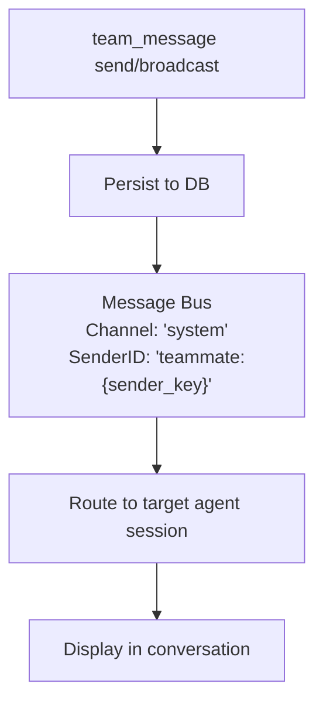

# Team Messaging

Team members communicate via a built-in mailbox system. Members can send direct messages and read unread messages. The lead agent does not have access to the `team_message` tool — it is removed from the lead's tool list by policy. Messages flow through the message bus with real-time delivery.

## Mailbox Tool: `team_message`

All team members access the mailbox via the `team_message` tool. Actions:

| Action | Params | Description |
|--------|--------|-------------|
| `send` | `to`, `text`, `media` (optional) | Send direct message to specific teammate |
| `broadcast` | `text` | Send message to all teammates (except self); system/teammate channel only |
| `read` | none | Get unread messages; auto-marks as read |

## Send a Direct Message

**Member sends message to another member**:

```json
{
  "action": "send",
  "to": "analyst_agent",
  "text": "Please review my findings from task 123. I need your input on the methodology."
}
```

**What happens**:
1. Message is persisted to database
2. A "message" task is auto-created on the team task board (visible in Tasks tab)
3. Recipient is notified in real-time via message bus (channel: `system`, sender: `teammate:{sender_key}`)
4. Event broadcast to UI for real-time updates

**Response**:
```
Message sent to analyst_agent.
```

**Cross-team protection**: You can only message team members. Attempting to message someone outside your team fails with `"agent is not a member of your team"`.

## Broadcast to All Members

Broadcast delivers a message to all team members simultaneously. This action is restricted to system/teammate channels (internal operations) — regular member agents cannot call `broadcast` directly.

```json
{
  "action": "broadcast",
  "text": "Important update: We've decided to focus on the top 5 findings. Please adjust your work accordingly."
}
```

**What happens**:
1. Message persisted as broadcast (to_agent_id = NULL)
2. Message type: `broadcast`
3. Each team member (except sender) receives the message
4. Event broadcast to UI for all to see

**Response**:
```
Broadcast sent to all teammates.
```

## Read Unread Messages

**Check mailbox**:

```json
{
  "action": "read"
}
```

**Response**:
```json
{
  "messages": [
    {
      "id": "550e8400-e29b-41d4-a716-446655440000",
      "team_id": "...",
      "from_agent_id": "...",
      "from_agent_key": "researcher_agent",
      "to_agent_key": "analyst_agent",
      "message_type": "chat",
      "content": "Please review my findings...",
      "read": false,
      "created_at": "2025-03-08T10:30:00Z"
    }
  ],
  "count": 1
}
```

**Auto-marking**: Reading messages automatically marks them as read. Next `read` call will only show new unread messages.

**Pagination**: Returns up to 50 unread messages per call. If more exist, the response includes `"has_more": true` and a note to call `read` again after processing.

## Message Routing

Messages flow through the system with special routing:



**Message format on delivery**:
```
[Team message from researcher_agent]: Please review my findings...
```

The `teammate:` prefix in the sender ID tells the consumer to route the message to the correct team member's session, not the general user session.

## Domain Event Bus

In addition to mailbox messages, GoClaw uses a typed **Domain Event Bus** (`eventbus.DomainEventBus`) for internal event propagation across the v3 pipeline. This is separate from the channel message bus used for routing.

The domain event bus is defined in `internal/eventbus/domain_event_bus.go`:

```go
type DomainEventBus interface {
    Publish(event DomainEvent)                                    // non-blocking enqueue
    Subscribe(eventType EventType, handler DomainEventHandler) func() // returns unsubscribe fn
    Start(ctx context.Context)
    Drain(timeout time.Duration) error
}
```

**Key properties**:
- Async worker pool (default 2 workers, queue depth 1000)
- Per-`SourceID` dedup window (default 5 minutes) — prevents duplicate processing
- Configurable retry (default 3 attempts with exponential backoff)
- Graceful drain on shutdown

**Event types catalog** (defined in `eventbus/event_types.go`):

| Event Type | Trigger |
|-----------|---------|
| `session.completed` | Session ends or context is compacted |
| `episodic.created` | Episodic memory summary stored |
| `entity.upserted` | Knowledge graph entity updated |
| `run.completed` | Agent pipeline run finishes |
| `tool.executed` | Tool call completes (for metrics) |
| `vault.doc_upserted` | Vault document registered or updated |
| `delegate.sent` | Delegation dispatched to member |
| `delegate.completed` | Delegatee finishes successfully |
| `delegate.failed` | Delegation fails |

These events power the v3 enrichment pipeline (episodic memory, knowledge graph, vault indexing) independently from the WebSocket team events used by the UI.

## WebSocket Team Events

For UI real-time updates, team activity emits WebSocket events via `msgBus.Broadcast`. These are separate from the domain event bus and target connected dashboard clients.

When messages are sent, real-time events are broadcast to UI:

```json
{
  "event": "team.message.sent",
  "payload": {
    "team_id": "550e8400-e29b-41d4-a716-446655440000",
    "from_agent_key": "researcher_agent",
    "from_display_name": "Research Expert",
    "to_agent_key": "analyst_agent",
    "to_display_name": "Data Analyst",
    "message_type": "chat",
    "preview": "Please review my findings...",
    "user_id": "...",
    "channel": "telegram",
    "chat_id": "..."
  }
}
```

### Task Lifecycle Events API

Task lifecycle events (create, assign, complete, approve, reject, comment, fail, etc.) are also available via the REST endpoint:

```
GET /v1/teams/{id}/events
```

This returns a paginated audit log of all task state changes for the team, useful for compliance review or building custom dashboards.

## Use Cases

**Member → Member**: "Task 123 is ready for your review. The data shows..."

**Member → Member**: "I'm blocked on step 2 — do you have the raw dataset I need?"

**Broadcast** (system-level only): "Changing priorities. Focus on tasks 1, 2, 5 instead of 3, 4."

> **Note**: Leads coordinate via `team_tasks`, not `team_message`. Use `team_tasks(action="progress")` to report status updates instead of direct messages.

## Auto-Fail on Loop Kill

If a member agent's run is terminated by the loop detector (stuck or infinite loop), the task automatically transitions to `failed`:

- The loop detector identifies stuck patterns — same tool calls with same args and results repeated, or read-only streaks without progress
- When critical level triggers, the run is killed and the team task manager marks the task as `failed`
- The lead agent is notified and can reassign or retry with updated instructions

This prevents infinite loops from blocking team progress — agents can safely attempt exploratory tasks without risk of permanent stall.

## Team Notification Settings

Team task events can be forwarded to chat channels. The default configuration is conservative — only high-signal events are on by default to reduce noise.

| Event | Default | Description |
|-------|---------|-------------|
| `dispatched` | ON | Task dispatched to a member |
| `new_task` | ON | New task created (human-initiated) |
| `completed` | ON | Task completed |
| `progress` | OFF | Member updates progress |
| `failed` | OFF | Task failed |
| `commented` | OFF | Task comment added |
| `slow_tool` | OFF | System alert when a tool call exceeds the adaptive threshold |

Delivery mode is `direct` by default (outbound channel). Set `mode: "leader"` to route all notifications through the lead agent.

Configure notifications in team settings:

```json
{
  "notifications": {
    "dispatched": true,
    "new_task": true,
    "completed": true,
    "progress": false,
    "failed": false,
    "commented": false,
    "slow_tool": false,
    "mode": "direct"
  }
}
```

## Best Practices

1. **Be concise**: Keep messages focused and actionable
2. **Use broadcasts for team-wide info**: Don't send identical messages to multiple members
3. **Direct message for discussion**: Back-and-forth coordination use direct messages
4. **Reference tasks**: Mention task IDs for context ("Task 123 is blocked by...")
5. **Check regularly**: Members should check their mailbox if waiting for updates

## Message Persistence

All messages are persisted to the database:
- Direct messages link sender → specific recipient
- Broadcasts link sender → NULL (means all members)
- Timestamps and read status tracked
- Full message history available for audit/review

<!-- goclaw-source: 050aafc9 | updated: 2026-04-09 -->
