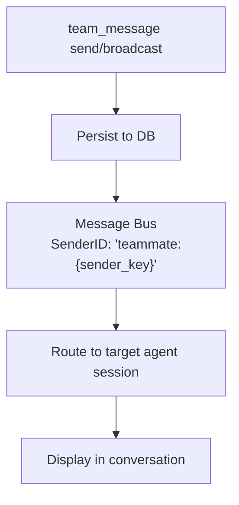

# Team Messaging

Team members communicate via a built-in mailbox system. Send direct messages, broadcast to all members, and read unread messages. Messages flow through the message bus with real-time delivery.

## Mailbox Tool: `team_message`

All team members access the mailbox via the `team_message` tool. Actions:

| Action | Params | Description |
|--------|--------|-------------|
| `send` | `to`, `text` | Send direct message to specific teammate |
| `broadcast` | `text` | Send message to all teammates (except self) |
| `read` | none | Get unread messages; auto-marks as read |

## Send a Direct Message

**Member sends message to another member**:

```json
{
  "action": "send",
  "to": "analyst_agent",
  "text": "Please review my findings from task 123. I need your input on the methodology."
}
```

**What happens**:
1. Message is persisted to database
2. Recipient is notified in real-time via message bus
3. Message routed through `team_message` channel with `teammate:sender_key` prefix
4. Response is published back to originating channel
5. Event broadcast to UI for real-time updates

**Response**:
```
Message sent to analyst_agent.
```

**Cross-team protection**: You can only message team members. Attempting to message someone outside your team fails with `"agent is not a member of your team"`.

## Broadcast to All Members

**Send message to entire team** (except self):

```json
{
  "action": "broadcast",
  "text": "Important update: We've decided to focus on the top 5 findings. Please adjust your work accordingly."
}
```

**What happens**:
1. Message persisted as broadcast (to_agent_id = NULL)
2. Message type: `broadcast`
3. Each team member (except sender) receives the message
4. Event broadcast to UI for all to see

**Response**:
```
Broadcast sent to all teammates.
```

## Read Unread Messages

**Check mailbox**:

```json
{
  "action": "read"
}
```

**Response**:
```json
{
  "messages": [
    {
      "id": "550e8400-e29b-41d4-a716-446655440000",
      "from_agent_key": "researcher_agent",
      "from_display_name": "Research Expert",
      "to_agent_key": "analyst_agent",
      "message_type": "chat",
      "content": "Please review my findings...",
      "created_at": "2025-03-08T10:30:00Z",
      "read_at": null
    }
  ],
  "count": 1
}
```

**Auto-marking**: Reading messages automatically marks them as read. Next `read` call will only show new unread messages.

## Message Routing

Messages flow through the system with special routing:



**Message format on delivery**:
```
[Team message from researcher_agent]: Please review my findings...
```

The `teammate:` prefix tells the consumer to route the message to the correct team member's session, not the general user session.

## Event Broadcasting

When messages are sent, real-time events are broadcast to UI:

```json
{
  "event": "team_message.sent",
  "payload": {
    "team_id": "550e8400-e29b-41d4-a716-446655440000",
    "from_agent_key": "researcher_agent",
    "from_display_name": "Research Expert",
    "to_agent_key": "analyst_agent",
    "message_type": "chat",
    "preview": "Please review my findings...",
    "timestamp": "2025-03-08T10:30:00Z"
  }
}
```

## Use Cases

**Lead → Member**: "Please claim the next task from the board"

**Member → Member**: "Task 123 is ready for your review. The data shows..."

**Member → Lead**: "Task 456 is 80% done. I need clarification on the acceptance criteria."

**Broadcast**: "Changing priorities. Focus on tasks 1, 2, 5 instead of 3, 4."

## Best Practices

1. **Be concise**: Keep messages focused and actionable
2. **Use broadcasts for team-wide info**: Don't send identical messages to multiple members
3. **Direct message for discussion**: Back-and-forth coordination use direct messages
4. **Reference tasks**: Mention task IDs for context ("Task 123 is blocked by...")
5. **Check regularly**: Members should check their mailbox if waiting for updates

## Message Persistence

All messages are persisted to the database:
- Direct messages link sender → specific recipient
- Broadcasts link sender → NULL (means all members)
- Timestamps and read status tracked
- Full message history available for audit/review
