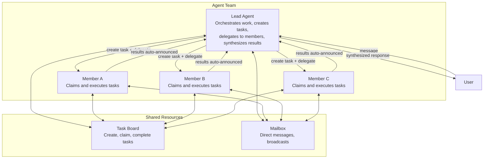

# What Are Agent Teams?

Agent teams enable multiple agents to collaborate on shared tasks. A **lead** agent orchestrates work, while **members** execute tasks independently and report results back.

## The Team Model

Teams consist of:
- **Lead Agent**: Orchestrates work, creates and assigns tasks via `team_tasks`, delegates to members, synthesizes results
- **Member Agents**: Receive dispatched tasks, execute independently, complete with results, can send progress updates via mailbox
- **Shared Task Board**: Track work, dependencies, priority, status
- **Team Mailbox**: Direct messages between all team members via `team_message`



## Key Design Principles

**Lead-centric TEAM.md**: Only the lead receives `TEAM.md` with full orchestration instructions — mandatory workflow, delegation patterns, follow-up reminders. Members discover context on demand through tools; no wasted tokens on idle agents.

**Mandatory task tracking**: Every delegation from a lead must be linked to a task on the board. The system enforces this — delegations without a `team_task_id` are rejected, with a list of pending tasks provided to help the lead self-correct.

**Auto-completion**: When a delegation finishes, the linked task is automatically marked as complete. Files created during execution are auto-linked to the task. No manual bookkeeping.

**Blocker escalation**: Members can flag themselves as blocked by posting a blocker comment on a task. This auto-fails the task and delivers an escalation message to the lead with the blocked member name, task subject, blocker reason, and retry instructions.

**Parallel batching**: When multiple members work simultaneously, results are collected and delivered to the lead in a single combined announcement.

**Member scope**: Members do not have spawn or delegate access. They work within the team structure — executing tasks, reporting progress, and communicating via mailbox.

## Team Workspace

Each team has a shared workspace for files produced during task execution. Workspace scoping is configurable:

| Mode | Directory | Use Case |
|------|-----------|----------|
| **Isolated** (default) | `{dataDir}/teams/{teamID}/{chatID}/` | Per-conversation isolation |
| **Shared** | `{dataDir}/teams/{teamID}/` | All members access same folder |

Configure via `workspace_scope: "shared"` in team settings. Files written during task execution are automatically stored in the workspace and linked to the active task.

## v3 Orchestration Changes

In v3, teams use a **task-board-driven dispatch model** instead of the old `spawn(agent=...)` flow.

### Post-Turn Dispatch (BatchQueue)

Tasks created during a lead's turn are queued (`PendingTeamDispatchFromCtx`) and dispatched **after the turn ends** — not inline. This ensures `blocked_by` dependencies are fully wired before any member receives work.

```
Lead turn ends
  → BatchQueue flushes pending dispatches
  → Each assignee receives inbound message via bus
  → Member agents execute in isolated sessions
```

### Domain Event Bus

All task state changes emit typed events (`team_task.created`, `team_task.assigned`, `team_task.completed`, etc.) on the domain event bus. The dashboard updates in real-time via WebSocket without polling.

### Circuit Breaker

Tasks auto-fail after **3 dispatch attempts** (`maxTaskDispatches`). This prevents infinite loops when a member agent repeatedly fails or rejects a task. The dispatch count is tracked in `metadata.dispatch_count`.

### WaitAll Pattern

The lead can create multiple tasks in parallel and they dispatch concurrently. When all member tasks complete, `DispatchUnblockedTasks` auto-dispatches any waiting dependent tasks (ordered by priority). The lead synthesizes results only after all branches resolve.

> **Spawn tool change**: `spawn(agent="member")` is no longer valid in v3. Leads must use `team_tasks(action="create", assignee="member")` instead. The system will reject direct spawn-to-agent calls with an instructive error.

## Real-World Example

**Scenario**: User asks the lead to analyze a research paper and write a summary.

1. Lead receives request
2. Lead calls `team_tasks(action="create", subject="Extract key points from paper", assignee="researcher")` — system dispatches to researcher with a linked `team_task_id`
3. Researcher receives task, works independently, calls `team_tasks(action="complete", result="<findings>")` — linked task auto-completed, lead is notified
4. Lead calls `team_tasks(action="create", subject="Write summary", assignee="writer", description="Use researcher findings: <findings>", blocked_by=["<researcher-task-id>"])`
5. Writer's task unblocks automatically when researcher finishes, writer completes with result
6. Lead synthesizes and sends final response to user

## Teams vs Other Delegation Models

| Aspect | Agent Team | Simple Delegation | Agent Link |
|--------|-----------|-------------------|-----------|
| **Coordination** | Lead orchestrates with task board | Parent waits for result | Direct peer-to-peer |
| **Task Tracking** | Shared task board, dependencies, priorities | No tracking | No tracking |
| **Messaging** | All members use mailbox | Parent-only | Parent-only |
| **Scalability** | Designed for 3-10 members | Simple parent-child | One-to-one links |
| **TEAM.md Context** | Lead gets full instructions; members get execution guidance | Not applicable | Not applicable |
| **Use Case** | Parallel research, content review, analysis | Quick delegate & wait | Conversation handoff |

**Use Teams When**:
- 3+ agents need to work together
- Tasks have dependencies or priorities
- Members need to communicate
- Results need parallel batching

**Use Simple Delegation When**:
- One parent delegates to one child
- Need quick synchronous result
- No inter-team communication required

**Use Agent Links When**:
- Conversation needs to transfer between agents
- No task board or orchestration needed

<!-- goclaw-source: 050aafc9 | updated: 2026-04-09 -->
