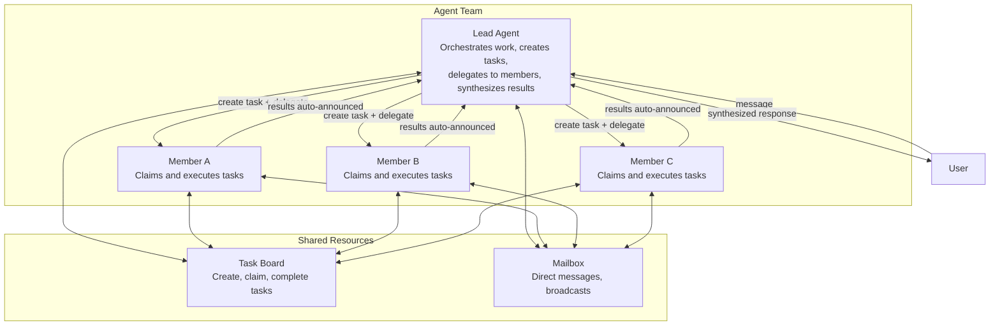

# What Are Agent Teams?

Agent teams enable multiple agents to collaborate on shared tasks. A **lead** agent orchestrates work, while **members** execute tasks independently and report results back.

## The Team Model

Teams consist of:
- **Lead Agent**: Orchestrates work, creates tasks, delegates to members, synthesizes results
- **Member Agents**: Claim tasks from a shared board, execute independently, auto-announce results
- **Shared Task Board**: Track work, dependencies, priority, status
- **Team Mailbox**: Direct messages between members, broadcasts to all

## Key Design Principles

**Lead-centric**: The lead receives full `TEAM.md` with orchestration instructions in its system prompt. Members receive a minimal team context (team name, their role, available tools) — no wasted tokens on idle agents.

**Mandatory task tracking**: Every delegation must link to a task on the board. System enforces this — delegations without `team_task_id` are rejected.

**Auto-completion**: When a delegation finishes, its linked task is automatically marked complete. No manual bookkeeping.

**Parallel batching**: When multiple members work simultaneously, results are collected in a single announcement to the lead.

## Real-World Example

**Scenario**: User asks the lead to analyze a research paper and write a summary.

1. Lead receives request
2. Lead creates two tasks: "Extract key points" and "Write summary"
3. Lead delegates first task to Researcher member
4. Researcher works, completes task
5. Lead delegates second task to Writer member with Researcher's output
6. Writer finishes, result auto-announced to lead
7. Lead synthesizes and sends final response to user

## Teams vs Other Delegation Models

| Aspect | Agent Team | Simple Delegation | Agent Link |
|--------|-----------|-------------------|-----------|
| **Coordination** | Lead orchestrates with task board | Parent waits for result | Direct peer-to-peer |
| **Task Tracking** | Shared task board, dependencies, priorities | No tracking | No tracking |
| **Messaging** | Mailbox for team communication | Parent-only | Parent-only |
| **Scalability** | Designed for 3-10 members | Simple parent-child | One-to-one links |
| **TEAM.md Context** | Lead gets full instructions; members get minimal context | Not applicable | Not applicable |
| **Use Case** | Parallel research, content review, analysis | Quick delegate & wait | Conversation handoff |

**Use Teams When**:
- 3+ agents need to work together
- Tasks have dependencies or priorities
- Members need to communicate
- Results need parallel batching

**Use Simple Delegation When**:
- One parent delegates to one child
- Need quick synchronous result
- No inter-team communication required

**Use Agent Links When**:
- Conversation needs to transfer between agents
- No task board or orchestration needed
