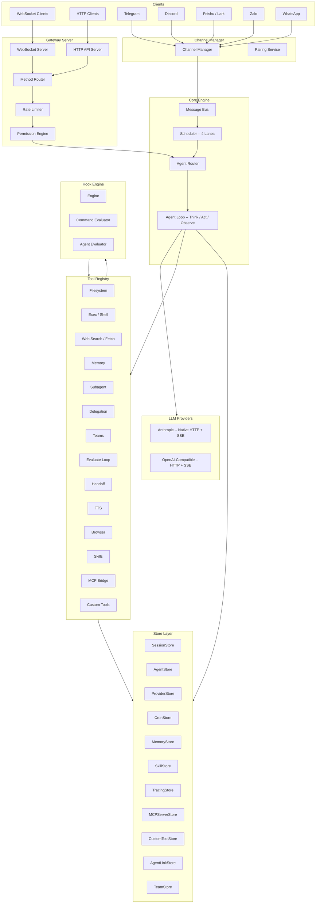
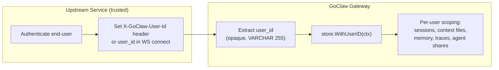
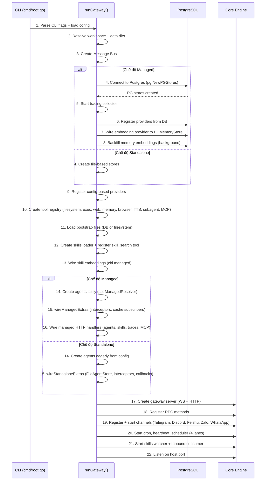
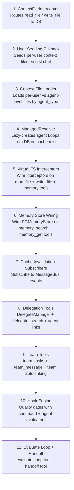
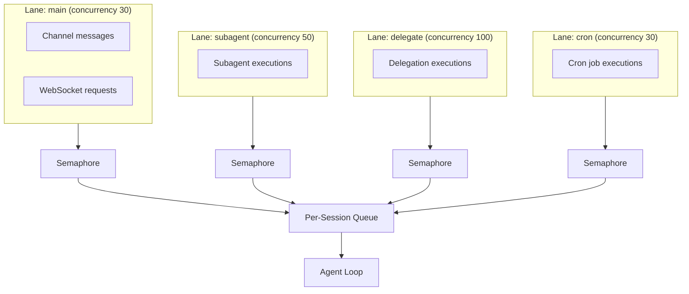
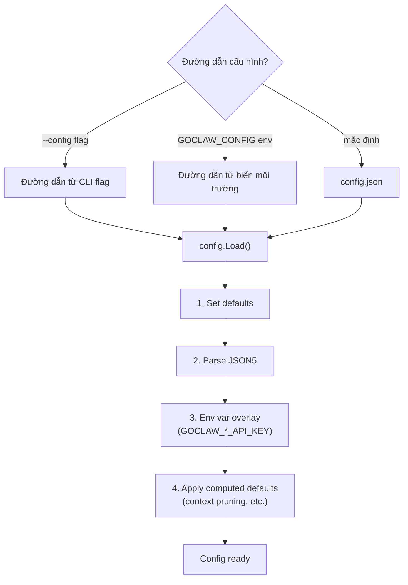

# 00 - Tổng Quan Kiến Trúc

## 1. Tổng Quan

GoClaw là một AI agent gateway được viết bằng Go. Hệ thống cung cấp giao diện WebSocket RPC (v3) và HTTP API tương thích OpenAI để điều phối các agent được hỗ trợ bởi LLM. Hệ thống hỗ trợ hai chế độ hoạt động:

- **Standalone** -- lưu trữ dựa trên file với SQLite cho dữ liệu người dùng, không có phụ thuộc bên ngoài ngoài LLM API key.
- **Managed** -- chế độ đa tenant dựa trên PostgreSQL với HTTP CRUD API, file context theo người dùng, mã hóa thông tin xác thực, ủy quyền agent, nhóm agent, và tracing cuộc gọi LLM.

> **Phạm vi tài liệu**: Tài liệu này bao gồm cả hai chế độ. Chế độ Standalone hiện đã gần đạt parity với chế độ Managed cho các tính năng cốt lõi (file context theo người dùng, cô lập workspace, loại agent, onboarding bootstrap). Chế độ Managed bổ sung thêm ủy quyền agent, nhóm agent, quality gate, tracing, HTTP CRUD API, và secret được mã hóa.

## 2. Sơ Đồ Thành Phần



## 3. Bản Đồ Module

| Module | Mô tả |
|--------|-------------|
| `internal/gateway/` | Server WebSocket + HTTP, xử lý client, method router |
| `internal/gateway/methods/` | Các handler RPC method: chat, agents, agent_links, teams, delegations, sessions, config, skills, cron, pairing, exec approval, usage, send |
| `internal/agent/` | Vòng lặp agent (think, act, observe), router, resolver, system prompt builder, sanitization, pruning, tracing, memory flush, DELEGATION.md + TEAM.md injection |
| `internal/providers/` | Các provider LLM: Anthropic (native HTTP + SSE streaming), tương thích OpenAI (HTTP + SSE), retry logic |
| `internal/tools/` | Tool registry, filesystem ops, exec/shell, policy engine, subagent, delegation manager, team tools, evaluate loop, handoff, context file + memory interceptors, credential scrubbing, rate limiting, PathDenyable |
| `internal/tools/dynamic_loader.go` | Custom tool loader: LoadGlobal (khởi động), LoadForAgent (clone theo agent), ReloadGlobal (cache invalidation) |
| `internal/tools/dynamic_tool.go` | Custom tool executor: render command template, shell escaping, biến môi trường mã hóa |
| `internal/hooks/` | Hook engine: quality gate, command evaluator, agent evaluator, ngăn chặn đệ quy (`WithSkipHooks`) |
| `internal/store/` | Các interface Store: SessionStore, AgentStore, ProviderStore, SkillStore, MemoryStore, CronStore, PairingStore, TracingStore, MCPServerStore, AgentLinkStore, TeamStore, ChannelInstanceStore, ConfigSecretsStore |
| `internal/store/pg/` | Các triển khai PostgreSQL (`database/sql` + `pgx/v5`) |
| `internal/store/file/` | Các triển khai dựa trên file: sessions, memory (SQLite), cron, pairing, skills, agents (filesystem + SQLite) |
| `internal/bootstrap/` | Các file system prompt (AGENTS.md, SOUL.md, TOOLS.md, IDENTITY.md, USER.md, HEARTBEAT.md, BOOTSTRAP.md) + seeding + truncation |
| `internal/config/` | Tải cấu hình (JSON5) + phủ chồng biến môi trường |
| `internal/skills/` | Loader SKILL.md (phân cấp 5 tầng) + tìm kiếm BM25 + hot-reload qua fsnotify |
| `internal/channels/` | Channel manager + adapter: Telegram, Feishu/Lark, Zalo, Discord, WhatsApp |
| `internal/mcp/` | MCP server bridge (transport stdio, SSE, streamable-HTTP) |
| `internal/scheduler/` | Kiểm soát concurrency theo luồng (luồng main, subagent, cron, delegate) với serialization theo session |
| `internal/memory/` | Hệ thống bộ nhớ (SQLite FTS5 + embeddings cho chế độ standalone) |
| `internal/permissions/` | Policy engine RBAC (vai trò admin, operator, viewer) |
| `internal/pairing/` | Dịch vụ DM/device pairing (mã 8 ký tự) |
| `internal/sessions/` | Session manager dựa trên file (chế độ standalone) |
| `internal/bus/` | Event pub/sub (Message Bus) |
| `internal/sandbox/` | Sandbox thực thi code dựa trên Docker |
| `internal/tts/` | Các provider Text-to-Speech: OpenAI, ElevenLabs, Edge, MiniMax |
| `internal/http/` | Các handler HTTP API: /v1/chat/completions, /v1/agents, /v1/skills, /v1/traces, /v1/mcp, /v1/delegations, summoner |
| `internal/crypto/` | Mã hóa AES-256-GCM cho API key |
| `internal/tracing/` | Tracing cuộc gọi LLM (traces + spans), bộ đệm in-memory với flush định kỳ vào store |
| `internal/tracing/otelexport/` | Exporter OpenTelemetry OTLP tùy chọn (opt-in qua build tags; thêm gRPC + protobuf) |
| `internal/heartbeat/` | Dịch vụ đánh thức agent định kỳ |

---

## 4. Hai Chế Độ Hoạt Động

| Khía cạnh | Standalone | Managed |
|--------|-----------|---------|
| Nguồn cấu hình | `config.json` + biến môi trường | `config.json` + `GOCLAW_POSTGRES_DSN` |
| Lưu trữ | File JSON + SQLite (`~/.goclaw/data/agents.db`) | PostgreSQL |
| Agent | Định nghĩa trong `config.json` `agents.list`, tạo sẵn khi khởi động | Bảng `agents`, resolve lazily qua `ManagedResolver` |
| Agent store | `FileAgentStore` (filesystem + SQLite) | `PGAgentStore` |
| File context | Cấp agent trên filesystem, theo người dùng trong SQLite | Bảng `agent_context_files` + `user_context_files` |
| Loại agent | `open` / `predefined` (qua config) | `open` (7 file theo người dùng) / `predefined` (cấp agent + USER.md theo người dùng) |
| Cô lập theo người dùng | Thư mục workspace con (`user_alice/`, `user_bob/`) | Như trên + file context theo DB |
| Bootstrap onboarding | Seeding BOOTSTRAP.md theo người dùng (SQLite) | Như trên (PostgreSQL) |
| Ủy quyền agent | Không có | Ủy quyền đồng bộ/bất đồng bộ, agent links, quality gate |
| Nhóm agent | Không có | Bảng nhiệm vụ chung, hộp thư, handoff |
| Skills | Chỉ filesystem (workspace + thư mục global) | PostgreSQL + filesystem + tìm kiếm embedding |
| Memory | SQLite FTS5 + embeddings | pgvector hybrid (full-text search + vector similarity) |
| Tracing | Không có | Bảng `traces` + `spans` + xuất OTel OTLP tùy chọn |
| MCP server | `tools.mcp_servers` trong `config.json` | Bảng `mcp_servers` + grants |
| Lưu trữ API key | Chỉ `.env.local` / biến môi trường | PostgreSQL (mã hóa AES-256-GCM) |
| HTTP CRUD API | Không có | `/v1/agents`, `/v1/skills`, `/v1/traces`, `/v1/mcp`, `/v1/delegations` |
| Virtual FS | `ContextFileInterceptor` route đến SQLite | `ContextFileInterceptor` route đến PostgreSQL |
| Công cụ tùy chỉnh | Không có | Bảng `custom_tools` + `DynamicToolLoader` |
| Store chỉ dùng trong managed (nil trong standalone) | -- | ProviderStore, TracingStore, MCPServerStore, CustomToolStore, AgentLinkStore, TeamStore |

---

## 5. Mô Hình Identity Đa Tenant

GoClaw sử dụng mẫu **Identity Propagation** (còn được gọi là **Trusted Subsystem**). Hệ thống không triển khai xác thực hay phân quyền — thay vào đó, nó tin tưởng dịch vụ upstream đã xác thực bằng gateway token để cung cấp identity người dùng chính xác.



### Luồng Identity

| Điểm vào | Cách cung cấp user_id | Bắt buộc |
|-------------|------------------------|-------------|
| HTTP API | Header `X-GoClaw-User-Id` | Bắt buộc trong chế độ managed |
| WebSocket | Trường `user_id` trong handshake `connect` | Bắt buộc trong chế độ managed |
| Kênh giao tiếp | Lấy từ ID người gửi trên nền tảng (ví dụ: Telegram user ID) | Tự động |

### Quy Ước User ID Dạng Kết Hợp

Trường `user_id` là **opaque** đối với GoClaw — hệ thống không phân tích hay kiểm tra định dạng. Đối với triển khai đa tenant, quy ước được khuyến nghị là:

```
tenant.{tenantId}.user.{userId}
```

Định dạng phân cấp này đảm bảo cô lập tự nhiên giữa các tenant. Vì `user_id` được dùng làm khóa phân vùng trên tất cả bảng theo người dùng (`user_context_files`, `user_agent_profiles`, `user_agent_overrides`, `agent_shares`, `sessions`, `traces`), định dạng kết hợp đảm bảo người dùng từ các tenant khác nhau không thể truy cập dữ liệu của nhau.

### Nơi Sử Dụng user_id

| Thành phần | Cách sử dụng |
|-----------|-------|
| Khóa session | `agent:{agentId}:{channel}:direct:{peerId}` — peerId lấy từ user_id |
| File context | Bảng `user_context_files` phân vùng theo `(agent_id, user_id)` |
| Profile người dùng | Bảng `user_agent_profiles` — thời gian truy cập đầu/cuối, workspace |
| Override người dùng | `user_agent_overrides` — tùy chọn provider/model theo người dùng |
| Chia sẻ agent | Bảng `agent_shares` — kiểm soát truy cập cấp người dùng |
| Memory | Mục memory theo người dùng qua context propagation |
| Traces | Bảng `traces` bao gồm `user_id` để lọc |
| MCP grants | `mcp_user_grants` — quyền truy cập MCP server theo người dùng |
| Skill grants | `skill_user_grants` — quyền truy cập skill theo người dùng |

---

## 6. Trình Tự Khởi Động Gateway



---

## 7. Kết Nối Chế Độ Managed

Hàm `wireManagedExtras()` trong `cmd/gateway_managed.go` kết nối các thành phần đa tenant:



Một hàm `wireStandaloneExtras()` riêng biệt trong `cmd/gateway_standalone.go` kết nối các callback cốt lõi tương tự (user seeding, context file loading) sử dụng `FileAgentStore` thay vì PostgreSQL.

### Sự Kiện Cache Invalidation

| Sự kiện | Subscriber | Hành động |
|-------|-----------|--------|
| `cache:bootstrap` | ContextFileInterceptor | `InvalidateAgent()` hoặc `InvalidateAll()` |
| `cache:agent` | AgentRouter | `InvalidateAgent()` -- buộc resolve lại từ DB |
| `cache:skills` | SkillStore | `BumpVersion()` |
| `cache:cron` | CronStore | `InvalidateCache()` |
| `cache:custom_tools` | DynamicToolLoader | `ReloadGlobal()` + `AgentRouter.InvalidateAll()` |

---

## 8. Luồng Scheduler

Scheduler sử dụng mô hình concurrency theo luồng. Mỗi luồng là một worker pool được đặt tên với semaphore có giới hạn. Hàng đợi theo session kiểm soát concurrency trong mỗi session.



### Mặc Định Của Luồng

| Luồng | Concurrency | Biến môi trường | Mục đích |
|------|:-----------:|-------------|---------|
| `main` | 30 | `GOCLAW_LANE_MAIN` | Session chat người dùng chính |
| `subagent` | 50 | `GOCLAW_LANE_SUBAGENT` | Subagent được spawn |
| `delegate` | 100 | `GOCLAW_LANE_DELEGATE` | Thực thi ủy quyền agent |
| `cron` | 30 | `GOCLAW_LANE_CRON` | Công việc cron định kỳ |

### Concurrency Hàng Đợi Session

Hàng đợi theo session hiện hỗ trợ `maxConcurrent` có thể cấu hình:
- **DM**: `maxConcurrent = 1` (đơn luồng theo người dùng)
- **Nhóm**: `maxConcurrent = 3` (nhiều phản hồi đồng thời)
- **Điều tiết thích ứng**: Khi lịch sử session vượt 60% context window, concurrency giảm xuống 1

### Chế Độ Hàng Đợi

| Chế độ | Hành vi |
|------|----------|
| `queue` | FIFO -- tin nhắn mới chờ cho đến khi lần chạy hiện tại hoàn thành |
| `followup` | Gộp tin nhắn đến vào hàng đợi đang chờ như một follow-up |
| `interrupt` | Hủy lần chạy đang hoạt động và thay thế bằng tin nhắn mới |

Cấu hình hàng đợi mặc định: dung lượng 10, chính sách drop `old` (bỏ cũ nhất khi tràn), debounce 800ms.

### /stop và /stopall

- `/stop` -- Hủy tác vụ đang chạy cũ nhất (các tác vụ khác vẫn tiếp tục)
- `/stopall` -- Hủy tất cả tác vụ đang chạy + làm trống hàng đợi

Cả hai đều được xử lý trước debouncer để tránh bị gộp với tin nhắn thông thường.

---

## 9. Tắt Hệ Thống Nhẹ Nhàng

Khi tiến trình nhận SIGINT hoặc SIGTERM:

1. Phát tín hiệu `shutdown` đến tất cả WebSocket client đang kết nối.
2. `channelMgr.StopAll()` -- dừng tất cả channel adapter.
3. `cronStore.Stop()` -- dừng cron scheduler.
4. `heartbeatSvc.Stop()` -- dừng dịch vụ heartbeat.
5. `sandboxMgr.Stop()` + `ReleaseAll()` -- giải phóng Docker container.
6. `cancel()` -- hủy root context, lan truyền đến consumer + scheduler.
7. Dọn dẹp deferred: flush tracing collector, đóng memory store, đóng browser manager, dừng các luồng scheduler.
8. Tắt HTTP server với **timeout 5 giây** (`context.WithTimeout`).

---

## 10. Hệ Thống Cấu Hình

Cấu hình được tải từ file JSON5 với phủ chồng biến môi trường. Bí mật không bao giờ được lưu vào file cấu hình.



### Các Phần Cấu Hình Quan Trọng

| Phần | Mục đích |
|---------|---------|
| `gateway` | host, port, token, allowed_origins, rate_limit_rpm, max_message_chars |
| `agents` | defaults (provider, model, context_window) + list (ghi đè theo agent) |
| `tools` | profile, allow/deny lists, exec_approval, web, browser, mcp_servers, rate_limit_per_hour |
| `channels` | Theo từng kênh: enabled, token, dm_policy, group_policy, allow_from |
| `database` | mode (standalone/managed); postgres_dsn chỉ đọc từ biến môi trường |

### Xử Lý Bí Mật

- Bí mật chỉ tồn tại trong biến môi trường hoặc `.env.local` -- không bao giờ trong `config.json`.
- `GOCLAW_POSTGRES_DSN` được đánh dấu `json:"-"` và không thể đọc từ file cấu hình.
- `MaskedCopy()` thay thế API key bằng `"***"` khi trả về cấu hình qua WebSocket.
- `StripSecrets()` xóa bí mật trước khi ghi cấu hình ra đĩa.
- Hot-reload cấu hình qua watcher `fsnotify` với debounce 300ms.

---

## 11. Tham Chiếu File

| File | Mục đích |
|------|---------|
| `cmd/root.go` | Điểm vào Cobra CLI, parse flag |
| `cmd/gateway.go` | Điều phối khởi động gateway (`runGateway()`) |
| `cmd/gateway_managed.go` | Kết nối chế độ managed (`wireManagedExtras()`, `wireManagedHTTP()`) |
| `cmd/gateway_standalone.go` | Kết nối chế độ standalone (`wireStandaloneExtras()`) |
| `cmd/gateway_callbacks.go` | Callback dùng chung cho managed + standalone (user seeding, context file loading) |
| `cmd/gateway_consumer.go` | Consumer tin nhắn đến (subagent, delegate, teammate, handoff routing) |
| `cmd/gateway_providers.go` | Đăng ký provider (từ config + DB) |
| `cmd/gateway_methods.go` | Đăng ký RPC method |
| `internal/config/config.go` | Định nghĩa cấu trúc Config |
| `internal/config/config_load.go` | Tải JSON5 + phủ chồng biến môi trường |
| `internal/config/config_channels.go` | Cấu trúc config kênh giao tiếp |
| `internal/gateway/server.go` | Server WS + HTTP, CORS, thiết lập rate limiter |
| `internal/gateway/client.go` | Xử lý WebSocket client, giới hạn đọc (512KB) |
| `internal/gateway/router.go` | Route RPC method |
| `internal/scheduler/lanes.go` | Định nghĩa luồng, concurrency dựa trên semaphore |
| `internal/scheduler/queue.go` | Hàng đợi theo session, chế độ hàng đợi, debounce |
| `internal/hooks/engine.go` | Hook engine: đăng ký evaluator, `EvaluateHooks` |
| `internal/hooks/command_evaluator.go` | Shell command evaluator (exit 0 = pass) |
| `internal/hooks/agent_evaluator.go` | Agent delegation evaluator (APPROVED/REJECTED) |
| `internal/hooks/context.go` | `WithSkipHooks` / `SkipHooksFromContext` (ngăn đệ quy) |
| `internal/store/stores.go` | Container struct `Stores` (tất cả 14 interface store) |
| `internal/store/types.go` | `StoreConfig`, `BaseModel` |

---

## Tham Chiếu Chéo

| Tài liệu | Nội dung |
|----------|---------|
| [01-agent-loop.md](./01-agent-loop.md) | Chi tiết vòng lặp agent, pipeline sanitization, quản lý lịch sử |
| [02-providers.md](./02-providers.md) | Provider LLM, retry logic, schema cleaning |
| [03-tools-system.md](./03-tools-system.md) | Tool registry, policy engine, interceptors, công cụ tùy chỉnh, MCP grants |
| [04-gateway-protocol.md](./04-gateway-protocol.md) | WebSocket protocol v3, HTTP API, RBAC, identity propagation |
| [05-channels-messaging.md](./05-channels-messaging.md) | Channel adapter, định dạng Telegram, pairing, user scoping chế độ managed |
| [06-store-data-model.md](./06-store-data-model.md) | Interface store, schema PostgreSQL, session caching, custom tool store |
| [07-bootstrap-skills-memory.md](./07-bootstrap-skills-memory.md) | File bootstrap, hệ thống skills, memory, skill grants |
| [08-scheduling-cron-heartbeat.md](./08-scheduling-cron-heartbeat.md) | Luồng scheduler, vòng đời cron, heartbeat |
| [09-security.md](./09-security.md) | Các lớp bảo vệ, mã hóa, rate limiting, RBAC, sandbox |
| [10-tracing-observability.md](./10-tracing-observability.md) | Tracing collector, phân cấp span, xuất OTel, trace API |
