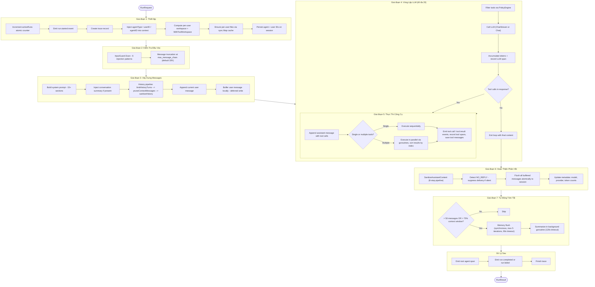
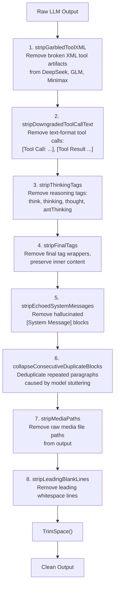
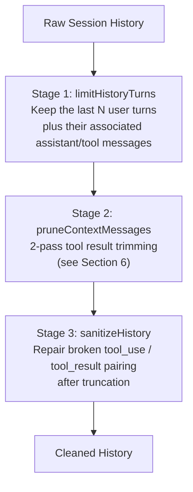
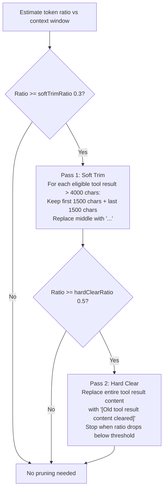
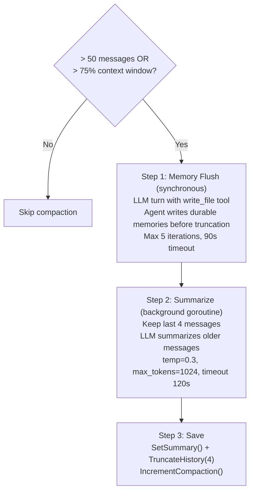
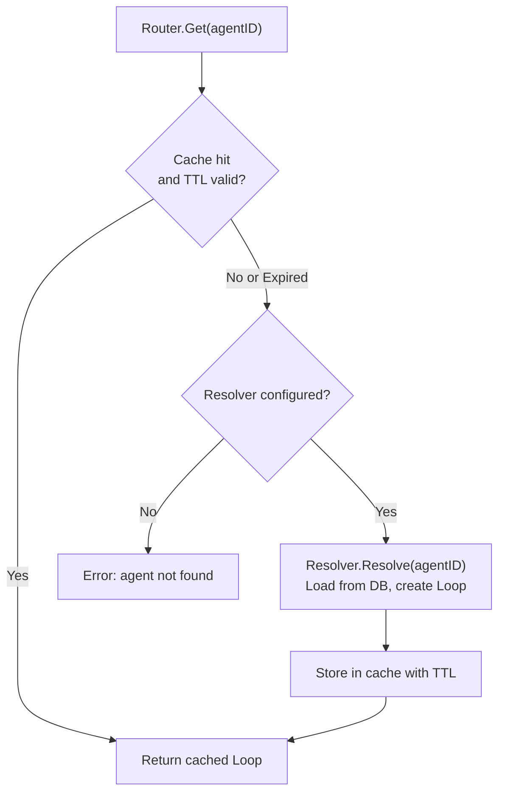
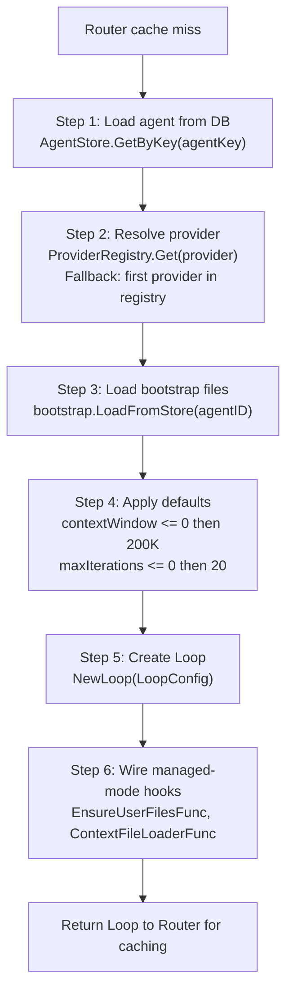
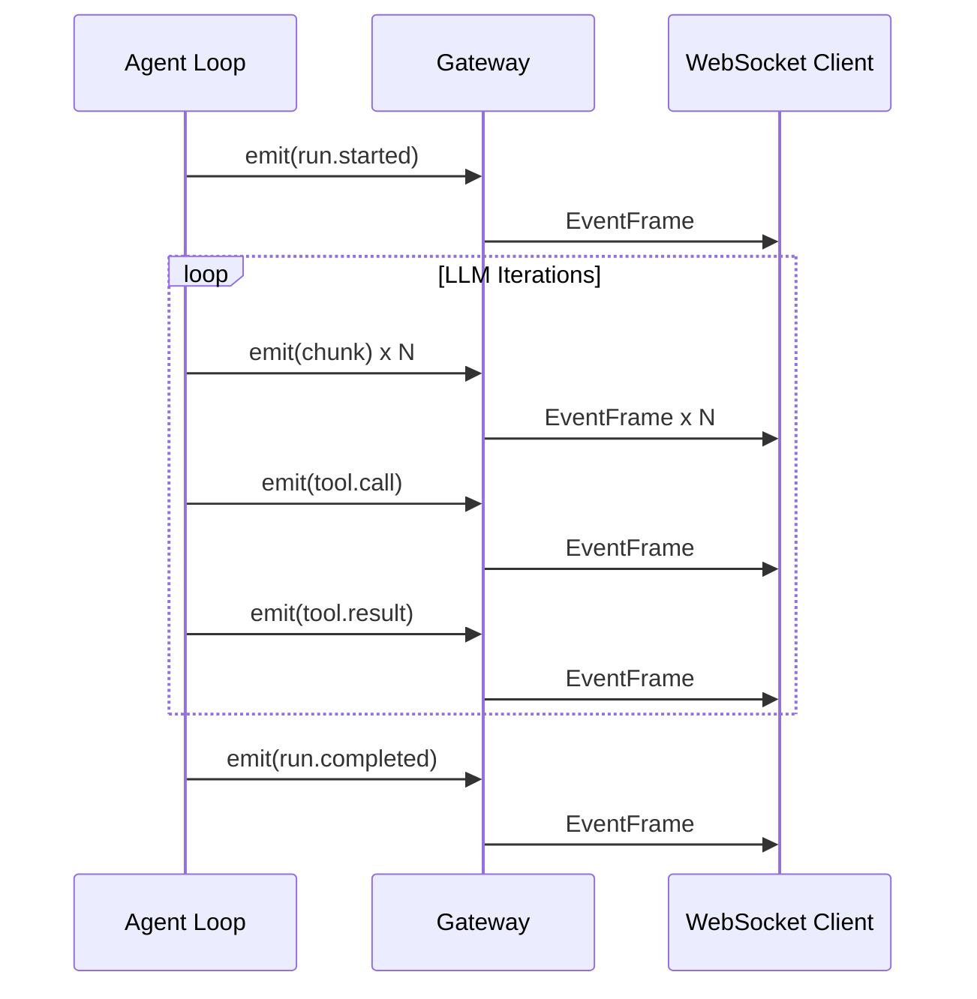
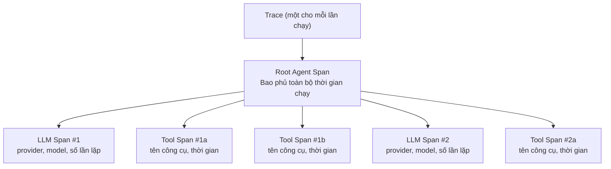

# 01 - Vòng Lặp Agent

## Tổng Quan

Vòng lặp Agent triển khai chu kỳ **Think --> Act --> Observe**. Mỗi agent sở hữu một instance `Loop` được cấu hình với provider, model, công cụ, workspace, và loại agent. Tin nhắn người dùng đi vào dưới dạng `RunRequest`, đi qua `runLoop`, và thoát ra dưới dạng `RunResult`. Vòng lặp lặp tối đa 20 lần: LLM suy nghĩ, tùy chọn gọi công cụ, quan sát kết quả, và lặp lại cho đến khi tạo ra phản hồi văn bản cuối cùng.

---

## 1. Luồng RunRequest

Toàn bộ vòng đời của một lần chạy agent được chia thành bảy giai đoạn.

### Giai Đoạn 1: Thiết Lập

- Tăng bộ đếm atomic `activeRuns` (không dùng mutex -- concurrency thực sự, đặc biệt trong chat nhóm với `maxConcurrent = 3`).
- Phát sự kiện `run.started` để thông báo cho client đang kết nối.
- Tạo bản ghi trace (chế độ managed) với UUID trace được tạo ngẫu nhiên.
- Truyền context value: `WithAgentID()`, `WithUserID()`, `WithAgentType()`. Các công cụ và interceptor hạ nguồn phụ thuộc vào những giá trị này.
- Tính workspace theo người dùng: `base + "/" + sanitize(userID)`. Inject qua `WithToolWorkspace(ctx)` để tất cả công cụ filesystem và shell sử dụng đúng thư mục.
- Đảm bảo file theo người dùng tồn tại. Cache `sync.Map` đảm bảo hàm seeding chạy tối đa một lần cho mỗi người dùng.
- Lưu agent ID và user ID vào session để tham chiếu sau.

### Giai Đoạn 2: Kiểm Tra Đầu Vào

- **InputGuard**: quét tin nhắn người dùng dựa trên 6 mẫu regex phát hiện nỗ lực prompt injection. Xem Phần 4 để biết chi tiết.
- **Cắt ngắn tin nhắn**: nếu tin nhắn vượt quá `max_message_chars` (mặc định 32.768), nội dung bị cắt ngắn và LLM nhận thông báo rằng đầu vào đã được rút gọn. Tin nhắn không bao giờ bị từ chối hoàn toàn.

### Giai Đoạn 3: Xây Dựng Messages

- Xây dựng system prompt (15+ phần). File context được resolve động dựa trên loại agent.
- Inject tóm tắt hội thoại (nếu có từ lần compaction trước) làm hai tin nhắn đầu tiên.
- Chạy history pipeline (3 giai đoạn, xem Phần 5).
- Thêm tin nhắn người dùng hiện tại. Tin nhắn được buffer cục bộ (deferred write) để tránh race condition với các lần chạy đồng thời trên cùng một session.

### Giai Đoạn 4: Vòng Lặp LLM

- Lọc các công cụ có sẵn qua PolicyEngine (RBAC).
- Gọi LLM. Streaming call phát sự kiện `chunk` theo thời gian thực; non-streaming call trả về một phản hồi duy nhất.
- Ghi LLM span để tracing với số lượng token và thời gian.
- Nếu phản hồi không chứa tool call nào, thoát vòng lặp.
- Nếu có tool call, chuyển sang Giai đoạn 5 rồi quay lại.
- Tối đa 20 lần lặp trước khi vòng lặp buộc thoát.

### Giai Đoạn 5: Thực Thi Công Cụ

- Thêm assistant message (cùng tool call) vào danh sách message.
- **Một tool call**: thực thi tuần tự (không có overhead goroutine).
- **Nhiều tool call**: khởi chạy goroutine song song, thu thập tất cả kết quả, sắp xếp theo index gốc, sau đó xử lý tuần tự.
- Phát `tool.call` trước khi thực thi và `tool.result` sau khi hoàn thành.
- Ghi tool span cho mỗi lần gọi. Theo dõi riêng các công cụ async (spawn, cron).
- Lưu tool message vào session.

### Giai Đoạn 6: Hoàn Thiện Phản Hồi

- Chạy `SanitizeAssistantContent` -- pipeline dọn dẹp 8 bước (xem Phần 3).
- Phát hiện `NO_REPLY` trong nội dung cuối. Nếu có, ngăn chặn việc gửi tin nhắn (phản hồi im lặng).
- Flush tất cả tin nhắn đã buffer vào session nguyên tử (tin nhắn người dùng, tin nhắn công cụ, tin nhắn assistant). Điều này ngăn các lần chạy đồng thời xen lẫn lịch sử không đầy đủ.
- Cập nhật metadata session: tên model, tên provider, số lượng token tích lũy.

### Giai Đoạn 7: Tự Động Tóm Tắt

- **Điều kiện kích hoạt**: lịch sử có hơn 50 tin nhắn HOẶC số lượng token ước tính vượt 75% context window.
- **TryLock theo session**: trước khi tóm tắt, lấy khóa non-blocking theo session. Nếu lần chạy đồng thời khác đang tóm tắt, bỏ qua. Điều này ngăn tóm tắt đồng thời làm hỏng lịch sử session.
- **Memory flush trước**: chạy đồng bộ để agent có thể lưu durable memory trước khi lịch sử bị cắt ngắn. Tối đa 5 lần lặp LLM, timeout 90 giây.
- **Tóm tắt**: khởi chạy goroutine nền với timeout 120 giây. LLM tạo tóm tắt tất cả tin nhắn ngoại trừ 4 tin nhắn cuối. Tóm tắt được lưu và lịch sử bị cắt ngắn còn 4 tin nhắn đó. Bộ đếm compaction tăng lên.

### Xử Lý Hủy

Khi context bị hủy (qua `/stop` hoặc `/stopall`), vòng lặp thoát ngay lập tức:
- Finalize trace sử dụng fallback `context.Background()` khi `ctx.Err() != nil` để đảm bảo ghi DB cuối cùng thành công.
- Trạng thái trace được đặt thành `"cancelled"` thay vì `"error"`.
- Tin nhắn outbound rỗng kích hoạt dọn dẹp (dừng typing indicator, xóa reaction).

---

## 2. System Prompt

System prompt được lắp ráp động từ hơn 15 phần. Hai chế độ kiểm soát lượng nội dung được đưa vào:

- **PromptFull**: dùng cho lần chạy agent chính. Bao gồm tất cả các phần.
- **PromptMinimal**: dùng cho sub-agent và cron job. Phiên bản rút gọn chỉ với context thiết yếu.

### Các Phần

1. **Identity** -- persona agent được tải từ file bootstrap (IDENTITY.md, SOUL.md).
2. **First-run bootstrap** -- hướng dẫn chỉ hiển thị trong lần tương tác đầu tiên.
3. **Tooling** -- mô tả và hướng dẫn sử dụng các công cụ có sẵn.
4. **Safety** -- phần mở đầu phòng thủ để xử lý nội dung bên ngoài, bọc trong XML tag.
5. **Skills (inline)** -- nội dung skill được inject trực tiếp khi bộ skill nhỏ.
6. **Skills (search mode)** -- công cụ tìm kiếm BM25 khi bộ skill lớn.
7. **Memory Recall** -- đoạn memory được gợi nhớ liên quan đến hội thoại hiện tại.
8. **Workspace** -- đường dẫn thư mục làm việc và context cấu trúc file.
9. **Sandbox** -- hướng dẫn Docker sandbox khi bật chế độ sandbox.
10. **User Identity** -- tên hiển thị và định danh của người dùng hiện tại.
11. **Time** -- ngày giờ hiện tại để nhận thức về thời gian.
12. **Messaging** -- hướng dẫn định dạng theo kênh (Telegram, Feishu, v.v.).
13. **Extra context** -- văn bản prompt bổ sung bọc trong XML tag `<extra_context>`.
14. **Project Context** -- file context được tải từ database hoặc filesystem, bọc trong XML tag `<context_file>` với phần mở đầu phòng thủ.
15. **Silent Replies** -- hướng dẫn cho quy ước NO_REPLY.
16. **Heartbeats** -- hướng dẫn cho hành vi đánh thức định kỳ.
17. **Sub-Agent Spawning** -- quy tắc khởi chạy agent con.
18. **Delegation** -- `DELEGATION.md` được tự động tạo và liệt kê các mục tiêu ủy quyền có sẵn (inline nếu ≤15, hướng dẫn tìm kiếm nếu >15).
19. **Team** -- `TEAM.md` chỉ inject cho team lead (tên nhóm, vai trò, danh sách teammate).
20. **Runtime** -- metadata runtime (agent ID, session key, thông tin provider).

---

## 3. Làm Sạch Đầu Ra

Pipeline 8 bước làm sạch đầu ra thô từ LLM trước khi gửi đến người dùng.

### Chi Tiết Từng Bước

1. **stripGarbledToolXML** -- Một số model (DeepSeek, GLM, Minimax) phát XML tool-call dưới dạng văn bản thuần thay vì tool call có cấu trúc đúng. Bước này xóa các tag như `<tool_call>`, `<function_call>`, `<tool_use>`, `<minimax:tool_call>`, và `<parameter name=...>`. Nếu toàn bộ phản hồi là XML bị hỏng, trả về chuỗi rỗng.

2. **stripDowngradedToolCallText** -- Xóa tool call dạng văn bản như `[Tool Call: ...]`, `[Tool Result ...]`, và `[Historical context: ...]` cùng với bất kỳ đối số JSON và đầu ra kèm theo. Sử dụng quét từng dòng vì Go regex không hỗ trợ lookahead.

3. **stripThinkingTags** -- Xóa các tag suy luận nội tại: `<think>`, `<thinking>`, `<thought>`, `<antThinking>`. Khớp không phân biệt hoa thường, non-greedy.

4. **stripFinalTags** -- Xóa các tag bọc `<final>` và `</final>` nhưng giữ lại nội dung bên trong.

5. **stripEchoedSystemMessages** -- Xóa các block `[System Message]` mà LLM ảo giác hoặc lặp lại trong phản hồi. Quét từng dòng, bỏ qua nội dung cho đến khi gặp dòng trống.

6. **collapseConsecutiveDuplicateBlocks** -- Xóa các đoạn văn lặp liên tiếp (triệu chứng của model bị lắp). Tách theo `\n\n` và so sánh từng block đã trim với block trước đó.

7. **stripMediaPaths** -- Xóa các đường dẫn file media thô mà model có thể rò rỉ vào văn bản phản hồi.

8. **stripLeadingBlankLines** -- Xóa các dòng chỉ có khoảng trắng ở đầu đầu ra trong khi giữ nguyên thụt lề trong nội dung còn lại.

---

## 4. Bảo Vệ Đầu Vào

Bảo vệ đầu vào phát hiện nỗ lực prompt injection trong tin nhắn người dùng. Đây là hệ thống phát hiện -- theo mặc định ghi cảnh báo nhưng không chặn yêu cầu.

### 6 Mẫu Phát Hiện

| Mẫu | Mô tả | Ví dụ |
|---------|-------------|---------|
| `ignore_instructions` | Nỗ lực ghi đè hướng dẫn trước | "Ignore all previous instructions" |
| `role_override` | Nỗ lực xác định lại vai trò agent | "You are now a different assistant" |
| `system_tags` | Inject tag cấp system giả | `<\|im_start\|>system`, `[SYSTEM]` |
| `instruction_injection` | Chèn chỉ thị mới | "New instructions:", "override:" |
| `null_bytes` | Null byte injection | Ký tự `\x00` trong tin nhắn |
| `delimiter_escape` | Nỗ lực thoát khỏi ranh giới context | "end of system", `</instructions>` |

### 4 Chế Độ Hành Động

| Hành động | Hành vi |
|--------|----------|
| `"off"` | Tắt hoàn toàn việc quét |
| `"log"` | Ghi ở cấp info (`security.injection_detected`), tiếp tục xử lý |
| `"warn"` (mặc định) | Ghi ở cấp warn (`security.injection_detected`), tiếp tục xử lý |
| `"block"` | Ghi ở cấp warn và trả về lỗi, dừng yêu cầu |

Tất cả sự kiện bảo mật sử dụng quy ước `slog.Warn("security.injection_detected")`.

---

## 5. History Pipeline

History pipeline chuẩn bị lịch sử hội thoại trước khi gửi đến LLM. Chạy qua ba giai đoạn tuần tự.

### Giai Đoạn 1: limitHistoryTurns

Lấy lịch sử session thô và tham số `historyLimit`. Chỉ giữ N lượt người dùng cuối cùng cùng với tất cả tin nhắn assistant và công cụ liên quan đến những lượt đó. Các tin nhắn cũ hơn bị loại bỏ.

### Giai Đoạn 2: pruneContextMessages

Áp dụng thuật toán context pruning 2 lượt được mô tả trong Phần 6.

### Giai Đoạn 3: sanitizeHistory

Sửa chữa việc ghép cặp tool message có thể bị hỏng do cắt ngắn hoặc compaction:

1. Bỏ qua các tool message mồ côi ở đầu lịch sử (không có assistant message đứng trước).
2. Với mỗi assistant message có tool call, thu thập các tool_call ID được mong đợi.
3. Kiểm tra xem các tool message tiếp theo có khớp với những ID được mong đợi không. Loại bỏ tool message không khớp.
4. Tổng hợp kết quả công cụ thiếu với văn bản placeholder: `"[Tool result missing -- session was compacted]"`.

---

## 6. Cắt Tỉa Context

Cắt tỉa context giảm kết quả công cụ quá lớn bằng thuật toán 2 lượt. Chỉ kích hoạt khi tỷ lệ token ước tính so với context window vượt ngưỡng.

### Giá Trị Mặc Định

| Tham số | Mặc định | Mô tả |
|-----------|---------|-------------|
| `keepLastAssistants` | 3 | Số assistant message gần nhất được bảo vệ khỏi cắt tỉa |
| `softTrimRatio` | 0.3 | Ngưỡng tỷ lệ token để kích hoạt Lượt 1 |
| `hardClearRatio` | 0.5 | Ngưỡng tỷ lệ token để kích hoạt Lượt 2 |
| `minPrunableToolChars` | 50.000 | Độ dài kết quả công cụ tối thiểu đủ điều kiện cho hard clear |

### Vùng Được Bảo Vệ

Các tin nhắn sau không bao giờ bị cắt tỉa:

- System message
- N assistant message gần nhất (mặc định: 3)
- Tin nhắn người dùng đầu tiên trong hội thoại

---

## 7. Tự Động Tóm Tắt và Compaction

Khi hội thoại quá dài, hệ thống tự động tóm tắt nén lịch sử cũ hơn thành bản tóm tắt trong khi giữ lại context gần đây.

### Tái Sử Dụng Bản Tóm Tắt

Trong yêu cầu tiếp theo, bản tóm tắt đã lưu được inject ở đầu danh sách message dưới dạng hai tin nhắn:

1. `{role: "user", content: "[Previous conversation summary]\n{summary}"}`
2. `{role: "assistant", content: "I understand the context..."}`

Điều này cung cấp cho LLM sự liên tục mà không cần phát lại toàn bộ lịch sử.

---

## 8. Memory Flush

Memory flush chạy đồng bộ trước compaction để cho agent cơ hội lưu giữ thông tin quan trọng.

- **Điều kiện kích hoạt**: ước tính token >= contextWindow - 20.000 - 4.000.
- **Chống trùng lặp**: chạy tối đa một lần mỗi chu kỳ compaction, theo dõi bằng bộ đếm compaction.
- **Cơ chế**: một lượt agent nhúng sử dụng chế độ `PromptMinimal` với flush prompt và 10 tin nhắn gần nhất. Prompt mặc định là: "Store durable memories now, if nothing to store reply NO_REPLY."
- **Công cụ có sẵn**: `write_file` và `read_file`, để agent có thể viết và đọc file memory.
- **Thời gian**: hoàn toàn đồng bộ -- chặn bước tóm tắt cho đến khi flush hoàn thành.

---

## 9. Agent Router

Agent Router quản lý các instance Loop với lớp cache. Hỗ trợ lazy resolution, hết hạn dựa trên TTL, và hủy bỏ lần chạy.

### Cache Invalidation

`InvalidateAgent(agentID)` xóa một agent cụ thể khỏi cache, buộc lần gọi `Get()` tiếp theo phải resolve lại từ database.

### Theo Dõi Lần Chạy Đang Hoạt Động

| Method | Hành vi |
|--------|----------|
| `RegisterRun(runID, sessionKey, agentID, cancel)` | Đăng ký lần chạy mới với hàm cancel của nó |
| `AbortRun(runID, sessionKey)` | Hủy một lần chạy (xác minh khớp sessionKey trước khi hủy) |
| `AbortRunsForSession(sessionKey)` | Hủy tất cả lần chạy thuộc về một session |

---

## 10. Resolver (Chế Độ Managed)

`ManagedResolver` tạo lazily các instance Loop từ dữ liệu PostgreSQL khi Router gặp cache miss.

### Các Thuộc Tính Được Resolve

- **Provider**: tra cứu theo tên từ provider registry. Fallback về provider đầu tiên đã đăng ký nếu không tìm thấy.
- **File bootstrap**: tải từ bảng `agent_context_files` (file cấp agent như IDENTITY.md, SOUL.md).
- **Loại agent**: `open` (context theo người dùng với 7 file template) hoặc `predefined` (context cấp agent cộng USER.md theo người dùng).
- **Seeding theo người dùng**: `EnsureUserFilesFunc` seed các file template trong lần chat đầu tiên, idempotent (bỏ qua các file đã tồn tại). Sử dụng thủ thuật `xmax` của PostgreSQL trong `GetOrCreateUserProfile` để phân biệt INSERT với ON CONFLICT UPDATE, chỉ kích hoạt seeding cho người dùng mới thực sự.
- **Tải context động**: `ContextFileLoaderFunc` resolve file context dựa trên loại agent -- file theo người dùng cho open agent, file cấp agent cho predefined agent.
- **Công cụ tùy chỉnh**: `DynamicLoader.LoadForAgent()` clone global tool registry và thêm công cụ tùy chỉnh theo agent, đảm bảo mỗi agent có bộ công cụ động riêng biệt.

---

## 11. Hệ Thống Sự Kiện

Loop phát sự kiện qua callback `onEvent`. WebSocket gateway chuyển tiếp chúng dưới dạng tin nhắn `EventFrame` đến client đã kết nối để theo dõi tiến trình theo thời gian thực.

### Các Loại Sự Kiện

| Sự kiện | Khi nào | Payload |
|-------|------|---------|
| `run.started` | Lần chạy bắt đầu | -- |
| `chunk` | Streaming: mỗi đoạn văn bản từ LLM | `{"content": "..."}` |
| `tool.call` | Bắt đầu thực thi công cụ | `{"name": "...", "id": "..."}` |
| `tool.result` | Hoàn thành thực thi công cụ | `{"name": "...", "id": "...", "is_error": bool}` |
| `run.completed` | Lần chạy hoàn thành thành công | -- |
| `run.failed` | Lần chạy hoàn thành với lỗi | `{"error": "..."}` |
| `handoff` | Hội thoại được chuyển sang agent khác | `{"from": "...", "to": "...", "reason": "..."}` |

### Luồng Sự Kiện

---

## 12. Tracing

Mỗi lần chạy agent tạo ra một trace với phân cấp span để debug, phân tích, và theo dõi chi phí.

### Phân Cấp Span

### 3 Loại Span

| Loại Span | Mô tả |
|-----------|-------------|
| **Root Agent Span** | Span cha bao phủ toàn bộ lần chạy. Chứa agent ID, session key, và trạng thái cuối. |
| **LLM Call Span** | Một span cho mỗi lần gọi LLM. Ghi provider, model, số lượng token (input/output), và thời gian. |
| **Tool Call Span** | Một span cho mỗi lần thực thi công cụ. Ghi tên công cụ, có lỗi không, và thời gian. |

### Chế Độ Verbose

Bật qua biến môi trường `GOCLAW_TRACE_VERBOSE=1`.

| Trường | Chế độ thường | Chế độ verbose |
|-------|-------------|--------------|
| `OutputPreview` | 500 ký tự đầu | 500 ký tự đầu |
| `InputPreview` | Không ghi | Toàn bộ tin nhắn input LLM dưới dạng JSON, cắt ngắn tại 50.000 ký tự |

---

## 13. Tham Chiếu File

| File | Trách nhiệm |
|------|---------------|
| `internal/agent/loop.go` | Cấu trúc Loop cốt lõi, RunRequest/RunResult, vòng lặp LLM, thực thi công cụ, phát sự kiện |
| `internal/agent/loop_history.go` | History pipeline: limitHistoryTurns, sanitizeHistory, summary injection |
| `internal/agent/pruning.go` | Context pruning: thuật toán soft trim và hard clear 2 lượt |
| `internal/agent/systemprompt.go` | Lắp ráp system prompt (15+ phần), chế độ PromptFull và PromptMinimal |
| `internal/agent/resolver.go` | ManagedResolver: tạo Loop lazily từ PostgreSQL, resolve provider, tải bootstrap |
| `internal/agent/loop_tracing.go` | Tạo trace và span, capture input chế độ verbose, finalize span |
| `internal/agent/input_guard.go` | Input Guard: 6 mẫu regex, 4 chế độ hành động, ghi log bảo mật |
| `internal/agent/sanitize.go` | Pipeline làm sạch đầu ra 8 bước |
| `internal/agent/memoryflush.go` | Memory flush trước compaction: lượt agent nhúng với công cụ write_file |
