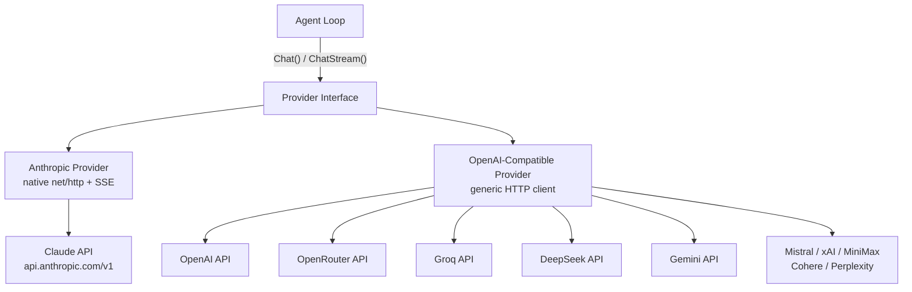
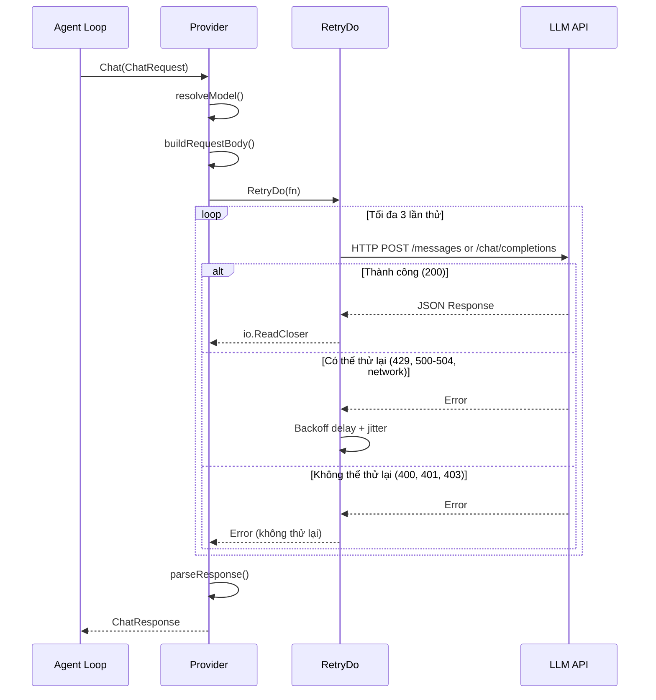
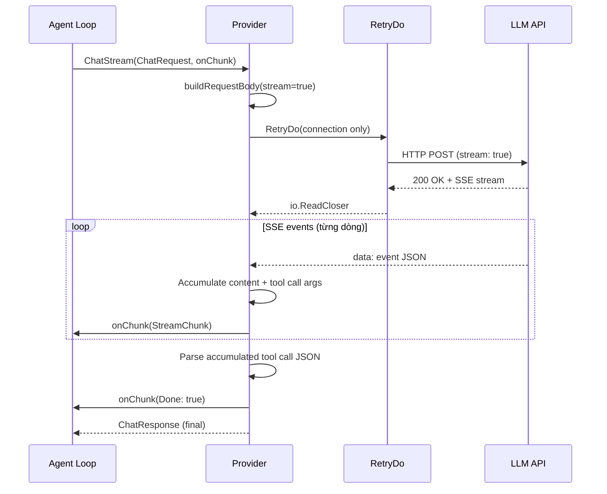
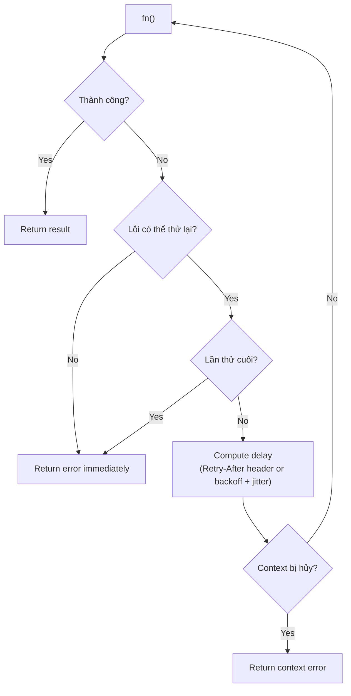
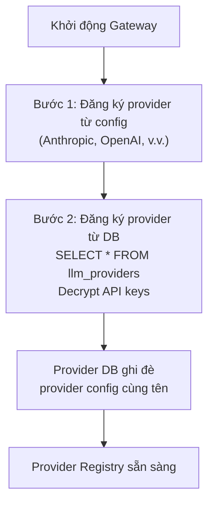
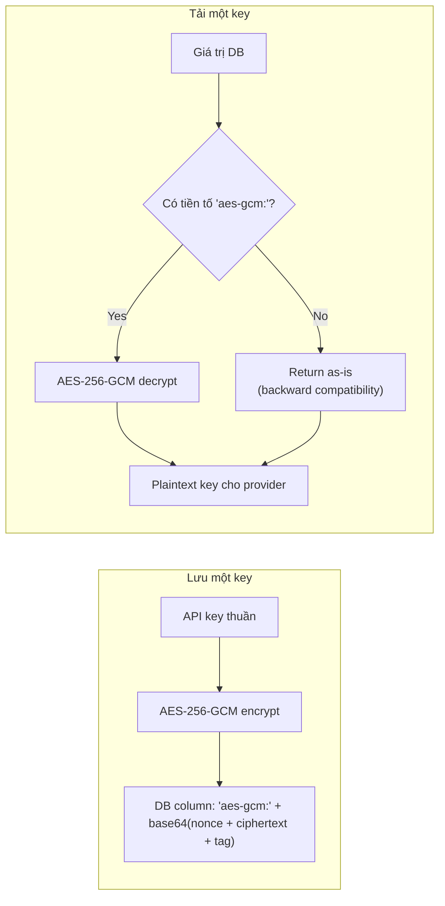

# 02 - Provider LLM

GoClaw trừu tượng hóa giao tiếp LLM đằng sau một interface `Provider` duy nhất, cho phép vòng lặp agent hoạt động với bất kỳ backend nào mà không cần biết định dạng truyền tải. Có hai triển khai cụ thể: một provider Anthropic sử dụng `net/http` native với SSE streaming, và một provider tương thích OpenAI generic bao phủ hơn 10 endpoint API.

---

## 1. Kiến Trúc Provider

Tất cả provider triển khai bốn method: `Chat()`, `ChatStream()`, `Name()`, và `DefaultModel()`. Vòng lặp agent gọi `Chat()` cho yêu cầu non-streaming và `ChatStream()` cho streaming từng token. Cả hai đều trả về `ChatResponse` thống nhất với nội dung, tool call, lý do kết thúc, và thống kê token.



Provider Anthropic sử dụng xác thực qua header `x-api-key` và header `anthropic-version: 2023-06-01`. Provider tương thích OpenAI sử dụng token `Authorization: Bearer` và nhắm đến endpoint `/chat/completions` của từng provider. Cả hai provider đặt timeout HTTP client là 120 giây.

---

## 2. Provider Được Hỗ Trợ

| Provider | Loại | API Base | Model Mặc Định |
|----------|------|----------|---------------|
| anthropic | Native HTTP + SSE | `https://api.anthropic.com/v1` | `claude-sonnet-4-5-20250929` |
| openai | Tương thích OpenAI | `https://api.openai.com/v1` | `gpt-4o` |
| openrouter | Tương thích OpenAI | `https://openrouter.ai/api/v1` | `anthropic/claude-sonnet-4-5-20250929` |
| groq | Tương thích OpenAI | `https://api.groq.com/openai/v1` | `llama-3.3-70b-versatile` |
| deepseek | Tương thích OpenAI | `https://api.deepseek.com/v1` | `deepseek-chat` |
| gemini | Tương thích OpenAI | `https://generativelanguage.googleapis.com/v1beta/openai` | `gemini-2.0-flash` |
| mistral | Tương thích OpenAI | `https://api.mistral.ai/v1` | `mistral-large-latest` |
| xai | Tương thích OpenAI | `https://api.x.ai/v1` | `grok-3-mini` |
| minimax | Tương thích OpenAI | `https://api.minimax.chat/v1` | `MiniMax-M2.5` |
| cohere | Tương thích OpenAI | `https://api.cohere.com/v2` | `command-a` |
| perplexity | Tương thích OpenAI | `https://api.perplexity.ai` | `sonar-pro` |
| dashscope | Tương thích OpenAI | `https://dashscope.aliyuncs.com/compatible-mode/v1` | `qwen3-max` |

---

## 3. Luồng Gọi

### Non-Streaming (Chat)



### Streaming (ChatStream)



Điểm khác biệt chính: non-streaming bọc toàn bộ yêu cầu trong `RetryDo`. Streaming chỉ thử lại giai đoạn kết nối -- một khi sự kiện SSE đã bắt đầu chảy, không có thử lại nào xảy ra giữa chừng.

---

## 4. Anthropic vs Tương Thích OpenAI

| Khía cạnh | Anthropic | Tương thích OpenAI |
|--------|-----------|-------------------|
| Triển khai | `net/http` native | HTTP client generic |
| System message | Trường `system` riêng (mảng text block) | Inline trong mảng `messages` với `role: "system"` |
| Định nghĩa công cụ | `name` + `description` + `input_schema` | Schema function OpenAI tiêu chuẩn |
| Kết quả công cụ | `role: "user"` với content block `tool_result` + `tool_use_id` | `role: "tool"` với `tool_call_id` |
| Đối số tool call | `map[string]interface{}` (JSON object đã parse) | Chuỗi JSON trong `function.arguments` (marshal thủ công) |
| Tool call streaming | Sự kiện `input_json_delta` | Đoạn `delta.tool_calls[].function.arguments` |
| Ánh xạ stop reason | `tool_use` ánh xạ thành `tool_calls`, `max_tokens` ánh xạ thành `length` | Truyền trực tiếp `finish_reason` |
| Tương thích Gemini | N/A | Bỏ qua trường `content` rỗng trong assistant message có tool_calls |
| Tương thích OpenRouter | N/A | Model phải chứa `/` (ví dụ: `anthropic/claude-...`); không có tiền tố thì fallback về mặc định |

---

## 5. Retry Logic

### Hàm Generic RetryDo[T]

`RetryDo` là một hàm generic bọc bất kỳ lần gọi provider nào với exponential backoff, jitter, và hỗ trợ hủy context.

### Cấu Hình

| Tham số | Mặc định | Mô tả |
|-----------|---------|-------------|
| Attempts | 3 | Tổng số lần thử (1 = không thử lại) |
| MinDelay | 300ms | Độ trễ ban đầu trước lần thử đầu tiên |
| MaxDelay | 30s | Giới hạn trên của độ trễ |
| Jitter | 0.1 (10%) | Biến động ngẫu nhiên áp dụng cho mỗi độ trễ |

### Công Thức Backoff

```
delay = MinDelay * 2^(attempt - 1)
delay = min(delay, MaxDelay)
delay = delay +/- (delay * jitter * random)

Ví dụ:
  Lần thử 1: 300ms (+/-30ms)   -> 270ms..330ms
  Lần thử 2: 600ms (+/-60ms)   -> 540ms..660ms
  Lần thử 3: 1200ms (+/-120ms) -> 1080ms..1320ms
```

Nếu phản hồi bao gồm header `Retry-After` (HTTP 429 hoặc 503), giá trị header hoàn toàn thay thế backoff đã tính toán. Header được parse dưới dạng số giây nguyên hoặc định dạng ngày RFC 1123.

### Lỗi Có Thể Thử Lại vs Không Thể Thử Lại

| Danh mục | Điều kiện |
|----------|------------|
| Có thể thử lại | HTTP 429, 500, 502, 503, 504; lỗi network (`net.Error`); connection reset; broken pipe; EOF; timeout |
| Không thể thử lại | HTTP 400, 401, 403, 404; tất cả status code khác |

### Luồng Retry



---

## 6. Làm Sạch Schema

Một số provider từ chối schema công cụ chứa các trường JSON Schema không được hỗ trợ. `CleanSchemaForProvider()` đệ quy xóa các trường này khỏi toàn bộ cây schema, bao gồm `properties`, `anyOf`, `oneOf`, và `allOf` lồng nhau.

| Provider | Các Trường Bị Xóa |
|----------|---------------|
| Gemini | `$ref`, `$defs`, `additionalProperties`, `examples`, `default` |
| Anthropic | `$ref`, `$defs` |
| Tất cả provider khác | Không làm sạch |

Provider Anthropic gọi `CleanSchemaForProvider("anthropic", ...)` khi chuyển đổi định nghĩa công cụ sang định dạng `input_schema`. Provider tương thích OpenAI gọi `CleanToolSchemas()` áp dụng logic tương tự theo tên provider.

---

## 7. Chế Độ Managed -- Provider Từ Database

Trong chế độ managed, provider được tải từ bảng `llm_providers` ngoài file config. Provider từ database ghi đè provider config với cùng tên.

### Luồng Tải



### Mã Hóa API Key



`GOCLAW_ENCRYPTION_KEY` chấp nhận ba định dạng:
- **Hex**: 64 ký tự (32 byte sau khi decode)
- **Base64**: 44 ký tự (32 byte sau khi decode)
- **Raw**: 32 ký tự (32 byte trực tiếp)

---

## 8. Agent Evaluator (Hệ Thống Hook)

Các agent evaluator trong hệ thống quality gate / hook (xem [03-tools-system.md](./03-tools-system.md)) sử dụng cùng cơ chế resolve provider như các lần chạy agent bình thường. Khi một quality gate được cấu hình với `"type": "agent"`, hook engine ủy thác cho agent reviewer đã chỉ định, agent này tự resolve provider thông qua provider registry tiêu chuẩn. Không cần cấu hình provider riêng cho agent evaluator.

---

## Tham Chiếu File

| File | Mục đích |
|------|---------|
| `internal/providers/types.go` | Interface Provider, ChatRequest, ChatResponse, Message, ToolCall, các kiểu Usage |
| `internal/providers/anthropic.go` | Triển khai provider Anthropic (native HTTP + SSE streaming) |
| `internal/providers/openai.go` | Triển khai provider tương thích OpenAI (HTTP generic) |
| `internal/providers/retry.go` | Hàm generic RetryDo[T], RetryConfig, IsRetryableError, tính toán backoff |
| `internal/providers/schema_cleaner.go` | CleanSchemaForProvider, CleanToolSchemas, xóa trường schema đệ quy |
| `cmd/gateway_providers.go` | Đăng ký provider từ config và database khi khởi động gateway |
