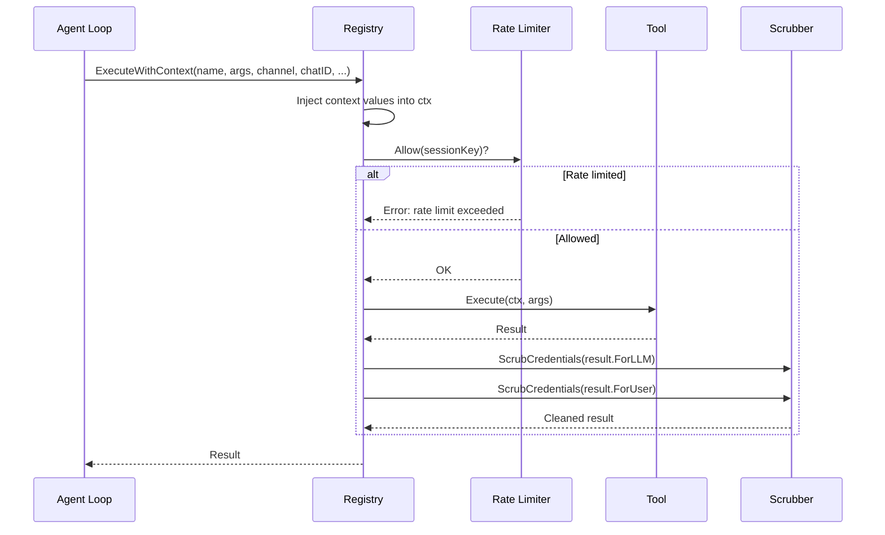
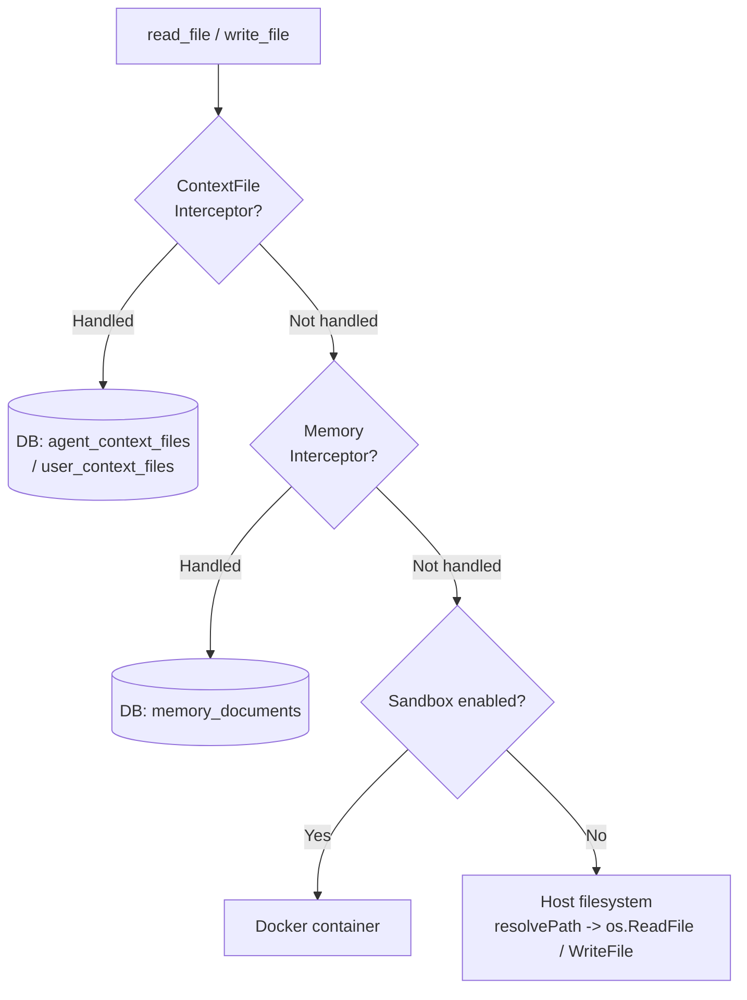
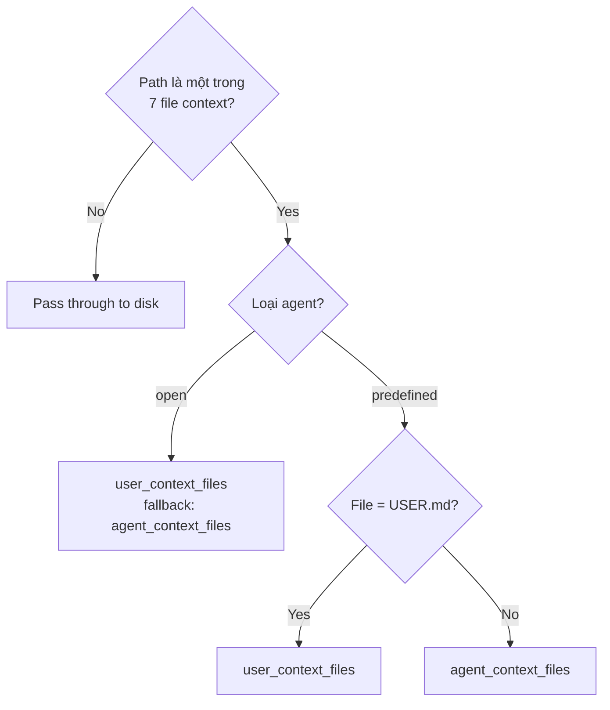
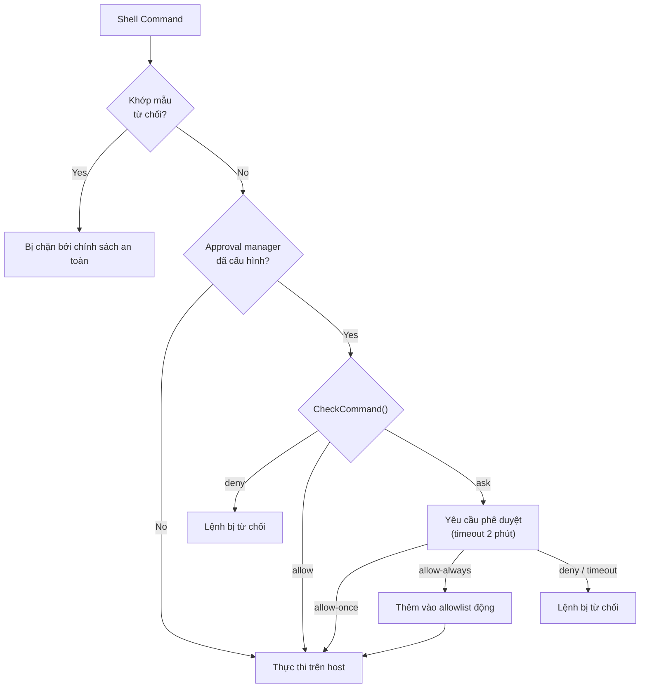
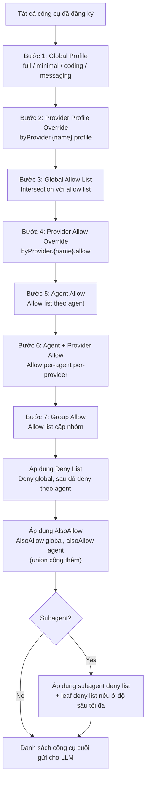
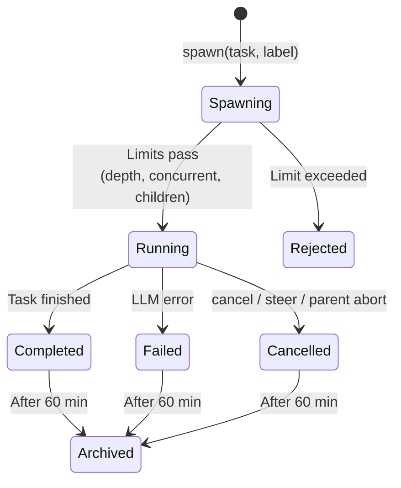
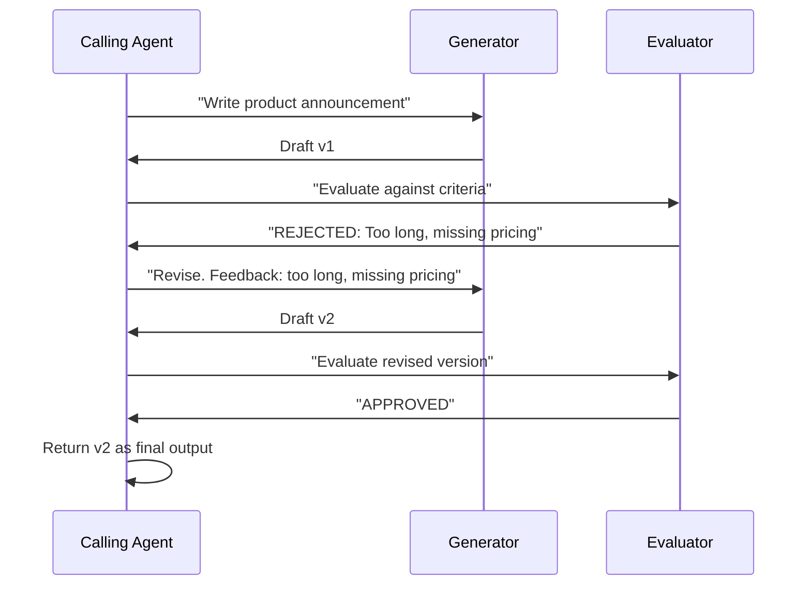
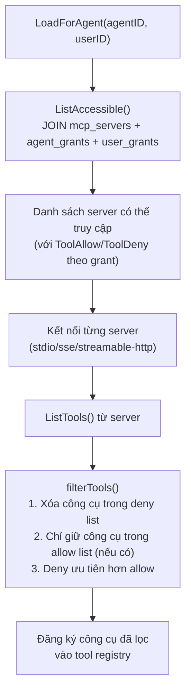
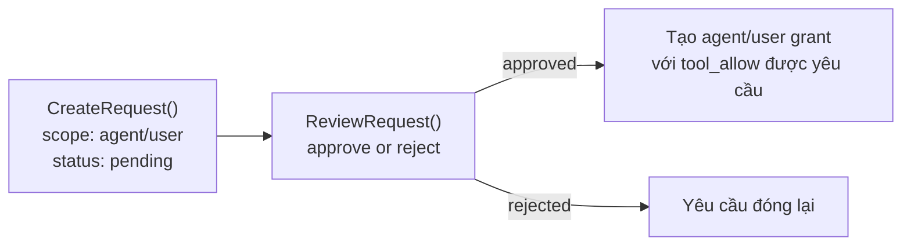
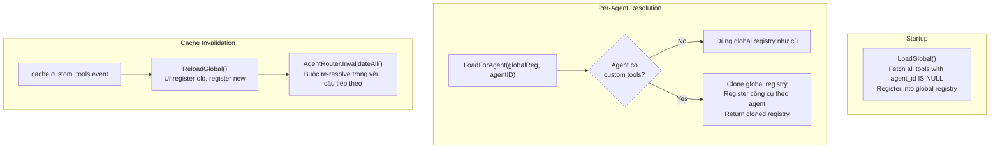

# 03 - Hệ Thống Công Cụ

Hệ thống công cụ là cầu nối giữa vòng lặp agent và môi trường bên ngoài. Khi LLM phát ra một tool call, vòng lặp agent ủy thác thực thi cho tool registry, nơi xử lý rate limiting, credential scrubbing, thực thi chính sách, và định tuyến virtual filesystem trước khi trả kết quả cho lần lặp LLM tiếp theo.

---

## 1. Luồng Thực Thi Công Cụ



ExecuteWithContext thực hiện 8 bước:

1. Khóa registry, tìm công cụ theo tên, mở khóa
2. Inject `WithToolChannel(ctx, channel)`
3. Inject `WithToolChatID(ctx, chatID)`
4. Inject `WithToolPeerKind(ctx, peerKind)`
5. Inject `WithToolSandboxKey(ctx, sessionKey)`
6. Kiểm tra rate limit qua `rateLimiter.Allow(sessionKey)`
7. Thực thi `tool.Execute(ctx, args)`
8. Scrub thông tin xác thực từ cả đầu ra `ForLLM` và `ForUser`, ghi lại thời gian thực thi

Các context key đảm bảo mỗi lần gọi công cụ nhận đúng giá trị theo lần gọi mà không cần trường có thể thay đổi, cho phép các instance công cụ được chia sẻ an toàn giữa các goroutine đồng thời.

---

## 2. Danh Sách Đầy Đủ Công Cụ

### Filesystem (nhóm: `fs`)

| Công cụ | Mô tả |
|------|-------------|
| `read_file` | Đọc nội dung file với tùy chọn phạm vi dòng |
| `write_file` | Ghi hoặc tạo file |
| `edit_file` | Áp dụng chỉnh sửa có mục tiêu vào file |
| `list_files` | Liệt kê nội dung thư mục |
| `search` | Tìm kiếm nội dung file với regex |
| `glob` | Tìm file khớp với glob pattern |

### Runtime (nhóm: `runtime`)

| Công cụ | Mô tả |
|------|-------------|
| `exec` | Thực thi lệnh shell |
| `process` | Quản lý tiến trình đang chạy |

### Web (nhóm: `web`)

| Công cụ | Mô tả |
|------|-------------|
| `web_search` | Tìm kiếm trên web |
| `web_fetch` | Tải và parse URL |

### Memory (nhóm: `memory`)

| Công cụ | Mô tả |
|------|-------------|
| `memory_search` | Tìm kiếm tài liệu trong memory |
| `memory_get` | Lấy một tài liệu memory cụ thể |

### Sessions (nhóm: `sessions`)

| Công cụ | Mô tả |
|------|-------------|
| `sessions_list` | Liệt kê session đang hoạt động |
| `sessions_history` | Xem lịch sử tin nhắn session |
| `sessions_send` | Gửi tin nhắn đến một session |
| `sessions_spawn` | Spawn tác vụ subagent bất đồng bộ |
| `subagents` | Quản lý tác vụ subagent (liệt kê, hủy, điều hướng) |
| `session_status` | Lấy trạng thái session hiện tại |

### UI (nhóm: `ui`)

| Công cụ | Mô tả |
|------|-------------|
| `browser` | Tự động hóa trình duyệt qua Rod + CDP |
| `canvas` | Thao tác visual canvas |

### Automation (nhóm: `automation`)

| Công cụ | Mô tả |
|------|-------------|
| `cron` | Quản lý tác vụ định kỳ |
| `gateway` | Lệnh quản trị gateway |

### Messaging (nhóm: `messaging`)

| Công cụ | Mô tả |
|------|-------------|
| `message` | Gửi tin nhắn đến một kênh |

### Delegation (nhóm: `delegation`)

| Công cụ | Mô tả |
|------|-------------|
| `delegate` | Ủy quyền tác vụ cho agent khác (actions: delegate, cancel, list, history) |
| `delegate_search` | Khám phá agent hybrid FTS + semantic để làm mục tiêu ủy quyền |
| `evaluate_loop` | Chu kỳ generate-evaluate-revise với hai agent (tối đa 5 vòng) |
| `handoff` | Chuyển giao hội thoại sang agent khác (routing override) |

### Teams (nhóm: `teams`)

| Công cụ | Mô tả |
|------|-------------|
| `team_tasks` | Bảng nhiệm vụ: liệt kê, tạo, nhận, hoàn thành, tìm kiếm |
| `team_message` | Hộp thư: gửi, phát sóng, đọc tin nhắn chưa đọc |

### Công Cụ Khác

| Công cụ | Mô tả |
|------|-------------|
| `skill_search` | Tìm kiếm kỹ năng có sẵn (BM25) |
| `image` | Tạo hình ảnh |
| `tts` | Text-to-speech synthesis (OpenAI, ElevenLabs, Edge, MiniMax) |
| `spawn` | Spawn subagent (thay thế cho sessions_spawn) |
| `nodes` | Thao tác node graph |

---

## 3. Công Cụ Filesystem và Định Tuyến Virtual FS

Trong chế độ managed, các thao tác filesystem bị chặn trước khi chạm đến đĩa host. Hai lớp interceptor định tuyến các đường dẫn cụ thể đến database thay thế.



### ContextFileInterceptor -- 7 File Được Định Tuyến

| File | Mô tả |
|------|-------------|
| `SOUL.md` | Tính cách và hành vi của agent |
| `IDENTITY.md` | Thông tin nhận dạng agent |
| `AGENTS.md` | Định nghĩa sub-agent |
| `TOOLS.md` | Hướng dẫn sử dụng công cụ |
| `HEARTBEAT.md` | Hướng dẫn đánh thức định kỳ |
| `USER.md` | Tùy chọn và context theo người dùng |
| `BOOTSTRAP.md` | Hướng dẫn lần chạy đầu (ghi rỗng = xóa hàng) |

### Định Tuyến Theo Loại Agent



- **Open agent**: Tất cả 7 file đều theo người dùng. Nếu file người dùng không tồn tại, template cấp agent được trả về như fallback.
- **Predefined agent**: Chỉ `USER.md` là theo người dùng. Tất cả file khác đến từ store cấp agent.

### MemoryInterceptor

Định tuyến các đường dẫn `MEMORY.md`, `memory.md`, và `memory/*`. Kết quả theo người dùng được ưu tiên với fallback về phạm vi global. Viết file `.md` tự động kích hoạt `IndexDocument()` (chunking + embedding).

### Interface PathDenyable

Các công cụ truy cập filesystem triển khai interface `PathDenyable`, cho phép từ chối các tiền tố đường dẫn cụ thể lúc runtime:

```go
type PathDenyable interface {
    DenyPaths(...string)
}
```

Tất cả bốn công cụ filesystem (`read_file`, `write_file`, `list_files`, `edit_file`) đều triển khai nó. `list_files` còn lọc các thư mục bị từ chối khỏi đầu ra -- agent thậm chí không biết thư mục tồn tại. Được dùng để ngăn agent truy cập thư mục `.goclaw` trong workspace.

### Injection Workspace Context

Các công cụ filesystem và shell đọc workspace của chúng từ `ToolWorkspaceFromCtx(ctx)`, được inject bởi vòng lặp agent dựa trên người dùng và agent hiện tại. Điều này cho phép cô lập workspace theo người dùng mà không cần thay đổi bất kỳ code công cụ nào. Fallback về trường struct để tương thích ngược.

### Bảo Mật Đường Dẫn

`resolvePath()` nối các đường dẫn tương đối với workspace root, áp dụng `filepath.Clean()`, và xác minh kết quả với `HasPrefix()`. Điều này ngăn chặn các cuộc tấn công path traversal (ví dụ: `../../../etc/passwd`). Phiên bản mở rộng `resolvePathWithAllowed()` cho phép các tiền tố bổ sung cho thư mục skills.

---

## 4. Thực Thi Shell

Công cụ `exec` cho phép LLM chạy lệnh shell, với nhiều lớp phòng thủ.

### Mẫu Từ Chối

| Danh mục | Mẫu bị chặn |
|----------|------------------|
| Thao tác file phá hoại | `rm -rf`, `del /f`, `rmdir /s` |
| Phá hủy đĩa | `mkfs`, `dd if=`, `> /dev/sd*` |
| Kiểm soát hệ thống | `shutdown`, `reboot`, `poweroff` |
| Fork bomb | `:(){ ... };:` |
| Thực thi code từ xa | `curl \| sh`, `wget -O - \| sh` |
| Reverse shell | `/dev/tcp/`, `nc -e` |
| Eval injection | `eval $()`, `base64 -d \| sh` |

### Quy Trình Phê Duyệt



### Định Tuyến Sandbox

Khi sandbox manager được cấu hình và `sandboxKey` tồn tại trong context, lệnh thực thi bên trong Docker container. Thư mục làm việc host được ánh xạ đến `/workspace` trong container. Host timeout là 60 giây; sandbox timeout là 300 giây. Nếu sandbox trả về `ErrSandboxDisabled`, thực thi fallback về host.

---

## 5. Policy Engine

Policy engine xác định công cụ nào LLM có thể sử dụng qua pipeline cho phép 7 bước, theo sau là trừ deny và additive alsoAllow.



### Profile

| Profile | Công cụ bao gồm |
|---------|---------------|
| `full` | Tất cả công cụ đã đăng ký (không hạn chế) |
| `coding` | `group:fs`, `group:runtime`, `group:sessions`, `group:memory`, `image` |
| `messaging` | `group:messaging`, `sessions_list`, `sessions_history`, `sessions_send`, `session_status` |
| `minimal` | Chỉ `session_status` |

### Nhóm Công Cụ

| Nhóm | Thành viên |
|-------|---------|
| `fs` | `read_file`, `write_file`, `list_files`, `edit_file`, `search`, `glob` |
| `runtime` | `exec`, `process` |
| `web` | `web_search`, `web_fetch` |
| `memory` | `memory_search`, `memory_get` |
| `sessions` | `sessions_list`, `sessions_history`, `sessions_send`, `sessions_spawn`, `subagents`, `session_status` |
| `ui` | `browser`, `canvas` |
| `automation` | `cron`, `gateway` |
| `messaging` | `message` |
| `delegation` | `delegate`, `delegate_search`, `evaluate_loop`, `handoff` |
| `teams` | `team_tasks`, `team_message` |
| `goclaw` | Tất cả công cụ native (nhóm tổng hợp) |

Các nhóm có thể được tham chiếu trong allow/deny list với tiền tố `group:` (ví dụ: `group:fs`). MCP manager đăng ký động các nhóm `mcp` và `mcp:{serverName}` lúc runtime.

---

## 6. Hệ Thống Subagent

Subagent là các instance agent con được spawn để xử lý các tác vụ song song hoặc phức tạp. Chúng chạy trong goroutine nền với quyền truy cập công cụ bị hạn chế.

### Vòng Đời



### Giới Hạn

| Ràng buộc | Mặc định | Mô tả |
|------------|---------|-------------|
| MaxConcurrent | 8 | Tổng subagent đang chạy trên tất cả agent cha |
| MaxSpawnDepth | 1 | Độ sâu lồng tối đa |
| MaxChildrenPerAgent | 5 | Số con tối đa cho mỗi agent cha |
| ArchiveAfterMinutes | 60 | Tự động archive tác vụ đã hoàn thành |
| Max iterations | 20 | Số lần lặp LLM cho mỗi subagent |

### Hành Động Subagent

| Hành động | Hành vi |
|--------|----------|
| `spawn` (async) | Khởi chạy trong goroutine, trả về ngay với tin nhắn chấp nhận |
| `run` (sync) | Chặn cho đến khi subagent hoàn thành, trả về kết quả trực tiếp |
| `list` | Liệt kê tất cả tác vụ subagent với trạng thái |
| `cancel` | Hủy theo ID cụ thể, `"all"`, hoặc `"last"` |
| `steer` | Hủy + chờ 500ms + spawn lại với tin nhắn mới |

### Deny List Công Cụ

| Danh sách | Công cụ bị từ chối |
|------|-------------|
| Luôn từ chối (mọi độ sâu) | `gateway`, `agents_list`, `whatsapp_login`, `session_status`, `cron`, `memory_search`, `memory_get`, `sessions_send` |
| Từ chối ở leaf (độ sâu tối đa) | `sessions_list`, `sessions_history`, `sessions_spawn`, `spawn`, `subagent` |

Kết quả được thông báo lại cho agent cha qua message bus, tùy chọn được batch qua AnnounceQueue với debouncing.

---

## 7. Hệ Thống Ủy Quyền

Ủy quyền cho phép các agent được đặt tên ủy thác tác vụ cho các agent hoàn toàn độc lập khác (mỗi agent có identity, công cụ, provider, model, và file context riêng). Không giống subagent (clone ẩn danh), ủy quyền vượt qua ranh giới agent qua các liên kết quyền tường minh.

### DelegateManager

`DelegateManager` trong `internal/tools/delegate.go` điều phối tất cả hoạt động ủy quyền:

| Hành động | Chế độ | Hành vi |
|--------|------|----------|
| `delegate` | `sync` | Caller chờ kết quả (tra cứu nhanh, kiểm tra thực tế) |
| `delegate` | `async` | Caller tiếp tục; kết quả được thông báo sau qua message bus (`delegate:{id}`) |
| `cancel` | -- | Hủy ủy quyền async đang chạy theo ID |
| `list` | -- | Liệt kê các ủy quyền đang hoạt động |
| `history` | -- | Truy vấn các ủy quyền đã qua từ bảng `delegation_history` |

### Mẫu Callback

Package `tools` không thể import `agent` (import cycle). Một hàm callback là cầu nối:

```go
type AgentRunFunc func(ctx context.Context, agentKey string, req DelegateRunRequest) (*DelegateRunResult, error)
```

Tầng `cmd` cung cấp triển khai khi kết nối. Package `tools` không bao giờ biết `agent` tồn tại.

### Agent Link (Kiểm Soát Quyền)

Ủy quyền yêu cầu liên kết tường minh trong bảng `agent_links`. Liên kết là các cạnh có hướng:

- **outbound** (A→B): Chỉ A có thể ủy quyền cho B
- **bidirectional** (A↔B): Cả hai đều có thể ủy quyền cho nhau

Mỗi liên kết có `max_concurrent` và `settings` theo người dùng (JSONB) cho deny/allow list.

### Kiểm Soát Concurrency

Hai lớp ngăn chặn quá tải:

| Lớp | Cấu hình | Phạm vi |
|-------|--------|-------|
| Per-link | `agent_links.max_concurrent` | A→B cụ thể |
| Per-agent | `other_config.max_delegation_load` | B từ tất cả nguồn |

Khi đạt giới hạn, thông báo lỗi được viết cho LLM suy luận: *"Agent at capacity (5/5). Try a different agent or handle it yourself."*

### Tự Động Inject DELEGATION.md

Trong quá trình resolve agent, `DELEGATION.md` được tự động tạo và inject vào system prompt:

- **≤15 mục tiêu**: Danh sách inline đầy đủ với agent key, tên, và frontmatter
- **>15 mục tiêu**: Hướng dẫn tìm kiếm trỏ đến công cụ `delegate_search` (hybrid FTS + pgvector cosine)

### Hợp Nhất File Context (Open Agent)

Đối với open agent, file context theo người dùng được hợp nhất với file cơ sở do resolver inject. File của người dùng ghi đè file cùng tên ở cơ sở, nhưng file chỉ có ở cơ sở như `DELEGATION.md` được giữ lại:

```
File cơ sở (resolver):     DELEGATION.md
File theo người dùng (DB): AGENTS.md, SOUL.md, TOOLS.md, USER.md, ...
Kết quả hợp nhất:          AGENTS.md, SOUL.md, TOOLS.md, USER.md, ..., DELEGATION.md ✓
```

---

## 8. Nhóm Agent

Nhóm agent thêm một lớp phối hợp chung trên nền ủy quyền: bảng nhiệm vụ cho công việc song song và hộp thư cho giao tiếp ngang hàng.

### Kiến Trúc

Admin tạo nhóm qua dashboard, gán **lead** và **thành viên**. Khi người dùng nhắn tin cho lead:
1. Lead thấy `TEAM.md` trong system prompt (danh sách teammate + vai trò)
2. Lead đăng nhiệm vụ lên bảng
3. Teammate được kích hoạt, nhận nhiệm vụ, và làm việc song song
4. Teammate nhắn tin với nhau để phối hợp
5. Lead tổng hợp kết quả và trả lời người dùng

### Bảng Nhiệm Vụ (công cụ `team_tasks`)

| Hành động | Mô tả |
|--------|-------------|
| `list` | Liệt kê nhiệm vụ (lọc: active/completed/all, sắp xếp: priority/newest) |
| `create` | Tạo nhiệm vụ với subject, description, priority, blocked_by |
| `claim` | Nhận nhiệm vụ đang chờ nguyên tử (an toàn đua tranh qua row-level lock) |
| `complete` | Đánh dấu nhiệm vụ hoàn thành với kết quả; tự động mở khóa nhiệm vụ phụ thuộc |
| `search` | Tìm kiếm FTS trên subject + description của nhiệm vụ |

### Hộp Thư (công cụ `team_message`)

| Hành động | Mô tả |
|--------|-------------|
| `send` | Gửi tin nhắn trực tiếp cho teammate cụ thể |
| `broadcast` | Gửi tin nhắn đến tất cả teammate |
| `read` | Đọc tin nhắn chưa đọc |

### Thiết Kế Lấy Lead Làm Trung Tâm

Chỉ lead nhận `TEAM.md` trong system prompt. Teammate khám phá context theo nhu cầu qua công cụ -- không lãng phí token vào các agent rảnh rỗi. Khi tin nhắn teammate đến, bản thân tin nhắn mang context (ví dụ: *"[Team message from lead]: please claim a task from the board."*).

### Định Tuyến Tin Nhắn

Kết quả teammate được định tuyến qua message bus với tiền tố `"teammate:"`. Consumer công bố phản hồi outbound để lead (và cuối cùng người dùng) thấy kết quả.

---

## 9. Vòng Lặp Đánh Giá-Tối Ưu

Chu kỳ sửa đổi có cấu trúc giữa hai agent: một generator và một evaluator.



Công cụ `evaluate_loop` điều phối điều này. Các tham số: generator agent, evaluator agent, tiêu chí pass, và số vòng tối đa (mặc định 3, giới hạn 5). Mỗi vòng là một cặp ủy quyền đồng bộ. Nếu evaluator phản hồi "APPROVED" (khớp tiền tố không phân biệt hoa thường), vòng lặp thoát. Nếu "REJECTED: feedback", generator được thêm cơ hội.

Các ủy quyền nội bộ sử dụng `WithSkipHooks(ctx)` để ngăn quality gate kích hoạt đệ quy.

---

## 10. Agent Handoff

Handoff chuyển hội thoại từ một agent sang agent khác. Không giống ủy quyền (giữ agent nguồn trong vòng lặp), handoff loại bỏ hoàn toàn agent nguồn.

| | Ủy quyền | Handoff |
|---|---|---|
| Ai nói với người dùng? | Agent nguồn (luôn luôn) | Agent đích (sau khi chuyển) |
| Sự tham gia agent nguồn | Chờ kết quả, tái diễn đạt | Rút hoàn toàn |
| Session | Agent đích chạy trong context của nguồn | Agent đích nhận session mới |
| Thời gian | Một tác vụ | Cho đến khi xóa hoặc chuyển lại |

### Cơ Chế

Khi agent A gọi `handoff(agent="billing", reason="billing question")`:
1. Một hàng được ghi vào `handoff_routes`: kênh + chat ID này bây giờ route đến billing
2. Sự kiện `handoff` được phát (WS client có thể phản ứng)
3. Tin nhắn ban đầu được công bố đến billing qua message bus với context hội thoại

Các tin nhắn tiếp theo từ người dùng trên kênh đó được route đến billing (consumer kiểm tra `handoff_routes` trước khi route thông thường). Billing có thể chuyển lại qua `handoff(action="clear")`.

---

## 11. Quality Gate (Hệ Thống Hook)

Hệ thống hook đa năng để xác thực đầu ra agent trước khi đến người dùng. Nằm trong `internal/hooks/`.

### Loại Evaluator

| Loại | Cách hoạt động | Ví dụ |
|------|-------------|---------|
| **command** | Chạy lệnh shell. Exit 0 = pass. Stderr = feedback. | `npm test`, `eslint --stdin` |
| **agent** | Ủy thác cho agent reviewer. Parse "APPROVED" hoặc "REJECTED: feedback". | QA reviewer kiểm tra tone/độ chính xác |

### Cấu Hình

Quality gate nằm trong JSON `other_config` của agent nguồn:

```json
{
  "quality_gates": [
    {
      "event": "delegation.completed",
      "type": "agent",
      "agent": "qa-reviewer",
      "block_on_failure": true,
      "max_retries": 2
    }
  ]
}
```

Khi `block_on_failure` là true và còn lần thử lại, hệ thống chạy lại agent đích với feedback của evaluator được inject làm revision prompt.

### Ngăn Chặn Đệ Quy

Quality gate với agent evaluator có thể gây đệ quy vô hạn (gate ủy quyền cho reviewer → reviewer hoàn thành → gate kích hoạt lại). Giải pháp là một context flag: `hooks.WithSkipHooks(ctx, true)`. Ba nơi đặt flag này:
1. **Agent evaluator** -- khi ủy quyền cho reviewer
2. **Evaluate loop** -- cho tất cả ủy quyền generator/evaluator nội bộ
3. **Agent eval callback trong tầng cmd** -- khi hook engine tự kích hoạt ủy quyền

`DelegateManager.Delegate()` kiểm tra `hooks.SkipHooksFromContext(ctx)` trước khi áp dụng gate. Nếu được đặt, gate bị bỏ qua.

---

## 12. Công Cụ MCP Bridge

GoClaw tích hợp với server Model Context Protocol (MCP) qua `internal/mcp/`. MCP Manager kết nối đến các server công cụ bên ngoài và đăng ký công cụ của chúng trong tool registry với tiền tố có thể cấu hình.

### Transport

| Transport | Mô tả |
|-----------|-------------|
| `stdio` | Khởi chạy tiến trình với command + args, giao tiếp qua stdin/stdout |
| `sse` | Kết nối đến SSE endpoint qua URL |
| `streamable-http` | Kết nối đến HTTP streaming endpoint |

### Hành Vi

- Health check chạy mỗi 30 giây cho mỗi server
- Kết nối lại sử dụng exponential backoff (ban đầu 2s, tối đa 60s, 10 lần thử)
- Công cụ được đăng ký với tiền tố (ví dụ: `mcp_servername_toolname`)
- Đăng ký nhóm công cụ động: nhóm `mcp` và `mcp:{serverName}`

### Kiểm Soát Truy Cập (Chế Độ Managed)

Trong chế độ managed, quyền truy cập MCP server được kiểm soát qua grant theo agent và theo người dùng được lưu trong PostgreSQL.



**Loại grant**:

| Grant | Bảng | Phạm vi | Trường |
|-------|-------|-------|--------|
| Agent grant | `mcp_agent_grants` | Theo server + agent | `tool_allow`, `tool_deny` (JSONB array), `config_overrides`, `enabled` |
| User grant | `mcp_user_grants` | Theo server + người dùng | `tool_allow`, `tool_deny` (JSONB array), `enabled` |

**Quy trình yêu cầu truy cập**: Người dùng có thể yêu cầu truy cập MCP server. Admin xem xét và phê duyệt hoặc từ chối. Khi phê duyệt, grant tương ứng được tạo trong giao dịch.



---

## 13. Công Cụ Tùy Chỉnh (Chế Độ Managed)

Định nghĩa các công cụ dựa trên shell lúc runtime qua HTTP API -- không cần biên dịch lại hay khởi động lại. Công cụ tùy chỉnh được lưu trong bảng `custom_tools` của PostgreSQL và tải động vào tool registry của agent.

### Vòng Đời



### Phạm Vi

| Phạm vi | `agent_id` | Hành vi |
|-------|-----------|----------|
| Global | `NULL` | Có sẵn cho tất cả agent |
| Per-agent | UUID | Chỉ có sẵn cho agent đã chỉ định |

### Thực Thi Lệnh

1. **Render template**: placeholder `{{.key}}` được thay thế bằng giá trị đối số đã shell-escape (bọc dấu nháy đơn với escape dấu nháy nhúng)
2. **Kiểm tra mẫu từ chối**: Cùng mẫu từ chối như công cụ `exec` (chặn `curl|sh`, reverse shell, v.v.)
3. **Thực thi**: `sh -c <rendered_command>` với timeout có thể cấu hình (mặc định 60s) và thư mục làm việc tùy chọn
4. **Biến môi trường**: Được lưu mã hóa (AES-256-GCM) trong database, giải mã lúc runtime và inject vào môi trường lệnh

### Ví Dụ Cấu Hình JSON

```json
{
  "name": "dns_lookup",
  "description": "Look up DNS records for a domain",
  "parameters": {
    "type": "object",
    "properties": {
      "domain": { "type": "string", "description": "Domain name" },
      "record_type": { "type": "string", "enum": ["A", "AAAA", "MX", "CNAME", "TXT"] }
    },
    "required": ["domain"]
  },
  "command": "dig +short {{.record_type}} {{.domain}}",
  "timeout_seconds": 10,
  "enabled": true
}
```

---

## 14. Credential Scrubbing

Đầu ra công cụ được tự động scrub trước khi trả về cho LLM. Bật mặc định trong registry.

### Mẫu Phát Hiện

| Loại | Mẫu |
|------|---------|
| OpenAI | `sk-[a-zA-Z0-9]{20,}` |
| Anthropic | `sk-ant-[a-zA-Z0-9-]{20,}` |
| GitHub PAT | `ghp_`, `gho_`, `ghu_`, `ghs_`, `ghr_` + 36 ký tự chữ số |
| AWS | `AKIA[A-Z0-9]{16}` |
| Generic | `(api_key\|token\|secret\|password\|bearer\|authorization)[:=]value` (không phân biệt hoa thường) |

Tất cả kết quả khớp được thay thế bằng `[REDACTED]`.

---

## 15. Rate Limiter

Tool registry hỗ trợ rate limiting theo session qua `ToolRateLimiter`. Khi được cấu hình, mỗi lần gọi `ExecuteWithContext` kiểm tra `rateLimiter.Allow(sessionKey)` trước khi thực thi công cụ. Các lần gọi bị rate-limited nhận kết quả lỗi mà không thực thi công cụ.

---

## Tham Chiếu File

| File | Mục đích |
|------|---------|
| `internal/tools/registry.go` | Registry: Register, Execute, ExecuteWithContext, ProviderDefs |
| `internal/tools/types.go` | Interface Tool, ContextualTool, InterceptorAware, và các interface cấu hình khác |
| `internal/tools/policy.go` | PolicyEngine: pipeline 7 bước, nhóm công cụ, profile, subagent deny list |
| `internal/tools/filesystem.go` | read_file, write_file, edit_file với hỗ trợ interceptor |
| `internal/tools/filesystem_list.go` | Công cụ list_files |
| `internal/tools/filesystem_write.go` | Các thao tác ghi bổ sung |
| `internal/tools/shell.go` | ExecTool: mẫu từ chối, quy trình phê duyệt, sandbox routing |
| `internal/tools/scrub.go` | ScrubCredentials: khớp mẫu thông tin xác thực và ẩn |
| `internal/tools/subagent.go` | SubagentManager: spawn, cancel, steer, run sync, deny list |
| `internal/tools/delegate.go` | DelegateManager: đồng bộ, bất đồng bộ, hủy, concurrency, kiểm tra theo người dùng |
| `internal/tools/delegate_tool.go` | Wrapper công cụ Delegate (action: delegate/cancel/list/history) |
| `internal/tools/delegate_search_tool.go` | Khám phá agent hybrid FTS + semantic |
| `internal/tools/evaluate_loop_tool.go` | Vòng lặp generate-evaluate-revise (tối đa 5 vòng) |
| `internal/tools/handoff_tool.go` | Chuyển giao hội thoại (routing override + mang context) |
| `internal/tools/team_tool_manager.go` | Backend chung cho công cụ nhóm |
| `internal/tools/team_tasks_tool.go` | Bảng nhiệm vụ: list, create, claim, complete, search |
| `internal/tools/team_message_tool.go` | Hộp thư: send, broadcast, read |
| `internal/hooks/engine.go` | Hook engine: đăng ký evaluator, EvaluateHooks |
| `internal/hooks/command_evaluator.go` | Shell command evaluator |
| `internal/hooks/agent_evaluator.go` | Agent delegation evaluator |
| `internal/hooks/context.go` | WithSkipHooks / SkipHooksFromContext |
| `internal/tools/context_file_interceptor.go` | ContextFileInterceptor: định tuyến 7 file theo loại agent |
| `internal/tools/memory_interceptor.go` | MemoryInterceptor: định tuyến MEMORY.md và memory/* |
| `internal/tools/skill_search.go` | Công cụ tìm kiếm kỹ năng (BM25) |
| `internal/tools/tts.go` | Công cụ text-to-speech (4 provider) |
| `internal/mcp/manager.go` | MCP Manager: kết nối server, health check, đăng ký công cụ |
| `internal/mcp/bridge_tool.go` | Triển khai công cụ MCP bridge |
| `internal/tools/dynamic_loader.go` | DynamicLoader: LoadGlobal, LoadForAgent, ReloadGlobal |
| `internal/tools/dynamic_tool.go` | DynamicTool: render template, shell escaping, thực thi |
| `internal/store/custom_tool_store.go` | Interface CustomToolStore |
| `internal/store/pg/custom_tools.go` | Triển khai PostgreSQL custom tools |
| `internal/store/mcp_store.go` | Interface MCPServerStore (grants, access request) |
| `internal/store/pg/mcp_servers.go` | Triển khai MCP PostgreSQL |
