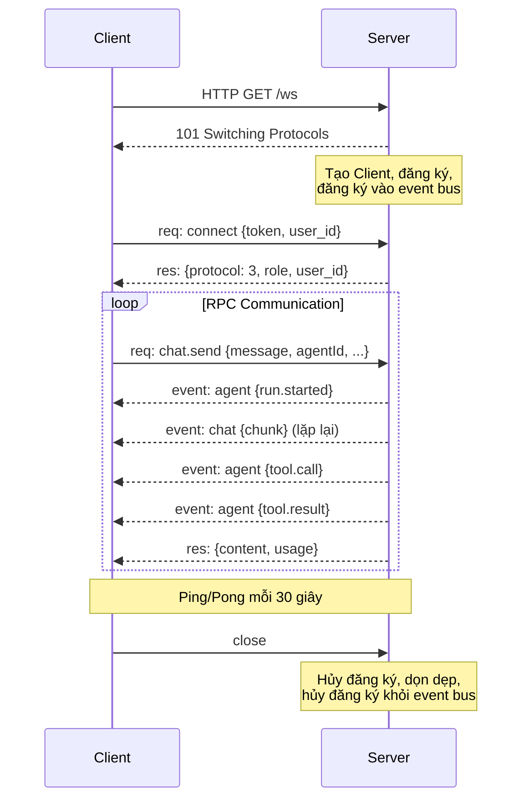
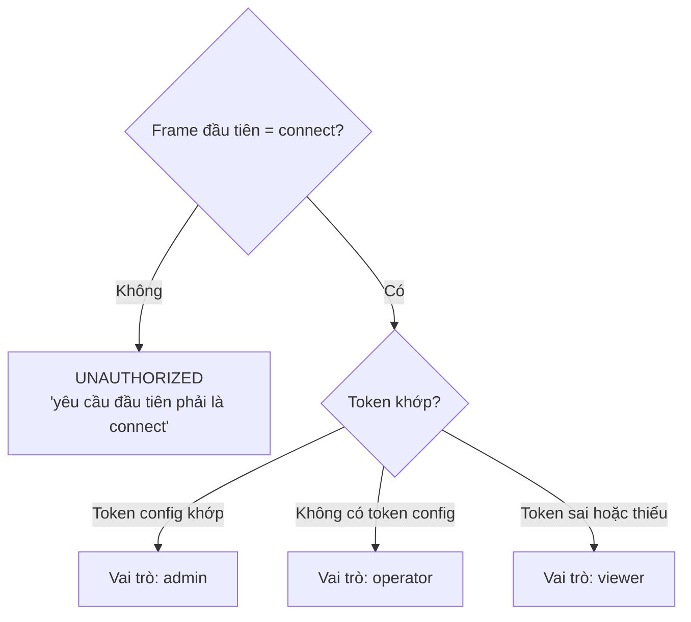
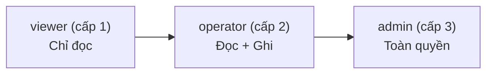
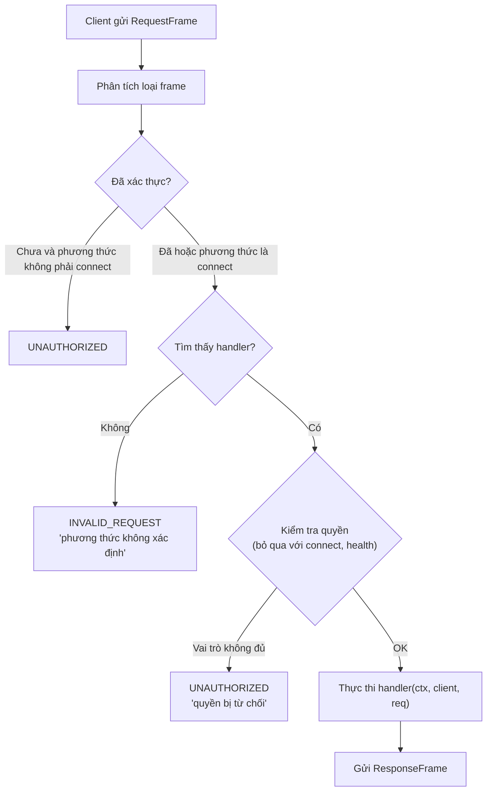
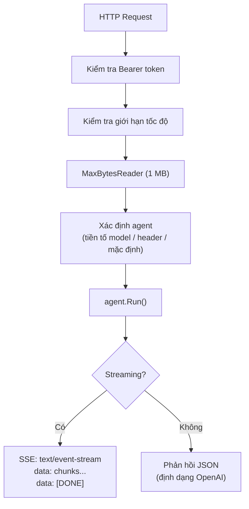
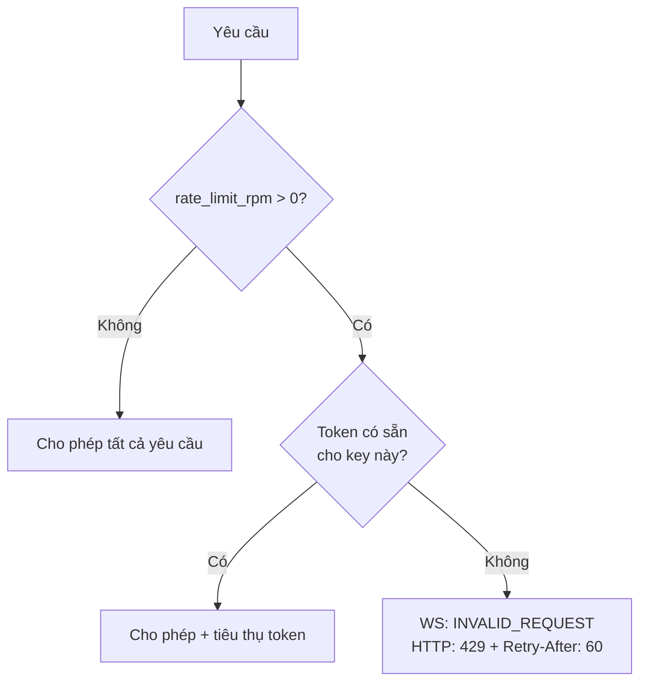

# 04 - Gateway và Giao Thức

Gateway là thành phần trung tâm của GoClaw, phục vụ cả WebSocket RPC (Protocol v3) và HTTP REST API trên một cổng duy nhất. Nó xử lý xác thực, kiểm soát truy cập theo vai trò, giới hạn tốc độ và điều phối phương thức cho mọi tương tác từ phía client.

---

## 1. Vòng Đời WebSocket

### Tham Số Kết Nối

| Tham số | Giá trị | Mô tả |
|---------|---------|-------|
| Giới hạn đọc | 512 KB | Tự động đóng kết nối khi vượt quá |
| Bộ đệm gửi | Dung lượng 256 | Bỏ bớt tin nhắn khi đầy |
| Thời hạn đọc | 60 giây | Đặt lại khi có mỗi tin nhắn hoặc pong |
| Thời hạn ghi | 10 giây | Thời gian chờ mỗi lần ghi |
| Khoảng ping | 30 giây | Server khởi tạo keepalive |

---

## 2. Các Loại Frame Protocol v3

| Loại | Hướng | Mục đích |
|------|-------|---------|
| `req` | Client đến Server | Gọi một phương thức RPC |
| `res` | Server đến Client | Phản hồi khớp với yêu cầu theo `id` |
| `event` | Server đến Client | Đẩy sự kiện (các chunk streaming, trạng thái agent, v.v.) |

Yêu cầu đầu tiên từ client phải là `connect`. Bất kỳ phương thức nào được gửi trước khi xác thực sẽ dẫn đến lỗi `UNAUTHORIZED`.

### Cấu Trúc Request Frame

- `type`: luôn là `"req"`
- `id`: ID yêu cầu duy nhất (do client tạo)
- `method`: tên phương thức RPC
- `params`: tham số đặc thù của phương thức (JSON)

### Cấu Trúc Response Frame

- `type`: luôn là `"res"`
- `id`: khớp với ID của yêu cầu
- `ok`: chỉ báo thành công dạng boolean
- `payload`: dữ liệu phản hồi (khi `ok` là true)
- `error`: cấu trúc lỗi với `code`, `message`, `details`, `retryable`, `retryAfterMs` (khi `ok` là false)

### Cấu Trúc Event Frame

- `type`: luôn là `"event"`
- `event`: tên sự kiện (ví dụ: `chat`, `agent`, `status`, `handoff`)
- `payload`: dữ liệu sự kiện
- `seq`: số thứ tự sắp xếp
- `stateVersion`: bộ đếm phiên bản để đồng bộ trạng thái lạc quan

---

## 3. Xác Thực và RBAC

### Bắt Tay Kết Nối

So sánh token sử dụng `crypto/subtle.ConstantTimeCompare` để ngăn chặn tấn công timing.

Trong managed mode, `user_id` trong tham số kết nối là bắt buộc để phân vùng phiên theo người dùng và định tuyến tệp context. GoClaw sử dụng mẫu **Identity Propagation** — tin tưởng dịch vụ upstream cung cấp danh tính người dùng chính xác. `user_id` là dạng mờ (VARCHAR 255); các triển khai đa tenant sử dụng định dạng phức hợp `tenant.{tenantId}.user.{userId}`. Xem [00-architecture-overview.md Mục 5](./00-architecture-overview.md) để biết thêm chi tiết.

### Ba Vai Trò

### Quyền Phương Thức

| Vai trò | Phương thức có thể truy cập |
|---------|--------------------------|
| viewer | `agents.list`, `config.get`, `sessions.list`, `sessions.preview`, `health`, `status`, `models.list`, `skills.list`, `skills.get`, `channels.list`, `channels.status`, `cron.list`, `cron.status`, `cron.runs`, `usage.get`, `usage.summary` |
| operator | Tất cả phương thức của viewer cộng thêm: `chat.send`, `chat.abort`, `chat.history`, `chat.inject`, `sessions.delete`, `sessions.reset`, `sessions.patch`, `cron.create`, `cron.update`, `cron.delete`, `cron.toggle`, `cron.run`, `skills.update`, `send`, `exec.approval.list`, `exec.approval.approve`, `exec.approval.deny`, `device.pair.request`, `device.pair.list` |
| admin | Tất cả phương thức của operator cộng thêm: `config.apply`, `config.patch`, `agents.create`, `agents.update`, `agents.delete`, `agents.files.*`, `agents.links.*`, `teams.*`, `channels.toggle`, `device.pair.approve`, `device.pair.revoke` |

---

## 4. Pipeline Xử Lý Yêu Cầu

---

## 5. Các Phương Thức RPC

### Hệ Thống

| Phương thức | Mô tả |
|------------|-------|
| `connect` | Bắt tay xác thực (phải là yêu cầu đầu tiên) |
| `health` | Kiểm tra sức khỏe |
| `status` | Trạng thái gateway (client đã kết nối, agent, kênh) |
| `models.list` | Liệt kê các model có sẵn từ tất cả provider |

### Chat

| Phương thức | Mô tả |
|------------|-------|
| `chat.send` | Gửi tin nhắn đến agent, nhận phản hồi streaming |
| `chat.history` | Lấy lịch sử hội thoại của một phiên |
| `chat.abort` | Hủy vòng lặp agent đang chạy |
| `chat.inject` | Tiêm tin nhắn hệ thống vào phiên |

### Agents

| Phương thức | Mô tả |
|------------|-------|
| `agent` | Lấy chi tiết của một agent cụ thể |
| `agent.wait` | Chờ agent sẵn sàng |
| `agent.identity.get` | Lấy danh tính agent (tên, mô tả) |
| `agents.list` | Liệt kê tất cả agent có thể truy cập |
| `agents.create` | Tạo agent mới (managed mode) |
| `agents.update` | Cập nhật cấu hình agent |
| `agents.delete` | Xóa mềm một agent |
| `agents.files.list` | Liệt kê các tệp context của agent |
| `agents.files.get` | Đọc tệp context |
| `agents.files.set` | Ghi tệp context |

### Sessions

| Phương thức | Mô tả |
|------------|-------|
| `sessions.list` | Liệt kê tất cả phiên |
| `sessions.preview` | Xem trước nội dung phiên |
| `sessions.patch` | Cập nhật metadata phiên |
| `sessions.delete` | Xóa phiên |
| `sessions.reset` | Đặt lại lịch sử phiên |

### Config

| Phương thức | Mô tả |
|------------|-------|
| `config.get` | Lấy cấu hình hiện tại (bí mật đã bị ẩn) |
| `config.apply` | Thay thế toàn bộ cấu hình |
| `config.patch` | Cập nhật cấu hình một phần |
| `config.schema` | Lấy JSON schema cấu hình |

### Skills

| Phương thức | Mô tả |
|------------|-------|
| `skills.list` | Liệt kê tất cả skill |
| `skills.get` | Lấy chi tiết skill |
| `skills.update` | Cập nhật nội dung skill |

### Cron

| Phương thức | Mô tả |
|------------|-------|
| `cron.list` | Liệt kê các công việc đã lên lịch |
| `cron.create` | Tạo cron job mới |
| `cron.update` | Cập nhật cron job |
| `cron.delete` | Xóa cron job |
| `cron.toggle` | Bật/tắt cron job |
| `cron.status` | Lấy trạng thái hệ thống cron |
| `cron.run` | Kích hoạt thủ công cron job |
| `cron.runs` | Liệt kê nhật ký chạy gần đây |

### Channels

| Phương thức | Mô tả |
|------------|-------|
| `channels.list` | Liệt kê các kênh đang bật |
| `channels.status` | Lấy trạng thái hoạt động của kênh |
| `channels.toggle` | Bật/tắt kênh (chỉ admin) |

### Pairing

| Phương thức | Mô tả |
|------------|-------|
| `device.pair.request` | Yêu cầu mã ghép nối |
| `device.pair.approve` | Chấp thuận yêu cầu ghép nối |
| `device.pair.list` | Liệt kê thiết bị đã ghép nối |
| `device.pair.revoke` | Thu hồi thiết bị đã ghép nối |
| `browser.pairing.status` | Kiểm tra trạng thái chấp thuận ghép nối trình duyệt |

### Exec Approval

| Phương thức | Mô tả |
|------------|-------|
| `exec.approval.list` | Liệt kê các yêu cầu phê duyệt exec đang chờ |
| `exec.approval.approve` | Chấp thuận yêu cầu exec |
| `exec.approval.deny` | Từ chối yêu cầu exec |

### Usage và Send

| Phương thức | Mô tả |
|------------|-------|
| `usage.get` | Lấy mức sử dụng token của phiên |
| `usage.summary` | Lấy tóm tắt sử dụng tổng hợp |
| `send` | Gửi tin nhắn trực tiếp đến kênh |

### Agent Links

| Phương thức | Mô tả |
|------------|-------|
| `agents.links.list` | Liệt kê liên kết agent (theo agent nguồn) |
| `agents.links.create` | Tạo liên kết agent (chiều ra hoặc hai chiều) |
| `agents.links.update` | Cập nhật liên kết (max_concurrent, settings, status) |
| `agents.links.delete` | Xóa liên kết agent |

### Teams

| Phương thức | Mô tả |
|------------|-------|
| `teams.list` | Liệt kê các team agent |
| `teams.create` | Tạo team (lead + thành viên) |
| `teams.get` | Lấy chi tiết team kèm thành viên |
| `teams.delete` | Xóa team |
| `teams.tasks.list` | Liệt kê nhiệm vụ của team |

### Delegations

| Phương thức | Mô tả |
|------------|-------|
| `delegations.list` | Liệt kê lịch sử ủy quyền (kết quả được cắt bớt xuống 500 rune) |
| `delegations.get` | Lấy chi tiết ủy quyền (kết quả được cắt bớt xuống 8000 rune) |

---

## 6. HTTP API

### Xác Thực

- `Authorization: Bearer <token>` -- so sánh an toàn về thời gian qua `crypto/subtle.ConstantTimeCompare`
- Không có token được cấu hình: tất cả yêu cầu được phép
- `X-GoClaw-User-Id`: bắt buộc trong managed mode để phân vùng theo người dùng
- `X-GoClaw-Agent-Id`: chỉ định agent đích cho yêu cầu

### Các Endpoint

#### POST /v1/chat/completions (Tương thích OpenAI)

Thứ tự ưu tiên xác định agent: trường `model` với tiền tố `goclaw:` hoặc `agent:`, sau đó header `X-GoClaw-Agent-Id`, rồi `"default"`.

#### POST /v1/responses (OpenResponses Protocol)

Cùng luồng xác định và thực thi agent, định dạng phản hồi khác (`response.started`, `response.delta`, `response.done`).

#### POST /v1/tools/invoke

Gọi tool trực tiếp mà không qua vòng lặp agent. Hỗ trợ `dryRun: true` để chỉ trả về schema của tool.

#### GET /health

Trả về `{"status":"ok","protocol":3}`.

#### Các Endpoint CRUD Managed Mode

Tất cả endpoint managed đều yêu cầu `Authorization: Bearer <token>` và header `X-GoClaw-User-Id` để phân vùng theo người dùng.

**Agents** (`/v1/agents`):

| Phương thức | Đường dẫn | Mô tả |
|------------|----------|-------|
| GET | `/v1/agents` | Liệt kê agent có thể truy cập (được lọc theo chia sẻ người dùng) |
| POST | `/v1/agents` | Tạo agent mới |
| GET | `/v1/agents/{id}` | Lấy chi tiết agent |
| PUT | `/v1/agents/{id}` | Cập nhật cấu hình agent |
| DELETE | `/v1/agents/{id}` | Xóa mềm agent |

**Custom Tools** (`/v1/tools/custom`):

| Phương thức | Đường dẫn | Mô tả |
|------------|----------|-------|
| GET | `/v1/tools/custom` | Liệt kê tool (tùy chọn lọc theo `?agent_id=`) |
| POST | `/v1/tools/custom` | Tạo custom tool |
| GET | `/v1/tools/custom/{id}` | Lấy chi tiết tool |
| PUT | `/v1/tools/custom/{id}` | Cập nhật tool |
| DELETE | `/v1/tools/custom/{id}` | Xóa tool |

**MCP Servers** (`/v1/mcp`):

| Phương thức | Đường dẫn | Mô tả |
|------------|----------|-------|
| GET | `/v1/mcp/servers` | Liệt kê MCP server đã đăng ký |
| POST | `/v1/mcp/servers` | Đăng ký MCP server mới |
| GET | `/v1/mcp/servers/{id}` | Lấy chi tiết server |
| PUT | `/v1/mcp/servers/{id}` | Cập nhật cấu hình server |
| DELETE | `/v1/mcp/servers/{id}` | Xóa MCP server |
| POST | `/v1/mcp/servers/{id}/grants/agent` | Cấp quyền truy cập cho agent |
| DELETE | `/v1/mcp/servers/{id}/grants/agent/{agentID}` | Thu hồi quyền truy cập của agent |
| GET | `/v1/mcp/grants/agent/{agentID}` | Liệt kê quyền MCP của agent |
| POST | `/v1/mcp/servers/{id}/grants/user` | Cấp quyền truy cập cho người dùng |
| DELETE | `/v1/mcp/servers/{id}/grants/user/{userID}` | Thu hồi quyền truy cập của người dùng |
| POST | `/v1/mcp/requests` | Yêu cầu quyền truy cập (tự phục vụ người dùng) |
| GET | `/v1/mcp/requests` | Liệt kê các yêu cầu quyền truy cập đang chờ |
| POST | `/v1/mcp/requests/{id}/review` | Chấp thuận hoặc từ chối yêu cầu |

**Agent Sharing** (`/v1/agents/{id}/sharing`):

| Phương thức | Đường dẫn | Mô tả |
|------------|----------|-------|
| GET | `/v1/agents/{id}/sharing` | Liệt kê chia sẻ của agent |
| POST | `/v1/agents/{id}/sharing` | Chia sẻ agent với người dùng |
| DELETE | `/v1/agents/{id}/sharing/{userID}` | Thu hồi quyền truy cập của người dùng |

**Agent Links** (`/v1/agents/{id}/links`):

| Phương thức | Đường dẫn | Mô tả |
|------------|----------|-------|
| GET | `/v1/agents/{id}/links` | Liệt kê liên kết của agent |
| POST | `/v1/agents/{id}/links` | Tạo liên kết mới |
| PUT | `/v1/agents/{id}/links/{linkID}` | Cập nhật liên kết |
| DELETE | `/v1/agents/{id}/links/{linkID}` | Xóa liên kết |

**Delegations** (`/v1/delegations`):

| Phương thức | Đường dẫn | Mô tả |
|------------|----------|-------|
| GET | `/v1/delegations` | Liệt kê lịch sử ủy quyền (bản ghi đầy đủ, phân trang) |
| GET | `/v1/delegations/{id}` | Lấy chi tiết ủy quyền |

**Skills** (`/v1/skills`):

| Phương thức | Đường dẫn | Mô tả |
|------------|----------|-------|
| GET | `/v1/skills` | Liệt kê skill |
| POST | `/v1/skills/upload` | Tải lên skill ZIP (tối đa 20 MB) |
| DELETE | `/v1/skills/{id}` | Xóa skill |

**Traces** (`/v1/traces`):

| Phương thức | Đường dẫn | Mô tả |
|------------|----------|-------|
| GET | `/v1/traces` | Liệt kê trace (lọc theo agent_id, user_id, status, khoảng ngày) |
| GET | `/v1/traces/{id}` | Lấy chi tiết trace kèm tất cả span |

---

## 7. Giới Hạn Tốc Độ

Giới hạn tốc độ token bucket theo người dùng hoặc địa chỉ IP. Được cấu hình qua `gateway.rate_limit_rpm` (0 = tắt, > 0 = bật).

| Khía cạnh | WebSocket | HTTP |
|-----------|-----------|------|
| Khóa tốc độ | `client.UserID()` dự phòng `client.ID()` | `RemoteAddr` dự phòng `"token:" + bearer` |
| Khi vượt giới hạn | `INVALID_REQUEST "rate limit exceeded"` | HTTP 429 |
| Burst | 5 yêu cầu | 5 yêu cầu |
| Dọn dẹp | Mỗi 5 phút, các mục không hoạt động > 10 phút | Tương tự |

---

## 8. Mã Lỗi

| Mã | Mô tả |
|----|-------|
| `UNAUTHORIZED` | Xác thực thất bại hoặc vai trò không đủ quyền |
| `INVALID_REQUEST` | Trường thiếu hoặc không hợp lệ trong yêu cầu |
| `NOT_FOUND` | Tài nguyên được yêu cầu không tồn tại |
| `ALREADY_EXISTS` | Tài nguyên đã tồn tại (xung đột) |
| `UNAVAILABLE` | Dịch vụ tạm thời không khả dụng |
| `RESOURCE_EXHAUSTED` | Đã vượt giới hạn tốc độ |
| `FAILED_PRECONDITION` | Điều kiện tiên quyết của thao tác chưa được đáp ứng |
| `AGENT_TIMEOUT` | Lần chạy agent vượt quá giới hạn thời gian |
| `INTERNAL` | Lỗi server không mong muốn |

Phản hồi lỗi bao gồm các trường `retryable` (boolean) và `retryAfterMs` (integer) để hướng dẫn hành vi thử lại của client.

---

## Tham Chiếu Tệp

| Tệp | Mục đích |
|-----|---------|
| `internal/gateway/server.go` | Server: nâng cấp WebSocket, HTTP mux, kiểm tra CORS, vòng đời client |
| `internal/gateway/client.go` | Client: quản lý kết nối, vòng đọc/ghi, bộ đệm gửi |
| `internal/gateway/router.go` | MethodRouter: đăng ký handler, điều phối có kiểm tra quyền |
| `internal/gateway/ratelimit.go` | RateLimiter: token bucket theo key, vòng dọn dẹp |
| `internal/gateway/methods/chat.go` | Handler cho chat.send, chat.history, chat.abort, chat.inject |
| `internal/gateway/methods/agents.go` | Handler cho agents.list, agents.create/update/delete, agents.files.* |
| `internal/gateway/methods/sessions.go` | Handler cho sessions.list/preview/patch/delete/reset |
| `internal/gateway/methods/config.go` | Handler cho config.get/apply/patch/schema |
| `internal/gateway/methods/skills.go` | Handler cho skills.list/get/update |
| `internal/gateway/methods/cron.go` | Handler cho cron.list/create/update/delete/toggle/run/runs |
| `internal/gateway/methods/agent_links.go` | Handler cho agents.links.* + vô hiệu hóa cache router agent |
| `internal/gateway/methods/teams.go` | Handler cho teams.* + tự động liên kết đồng đội |
| `internal/gateway/methods/delegations.go` | Handler cho delegations.list/get |
| `internal/gateway/methods/channels.go` | Handler cho channels.list/status |
| `internal/gateway/methods/pairing.go` | Handler cho device.pair.* |
| `internal/gateway/methods/exec_approval.go` | Handler cho exec.approval.* |
| `internal/gateway/methods/usage.go` | Handler cho usage.get/summary |
| `internal/gateway/methods/send.go` | Handler send (tin nhắn trực tiếp đến kênh) |
| `internal/http/chat_completions.go` | POST /v1/chat/completions (tương thích OpenAI) |
| `internal/http/responses.go` | POST /v1/responses (OpenResponses protocol) |
| `internal/http/tools_invoke.go` | POST /v1/tools/invoke (thực thi tool trực tiếp) |
| `internal/http/agents.go` | Handler HTTP CRUD Agent (managed mode) |
| `internal/http/skills.go` | Handler HTTP Skills (managed mode) |
| `internal/http/traces.go` | Handler HTTP Traces (managed mode) |
| `internal/http/delegations.go` | Handler HTTP lịch sử ủy quyền |
| `internal/http/summoner.go` | Thiết lập agent bằng LLM (phân tích XML, tạo tệp context) |
| `internal/http/auth.go` | Xác thực Bearer token, so sánh an toàn về thời gian |
| `internal/permissions/policy.go` | PolicyEngine: phân cấp vai trò, ánh xạ phương thức theo vai trò |
| `pkg/protocol/frames.go` | Các loại frame: RequestFrame, ResponseFrame, EventFrame, ErrorShape |
