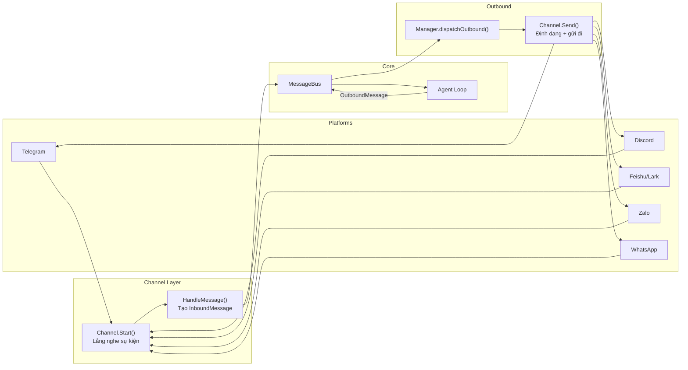
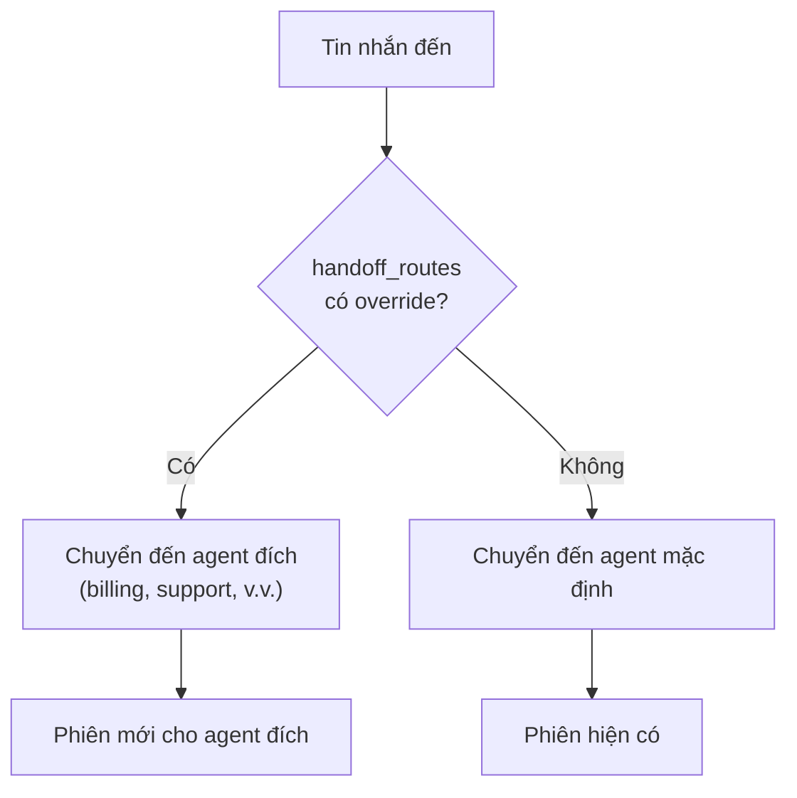
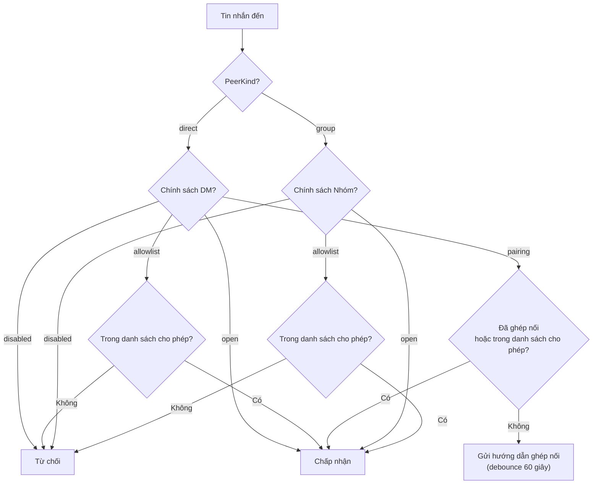
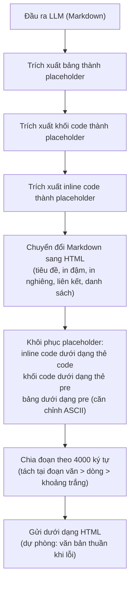
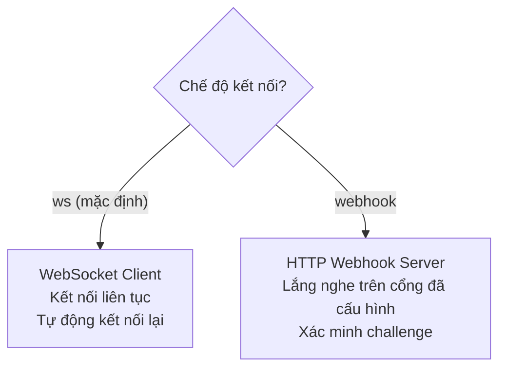
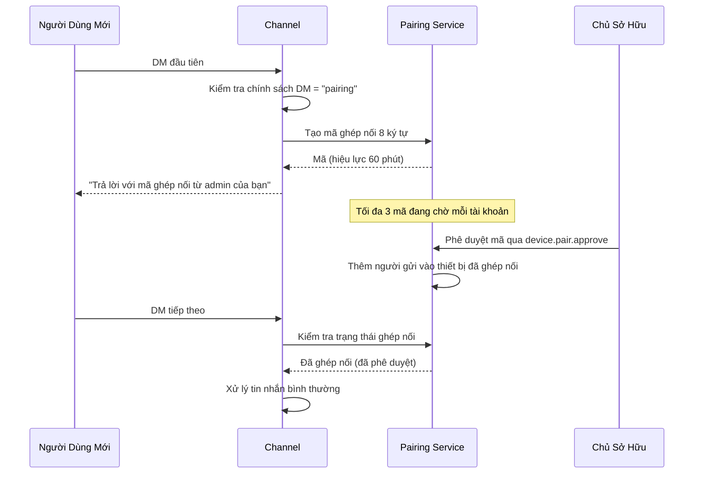

# 05 - Channels và Messaging

Các channel kết nối nền tảng nhắn tin bên ngoài với runtime agent của GoClaw thông qua một message bus dùng chung. Mỗi triển khai channel dịch các sự kiện đặc thù của nền tảng thành một `InboundMessage` thống nhất, và chuyển đổi phản hồi của agent thành tin nhắn outbound phù hợp với từng nền tảng.

---

## 1. Luồng Tin Nhắn

Các channel nội bộ (`cli`, `system`, `subagent`) bị bộ điều phối outbound bỏ qua hoàn toàn và không bao giờ được chuyển tiếp đến nền tảng bên ngoài.

### Định Tuyến Handoff (Managed Mode)

Trước khi định tuyến agent thông thường, consumer kiểm tra bảng `handoff_routes` để tìm override định tuyến đang hoạt động. Nếu tồn tại một tuyến handoff cho kênh + chat ID đến, tin nhắn sẽ được chuyển hướng đến agent đích thay vì agent gốc.

Các tuyến handoff được tạo bởi tool `handoff` (xem [03-tools-system.md](./03-tools-system.md)) và có thể được xóa bởi agent đích gọi `handoff(action="clear")` hoặc bằng cách chuyển lại về agent gốc.

### Tiền Tố Định Tuyến Tin Nhắn

Consumer định tuyến tin nhắn hệ thống dựa trên tiền tố ID người gửi:

| Tiền tố | Tuyến | Gửi Outbound |
|---------|-------|:------------:|
| `subagent:` | Hàng đợi phiên cha | Có |
| `delegate:` | Làn lịch trình delegate | Có |
| `teammate:` | Hàng đợi phiên agent trưởng | Có |
| `handoff:` | Agent đích qua làn delegate | Có |

### Hành Vi Managed Mode

Trong managed mode, các channel cung cấp tính cô lập theo người dùng thông qua ID người gửi phức hợp và truyền bá context:

- **Phân vùng người dùng**: Mỗi channel xây dựng ID người gửi phức hợp (ví dụ: `telegram:123456`) ánh xạ đến `user_id` để tạo khóa phiên. Định dạng khóa phiên `agent:{agentId}:{channel}:direct:{peerId}` đảm bảo mỗi người dùng có lịch sử hội thoại riêng biệt trên mỗi agent.
- **Truyền bá context**: `HandleMessage()` đặt `store.WithAgentID(ctx)`, `store.WithUserID(ctx)` và `store.WithAgentType(ctx)` trên context. Các giá trị này chạy qua ContextFileInterceptor, MemoryInterceptor và việc seeding tệp theo người dùng.
- **Lưu trữ Pairing**: Trong managed mode, trạng thái pairing (yêu cầu đang chờ và các ghép nối đã được phê duyệt) được lưu trong các bảng PostgreSQL `pairing_requests` và `paired_devices` thông qua `PGPairingStore`. Trong standalone mode, trạng thái pairing được lưu trong các tệp JSON.
- **Duy trì phiên**: Các phiên chat được lưu trong bảng PostgreSQL `sessions` thông qua `PGSessionStore` với bộ nhớ đệm ghi trễ.

---

## 2. Giao Diện Channel

Mỗi channel phải triển khai các phương thức sau:

| Phương thức | Mô tả |
|------------|-------|
| `Name()` | Định danh channel (ví dụ: `"telegram"`, `"discord"`) |
| `Start(ctx)` | Bắt đầu lắng nghe tin nhắn (không chặn sau khi thiết lập) |
| `Stop(ctx)` | Dừng graceful |
| `Send(ctx, msg)` | Gửi tin nhắn outbound đến nền tảng |
| `IsRunning()` | Liệu channel có đang xử lý tích cực không |
| `IsAllowed(senderID)` | Kiểm tra xem người gửi có vượt qua danh sách cho phép không |

`BaseChannel` cung cấp một triển khai dùng chung mà tất cả channel nhúng vào. Nó xử lý:

- Khớp danh sách cho phép với định dạng phức hợp `"123456|username"` và loại bỏ tiền tố `@`
- `HandleMessage()` tạo `InboundMessage` và phát lên bus
- `CheckPolicy()` đánh giá chính sách DM/Group cho mỗi tin nhắn
- Trích xuất user ID từ ID người gửi phức hợp (loại bỏ hậu tố `|username`)

---

## 3. Chính Sách Channel

### Chính Sách DM

| Chính sách | Hành vi |
|-----------|---------|
| `pairing` | Yêu cầu mã ghép nối cho người gửi mới |
| `allowlist` | Chỉ chấp nhận người gửi trong danh sách trắng |
| `open` | Chấp nhận tất cả DM |
| `disabled` | Từ chối tất cả DM |

### Chính Sách Nhóm

| Chính sách | Hành vi |
|-----------|---------|
| `open` | Chấp nhận tất cả tin nhắn nhóm |
| `allowlist` | Chỉ chấp nhận nhóm trong danh sách trắng |
| `disabled` | Không xử lý tin nhắn nhóm nào |

### Đánh Giá Chính Sách

Chính sách được cấu hình theo từng channel. Mặc định là `"open"` cho các channel không chỉ định chính sách.

---

## 4. So Sánh Channel

| Tính năng | Telegram | Discord | Feishu/Lark | Zalo | WhatsApp |
|-----------|----------|---------|-------------|------|----------|
| Kết nối | Long polling | Gateway events | WebSocket (mặc định) hoặc Webhook | Long polling | External WS bridge |
| Hỗ trợ DM | Có | Có | Có | Có (chỉ DM) | Có |
| Hỗ trợ nhóm | Có (cần @mention) | Có | Có | Không | Có |
| Giới hạn tin nhắn | 4096 ký tự | 2000 ký tự | 4000 ký tự | 2000 ký tự | N/A (bridge) |
| Streaming | Chỉ báo đang gõ | Sửa tin nhắn "Thinking..." | Thẻ tin nhắn streaming | Không | Không |
| Media | Ảnh, giọng nói, tệp | Tệp, embeds | Hình ảnh, tệp (30 MB) | Hình ảnh (5 MB) | Tin nhắn JSON |
| Định dạng phong phú | Markdown sang HTML | Markdown | Card messages | Văn bản thuần | Văn bản thuần |
| Hỗ trợ pairing | Có | Không | Có | Có | Không |

---

## 5. Telegram

Channel Telegram sử dụng long polling qua thư viện `telego` (Telegram Bot API).

### Hành Vi Chính

- **Kiểm soát mention nhóm**: Theo mặc định, bot phải được @mention trong nhóm (`requireMention: true`). Các tin nhắn nhóm đang chờ mà không có mention được lưu trong bộ đệm lịch sử (mặc định 50 tin nhắn) và được đưa vào làm context khi bot cuối cùng được mention.
- **Chỉ báo đang gõ**: Hành động "typing" được gửi trong khi agent đang xử lý.
- **Hỗ trợ proxy**: HTTP proxy tùy chọn được cấu hình qua cấu hình channel.
- **Lệnh hủy**: `/stop` (hủy tác vụ đang chạy cũ nhất) và `/stopall` (hủy tất cả + xả hàng đợi). Cả hai đều bị chặn trước bộ debouncer 800ms để tránh bị gộp với các tin nhắn tiếp theo. Xem [08-scheduling-cron-heartbeat.md](./08-scheduling-cron-heartbeat.md) để biết thêm chi tiết.
- **Hỗ trợ nhóm đồng thời**: Các phiên nhóm hỗ trợ tối đa 3 lần chạy agent đồng thời, cho phép nhiều người dùng nhận phản hồi song song.

### Pipeline Định Dạng

Đầu ra của LLM được chuyển đổi qua pipeline nhiều bước để tạo HTML Telegram hợp lệ. Telegram chỉ hỗ trợ `<b>`, `<i>`, `<s>`, `<a>`, `<code>`, `<pre>`, `<blockquote>` -- không có `<table>`.

- **Hiển thị bảng**: Các bảng Markdown được hiển thị dưới dạng văn bản căn chỉnh ASCII trong thẻ `<pre>` (không phải `<pre><code>` để tránh nút "Copy"). Nội dung ô được loại bỏ markdown inline (`**bold**`, `_italic_`).
- **Xử lý CJK**: `displayWidth()` đếm chính xác các ký tự CJK và emoji là chiều rộng 2 cột để căn chỉnh bảng đúng.

---

## 6. Feishu/Lark

Channel Feishu/Lark kết nối qua HTTP gốc với hai chế độ truyền tải.

### Chế Độ Truyền Tải

### Hành Vi Chính

- **Domain mặc định**: Lark Global (`open.larksuite.com`). Có thể cấu hình cho Feishu China.
- **Thẻ tin nhắn streaming**: Phản hồi được gửi dưới dạng thẻ tin nhắn tương tác với cập nhật streaming, cung cấp hiển thị đầu ra thời gian thực. Cập nhật được điều tiết ở khoảng 100ms với số thứ tự tăng dần.
- **Xử lý media**: Hỗ trợ tải lên/xuống hình ảnh và tệp với giới hạn mặc định 30 MB.
- **Hỗ trợ mention**: Xử lý các mention `@bot` trong chat nhóm với loại bỏ văn bản mention.
- **Cache người gửi**: Tên người dùng được cache với TTL 10 phút để giảm lời gọi API.
- **Chống trùng lặp**: ID tin nhắn được theo dõi qua `sync.Map` để ngăn xử lý sự kiện trùng lặp.
- **Debounce pairing**: Debounce 60 giây cho các trả lời liên quan đến pairing.

---

## 7. Discord

Channel Discord sử dụng thư viện `discordgo` để kết nối qua Discord Gateway.

### Hành Vi Chính

- **Gateway intents**: Yêu cầu các intent `GuildMessages`, `DirectMessages` và `MessageContent`.
- **Giới hạn tin nhắn**: Giới hạn 2000 ký tự mỗi tin nhắn, tự động tách cho nội dung dài hơn.
- **Chỉnh sửa placeholder**: Gửi tin nhắn "Thinking..." ban đầu, được chỉnh sửa bằng phản hồi thực tế khi hoàn thành.
- **Danh tính bot**: Lấy `@me` khi khởi động để phát hiện và bỏ qua tin nhắn của chính mình.

---

## 8. WhatsApp

Channel WhatsApp giao tiếp qua external WebSocket bridge (ví dụ: dựa trên whatsapp-web.js). GoClaw không triển khai trực tiếp giao thức WhatsApp.

### Hành Vi Chính

- **Kết nối bridge**: Kết nối đến `bridge_url` có thể cấu hình qua WebSocket.
- **Định dạng JSON**: Tin nhắn được gửi và nhận dưới dạng đối tượng JSON qua kết nối WebSocket.
- **Tự động kết nối lại**: Nếu kết nối ban đầu thất bại, vòng lặp lắng nghe nền sẽ thử lại tự động.
- **Hỗ trợ DM và nhóm**: Cả hai đều được hỗ trợ qua giao thức bridge.

---

## 9. Zalo

Channel Zalo kết nối đến Zalo OA Bot API.

### Hành Vi Chính

- **Chỉ DM**: Không hỗ trợ nhóm. Chỉ xử lý tin nhắn trực tiếp.
- **Giới hạn văn bản**: Tối đa 2000 ký tự mỗi tin nhắn.
- **Long polling**: Sử dụng long polling với thời gian chờ mặc định 30 giây và backoff 5 giây khi lỗi.
- **Media**: Hỗ trợ hình ảnh với giới hạn mặc định 5 MB.
- **Chính sách DM mặc định**: `"pairing"` (yêu cầu mã ghép nối cho người dùng mới).
- **Debounce pairing**: Debounce 60 giây để tránh tràn ngập người dùng bằng hướng dẫn ghép nối.

---

## 10. Hệ Thống Pairing

Hệ thống pairing cung cấp luồng xác thực DM cho các channel sử dụng chính sách DM `pairing`.

### Luồng

### Thông Số Mã

| Khía cạnh | Giá trị |
|-----------|---------|
| Độ dài | 8 ký tự |
| Bảng chữ cái | `ABCDEFGHJKLMNPQRSTUVWXYZ23456789` (loại bỏ các ký tự dễ nhầm: 0, O, 1, I, L) |
| TTL | 60 phút |
| Tối đa đang chờ mỗi tài khoản | 3 |
| Debounce trả lời | 60 giây mỗi người gửi |

---

## Tham Chiếu Tệp

| Tệp | Mục đích |
|-----|---------|
| `internal/channels/channel.go` | Giao diện Channel, BaseChannel, các loại DMPolicy/GroupPolicy, HandleMessage |
| `internal/channels/manager.go` | Manager: đăng ký channel, StartAll, StopAll, điều phối outbound |
| `internal/channels/telegram/telegram.go` | Channel Telegram: long polling, kiểm soát mention, chỉ báo đang gõ |
| `internal/channels/telegram/commands.go` | Handler lệnh /stop, /stopall, đăng ký menu |
| `internal/channels/telegram/format.go` | Pipeline Markdown-sang-Telegram-HTML, hiển thị bảng, độ rộng CJK |
| `internal/channels/telegram/format_test.go` | Kiểm thử pipeline định dạng Telegram |
| `internal/channels/feishu/feishu.go` | Channel Feishu/Lark: chế độ WS/Webhook, card messages |
| `internal/channels/feishu/streaming.go` | Cập nhật thẻ tin nhắn streaming |
| `internal/channels/feishu/media.go` | Xử lý tải lên/xuống media |
| `internal/channels/feishu/larkclient.go` | HTTP client gốc cho Lark API |
| `internal/channels/feishu/larkws.go` | Truyền tải WebSocket cho Lark |
| `internal/channels/feishu/larkevents.go` | Phân tích và định tuyến sự kiện |
| `internal/channels/discord/discord.go` | Channel Discord: gateway events, chỉnh sửa tin nhắn |
| `internal/channels/whatsapp/whatsapp.go` | Channel WhatsApp: external WS bridge |
| `internal/channels/zalo/zalo.go` | Channel Zalo: OA Bot API, long polling, chỉ DM |
| `internal/pairing/service.go` | Pairing service: tạo mã, phê duyệt, lưu trữ |
| `cmd/gateway_consumer.go` | Message consumer: tiền tố định tuyến, kiểm tra handoff, chặn lệnh hủy |
