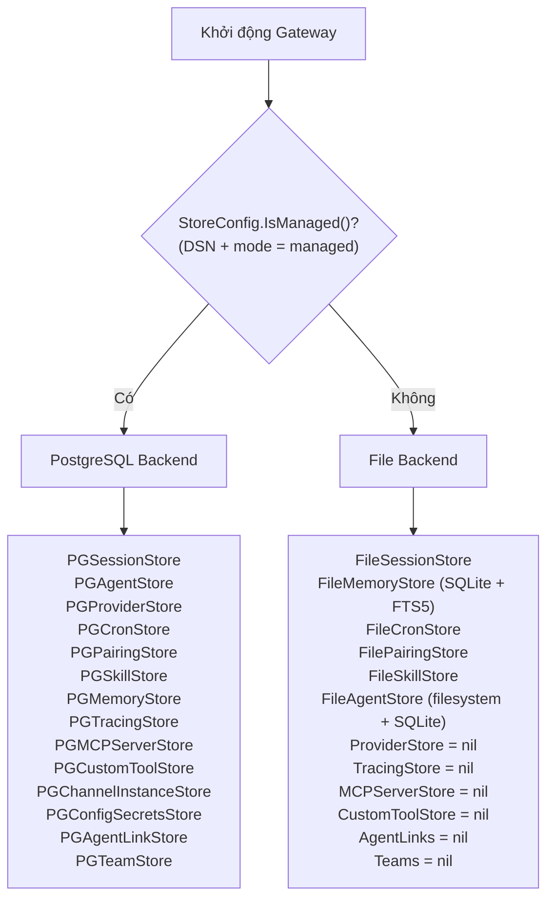
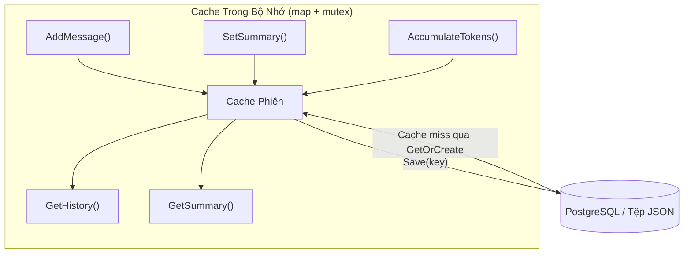
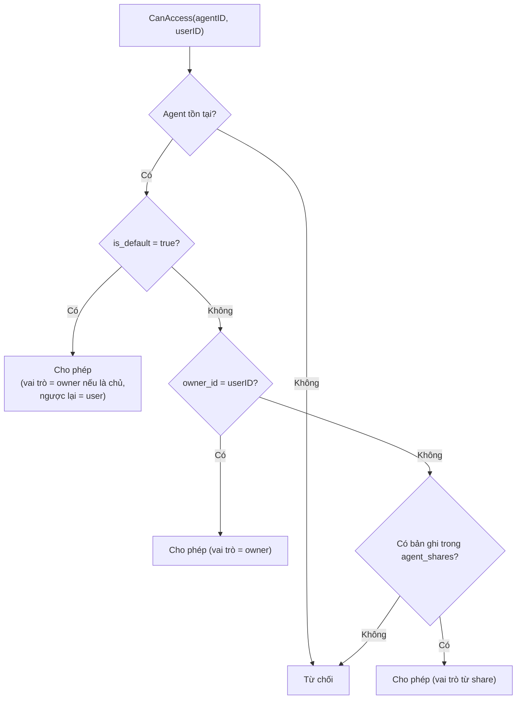
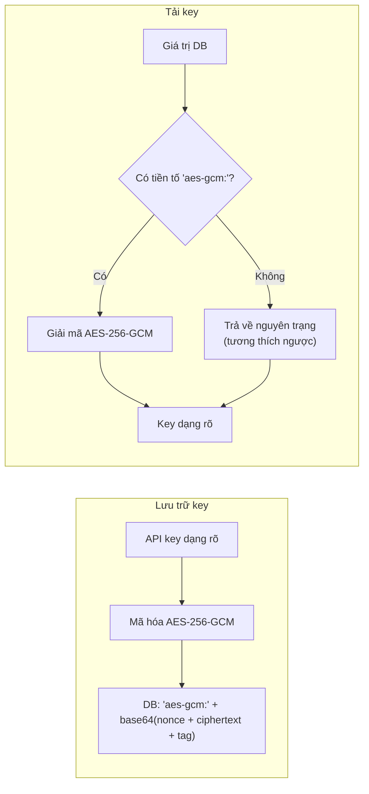
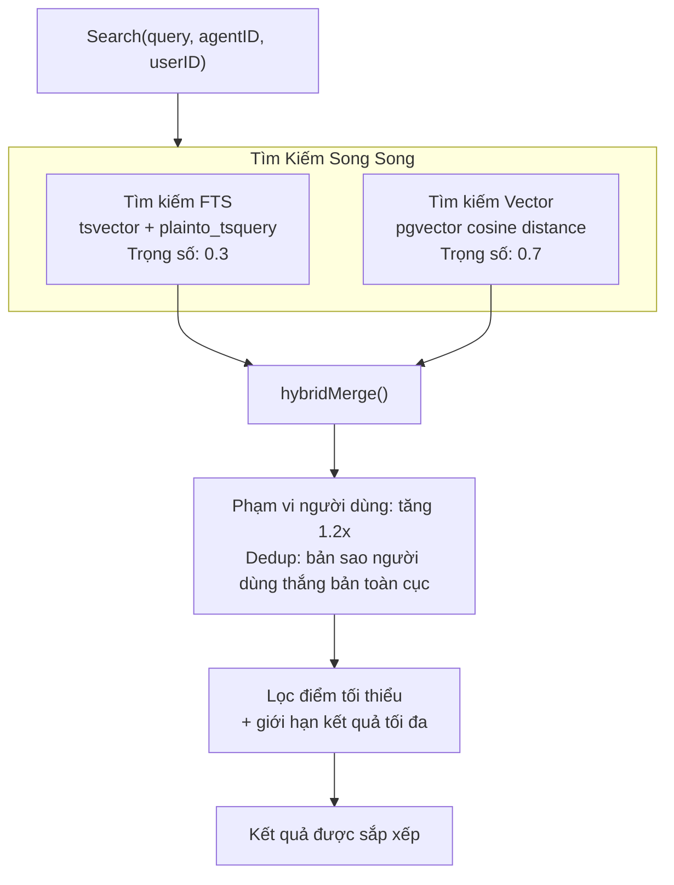
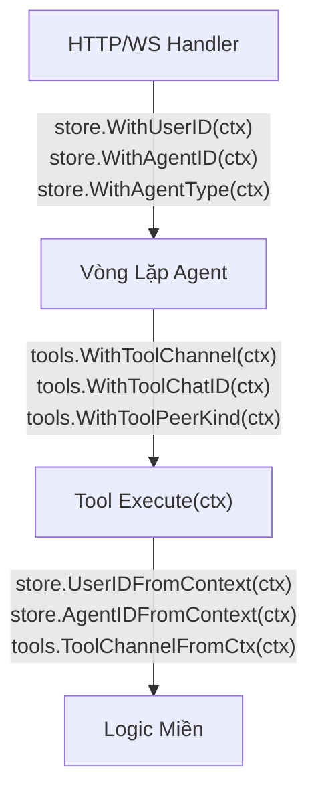

# 06 - Store Layer và Data Model

Store layer trừu tượng hóa toàn bộ việc lưu trữ sau các giao diện Go, cho phép cùng một core engine chạy với bộ lưu trữ dựa trên tệp (standalone mode) hoặc PostgreSQL (managed mode). Mỗi giao diện store có các triển khai độc lập, và hệ thống xác định backend nào sẽ sử dụng dựa trên cấu hình khi khởi động.

---

## 1. Định Tuyến Store Layer



---

## 2. Bản Đồ Giao Diện Store

Cấu trúc `Stores` là container cấp cao nhất chứa tất cả các backend lưu trữ. Trong standalone mode, các store chỉ dùng cho managed được đặt là `nil`.

| Giao diện | Triển khai Standalone | Triển khai Managed | Chế độ |
|-----------|-----------------------|-------------------|--------|
| SessionStore | `FileSessionStore` qua `sessions.Manager` | `PGSessionStore` | Cả hai |
| MemoryStore | `FileMemoryStore` (SQLite + FTS5 + embeddings) | `PGMemoryStore` (tsvector + pgvector) | Cả hai |
| CronStore | `FileCronStore` | `PGCronStore` | Cả hai |
| PairingStore | `FilePairingStore` qua `pairing.Service` | `PGPairingStore` | Cả hai |
| SkillStore | `FileSkillStore` qua `skills.Loader` | `PGSkillStore` | Cả hai |
| AgentStore | `FileAgentStore` (filesystem + SQLite) | `PGAgentStore` | Cả hai |
| ProviderStore | `nil` | `PGProviderStore` | Chỉ Managed |
| TracingStore | `nil` | `PGTracingStore` | Chỉ Managed |
| MCPServerStore | `nil` | `PGMCPServerStore` | Chỉ Managed |
| CustomToolStore | `nil` | `PGCustomToolStore` | Chỉ Managed |
| ChannelInstanceStore | `nil` | `PGChannelInstanceStore` | Chỉ Managed |
| ConfigSecretsStore | `nil` | `PGConfigSecretsStore` | Chỉ Managed |
| AgentLinkStore | `nil` | `PGAgentLinkStore` | Chỉ Managed |
| TeamStore | `nil` | `PGTeamStore` | Chỉ Managed |

### AgentStore Standalone (FileAgentStore)

Trong standalone mode, `FileAgentStore` cung cấp tệp context và hồ sơ theo người dùng mà không cần PostgreSQL. Nó kết hợp lưu trữ filesystem (tệp cấp agent như SOUL.md) với SQLite (`~/.goclaw/data/agents.db`) cho dữ liệu theo người dùng:

| Dữ liệu | Lưu trữ |
|---------|---------|
| Metadata agent | Trong bộ nhớ từ `config.json` |
| Tệp cấp agent (SOUL.md, IDENTITY.md, ...) | Filesystem tại workspace root |
| Tệp theo người dùng (USER.md, BOOTSTRAP.md) | SQLite `user_context_files` |
| Hồ sơ người dùng | SQLite `user_profiles` |
| Group file writers | SQLite `group_file_writers` |

UUID agent sử dụng UUID v5 (tất định): `uuid.NewSHA1(namespace, "goclaw-standalone:{agentKey}")` -- ổn định qua các lần khởi động lại mà không cần sequence database.

---

## 3. Cache Phiên

Store phiên sử dụng cache ghi trễ trong bộ nhớ để giảm thiểu I/O database trong vòng lặp tool agent. Mọi đọc và ghi đều diễn ra trong bộ nhớ; dữ liệu chỉ được flush đến backend lưu trữ khi `Save()` được gọi vào cuối một lần chạy.



### Vòng Đời

1. **GetOrCreate(key)**: Kiểm tra cache; nếu cache miss, tải từ DB vào cache; trả về dữ liệu phiên.
2. **AddMessage/SetSummary/AccumulateTokens**: Chỉ cập nhật cache trong bộ nhớ (không ghi DB).
3. **Save(key)**: Chụp ảnh dữ liệu dưới read lock, flush đến DB qua UPDATE.
4. **Delete(key)**: Xóa khỏi cả cache và DB. `List()` luôn đọc trực tiếp từ DB.

### Định Dạng Khóa Phiên

| Loại | Định dạng | Ví dụ |
|------|----------|-------|
| DM | `agent:{agentId}:{channel}:direct:{peerId}` | `agent:default:telegram:direct:386246614` |
| Group | `agent:{agentId}:{channel}:group:{groupId}` | `agent:default:telegram:group:-100123456` |
| Subagent | `agent:{agentId}:subagent:{label}` | `agent:default:subagent:my-task` |
| Cron | `agent:{agentId}:cron:{jobId}:run:{runId}` | `agent:default:cron:reminder:run:abc123` |
| Main | `agent:{agentId}:{mainKey}` | `agent:default:main` |

### Lưu Trữ Dựa Trên Tệp (Standalone)

- Khởi động: `loadAll()` đọc tất cả tệp `.json` vào bộ nhớ
- Lưu: tệp tạm + đổi tên (ghi nguyên tử, ngăn hỏng dữ liệu khi crash)
- Tên tệp: khóa phiên với `:` thay bằng `_`, cộng đuôi `.json`

---

## 4. Kiểm Soát Truy Cập Agent

Trong managed mode, quyền truy cập agent được kiểm tra qua pipeline 4 bước.



Bảng `agent_shares` lưu `UNIQUE(agent_id, user_id)` với các vai trò: `user`, `admin`, `operator`.

`ListAccessible(userID)` truy vấn: `owner_id = ? OR is_default = true OR id IN (SELECT agent_id FROM agent_shares WHERE user_id = ?)`.

---

## 5. Mã Hóa API Key

Các API key trong bảng `llm_providers` và `mcp_servers` được mã hóa bằng AES-256-GCM trước khi lưu trữ.



`GOCLAW_ENCRYPTION_KEY` chấp nhận ba định dạng:
- **Hex**: 64 ký tự (giải mã thành 32 byte)
- **Base64**: 44 ký tự (giải mã thành 32 byte)
- **Raw**: 32 ký tự (32 byte trực tiếp)

---

## 6. Tìm Kiếm Memory Lai

Tìm kiếm memory kết hợp tìm kiếm toàn văn (FTS) và độ tương đồng vector trong một kết hợp có trọng số.



### Quy Tắc Kết Hợp

1. Chuẩn hóa điểm FTS về [0, 1] (chia cho điểm cao nhất)
2. Điểm vector đã trong [0, 1] (cosine similarity)
3. Điểm kết hợp: `vec_score * 0.7 + fts_score * 0.3` cho các chunk được cả hai tìm thấy
4. Khi chỉ một kênh trả về kết quả, trọng số của nó tự điều chỉnh thành 1.0
5. Kết quả theo người dùng nhận tăng 1.2x
6. Deduplication: nếu một chunk tồn tại trong cả phạm vi toàn cục lẫn người dùng, phiên bản người dùng thắng

### Dự Phòng

Khi FTS không trả về kết quả (ví dụ: truy vấn đa ngôn ngữ), một dự phòng `likeSearch()` chạy các truy vấn ILIKE dùng tối đa 5 từ khóa (tối thiểu 3 ký tự mỗi từ), được phạm vi hóa đến chỉ mục của agent.

### Standalone vs Managed

| Khía cạnh | Standalone | Managed |
|-----------|-----------|---------|
| Engine FTS | SQLite FTS5 | PostgreSQL tsvector |
| Vector | Cache embedding | pgvector extension |
| Hàm tìm kiếm | `plainto_tsquery('simple', ...)` | Như nhau |
| Toán tử khoảng cách | N/A | `<=>` (cosine) |

---

## 7. Định Tuyến Context Files

Các tệp context được lưu trong hai bảng và định tuyến dựa trên loại agent.

### Bảng

| Bảng | Phạm vi | Khóa duy nhất |
|------|---------|--------------|
| `agent_context_files` | Cấp agent | `(agent_id, file_name)` |
| `user_context_files` | Theo người dùng | `(agent_id, user_id, file_name)` |

### Định Tuyến Theo Loại Agent

| Loại Agent | Tệp Cấp Agent | Tệp Theo Người Dùng |
|-----------|--------------|---------------------|
| `open` | Chỉ fallback template | Tất cả 7 tệp (SOUL, IDENTITY, AGENTS, TOOLS, HEARTBEAT, BOOTSTRAP, USER) |
| `predefined` | 6 tệp (SOUL, IDENTITY, AGENTS, TOOLS, HEARTBEAT, BOOTSTRAP) | Chỉ USER.md |

`ContextFileInterceptor` kiểm tra loại agent từ context và định tuyến các thao tác đọc/ghi tương ứng. Với agent open, tệp theo người dùng được ưu tiên với agent-level làm fallback.

---

## 8. MCP Server Store

MCP server store quản lý cấu hình server tool bên ngoài và cấp quyền truy cập.

### Bảng

| Bảng | Mục đích |
|------|---------|
| `mcp_servers` | Cấu hình server (tên, transport, command/URL, API key được mã hóa) |
| `mcp_agent_grants` | Cấp quyền theo agent với danh sách cho phép/từ chối tool |
| `mcp_user_grants` | Cấp quyền theo người dùng với danh sách cho phép/từ chối tool |
| `mcp_access_requests` | Các yêu cầu truy cập đang chờ/đã phê duyệt/đã từ chối |

### Loại Transport

| Transport | Trường Sử Dụng |
|-----------|---------------|
| `stdio` | `command`, `args` (JSONB), `env` (JSONB) |
| `sse` | `url`, `headers` (JSONB) |
| `streamable-http` | `url`, `headers` (JSONB) |

`ListAccessible(agentID, userID)` trả về tất cả MCP server mà tổ hợp agent+user đã cho có thể truy cập, với danh sách cho phép/từ chối tool hiệu quả được kết hợp từ cả cấp quyền agent lẫn người dùng.

---

## 9. Custom Tool Store

Các định nghĩa tool động được lưu trong PostgreSQL. Mỗi tool định nghĩa một template lệnh shell mà LLM có thể gọi tại runtime.

### Bảng: `custom_tools`

| Cột | Kiểu | Mô tả |
|-----|------|-------|
| `id` | UUID v7 | Khóa chính |
| `name` | VARCHAR | Tên tool duy nhất |
| `description` | TEXT | Mô tả tool cho LLM |
| `parameters` | JSONB | JSON Schema cho tham số tool |
| `command` | TEXT | Template lệnh shell với placeholder `{{.key}}` |
| `working_dir` | VARCHAR | Thư mục làm việc tùy chọn |
| `timeout_seconds` | INT | Thời gian chờ thực thi (mặc định 60) |
| `env` | BYTEA | Biến môi trường được mã hóa (AES-256-GCM) |
| `agent_id` | UUID | `NULL` = tool toàn cục, UUID = tool theo agent |
| `enabled` | BOOLEAN | Bật/tắt mềm |
| `created_by` | VARCHAR | Dấu vết kiểm toán |

**Phân vùng**: Các tool toàn cục (`agent_id IS NULL`) được tải khi khởi động vào registry toàn cục. Các tool theo agent được tải theo yêu cầu khi agent được xác định, sử dụng registry được nhân bản để tránh làm ô nhiễm registry toàn cục.

---

## 10. Agent Link Store

Agent link store quản lý quyền ủy quyền giữa các agent -- các cạnh có hướng kiểm soát agent nào có thể ủy quyền cho agent nào.

### Bảng: `agent_links`

| Cột | Kiểu | Mô tả |
|-----|------|-------|
| `id` | UUID v7 | Khóa chính |
| `source_agent_id` | UUID | Agent có thể ủy quyền (FK → agents) |
| `target_agent_id` | UUID | Agent được ủy quyền (FK → agents) |
| `direction` | VARCHAR(20) | `outbound` (chỉ A→B), `bidirectional` (A↔B) |
| `team_id` | UUID | Khác nil = tự động tạo bởi thiết lập team (FK → agent_teams, SET NULL khi xóa) |
| `description` | TEXT | Mô tả liên kết |
| `max_concurrent` | INT | Giới hạn đồng thời mỗi liên kết (mặc định 3) |
| `settings` | JSONB | Danh sách từ chối/cho phép theo người dùng để kiểm soát truy cập chi tiết |
| `status` | VARCHAR(20) | `active` hoặc `disabled` |
| `created_by` | VARCHAR | Dấu vết kiểm toán |

**Ràng buộc**: `UNIQUE(source_agent_id, target_agent_id)`, `CHECK (source_agent_id != target_agent_id)`

### Các Cột Tìm Kiếm Agent (migration 000002)

Bảng `agents` có thêm ba cột để khám phá agent trong quá trình ủy quyền:

| Cột | Kiểu | Mục đích |
|-----|------|---------|
| `frontmatter` | TEXT | Tóm tắt chuyên môn ngắn (khác với `other_config.description` là prompt triệu hồi) |
| `tsv` | TSVECTOR | Tự động tạo từ `display_name + frontmatter`, được đánh chỉ mục GIN |
| `embedding` | VECTOR(1536) | Để tìm kiếm cosine similarity, được đánh chỉ mục HNSW |

### Giao Diện AgentLinkStore (12 phương thức)

- **CRUD**: `CreateLink`, `DeleteLink`, `UpdateLink`, `GetLink`
- **Truy vấn**: `ListLinksFrom(agentID)`, `ListLinksTo(agentID)`
- **Quyền**: `CanDelegate(from, to)`, `GetLinkBetween(from, to)` (trả về liên kết đầy đủ với Settings để kiểm tra theo người dùng)
- **Khám phá**: `DelegateTargets(agentID)` (tất cả đích với agent_key + display_name được kết nối cho DELEGATION.md), `SearchDelegateTargets` (FTS), `SearchDelegateTargetsByEmbedding` (vector cosine)

### Bảng: `delegation_history`

| Cột | Kiểu | Mô tả |
|-----|------|-------|
| `id` | UUID v7 | Khóa chính |
| `source_agent_id` | UUID | Agent ủy quyền |
| `target_agent_id` | UUID | Agent đích |
| `team_id` | UUID | Context team (nullable) |
| `team_task_id` | UUID | Nhiệm vụ team liên quan (nullable) |
| `user_id` | VARCHAR | Người dùng đã kích hoạt ủy quyền |
| `task` | TEXT | Mô tả nhiệm vụ gửi đến agent đích |
| `mode` | VARCHAR(10) | `sync` hoặc `async` |
| `status` | VARCHAR(20) | `completed`, `failed`, `cancelled` |
| `result` | TEXT | Phản hồi của agent đích |
| `error` | TEXT | Thông báo lỗi khi thất bại |
| `iterations` | INT | Số lần lặp LLM |
| `trace_id` | UUID | Trace liên kết để quan sát |
| `duration_ms` | INT | Thời gian thực thi |
| `completed_at` | TIMESTAMPTZ | Thời điểm hoàn thành |

Mọi ủy quyền sync và async đều được tự động lưu tại đây qua `SaveDelegationHistory()`. Kết quả được cắt bớt cho transport WS (500 rune cho danh sách, 8000 rune cho chi tiết).

---

## 11. Team Store

Team store quản lý các nhóm agent cộng tác đa agent với bảng nhiệm vụ dùng chung, hộp thư peer-to-peer và định tuyến handoff.

### Bảng

| Bảng | Mục đích | Cột chính |
|------|---------|----------|
| `agent_teams` | Định nghĩa team | `name`, `lead_agent_id` (FK → agents), `status`, `settings` (JSONB) |
| `agent_team_members` | Thành viên team | PK `(team_id, agent_id)`, `role` (lead/member) |
| `team_tasks` | Bảng nhiệm vụ dùng chung | `subject`, `status` (pending/in_progress/completed/blocked), `owner_agent_id`, `blocked_by` (UUID[]), `priority`, `result`, `tsv` (FTS) |
| `team_messages` | Hộp thư peer-to-peer | `from_agent_id`, `to_agent_id` (NULL = broadcast), `content`, `message_type` (chat/broadcast), `read` |
| `handoff_routes` | Override định tuyến đang hoạt động | UNIQUE `(channel, chat_id)`, `from_agent_key`, `to_agent_key`, `reason` |

### Giao Diện TeamStore (22 phương thức)

**Team CRUD**: `CreateTeam`, `GetTeam`, `DeleteTeam`, `ListTeams`

**Thành viên**: `AddMember`, `RemoveMember`, `ListMembers`, `GetTeamForAgent` (tìm team theo agent)

**Nhiệm vụ**: `CreateTask`, `UpdateTask`, `ListTasks` (sắp xếp theo: priority/newest, lọc status: active/completed/all), `GetTask`, `SearchTasks` (FTS trên subject+description), `ClaimTask`, `CompleteTask`

**Lịch Sử Ủy Quyền**: `SaveDelegationHistory`, `ListDelegationHistory` (với tùy chọn lọc), `GetDelegationHistory`

**Handoff Routes**: `SetHandoffRoute`, `GetHandoffRoute`, `ClearHandoffRoute`

**Tin Nhắn**: `SendMessage`, `GetUnread`, `MarkRead`

### Nhận Nhiệm Vụ Nguyên Tử

Việc hai agent giành cùng một nhiệm vụ được ngăn chặn ở cấp database:

```sql
UPDATE team_tasks
SET status = 'in_progress', owner_agent_id = $1
WHERE id = $2 AND status = 'pending' AND owner_agent_id IS NULL
```

Cập nhật một hàng = đã nhận. Không có hàng = người khác đã lấy. Khóa cấp hàng, không cần mutex phân tán.

### Phụ Thuộc Nhiệm Vụ

Các nhiệm vụ có thể khai báo `blocked_by` (mảng UUID) trỏ đến các nhiệm vụ tiên quyết. Khi một nhiệm vụ được hoàn thành qua `CompleteTask`, tất cả các nhiệm vụ phụ thuộc mà các blocker của chúng đều đã hoàn thành sẽ tự động được mở khóa (chuyển trạng thái từ `blocked` sang `pending`).

---

## 12. Database Schema

Tất cả bảng sử dụng UUID v7 (có thứ tự thời gian) làm khóa chính qua `GenNewID()`.

```mermaid
flowchart TD
    subgraph Providers
        LP["llm_providers"] --> LM["llm_models"]
    end

    subgraph Agents
        AG["agents"] --> AS["agent_shares"]
        AG --> ACF["agent_context_files"]
        AG --> UCF["user_context_files"]
        AG --> UAP["user_agent_profiles"]
    end

    subgraph "Agent Links"
        AG --> AL["agent_links"]
        AL --> DH["delegation_history"]
    end

    subgraph Teams
        AT["agent_teams"] --> ATM["agent_team_members"]
        AT --> TT["team_tasks"]
        AT --> TM["team_messages"]
    end

    subgraph Handoff
        HR["handoff_routes"]
    end

    subgraph Sessions
        SE["sessions"]
    end

    subgraph Memory
        MD["memory_documents"] --> MC["memory_chunks"]
    end

    subgraph Cron
        CJ["cron_jobs"] --> CRL["cron_run_logs"]
    end

    subgraph Pairing
        PR["pairing_requests"]
        PD["paired_devices"]
    end

    subgraph Skills
        SK["skills"] --> SAG["skill_agent_grants"]
        SK --> SUG["skill_user_grants"]
    end

    subgraph Tracing
        TR["traces"] --> SP["spans"]
    end

    subgraph MCP
        MS["mcp_servers"] --> MAG["mcp_agent_grants"]
        MS --> MUG["mcp_user_grants"]
        MS --> MAR["mcp_access_requests"]
    end

    subgraph "Custom Tools"
        CT["custom_tools"]
    end
```



### Các Bảng Chính

| Bảng | Mục đích | Cột chính |
|------|---------|----------|
| `agents` | Định nghĩa agent | `agent_key` (UNIQUE), `owner_id`, `agent_type` (open/predefined), `is_default`, `frontmatter`, `tsv`, `embedding`, xóa mềm qua `deleted_at` |
| `agent_shares` | Chia sẻ RBAC agent | UNIQUE(agent_id, user_id), `role` (user/admin/operator) |
| `agent_context_files` | Context cấp agent | UNIQUE(agent_id, file_name) |
| `user_context_files` | Context theo người dùng | UNIQUE(agent_id, user_id, file_name) |
| `user_agent_profiles` | Theo dõi người dùng | `first_seen_at`, `last_seen_at`, `workspace` |
| `agent_links` | Quyền ủy quyền giữa agent | UNIQUE(source, target), `direction`, `max_concurrent`, `settings` (JSONB) |
| `agent_teams` | Định nghĩa team | `name`, `lead_agent_id`, `status`, `settings` (JSONB) |
| `agent_team_members` | Thành viên team | PK(team_id, agent_id), `role` (lead/member) |
| `team_tasks` | Bảng nhiệm vụ dùng chung | `subject`, `status`, `owner_agent_id`, `blocked_by` (UUID[]), `tsv` (FTS) |
| `team_messages` | Hộp thư peer-to-peer | `from_agent_id`, `to_agent_id`, `message_type`, `read` |
| `delegation_history` | Bản ghi ủy quyền đã lưu | `source_agent_id`, `target_agent_id`, `mode`, `status`, `result`, `trace_id` |
| `handoff_routes` | Override định tuyến đang hoạt động | UNIQUE(channel, chat_id), `from_agent_key`, `to_agent_key` |
| `sessions` | Lịch sử hội thoại | `session_key` (UNIQUE), `messages` (JSONB), `summary`, số lượng token |
| `memory_documents` | Tài liệu memory | UNIQUE(agent_id, COALESCE(user_id, ''), path) |
| `memory_chunks` | Văn bản được chunk + embedding | `embedding` (VECTOR), `tsv` (TSVECTOR) |
| `llm_providers` | Cấu hình provider | `api_key` (mã hóa AES-256-GCM) |
| `traces` | Trace lời gọi LLM | `agent_id`, `user_id`, `status`, `parent_trace_id`, số lượng token tổng hợp |
| `spans` | Thao tác riêng lẻ | `span_type` (llm_call, tool_call, agent, embedding), `parent_span_id` |
| `skills` | Định nghĩa skill | Nội dung, metadata, cấp quyền |
| `cron_jobs` | Nhiệm vụ đã lên lịch | `schedule_kind` (at/every/cron), `payload` (JSONB) |
| `mcp_servers` | Cấu hình MCP server | `transport`, `api_key` (được mã hóa), `tool_prefix` |
| `custom_tools` | Định nghĩa tool động | `command` (template), `agent_id` (NULL = toàn cục), `env` (được mã hóa) |

### Migrations

| Migration | Mục đích |
|-----------|---------|
| `000001_init_schema` | Các bảng cơ bản (agents, sessions, providers, memory, cron, pairing, skills, traces, MCP, custom tools) |
| `000002_agent_links` | Bảng `agent_links` + `frontmatter`, `tsv`, `embedding` trên agents + `parent_trace_id` trên traces |
| `000003_agent_teams` | `agent_teams`, `agent_team_members`, `team_tasks`, `team_messages` + `team_id` trên agent_links |
| `000004_teams_v2` | FTS trên `team_tasks` (cột tsv) + bảng `delegation_history` |
| `000005_phase4` | Bảng `handoff_routes` |

### Các Extension PostgreSQL Bắt Buộc

- **pgvector**: Tìm kiếm độ tương đồng vector cho memory embeddings
- **pgcrypto**: Các hàm tạo UUID

---

## 13. Truyền Bá Context

Metadata chạy qua `context.Context` thay vì trạng thái có thể thay đổi, đảm bảo an toàn thread qua các lần chạy agent đồng thời.



### Các Khóa Context Store

| Khóa | Kiểu | Mục đích |
|------|------|---------|
| `goclaw_user_id` | string | ID người dùng bên ngoài (ví dụ: Telegram user ID) |
| `goclaw_agent_id` | uuid.UUID | UUID agent (managed mode) |
| `goclaw_agent_type` | string | Loại agent: `"open"` hoặc `"predefined"` |
| `goclaw_sender_id` | string | ID người gửi cá nhân gốc (trong chat nhóm, `user_id` được phạm vi hóa theo nhóm nhưng `sender_id` giữ lại người thực sự) |

### Các Khóa Context Tool

| Khóa | Mục đích |
|------|---------|
| `tool_channel` | Kênh hiện tại (telegram, discord, v.v.) |
| `tool_chat_id` | Định danh chat/hội thoại |
| `tool_peer_kind` | Loại peer: `"direct"` hoặc `"group"` |
| `tool_sandbox_key` | Khóa phạm vi Docker sandbox |
| `tool_async_cb` | Callback cho thực thi tool async |
| `tool_workspace` | Thư mục workspace theo người dùng (được tiêm bởi vòng lặp agent, đọc bởi các tool filesystem/shell) |

---

## 14. Các Mẫu PostgreSQL Chính

### Database Driver

Tất cả PG store sử dụng `database/sql` với driver `pgx/v5/stdlib`. Không sử dụng ORM -- tất cả truy vấn đều là SQL thô với tham số có vị trí (`$1`, `$2`, ...).

### Cột Nullable

Các cột nullable được xử lý qua con trỏ Go: `*string`, `*int`, `*time.Time`, `*uuid.UUID`. Các hàm helper `nilStr()`, `nilInt()`, `nilUUID()`, `nilTime()` chuyển đổi giá trị zero thành `nil` để chèn SQL gọn gàng.

### Cập Nhật Động

`execMapUpdate()` xây dựng câu lệnh UPDATE động từ `map[string]any` gồm các cặp cột-giá trị. Điều này tránh việc viết truy vấn UPDATE riêng biệt cho mọi tổ hợp trường có thể cập nhật.

### Mẫu Upsert

Tất cả thao tác "tạo hoặc cập nhật" sử dụng `INSERT ... ON CONFLICT DO UPDATE`, đảm bảo tính idempotent:

| Thao tác | Khóa xung đột |
|---------|--------------|
| `SetAgentContextFile` | `(agent_id, file_name)` |
| `SetUserContextFile` | `(agent_id, user_id, file_name)` |
| `ShareAgent` | `(agent_id, user_id)` |
| `PutDocument` (memory) | `(agent_id, COALESCE(user_id, ''), path)` |
| `GrantToAgent` (skill) | `(skill_id, agent_id)` |

### Phát Hiện Hồ Sơ Người Dùng

`GetOrCreateUserProfile` sử dụng thủ thuật `xmax` của PostgreSQL:
- `xmax = 0` sau RETURNING có nghĩa là INSERT thực sự đã xảy ra (người dùng mới) -- kích hoạt seeding tệp context
- `xmax != 0` có nghĩa là UPDATE khi xung đột (người dùng hiện có) -- không cần seeding

### Chèn Span Theo Lô

`BatchCreateSpans` chèn các span theo lô 100. Nếu một lô thất bại, nó dự phòng bằng cách chèn từng span riêng lẻ để ngăn mất dữ liệu.

---

## Tham Chiếu Tệp

| Tệp | Mục đích |
|-----|---------|
| `internal/store/stores.go` | Cấu trúc container `Stores` (tất cả 14 giao diện store) |
| `internal/store/types.go` | `BaseModel`, `StoreConfig`, `GenNewID()` |
| `internal/store/context.go` | Truyền bá context: `WithUserID`, `WithAgentID`, `WithAgentType`, `WithSenderID` |
| `internal/store/session_store.go` | Giao diện `SessionStore`, `SessionData`, `SessionInfo` |
| `internal/store/memory_store.go` | Giao diện `MemoryStore`, `MemorySearchResult`, `EmbeddingProvider` |
| `internal/store/skill_store.go` | Giao diện `SkillStore` |
| `internal/store/agent_store.go` | Giao diện `AgentStore` |
| `internal/store/agent_link_store.go` | Giao diện `AgentLinkStore`, `AgentLinkData`, hằng số liên kết |
| `internal/store/team_store.go` | Giao diện `TeamStore`, `TeamData`, `TeamTaskData`, `DelegationHistoryData`, `HandoffRouteData`, `TeamMessageData` |
| `internal/store/provider_store.go` | Giao diện `ProviderStore` |
| `internal/store/tracing_store.go` | Giao diện `TracingStore`, `TraceData`, `SpanData` |
| `internal/store/mcp_store.go` | Giao diện `MCPServerStore`, các loại cấp quyền, các loại yêu cầu truy cập |
| `internal/store/channel_instance_store.go` | Giao diện `ChannelInstanceStore` |
| `internal/store/config_secrets_store.go` | Giao diện `ConfigSecretsStore` |
| `internal/store/pairing_store.go` | Giao diện `PairingStore` |
| `internal/store/cron_store.go` | Giao diện `CronStore` |
| `internal/store/custom_tool_store.go` | Giao diện `CustomToolStore` |
| `internal/store/file/agents.go` | `FileAgentStore`: backend filesystem + SQLite cho standalone mode |
| `internal/store/pg/factory.go` | Factory PG store: tạo tất cả instance PG store từ connection pool |
| `internal/store/pg/sessions.go` | `PGSessionStore`: cache phiên, Save, GetOrCreate |
| `internal/store/pg/agents.go` | `PGAgentStore`: CRUD, xóa mềm, kiểm soát truy cập |
| `internal/store/pg/agents_context.go` | Thao tác tệp context agent và người dùng |
| `internal/store/pg/agent_links.go` | `PGAgentLinkStore`: CRUD liên kết, quyền, FTS + tìm kiếm vector |
| `internal/store/pg/teams.go` | `PGTeamStore`: teams, tasks (nhận nguyên tử), messages, delegation history, handoff routes |
| `internal/store/pg/memory_docs.go` | `PGMemoryStore`: CRUD tài liệu, đánh chỉ mục, chunking |
| `internal/store/pg/memory_search.go` | Tìm kiếm lai: FTS, vector, dự phòng ILIKE, kết hợp |
| `internal/store/pg/skills.go` | `PGSkillStore`: CRUD skill và cấp quyền |
| `internal/store/pg/skills_grants.go` | Cấp quyền skill cho agent và người dùng |
| `internal/store/pg/mcp_servers.go` | `PGMCPServerStore`: CRUD server, cấp quyền, yêu cầu truy cập |
| `internal/store/pg/channel_instances.go` | `PGChannelInstanceStore`: CRUD instance channel |
| `internal/store/pg/config_secrets.go` | `PGConfigSecretsStore`: bí mật cấu hình được mã hóa |
| `internal/store/pg/custom_tools.go` | `PGCustomToolStore`: CRUD custom tool với env được mã hóa |
| `internal/store/pg/providers.go` | `PGProviderStore`: CRUD provider với key được mã hóa |
| `internal/store/pg/tracing.go` | `PGTracingStore`: traces và spans với chèn theo lô |
| `internal/store/pg/pool.go` | Quản lý connection pool |
| `internal/store/pg/helpers.go` | Helper nullable, helper JSON, `execMapUpdate()` |
| `internal/store/validate.go` | Tiện ích xác thực đầu vào |
| `internal/tools/context_keys.go` | Các khóa context tool bao gồm `WithToolWorkspace` |
