# 07 - Bootstrap, Skills & Memory

Ba hệ thống nền tảng định hình tính cách (Bootstrap), kiến thức (Skills) và khả năng nhớ dài hạn (Memory) của mỗi agent.

### Trách Nhiệm

- Bootstrap: tải tệp context, cắt bớt để vừa cửa sổ context, seeding template cho người dùng mới
- Skills: phân cấp giải quyết 5 tầng, tìm kiếm BM25, hot-reload qua fsnotify
- Memory: chunking, tìm kiếm lai (FTS + vector), flush memory trước khi compaction
- System Prompt: xây dựng 15+ mục theo thứ tự cố định với hai chế độ (full và minimal)

---

## 1. Tệp Bootstrap -- 7 Template Files

Các tệp Markdown được tải khi khởi tạo agent và nhúng vào system prompt. MEMORY.md KHÔNG phải là tệp template bootstrap; đây là tài liệu memory riêng biệt được tải độc lập.

| # | Tệp | Vai trò | Phiên Full | Subagent/Cron |
|---|-----|---------|:----------:|:-------------:|
| 1 | AGENTS.md | Hướng dẫn vận hành, quy tắc memory, hướng dẫn an toàn | Có | Có |
| 2 | SOUL.md | Nhân cách, giọng điệu, ranh giới | Có | Không |
| 3 | TOOLS.md | Ghi chú tool cục bộ (camera, SSH, TTS, v.v.) | Có | Có |
| 4 | IDENTITY.md | Tên agent, sinh vật, cảm giác, emoji | Có | Không |
| 5 | USER.md | Hồ sơ người dùng (tên, múi giờ, sở thích) | Có | Không |
| 6 | HEARTBEAT.md | Danh sách nhiệm vụ kiểm tra định kỳ | Có | Không |
| 7 | BOOTSTRAP.md | Nghi lễ lần đầu chạy (bị xóa sau khi hoàn thành) | Có | Không |

Các phiên subagent và cron chỉ tải AGENTS.md + TOOLS.md (danh sách `minimalAllowlist`).

---

## 2. Pipeline Cắt Bớt

Nội dung bootstrap có thể vượt quá ngân sách cửa sổ context. Một pipeline 4 bước cắt bớt các tệp để vừa, khớp với hành vi của triển khai TypeScript.

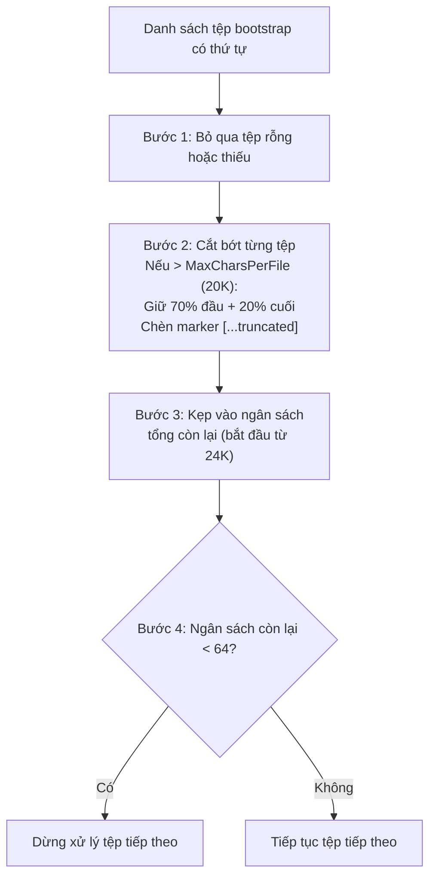

### Giá Trị Mặc Định Cắt Bớt

| Tham số | Giá trị |
|---------|---------|
| MaxCharsPerFile | 20.000 |
| TotalMaxChars | 24.000 |
| MinFileBudget | 64 |
| HeadRatio | 70% |
| TailRatio | 20% |

Khi một tệp bị cắt bớt, một marker được chèn giữa phần đầu và phần cuối:
`[...truncated, read SOUL.md for full content...]`

---

## 3. Seeding -- Tạo Template

Các template được nhúng vào binary qua Go `embed` (thư mục: `internal/bootstrap/templates/`). Seeding tự động tạo các tệp mặc định cho workspace mới hoặc người dùng mới.

```mermaid
flowchart TD
    subgraph "Standalone Mode"
        SA["EnsureWorkspaceFiles()"] --> SA1["Lặp qua các template được nhúng"]
        SA1 --> SA2{"Tệp đã tồn tại?<br/>(kiểm tra nguyên tử O_EXCL)"}
        SA2 -->|Có| SKIP1["Bỏ qua"]
        SA2 -->|Không| CREATE1["Tạo tệp template trên đĩa"]
    end

    subgraph "Standalone Mode -- Theo Người Dùng (FileAgentStore)"
        SU["SeedUserFiles()"] --> SU1{"Loại agent?"}
        SU1 -->|open| SU_OPEN["Seed tất cả 7 tệp vào SQLite"]
        SU1 -->|predefined| SU_PRED["Seed USER.md + BOOTSTRAP.md vào SQLite"]
        SU_OPEN --> SU_CHK{"Hàng đã tồn tại?"}
        SU_PRED --> SU_CHK
        SU_CHK -->|Có| SKIP_SU["Bỏ qua"]
        SU_CHK -->|Không| SU_WRITE["INSERT vào user_context_files"]
    end

    subgraph "Managed Mode -- Cấp Agent"
        SB["SeedToStore()"] --> SB1{"Loại agent = open?"}
        SB1 -->|Có| SKIP_AGENT["Bỏ qua (agent open chỉ dùng per-user)"]
        SB1 -->|Không| SB2["Seed 6 tệp vào agent_context_files<br/>(tất cả trừ BOOTSTRAP.md)"]
        SB2 --> SB3{"Tệp đã có nội dung?"}
        SB3 -->|Có| SKIP2["Bỏ qua"]
        SB3 -->|Không| WRITE2["Ghi template được nhúng"]
    end

    subgraph "Managed Mode -- Theo Người Dùng"
        MC["SeedUserFiles()"] --> MC1{"Loại agent?"}
        MC1 -->|open| OPEN["Seed tất cả 7 tệp vào user_context_files"]
        MC1 -->|predefined| PRED["Seed USER.md + BOOTSTRAP.md vào user_context_files"]
        OPEN --> CHECK{"Tệp đã có nội dung?"}
        PRED --> CHECK
        CHECK -->|Có| SKIP3["Bỏ qua -- không bao giờ ghi đè"]
        CHECK -->|Không| WRITE3["Ghi template được nhúng"]
    end
```

`SeedUserFiles()` là idempotent -- có thể gọi nhiều lần mà không ghi đè nội dung đã được cá nhân hóa.

### Tạo UUID Standalone

Các agent standalone được định nghĩa trong `config.json` mà không có UUID do database tạo. `FileAgentStore` sử dụng UUID v5 (`uuid.NewSHA1(namespace, "goclaw-standalone:{agentKey}")`) để tạo ID tất định từ các khóa agent. Điều này đảm bảo các hàng SQLite cho tệp per-user tồn tại qua các lần khởi động lại mà không cần phối hợp.

### Bootstrap Agent Predefined

Cả standalone và managed mode hiện nay đều seed `BOOTSTRAP.md` cho agent predefined (per-user). Khi chat lần đầu, agent chạy nghi lễ bootstrap (học tên, sở thích), rồi ghi `BOOTSTRAP.md` rỗng để kích hoạt xóa. Việc ghi rỗng để xóa được sắp xếp *trước* khối ghi predefined trong `ContextFileInterceptor` để ngăn vòng lặp bootstrap vô tận.

---

## 4. Định Tuyến Theo Loại Agent

Hai loại agent xác định tệp context nào nằm ở cấp agent so với cấp per-user. Loại agent hiện có sẵn trong cả managed và standalone mode.

| Loại Agent | Tệp Cấp Agent | Tệp Per-User |
|-----------|--------------|-------------|
| `open` | Không có | Tất cả 7 tệp (AGENTS, SOUL, TOOLS, IDENTITY, USER, HEARTBEAT, BOOTSTRAP) |
| `predefined` | 6 tệp (dùng chung cho tất cả người dùng) | USER.md + BOOTSTRAP.md |

Với agent `open`, mỗi người dùng có bộ tệp context đầy đủ riêng. Khi đọc tệp, hệ thống kiểm tra bản sao per-user trước và dự phòng sang bản sao cấp agent nếu không tìm thấy. Với agent `predefined`, tất cả người dùng dùng chung các tệp cấp agent ngoại trừ USER.md (được cá nhân hóa) và BOOTSTRAP.md (nghi lễ lần đầu per-user, bị xóa sau khi hoàn thành).

| Chế độ | Nguồn Loại Agent | Lưu Trữ Per-User |
|--------|-----------------|-----------------|
| Managed | Bảng PostgreSQL `agents` | Bảng `user_context_files` |
| Standalone | Các mục agent trong `config.json` | SQLite qua `FileAgentStore` |

---

## 5. System Prompt -- 17+ Mục

`BuildSystemPrompt()` xây dựng system prompt hoàn chỉnh từ các mục có thứ tự. Hai chế độ kiểm soát mục nào được bao gồm.

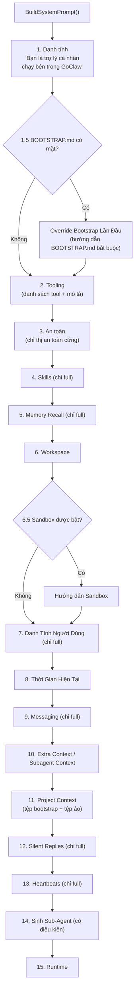

### So Sánh Chế Độ

| Mục | PromptFull | PromptMinimal |
|-----|:----------:|:-------------:|
| 1. Danh tính | Có | Có |
| 1.5. Bootstrap Override | Có điều kiện | Có điều kiện |
| 2. Tooling | Có | Có |
| 3. An toàn | Có | Có |
| 4. Skills | Có | Không |
| 5. Memory Recall | Có | Không |
| 6. Workspace | Có | Có |
| 6.5. Sandbox | Có điều kiện | Có điều kiện |
| 7. Danh tính người dùng | Có | Không |
| 8. Thời gian hiện tại | Có | Có |
| 9. Messaging | Có | Không |
| 10. Extra Context | Có điều kiện | Có điều kiện |
| 11. Project Context | Có | Có |
| 12. Silent Replies | Có | Không |
| 13. Heartbeats | Có | Không |
| 14. Sinh Sub-Agent | Có điều kiện | Có điều kiện |
| 15. Runtime | Có | Có |

Các tệp context được bọc trong thẻ XML `<context_file>` với phần mở đầu phòng thủ hướng dẫn model tuân theo hướng dẫn giọng điệu/nhân cách nhưng không thực thi các hướng dẫn mâu thuẫn với chỉ thị cốt lõi. ExtraPrompt được bọc trong thẻ `<extra_context>` để cô lập context.

### Tệp Context Ảo (DELEGATION.md, TEAM.md)

Hai tệp được resolver tiêm vào hệ thống thay vì lưu trên đĩa hoặc trong DB:

| Tệp | Điều kiện tiêm | Nội dung |
|-----|---------------|---------|
| `DELEGATION.md` | Agent có liên kết agent thủ công (không thuộc team) | ≤15 đích: danh sách tĩnh. >15 đích: hướng dẫn tìm kiếm cho tool `delegate_search` |
| `TEAM.md` | Agent là thành viên của một team | Tên team, vai trò, danh sách đồng đội kèm mô tả, câu quy trình làm việc |

Các tệp ảo được hiển thị trong thẻ `<system_context>` (không phải `<context_file>`) để LLM không cố đọc hoặc ghi chúng như tệp thực. Trong quá trình bootstrap (lần đầu chạy), cả hai tệp đều bị bỏ qua để tránh lãng phí token khi agent nên tập trung vào onboarding.

---

## 6. Kết Hợp Tệp Context

Với **agent open**, các tệp context per-user (từ `user_context_files`) được kết hợp với tệp context cơ sở (từ resolver) tại runtime. Tệp per-user ghi đè lên tệp cùng tên ở cơ sở, nhưng các tệp chỉ có ở cơ sở được giữ nguyên.

```
Tệp cơ sở (resolver):     AGENTS.md, DELEGATION.md, TEAM.md
Tệp per-user (DB/SQLite): AGENTS.md, SOUL.md, TOOLS.md, USER.md, ...
Kết quả kết hợp:          SOUL.md, TOOLS.md, USER.md, ..., AGENTS.md (per-user), DELEGATION.md ✓, TEAM.md ✓
```

Điều này đảm bảo các tệp ảo do resolver tiêm (`DELEGATION.md`, `TEAM.md`) tồn tại song song với các tùy chỉnh per-user. Logic kết hợp nằm trong `internal/agent/loop_history.go`.

---

## 7. Triệu Hồi Agent (Managed Mode)

Tạo agent predefined yêu cầu 5 tệp context (SOUL.md, IDENTITY.md, AGENTS.md, TOOLS.md, HEARTBEAT.md) với các quy ước định dạng cụ thể. Triệu hồi agent tạo ra tất cả 5 tệp từ mô tả ngôn ngữ tự nhiên trong một lời gọi LLM duy nhất.

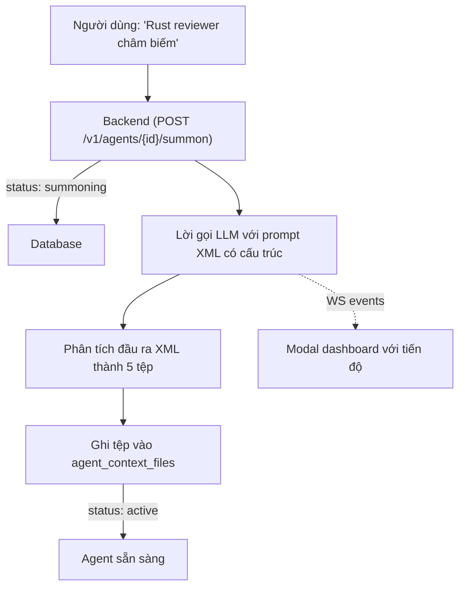

LLM xuất ra XML có cấu trúc với mỗi tệp trong một khối được gắn thẻ. Việc phân tích được thực hiện phía server trong `internal/http/summoner.go`. Nếu LLM thất bại (timeout, XML sai, không có provider), agent dự phòng sang các tệp template được nhúng và vẫn trở thành active. Người dùng có thể thử lại qua "Edit with AI" sau.

**Tại sao không dùng `write_file`?** `ContextFileInterceptor` chặn việc ghi tệp predefined từ chat theo thiết kế. Bỏ qua điều này sẽ tạo ra lỗ hổng bảo mật. Thay vào đó, trình triệu hồi ghi thẳng vào store -- một lời gọi, không có lần lặp tool.

---

## 8. Skills -- Phân Cấp 5 Tầng

Skills được tải từ nhiều thư mục với thứ tự ưu tiên. Skills tầng cao hơn ghi đè skills tầng thấp hơn cùng tên.

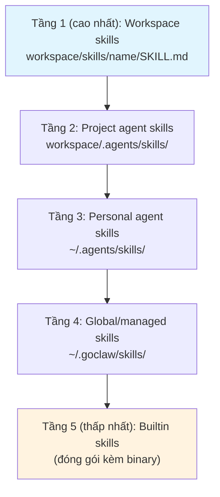

Mỗi thư mục skill chứa tệp `SKILL.md` với frontmatter YAML/JSON (`name`, `description`). Placeholder `{baseDir}` trong nội dung SKILL.md được thay thế bằng đường dẫn tuyệt đối của thư mục skill khi tải.

---

## 9. Skills -- Chế Độ Inline vs Tìm Kiếm

Hệ thống tự động quyết định liệu có nhúng tóm tắt skill trực tiếp vào prompt (chế độ inline) hay hướng dẫn agent dùng tool `skill_search` (chế độ tìm kiếm).

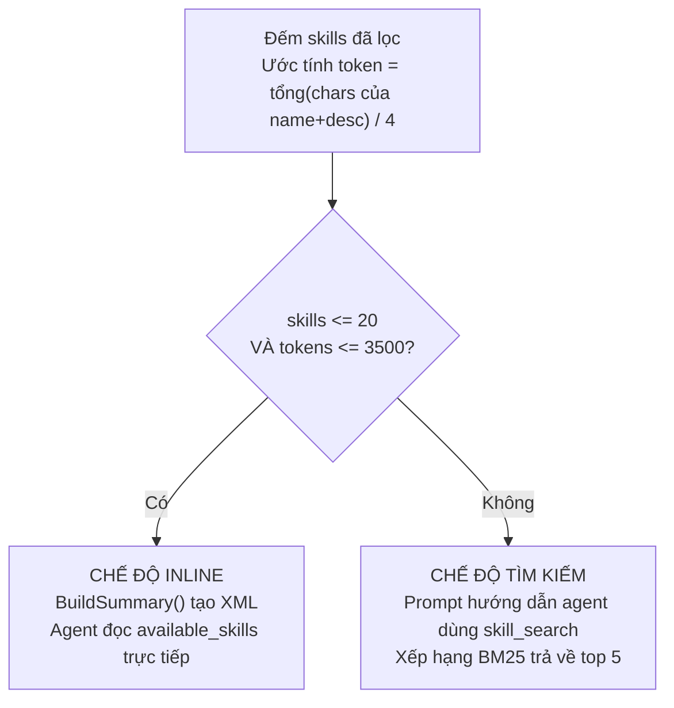

Quyết định này được đánh giá lại mỗi khi system prompt được xây dựng, vì vậy các skill vừa hot-reload ngay lập tức được phản ánh.

---

## 10. Skills -- Tìm Kiếm BM25

Chỉ mục BM25 trong bộ nhớ cung cấp tìm kiếm skill dựa trên từ khóa. Chỉ mục được xây dựng lại lazily mỗi khi phiên bản skill thay đổi.

**Tokenization**: Chuyển văn bản sang chữ thường, thay ký tự không phải chữ/số bằng dấu cách, lọc bỏ token một ký tự.

**Công thức tính điểm**: `IDF(t) x tf(t,d) x (k1 + 1) / (tf(t,d) + k1 x (1 - b + b x |d| / avgDL))`

| Tham số | Giá trị |
|---------|---------|
| k1 | 1.2 |
| b | 0.75 |
| Kết quả tối đa | 5 |

IDF được tính là: `log((N - df + 0.5) / (df + 0.5) + 1)`

---

## 11. Skills -- Tìm Kiếm Embedding (Managed Mode)

Trong managed mode, tìm kiếm skill sử dụng phương pháp lai kết hợp BM25 và độ tương đồng vector.

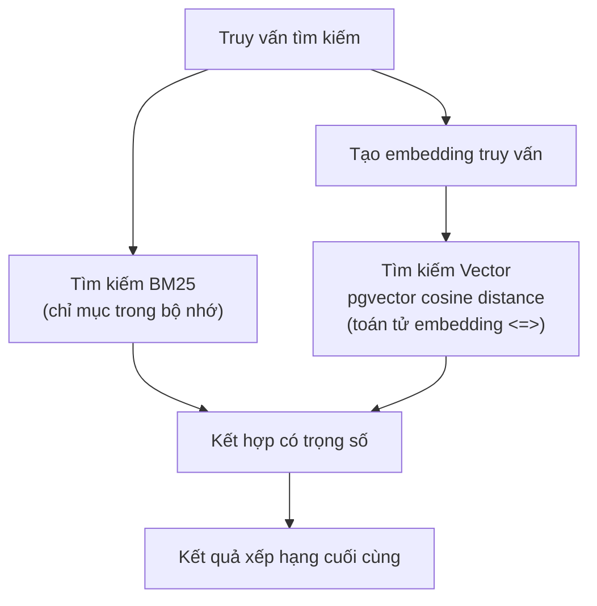

| Thành phần | Trọng số |
|-----------|---------|
| Điểm BM25 | 0.3 |
| Độ tương đồng vector | 0.7 |

**Tự động backfill**: Khi khởi động, `BackfillSkillEmbeddings()` tạo embedding đồng bộ cho bất kỳ skill active nào chưa có embedding.

---

## 12. Cấp Quyền & Khả Năng Hiển Thị Skills (Managed Mode)

Trong managed mode, quyền truy cập skill được kiểm soát qua mô hình khả năng hiển thị 3 tầng với cấp quyền agent và người dùng rõ ràng.

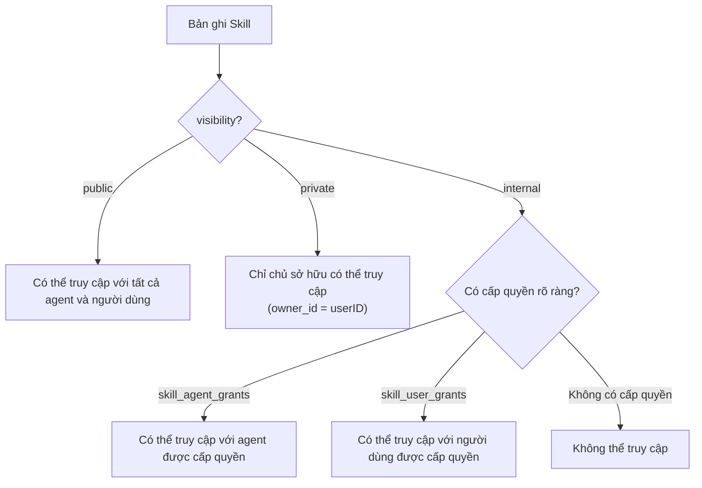

### Mức Khả Năng Hiển Thị

| Khả năng hiển thị | Quy tắc truy cập |
|-----------------|----------------|
| `public` | Tất cả agent và người dùng có thể khám phá và sử dụng skill |
| `private` | Chỉ chủ sở hữu (`skills.owner_id = userID`) có thể truy cập |
| `internal` | Yêu cầu cấp quyền rõ ràng cho agent hoặc người dùng |

### Bảng Cấp Quyền

| Bảng | Khóa | Bổ sung |
|------|------|---------|
| `skill_agent_grants` | `(skill_id, agent_id)` | `pinned_version` để ghim phiên bản theo agent, kiểm toán `granted_by` |
| `skill_user_grants` | `(skill_id, user_id)` | Kiểm toán `granted_by`, ON CONFLICT DO NOTHING cho idempotency |

**Giải quyết**: `ListAccessible(agentID, userID)` thực hiện join DISTINCT qua `skills`, `skill_agent_grants` và `skill_user_grants` với bộ lọc khả năng hiển thị, chỉ trả về các skill active mà người gọi có thể truy cập.

**Tầng 4 Managed-mode**: Trong managed mode, các skill toàn cục (Tầng 4 trong phân cấp) được tải từ bảng PostgreSQL `skills` thay vì filesystem.

---

## 13. Hot-Reload

Trình theo dõi dựa trên fsnotify giám sát tất cả thư mục skill để phát hiện thay đổi tệp SKILL.md.

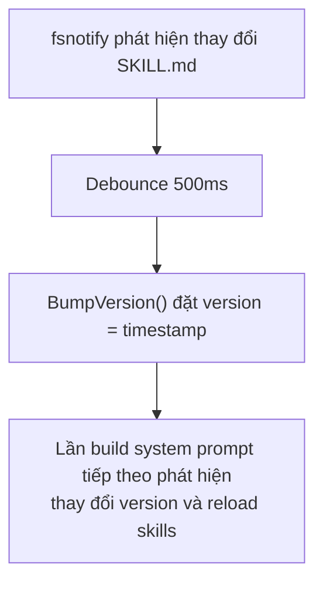

Các thư mục skill mới được tạo trong thư mục được theo dõi sẽ tự động được thêm vào danh sách theo dõi. Cửa sổ debounce (500ms) ngắn hơn trình theo dõi memory (1500ms) vì thay đổi skill nhẹ hơn.

---

## 14. Memory -- Pipeline Đánh Chỉ Mục

Các tài liệu memory được chunk, embedding và lưu trữ cho tìm kiếm lai.

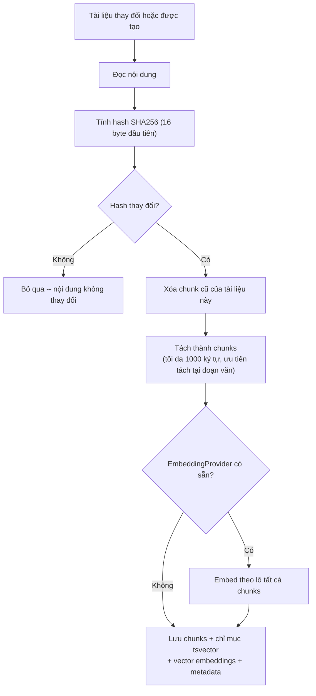

### Quy Tắc Chunking

- Ưu tiên tách tại dòng trống (ngắt đoạn) khi chunk hiện tại đạt nửa `maxChunkLen`
- Flush bắt buộc tại `maxChunkLen` (1000 ký tự)
- Mỗi chunk giữ lại `StartLine` và `EndLine` từ tài liệu nguồn

### Đường Dẫn Memory

- `MEMORY.md` hoặc `memory.md` tại workspace root
- `memory/*.md` (đệ quy, loại trừ `.git`, `node_modules`, v.v.)

---

## 15. Tìm Kiếm Lai

Kết hợp tìm kiếm toàn văn và tìm kiếm vector với kết hợp có trọng số.

```mermaid
flowchart TD
    Q["Search(query)"] --> FTS["Tìm kiếm FTS<br/>Standalone: SQLite FTS5 (BM25)<br/>Managed: tsvector + plainto_tsquery"]
    Q --> VEC["Tìm kiếm Vector<br/>Standalone: cosine similarity<br/>Managed: pgvector (cosine distance)"]
    FTS --> MERGE["hybridMerge()"]
    VEC --> MERGE
    MERGE --> NORM["Chuẩn hóa điểm FTS về 0..1<br/>Điểm vector đã trong 0..1"]
    NORM --> WEIGHT["Tổng có trọng số<br/>textWeight = 0.3<br/>vectorWeight = 0.7"]
    WEIGHT --> BOOST["Phạm vi per-user: tăng 1.2x<br/>Dedup: bản sao người dùng thắng bản toàn cục"]
    BOOST --> RESULT["Kết quả được sắp xếp + lọc"]
```

### So Sánh Standalone vs Managed

| Khía cạnh | Standalone | Managed |
|-----------|-----------|---------|
| Lưu trữ | SQLite + FTS5 | PostgreSQL + tsvector + pgvector |
| FTS | Tokenizer `porter unicode61` | `plainto_tsquery('simple')` |
| Vector | JSON array embedding | pgvector type |
| Phạm vi | Toàn cục (một agent) | Per-agent + per-user |
| File watcher | fsnotify (debounce 1500ms) | Không cần (được hỗ trợ DB) |

Khi cả FTS và tìm kiếm vector đều trả về kết quả, điểm được kết hợp bằng tổng có trọng số. Khi chỉ một kênh trả về kết quả, điểm của nó được dùng trực tiếp (trọng số chuẩn hóa thành 1.0).

---

## 16. Flush Memory -- Trước Compaction

Trước khi lịch sử phiên được compaction (tóm tắt + cắt bớt), agent được cho cơ hội ghi các memory bền vững ra đĩa.

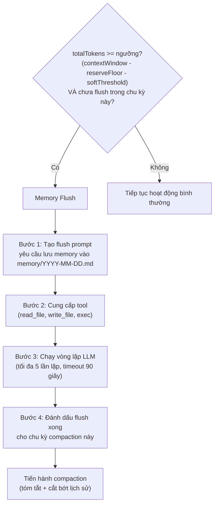

### Giá Trị Mặc Định Flush

| Tham số | Giá trị |
|---------|---------|
| softThresholdTokens | 4.000 |
| reserveTokensFloor | 20.000 |
| Số lần lặp LLM tối đa | 5 |
| Timeout | 90 giây |
| Prompt mặc định | "Store durable memories now." |

Flush là idempotent theo chu kỳ compaction -- sẽ không chạy lại cho đến khi đạt ngưỡng compaction tiếp theo.

---

## Tham Chiếu Tệp

| Tệp | Mô tả |
|-----|-------|
| `internal/bootstrap/files.go` | Hằng số tệp bootstrap, tải, lọc phiên |
| `internal/bootstrap/truncate.go` | Pipeline cắt bớt (tách head/tail, kẹp ngân sách) |
| `internal/bootstrap/seed.go` | Seeding standalone mode (EnsureWorkspaceFiles) |
| `internal/bootstrap/seed_store.go` | Seeding managed mode (SeedToStore, SeedUserFiles) |
| `internal/bootstrap/load_store.go` | Tải tệp context từ DB (LoadFromStore) |
| `internal/bootstrap/templates/*.md` | Các tệp template được nhúng |
| `internal/agent/systemprompt.go` | Bộ xây dựng system prompt (BuildSystemPrompt, 17+ mục) |
| `internal/agent/systemprompt_sections.go` | Các renderer mục, xử lý tệp ảo (DELEGATION.md, TEAM.md) |
| `internal/agent/resolver.go` | Xác định agent, tiêm DELEGATION.md + TEAM.md |
| `internal/agent/loop_history.go` | Kết hợp tệp context (cơ sở + per-user, chỉ cơ sở được giữ) |
| `internal/agent/memoryflush.go` | Logic flush memory (shouldRunMemoryFlush, runMemoryFlush) |
| `internal/store/file/agents.go` | FileAgentStore -- backend filesystem + SQLite cho standalone |
| `internal/http/summoner.go` | Triệu hồi agent -- tạo tệp context bằng LLM |
| `internal/skills/loader.go` | Bộ tải skill (phân cấp 5 tầng, BuildSummary, lọc) |
| `internal/skills/search.go` | Chỉ mục tìm kiếm BM25 (tokenization, tính điểm IDF) |
| `internal/skills/watcher.go` | Trình theo dõi fsnotify (debounce 500ms, bump version) |
| `internal/store/pg/skills.go` | Managed skill store (tìm kiếm embedding, backfill) |
| `internal/store/pg/skills_grants.go` | Cấp quyền skill (khả năng hiển thị agent/người dùng, ghim phiên bản) |
| `internal/store/pg/memory_docs.go` | Memory document store (chunking, đánh chỉ mục, embedding) |
| `internal/store/pg/memory_search.go` | Tìm kiếm lai (kết hợp FTS + vector, tính điểm có trọng số) |

---

## Tham Chiếu Chéo

| Tài liệu | Nội dung liên quan |
|----------|-------------------|
| [00-architecture-overview.md](./00-architecture-overview.md) | Trình tự khởi động, kết nối managed mode |
| [01-agent-loop.md](./01-agent-loop.md) | Vòng lặp agent gọi BuildSystemPrompt, luồng compaction |
| [03-tools-system.md](./03-tools-system.md) | ContextFileInterceptor định tuyến read_file/write_file đến DB |
| [06-store-data-model.md](./06-store-data-model.md) | Các bảng memory_documents, memory_chunks |
