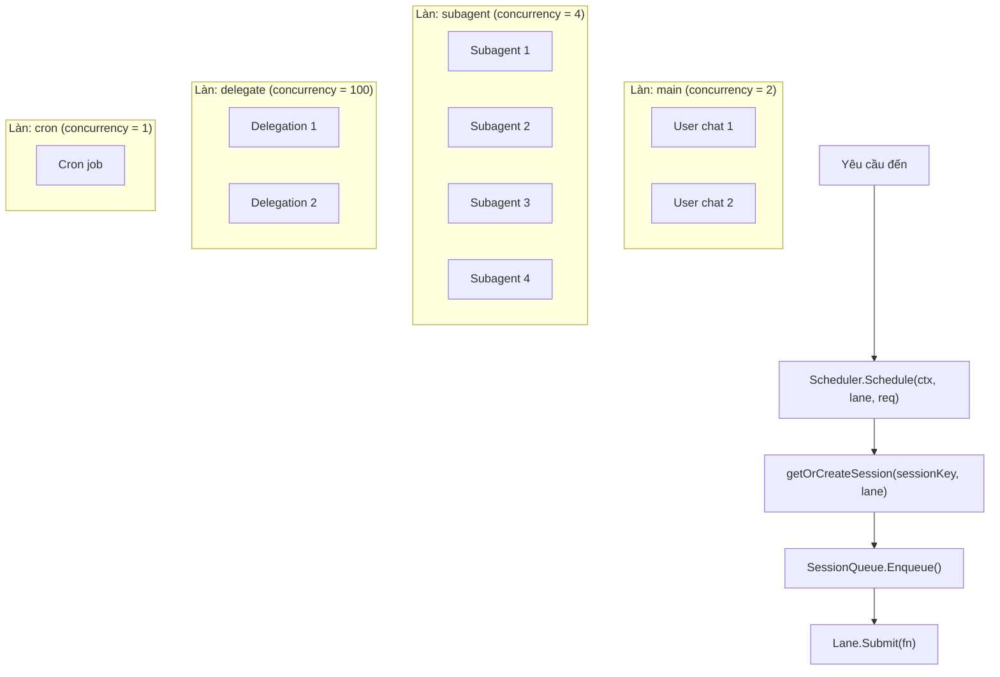
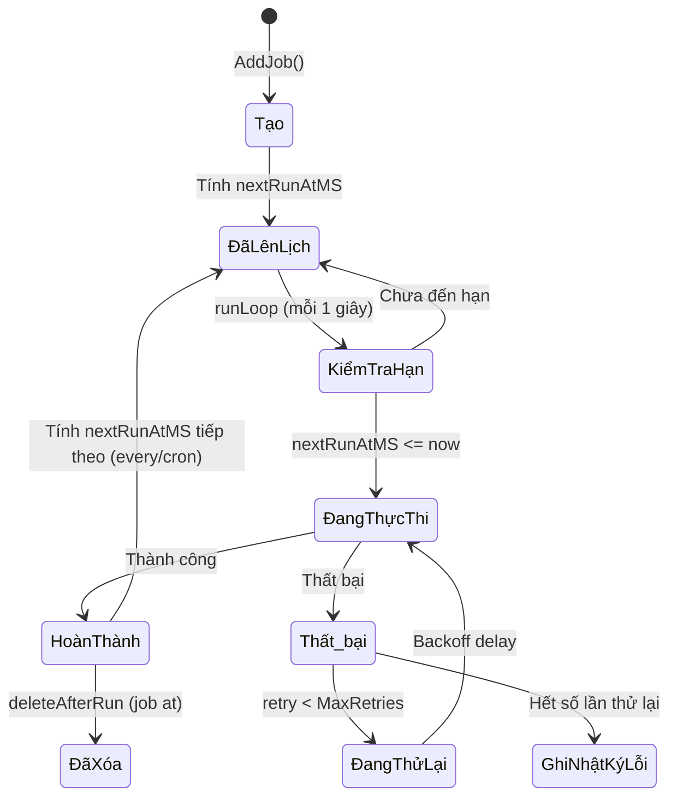
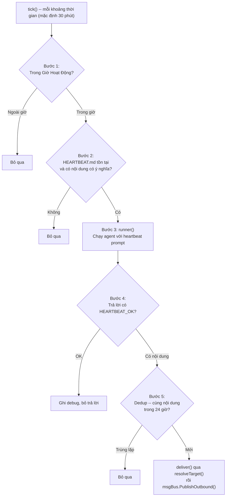

# 08 - Scheduling, Cron & Heartbeat

Kiểm soát đồng thời và thực thi nhiệm vụ định kỳ. Scheduler cung cấp cô lập dựa trên làn và tuần tự hóa hàng đợi theo phiên. Cron và heartbeat mở rộng vòng lặp agent với hành vi được kích hoạt theo thời gian.

> **Managed mode**: Các cron job và nhật ký chạy được lưu trong bảng PostgreSQL `cron_jobs` và `cron_run_logs`. Vô hiệu hóa cache được lan truyền qua sự kiện `cache:cron` trên message bus. Trong standalone mode, trạng thái cron được lưu vào tệp JSON.

### Trách Nhiệm

- Scheduler: kiểm soát đồng thời dựa trên làn, tuần tự hóa hàng đợi tin nhắn theo phiên
- Cron: ba loại lịch trình (at/every/cron), ghi nhật ký chạy, thử lại với exponential backoff
- Heartbeat: đánh thức agent định kỳ, phát hiện HEARTBEAT_OK, dedup trong 24 giờ

---

## 1. Làn Scheduler

Các worker pool được đặt tên (dựa trên semaphore) với giới hạn đồng thời có thể cấu hình. Mỗi làn xử lý yêu cầu độc lập. Tên làn không xác định sẽ dự phòng về làn `main`.

### Giá Trị Mặc Định Làn

| Làn | Đồng thời | Ghi đè Env | Mục đích |
|-----|:---------:|-----------|---------|
| `main` | 2 | `GOCLAW_LANE_MAIN` | Phiên chat người dùng chính |
| `subagent` | 4 | `GOCLAW_LANE_SUBAGENT` | Sub-agent được sinh bởi agent chính |
| `delegate` | 100 | `GOCLAW_LANE_DELEGATE` | Thực thi ủy quyền agent |
| `cron` | 1 | `GOCLAW_LANE_CRON` | Các cron job đã lên lịch (tuần tự để tránh xung đột) |

`GetOrCreate()` cho phép tạo các làn mới theo yêu cầu với đồng thời tùy chỉnh. Tất cả giá trị đồng thời của làn đều có thể cấu hình qua biến môi trường.

---

## 2. Hàng Đợi Phiên

Mỗi khóa phiên có một hàng đợi riêng quản lý các lần chạy agent. Hàng đợi hỗ trợ số lần chạy đồng thời có thể cấu hình mỗi phiên.

### Chạy Đồng Thời

| Context | `maxConcurrent` | Lý do |
|---------|:--------------:|-------|
| DM | 1 | Đơn luồng theo người dùng (không xen kẽ) |
| Groups | 3 | Nhiều người dùng có thể nhận phản hồi song song |

**Throttle thích ứng**: Khi lịch sử phiên vượt quá 60% cửa sổ context, đồng thời giảm xuống 1 để ngăn tràn cửa sổ context.

### Chế Độ Hàng Đợi

| Chế độ | Hành vi |
|--------|---------|
| `queue` (mặc định) | FIFO -- tin nhắn chờ cho đến khi có slot chạy |
| `followup` | Như `queue` -- tin nhắn được xếp hàng làm follow-up |
| `interrupt` | Hủy lần chạy đang hoạt động, xả hàng đợi, bắt đầu tin nhắn mới ngay lập tức |

### Chính Sách Bỏ

Khi hàng đợi đạt dung lượng, một trong hai chính sách bỏ được áp dụng.

| Chính sách | Khi Hàng Đợi Đầy | Lỗi Trả Về |
|-----------|-----------------|-----------|
| `old` (mặc định) | Bỏ tin nhắn cũ nhất trong hàng đợi, thêm cái mới | `ErrQueueDropped` |
| `new` | Từ chối tin nhắn đến | `ErrQueueFull` |

### Giá Trị Mặc Định Cấu Hình Hàng Đợi

| Tham số | Mặc định | Mô tả |
|---------|---------|-------|
| `mode` | `queue` | Chế độ hàng đợi (queue, followup, interrupt) |
| `cap` | 10 | Số tin nhắn tối đa trong hàng đợi |
| `drop` | `old` | Chính sách bỏ khi đầy (old hoặc new) |
| `debounce_ms` | 800 | Gộp các tin nhắn nhanh trong cửa sổ này |

---

## 3. Lệnh /stop và /stopall

Các lệnh hủy cho Telegram và các kênh khác.

| Lệnh | Hành vi |
|------|---------|
| `/stop` | Hủy nhiệm vụ đang chạy cũ nhất; các nhiệm vụ khác tiếp tục |
| `/stopall` | Hủy tất cả nhiệm vụ đang chạy + xả hàng đợi |

### Chi Tiết Triển Khai

- **Bỏ qua debouncer**: `/stop` và `/stopall` bị chặn trước bộ debouncer 800ms để tránh bị gộp với tin nhắn người dùng tiếp theo
- **Cơ chế hủy**: `SessionQueue.Cancel()` hiển thị `CancelFunc` từ scheduler. Hủy context được lan truyền đến vòng lặp agent
- **Outbound rỗng**: Khi hủy, một tin nhắn outbound rỗng được phát để kích hoạt dọn dẹp (dừng chỉ báo đang gõ, xóa reaction)
- **Hoàn thiện trace**: Khi `ctx.Err() != nil`, hoàn thiện trace dự phòng sang `context.Background()` để ghi DB cuối. Trạng thái được đặt thành `"cancelled"`
- **Tồn tại context**: Các giá trị context (traceID, collector) tồn tại khi hủy -- chỉ có kênh Done kích hoạt

---

## 4. Vòng Đời Cron

Các nhiệm vụ đã lên lịch chạy các lượt agent tự động. Vòng lặp chạy kiểm tra mỗi giây cho các job đến hạn.

### Loại Lịch Trình

| Loại | Tham số | Ví dụ |
|------|---------|-------|
| `at` | `atMs` (epoch ms) | Nhắc nhở lúc 3PM ngày mai, tự xóa sau khi thực thi |
| `every` | `everyMs` | Mỗi 30 phút (1.800.000 ms) |
| `cron` | `expr` (5 trường) | `"0 9 * * 1-5"` (9AM các ngày trong tuần) |

### Trạng Thái Job

Các job có thể là `active` hoặc `paused`. Các job paused bỏ qua thực thi trong quá trình kiểm tra hạn. Kết quả chạy được ghi vào bảng `cron_run_logs`. Vô hiệu hóa cache được lan truyền qua message bus.

### Thử Lại -- Exponential Backoff với Jitter

| Tham số | Mặc định |
|---------|---------|
| MaxRetries | 3 |
| BaseDelay | 2 giây |
| MaxDelay | 30 giây |

**Công thức**: `delay = min(base x 2^attempt, max) +/- 25% jitter`

---

## 5. Heartbeat -- 5 Bước

Định kỳ đánh thức agent để kiểm tra các sự kiện (lịch, hộp thư, cảnh báo) và nêu lên bất kỳ điều gì cần chú ý.

### Cấu Hình Heartbeat

| Tham số | Mặc định | Mô tả |
|---------|---------|-------|
| Khoảng thời gian | 30 phút | Thời gian giữa các lần đánh thức heartbeat |
| ActiveHours | (không có) | Giới hạn cửa sổ thời gian, hỗ trợ kéo qua nửa đêm |
| Target | `"last"` | `"last"` (kênh dùng cuối), `"none"`, hoặc tên kênh rõ ràng |
| AckMaxChars | 300 | Nội dung kèm HEARTBEAT_OK tối đa độ dài này vẫn được coi là OK |

### Phát Hiện HEARTBEAT_OK

Nhận ra nhiều biến thể định dạng: `HEARTBEAT_OK`, `**HEARTBEAT_OK**`, `` `HEARTBEAT_OK` ``, `<b>HEARTBEAT_OK</b>`. Nội dung kèm token được coi là xác nhận (OK) nếu không vượt quá `AckMaxChars`.

---

## Tham Chiếu Tệp

| Tệp | Mô tả |
|-----|-------|
| `internal/scheduler/lanes.go` | Lane và LaneManager (worker pool dựa trên semaphore) |
| `internal/scheduler/queue.go` | SessionQueue, Scheduler, chính sách bỏ, debounce |
| `internal/cron/service.go` | Vòng lặp cron, phân tích lịch trình, vòng đời job |
| `internal/cron/retry.go` | Thử lại với exponential backoff + jitter |
| `internal/heartbeat/service.go` | Vòng lặp heartbeat, phát hiện HEARTBEAT_OK, giờ hoạt động |
| `internal/store/cron_store.go` | Giao diện CronStore (job + nhật ký chạy) |
| `internal/store/pg/cron.go` | Triển khai cron PostgreSQL |

---

## Tham Chiếu Chéo

| Tài liệu | Nội dung liên quan |
|----------|-------------------|
| [00-architecture-overview.md](./00-architecture-overview.md) | Các làn scheduler trong trình tự khởi động |
| [01-agent-loop.md](./01-agent-loop.md) | Vòng lặp agent được kích hoạt bởi scheduler |
| [06-store-data-model.md](./06-store-data-model.md) | Các bảng cron_jobs, cron_run_logs |
