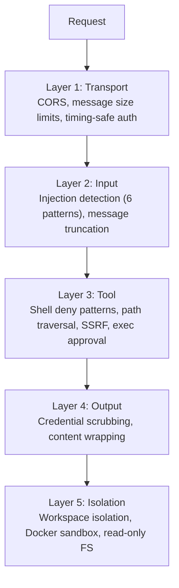
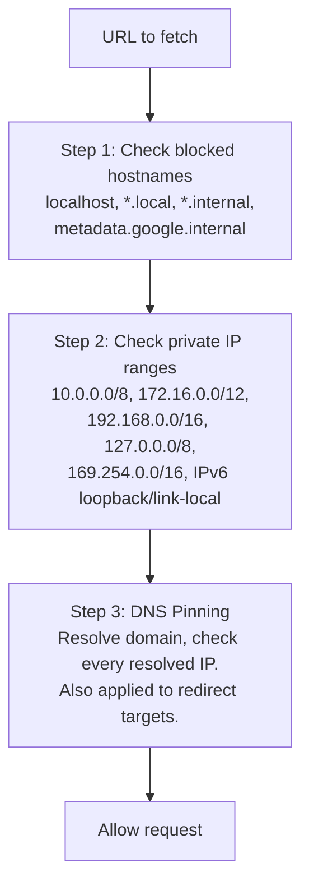
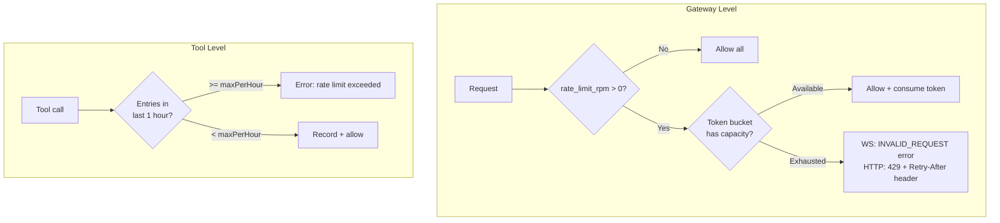
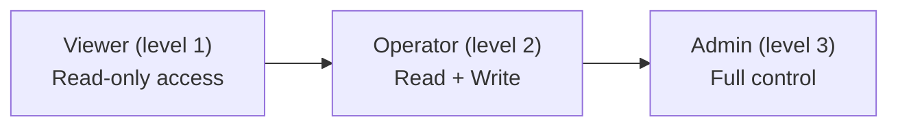
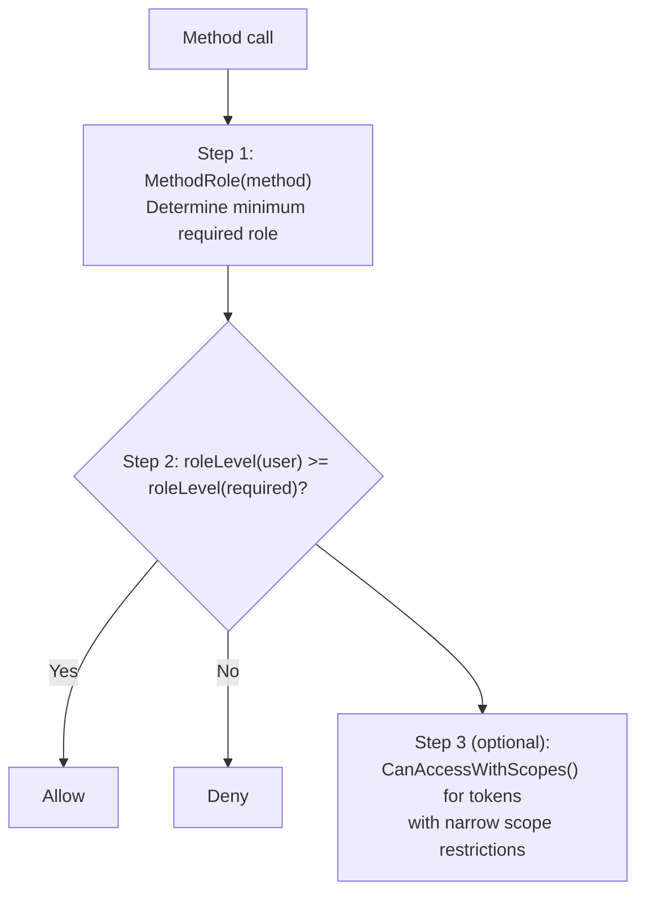
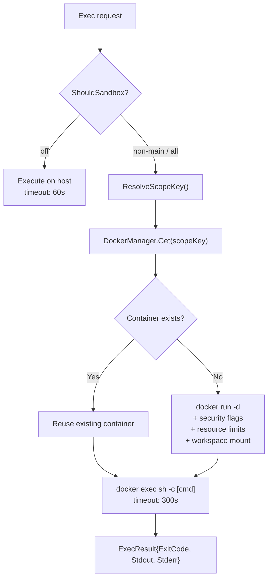

# 09 - Bảo mật

Phòng thủ theo chiều sâu với năm lớp độc lập từ tầng vận chuyển đến cô lập. Mỗi lớp hoạt động độc lập -- ngay cả khi một lớp bị vượt qua, các lớp còn lại vẫn tiếp tục bảo vệ hệ thống.

> **Chế độ Managed**: Bổ sung mã hóa AES-256-GCM cho các bí mật lưu trong PostgreSQL (API key của LLM provider, API key của MCP server, biến môi trường của custom tool), cùng kiểm soát truy cập cấp agent thông qua pipeline 4 bước `CanAccess` (xem [06-store-data-model.md](./06-store-data-model.md)).

---

## 1. Năm Lớp Phòng Thủ



### Lớp 1: Bảo mật Transport

| Cơ chế | Chi tiết |
|-----------|--------|
| CORS (WebSocket) | `checkOrigin()` xác thực dựa trên `allowed_origins` (rỗng = cho phép tất cả để tương thích ngược) |
| Giới hạn WS message | `SetReadLimit(512KB)` -- gorilla tự đóng kết nối khi vượt quá |
| Giới hạn HTTP body | `MaxBytesReader(1MB)` -- trả lỗi trước khi giải mã JSON |
| Xác thực token | `crypto/subtle.ConstantTimeCompare` (timing-safe) |
| Rate limiting | Token bucket theo user/IP, cấu hình qua `rate_limit_rpm` |

### Lớp 2: Input -- Phát hiện Injection

Bộ kiểm tra đầu vào quét 6 mẫu injection.

| Mẫu | Mục tiêu phát hiện |
|---------|-----------------|
| `ignore_instructions` | "ignore all previous instructions" |
| `role_override` | "you are now...", "pretend you are..." |
| `system_tags` | `<system>`, `[SYSTEM]`, `[INST]`, `<<SYS>>` |
| `instruction_injection` | "new instructions:", "override:", "system prompt:" |
| `null_bytes` | Ký tự null `\x00` (cố gắng làm mờ) |
| `delimiter_escape` | "end of system", `</instructions>`, `</prompt>` |

**Hành động có thể cấu hình** (`gateway.injection_action`):

| Giá trị | Hành vi |
|-------|----------|
| `"log"` | Ghi log cấp info, tiếp tục xử lý |
| `"warn"` (mặc định) | Ghi log cấp warning, tiếp tục xử lý |
| `"block"` | Ghi log warning, trả về lỗi, dừng xử lý |
| `"off"` | Tắt hoàn toàn tính năng phát hiện |

**Cắt ngắn message**: Các message vượt quá `max_message_chars` (mặc định 32K) sẽ bị cắt ngắn (không bị từ chối), và LLM được thông báo về việc cắt ngắn này.

### Lớp 3: Bảo mật Tool

**Shell deny patterns** -- hơn 77 mẫu thuộc nhiều danh mục lệnh bị chặn:

| Danh mục | Ví dụ |
|----------|----------|
| Thao tác file nguy hiểm | `rm -rf`, `del /f`, `rmdir /s` |
| Thao tác đĩa nguy hiểm | `mkfs`, `dd if=`, `> /dev/sd*` |
| Lệnh hệ thống | `shutdown`, `reboot`, `poweroff` |
| Fork bomb | `:(){ ... };:` |
| Thực thi mã từ xa | `curl \| sh`, `wget -O - \| sh` |
| Reverse shell | `/dev/tcp/`, `nc -e` |
| Eval injection | `eval $()`, `base64 -d \| sh` |
| Đánh cắp dữ liệu | `curl ... -d @/etc/passwd`, `exfil`, chuyển file nhạy cảm đến host từ xa |
| Leo thang đặc quyền | `sudo`, `su -`, `chmod 4755`, `chown root`, `setuid` |
| Thao tác đường dẫn nguy hiểm | Ghi vào `/etc/`, `/boot/`, `/sys/`, `/proc/` |

**Bảo vệ SSRF** -- xác thực 3 bước:



**Path traversal**: `resolvePath()` áp dụng `filepath.Clean()` rồi `HasPrefix()` để đảm bảo tất cả đường dẫn nằm trong workspace. Khi `restrict = true`, bất kỳ đường dẫn nào nằm ngoài workspace đều bị chặn.

**PathDenyable** -- Interface cho phép các filesystem tool từ chối các tiền tố đường dẫn cụ thể:

```go
type PathDenyable interface {
    DenyPaths(...string)
}
```

Cả bốn filesystem tool (`read_file`, `write_file`, `list_files`, `edit`) đều triển khai `PathDenyable`. Vòng lặp agent gọi `DenyPaths(".goclaw")` khi khởi động để ngăn agent truy cập các thư mục dữ liệu nội bộ. `list_files` còn lọc bỏ hoàn toàn các thư mục bị từ chối khỏi kết quả -- agent không thấy các đường dẫn bị từ chối trong danh sách thư mục.

### Lớp 4: Bảo mật Output

| Cơ chế | Chi tiết |
|-----------|--------|
| Che giấu thông tin xác thực | Phát hiện bằng regex: OpenAI (`sk-...`), Anthropic (`sk-ant-...`), GitHub (`ghp_/gho_/ghu_/ghs_/ghr_`), AWS (`AKIA...`), các mẫu key-value thông thường. Tất cả được thay thế bằng `[REDACTED]`. |
| Bọc nội dung web | Nội dung tải về được bọc trong thẻ `<<<EXTERNAL_UNTRUSTED_CONTENT>>>` kèm cảnh báo bảo mật |

### Lớp 5: Cô lập

**Cô lập workspace theo từng người dùng** -- Hai cấp độ ngăn chặn truy cập file chéo giữa các user:

| Cấp độ | Phạm vi | Mẫu thư mục |
|-------|-------|------------------|
| Per-agent | Mỗi agent có thư mục gốc riêng | `~/.goclaw/{agent-key}-workspace/` |
| Per-user | Mỗi user có thư mục con trong workspace của agent | `{agent-workspace}/user_{sanitized_id}/` |

Workspace được đưa vào tool qua context injection `WithToolWorkspace(ctx)`. Tool đọc workspace từ context tại thời điểm thực thi (fallback về trường struct để tương thích ngược). User ID được làm sạch: mọi ký tự ngoài `[a-zA-Z0-9_-]` trở thành dấu gạch dưới (`group:telegram:-1001234` → `group_telegram_-1001234`).

**Docker sandbox** -- Cô lập dựa trên container cho việc thực thi lệnh shell:

| Tăng cường bảo mật | Cấu hình |
|-----------|---------------|
| Root FS chỉ đọc | `--read-only` |
| Bỏ tất cả capabilities | `--cap-drop ALL` |
| Không cho phép leo thang đặc quyền | `--security-opt no-new-privileges` |
| Giới hạn bộ nhớ | 512 MB |
| Giới hạn CPU | 1.0 |
| Giới hạn PID | Bật |
| Tắt mạng | `--network none` |
| Mount tmpfs | `/tmp`, `/var/tmp`, `/run` |
| Giới hạn output | 1 MB |
| Timeout | 300 giây |

---

## 2. Mã hóa (Chế độ Managed)

Mã hóa AES-256-GCM cho các bí mật lưu trong PostgreSQL. Key được cung cấp qua biến môi trường `GOCLAW_ENCRYPTION_KEY`.

| Dữ liệu được mã hóa | Bảng | Cột |
|-----------------|-------|--------|
| API key của LLM provider | `llm_providers` | `api_key` |
| API key của MCP server | `mcp_servers` | `api_key` |
| Biến môi trường custom tool | `custom_tools` | `env` |

**Định dạng**: `"aes-gcm:" + base64(12-byte nonce + ciphertext + GCM tag)`

Tương thích ngược: các giá trị không có tiền tố `aes-gcm:` được trả về dạng plaintext (để hỗ trợ di chuyển từ dữ liệu chưa mã hóa).

---

## 3. Rate Limiting -- Gateway + Tool

Bảo vệ ở hai cấp độ: toàn gateway (theo user/IP) và cấp tool (theo session).



| Cấp độ | Thuật toán | Key | Burst | Dọn dẹp |
|-------|-----------|-----|:-----:|---------|
| Gateway | Token bucket | user/IP | 5 | Mỗi 5 phút (không hoạt động > 10 phút) |
| Tool | Sliding window | `agent:userID` | N/A | `Cleanup()` thủ công |

Rate limiting ở gateway áp dụng cho cả WebSocket (`chat.send`) và HTTP (`/v1/chat/completions`). Cấu hình: `gateway.rate_limit_rpm` (0 = tắt, giá trị dương bất kỳ = bật).

---

## 4. RBAC -- 3 Vai trò

Kiểm soát truy cập dựa trên vai trò cho các phương thức WebSocket RPC và endpoint HTTP API. Vai trò có tính phân cấp: cấp cao hơn bao gồm tất cả quyền của cấp thấp hơn.



| Vai trò | Quyền chính |
|------|----------------|
| Viewer | agents.list, config.get, sessions.list, health, status, skills.list |
| Operator | + chat.send, chat.abort, sessions.delete/reset, cron.*, skills.update |
| Admin | + config.apply/patch, agents.create/update/delete, channels.toggle, device.pair.approve/revoke |

### Luồng kiểm tra truy cập



Phân quyền theo token diễn ra trong quá trình bắt tay `connect` của WebSocket. Các scope bao gồm: `operator.admin`, `operator.read`, `operator.write`, `operator.approvals`, `operator.pairing`.

---

## 5. Sandbox -- Vòng đời Container

Cô lập mã dựa trên Docker cho việc thực thi lệnh shell.



### Chế độ Sandbox

| Chế độ | Hành vi |
|------|----------|
| `off` (mặc định) | Thực thi trực tiếp trên host |
| `non-main` | Sandbox tất cả agent trừ main/default |
| `all` | Sandbox mọi agent |

### Phạm vi Container

| Phạm vi | Mức tái sử dụng | Scope Key |
|-------|-------------|-----------|
| `session` (mặc định) | Một container mỗi session | sessionKey |
| `agent` | Dùng chung qua các session của cùng agent | `"agent:" + agentID` |
| `shared` | Một container cho tất cả agent | `"shared"` |

### Quyền truy cập Workspace

| Chế độ | Mount |
|------|-------|
| `none` | Không truy cập workspace |
| `ro` | Mount chỉ đọc |
| `rw` | Mount đọc-ghi |

### Tự động Dọn dẹp

| Tham số | Mặc định | Hành động |
|-----------|---------|--------|
| `idle_hours` | 24 | Xóa container không hoạt động quá 24 giờ |
| `max_age_days` | 7 | Xóa container cũ hơn 7 ngày |
| `prune_interval_min` | 5 | Kiểm tra mỗi 5 phút |

### FsBridge -- Thao tác File trong Sandbox

| Thao tác | Lệnh Docker |
|-----------|---------------|
| ReadFile | `docker exec [id] cat -- [path]` |
| WriteFile | `docker exec -i [id] sh -c 'cat > [path]'` |
| ListDir | `docker exec [id] ls -la -- [path]` |
| Stat | `docker exec [id] stat -- [path]` |

---

## 6. Quy ước Ghi Log Bảo mật

Tất cả sự kiện bảo mật sử dụng `slog.Warn` với tiền tố `security.*` để lọc và cảnh báo nhất quán.

| Sự kiện | Ý nghĩa |
|-------|---------|
| `security.injection_detected` | Phát hiện mẫu prompt injection |
| `security.injection_blocked` | Message bị chặn do injection (khi action = block) |
| `security.rate_limited` | Request bị từ chối do vượt rate limit |
| `security.cors_rejected` | Kết nối WebSocket bị từ chối do chính sách CORS |
| `security.message_truncated` | Message bị cắt ngắn vì vượt giới hạn kích thước |

Lọc tất cả sự kiện bảo mật bằng cách grep tiền tố `security.` trong log.

---

## 7. Ngăn Chặn Đệ quy Hook

Hệ thống hook (quality gate) có thể gây ra đệ quy vô hạn: agent evaluator ủy quyền cho reviewer → ủy quyền hoàn thành → kích hoạt quality gate → lại ủy quyền cho reviewer → vòng lặp vô hạn.

Cờ context `hooks.WithSkipHooks(ctx, true)` ngăn chặn điều này. Ba điểm injection đặt cờ này:

| Điểm injection | Lý do |
|----------------|-----|
| Agent evaluator | Ủy quyền cho reviewer để kiểm tra chất lượng không được kích hoạt lại gate |
| Vòng lặp evaluate-optimize | Tất cả ủy quyền nội bộ generator/evaluator bỏ qua gate |
| Agent eval callback (tầng cmd) | Khi chính hook engine kích hoạt ủy quyền |

`DelegateManager.Delegate()` kiểm tra `hooks.SkipHooksFromContext(ctx)` trước khi áp dụng quality gate. Nếu cờ được đặt, gate bị bỏ qua hoàn toàn.

---

## 8. Bảo mật Ủy quyền

Ủy quyền agent sử dụng quyền có hướng thông qua bảng `agent_links`.

| Kiểm soát | Phạm vi | Mô tả |
|---------|-------|-------------|
| Liên kết có hướng | A → B | Một hàng `(A→B, outbound)` nghĩa là A có thể ủy quyền cho B, không ngược lại |
| Từ chối/cho phép theo user | Mỗi liên kết | `settings` JSONB trên mỗi liên kết chứa giới hạn theo từng user (chỉ dành cho premium, tài khoản bị chặn) |
| Giới hạn đồng thời theo liên kết | A → B | `agent_links.max_concurrent` giới hạn số ủy quyền đồng thời từ A đến B |
| Giới hạn tải theo agent | B (tất cả nguồn) | `other_config.max_delegation_load` giới hạn tổng số ủy quyền đồng thời hướng đến B |

Khi đạt giới hạn đồng thời, thông báo lỗi được viết để LLM có thể suy luận: *"Agent at capacity (5/5). Try a different agent or handle it yourself."*

---

## Tham chiếu File

| File | Mô tả |
|------|-------------|
| `internal/agent/input_guard.go` | Phát hiện mẫu injection (6 mẫu) |
| `internal/tools/scrub.go` | Che giấu thông tin xác thực (redaction dựa trên regex) |
| `internal/tools/shell.go` | Shell deny patterns, xác thực lệnh |
| `internal/tools/web_fetch.go` | Bọc nội dung web, bảo vệ SSRF |
| `internal/permissions/policy.go` | RBAC (3 vai trò, kiểm soát truy cập theo scope) |
| `internal/gateway/ratelimit.go` | Token bucket rate limiter cấp gateway |
| `internal/sandbox/` | Docker sandbox manager, FsBridge |
| `internal/crypto/aes.go` | Mã hóa/giải mã AES-256-GCM |
| `internal/tools/types.go` | Định nghĩa interface PathDenyable |
| `internal/tools/filesystem.go` | Kiểm tra đường dẫn bị từ chối (helper `checkDeniedPath`) |
| `internal/tools/filesystem_list.go` | Hỗ trợ đường dẫn bị từ chối + lọc thư mục |
| `internal/hooks/context.go` | WithSkipHooks / SkipHooksFromContext (ngăn chặn đệ quy) |
| `internal/hooks/engine.go` | Hook engine, evaluator registry |

---

## Tham chiếu Chéo

| Tài liệu | Nội dung liên quan |
|----------|-----------------|
| [03-tools-system.md](./03-tools-system.md) | Shell deny patterns, exec approval, PathDenyable, hệ thống ủy quyền, quality gate |
| [04-gateway-protocol.md](./04-gateway-protocol.md) | Xác thực WebSocket, RBAC, rate limiting |
| [06-store-data-model.md](./06-store-data-model.md) | Mã hóa API key, pipeline kiểm soát truy cập agent, bảng agent_links |
| [07-bootstrap-skills-memory.md](./07-bootstrap-skills-memory.md) | Hợp nhất file context, virtual file |
| [08-scheduling-cron-heartbeat.md](./08-scheduling-cron-heartbeat.md) | Các lane scheduler, vòng đời cron |
| [10-tracing-observability.md](./10-tracing-observability.md) | Tracing và xuất OTel |
