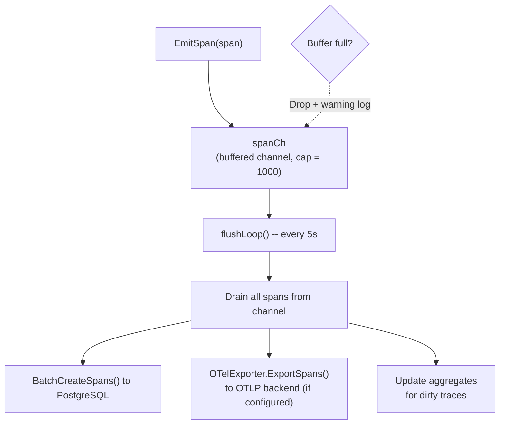
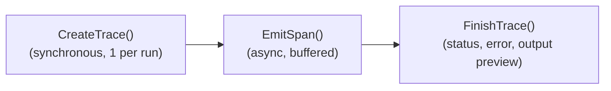
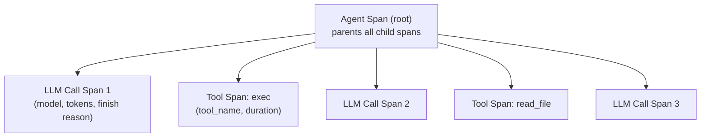
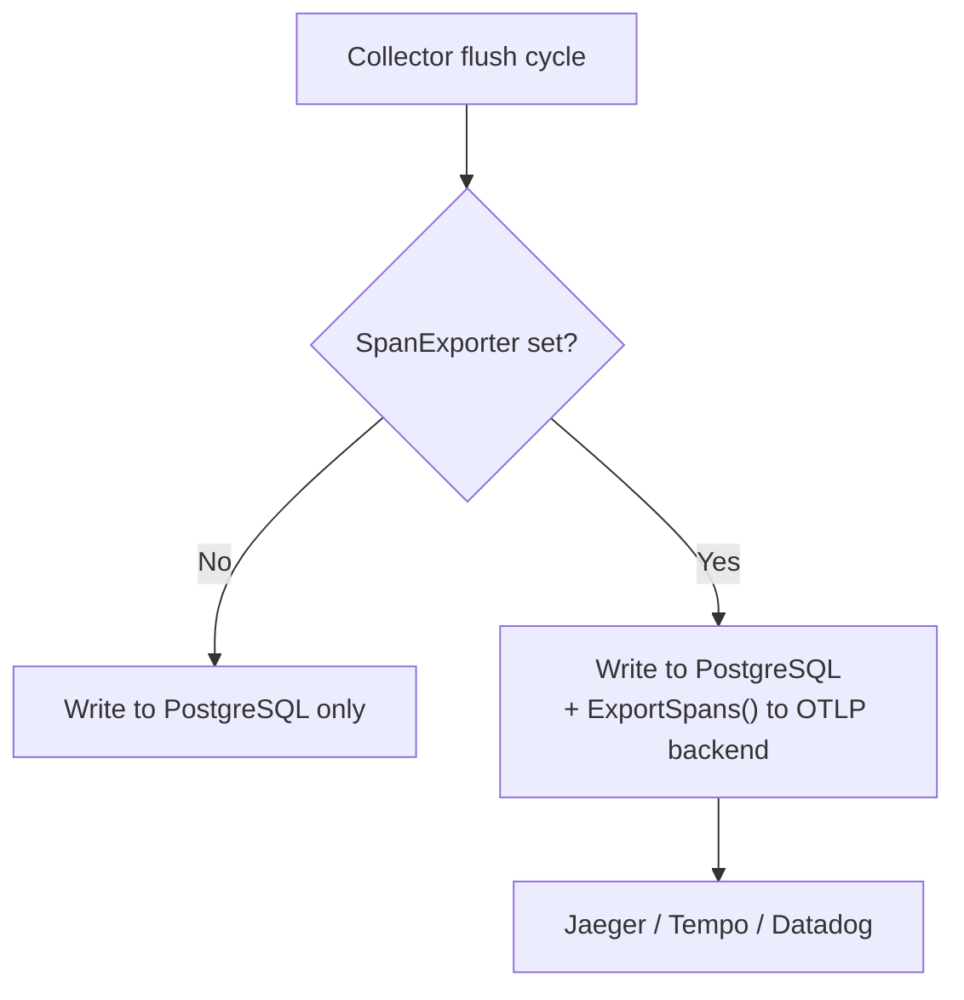

# 10 - Tracing & Observability

Ghi lại hoạt động chạy của agent theo cách bất đồng bộ. Các span được đệm trong bộ nhớ và đẩy vào TracingStore theo từng lô, với tùy chọn xuất sang các backend OpenTelemetry bên ngoài.

> **Chỉ dành cho chế độ Managed**: Tracing yêu cầu PostgreSQL. Trong chế độ standalone, `TracingStore` là nil và không có trace nào được ghi. Bảng `traces` và `spans` lưu trữ toàn bộ dữ liệu tracing. Xuất OTel tùy chọn gửi span đến các backend bên ngoài (Jaeger, Grafana Tempo, Datadog) ngoài PostgreSQL.

---

## 1. Collector -- Kiến trúc Buffer-Flush

### Vòng đời Trace

### Xử lý Hủy

Khi một lượt chạy bị hủy qua `/stop` hoặc `/stopall`, context của lượt chạy bị hủy nhưng quá trình hoàn tất trace vẫn cần được lưu. `FinishTrace()` phát hiện `ctx.Err() != nil` và chuyển sang `context.Background()` cho lần ghi cơ sở dữ liệu cuối cùng. Trạng thái trace được đặt thành `"cancelled"` thay vì `"error"`.

Các giá trị context (traceID, collector) vẫn tồn tại sau khi hủy -- chỉ có `ctx.Done()` và `ctx.Err()` thay đổi. Điều này cho phép quá trình hoàn tất trace tìm thấy mọi thứ cần thiết với một context mới cho lời gọi DB.

---

## 2. Loại Span & Phân cấp

| Loại | Mô tả | OTel Kind |
|------|-------------|-----------|
| `llm_call` | Lời gọi LLM provider | Client |
| `tool_call` | Thực thi tool | Internal |
| `agent` | Span gốc của agent (là cha của tất cả span con) | Internal |

### Tổng hợp Token

Số lượng token được tổng hợp **chỉ từ các span `llm_call`** (không từ span `agent`) để tránh đếm trùng. Phương thức `BatchUpdateTraceAggregates()` tính tổng `input_tokens` và `output_tokens` từ các span có `span_type = 'llm_call'` và ghi tổng vào bản ghi trace cha.

---

## 3. Chế độ Verbose

| Chế độ | InputPreview | OutputPreview |
|------|:---:|:---:|
| Bình thường | Không ghi lại | Tối đa 500 ký tự |
| Verbose (`GOCLAW_TRACE_VERBOSE=1`) | Tối đa 50KB | Tối đa 500 ký tự |

Chế độ verbose hữu ích để debug các cuộc hội thoại LLM. Toàn bộ message đầu vào (bao gồm system prompt, lịch sử và kết quả tool) được serialize thành JSON và lưu trong trường `InputPreview` của span, giới hạn ở 50.000 ký tự.

---

## 4. Xuất OTel

Bộ xuất OpenTelemetry OTLP tùy chọn gửi span đến các backend observability bên ngoài.

### Cấu hình OTel

| Tham số | Mô tả |
|-----------|-------------|
| `endpoint` | Endpoint OTLP (ví dụ: `localhost:4317` cho gRPC, `localhost:4318` cho HTTP) |
| `protocol` | `grpc` (mặc định) hoặc `http` |
| `insecure` | Bỏ qua TLS cho môi trường phát triển local |
| `service_name` | Tên service OTel (mặc định: `goclaw-gateway`) |
| `headers` | Header bổ sung (auth token, v.v.) |

### Xử lý theo Lô

| Tham số | Giá trị |
|-----------|-------|
| Kích thước lô tối đa | 100 span |
| Timeout lô | 5 giây |

Bộ xuất nằm trong sub-package riêng biệt (`internal/tracing/otelexport/`) để cô lập các phụ thuộc gRPC và protobuf. Bỏ comment import và wiring sẽ giảm khoảng 15-20MB khỏi binary. Bộ xuất được gắn vào Collector qua `SetExporter()`.

---

## 5. Trace HTTP API (Chế độ Managed)

| Method | Path | Mô tả |
|--------|------|-------------|
| GET | `/v1/traces` | Liệt kê trace với phân trang và bộ lọc |
| GET | `/v1/traces/{id}` | Lấy chi tiết trace kèm tất cả span |

### Bộ lọc Query

| Tham số | Kiểu | Mô tả |
|-----------|------|-------------|
| `agent_id` | UUID | Lọc theo agent |
| `user_id` | string | Lọc theo user |
| `status` | string | Lọc theo trạng thái (running, success, error, cancelled) |
| `from` / `to` | timestamp | Lọc theo khoảng thời gian |
| `limit` | int | Kích thước trang (mặc định 50) |
| `offset` | int | Độ lệch phân trang |

---

## 6. Lịch sử Ủy quyền (Chế độ Managed)

Bản ghi lịch sử ủy quyền được lưu trong bảng `delegation_history` và được hiển thị cùng với trace để đối chiếu tương tác giữa các agent.

| Kênh | Endpoint | Chi tiết |
|---------|----------|---------|
| WebSocket RPC | `delegations.list` / `delegations.get` | Kết quả được cắt ngắn (500 rune cho list, 8000 cho chi tiết) |
| HTTP API | `GET /v1/delegations` / `GET /v1/delegations/{id}` | Bản ghi đầy đủ |
| Agent tool | `delegate(action="history")` | Agent tự kiểm tra lịch sử ủy quyền |

Lịch sử ủy quyền được ghi tự động bởi `DelegateManager.saveDelegationHistory()` cho mỗi lần ủy quyền (đồng bộ/bất đồng bộ). Mỗi bản ghi bao gồm agent nguồn, agent đích, đầu vào, kết quả, thời gian và trạng thái.

---

## Tham chiếu File

| File | Mô tả |
|------|-------------|
| `internal/tracing/collector.go` | Buffer-flush của Collector, EmitSpan, FinishTrace |
| `internal/tracing/context.go` | Truyền context trace (TraceID, ParentSpanID) |
| `internal/tracing/otelexport/exporter.go` | Bộ xuất OTel OTLP (gRPC + HTTP) |
| `internal/store/tracing_store.go` | Interface TracingStore |
| `internal/store/pg/tracing.go` | Lưu trữ và tổng hợp trace/span trên PostgreSQL |
| `internal/http/traces.go` | Handler Trace HTTP API (GET /v1/traces) |
| `internal/agent/loop_tracing.go` | Phát span từ vòng lặp agent (LLM, tool, agent span) |
| `internal/http/delegations.go` | Handler HTTP API lịch sử ủy quyền |
| `internal/gateway/methods/delegations.go` | Handler RPC lịch sử ủy quyền |

---

## Tham chiếu Chéo

| Tài liệu | Nội dung liên quan |
|----------|-----------------|
| [01-agent-loop.md](./01-agent-loop.md) | Phát span trong quá trình thực thi agent, xử lý hủy |
| [03-tools-system.md](./03-tools-system.md) | Hệ thống ủy quyền, lịch sử ủy quyền qua agent tool |
| [06-store-data-model.md](./06-store-data-model.md) | Schema bảng traces/spans, bảng delegation_history |
| [08-scheduling-cron-heartbeat.md](./08-scheduling-cron-heartbeat.md) | Lệnh /stop và /stopall |
| [09-security.md](./09-security.md) | Rate limiting, kiểm soát truy cập RBAC |
