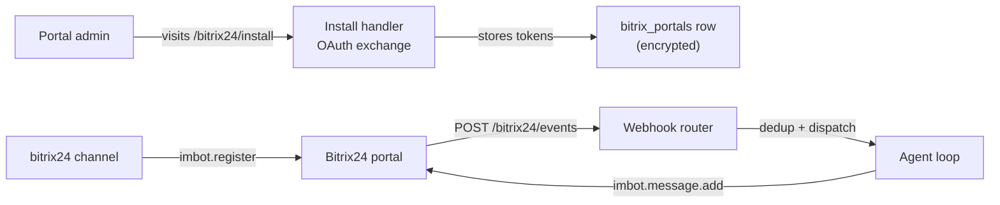

# Bitrix24 Channel

Bitrix24 integration via the **imbot** (chatbot) API. GoClaw registers a bot on a Bitrix24 portal, receives chat events through a webhook, and replies as the bot. One GoClaw gateway can serve many bots across many portals, and several bots can share a single portal (they share OAuth tokens and the refresh loop).

Unlike token-based channels (Telegram, Slack), Bitrix24 uses an **OAuth portal install flow**: an admin authorizes the GoClaw app on their portal once, GoClaw stores and auto-refreshes the tokens, then registers bots on demand.

## How It Works



1. **Seed a portal row** with the app's `client_id` / `client_secret` (CLI or dashboard).
2. **Admin authorizes** by visiting the install URL — GoClaw exchanges the code for tokens and persists them encrypted.
3. **Configure a channel instance** that points at the portal and names the bot.
4. On start, the channel calls `imbot.register` (idempotently) and wires the returned bot ID into the webhook router.
5. Inbound chat events hit `/bitrix24/events`; GoClaw deduplicates, dispatches to the agent loop, and replies as the bot.

## Setup

### 1. Create a Bitrix24 application

In your Bitrix24 portal, create either a **Local application** or a **Marketplace (OAuth2) application**. You need:

- `client_id` (application ID)
- `client_secret` (application key)
- OAuth scopes including `imbot` (chatbot) and `user` (so GoClaw can resolve sender display names)

Set the application handler / installer URL to your GoClaw public URL:

- **Install / installer URL:** `https://<your-public-url>/bitrix24/install`
- **Events:** registered automatically by GoClaw (`https://<your-public-url>/bitrix24/events`)

> **Public URL required.** Bitrix24 needs absolute, publicly reachable URLs for the event handlers it calls. GoClaw captures the public URL automatically from the install callback. If your gateway sits behind a tunnel or rotating ingress, see [Public URL handling](#public-url-handling).

### 2. Seed the portal row

A `bitrix_portals` row must exist before the admin authorizes the app. Create it via CLI:

```bash
goclaw bitrix-portal create \
  --tenant-id <tenant-uuid> \
  --name acme \
  --domain acme.bitrix24.com \
  --client-id <your-client-id> \
  --client-secret <your-client-secret>
```

The `--name` (e.g. `acme`) is the portal key your channel config references. The `--domain` is the bare host — no scheme, no trailing slash.

> Set `GOCLAW_ENCRYPTION_KEY` before running this. Credentials and tokens are stored AES-256-GCM encrypted; without the key they are stored in plaintext (with a warning).

You can also create portals from the dashboard, which returns the install URL directly.

### 3. Authorize the portal

Direct the portal admin to the install URL printed by the create command:

```
https://<your-public-url>/bitrix24/install?state=<tenant-uuid>:acme
```

The admin authorizes the app inside Bitrix24. GoClaw exchanges the code for tokens, captures the public URL, and shows a small auto-closing success page. The portal is now **installed**.

Both install flows are supported automatically:

- **Marketplace (OAuth2):** `code` is exchanged for tokens.
- **Local application:** Bitrix24 POSTs the tokens directly (`AUTH_ID` / `REFRESH_ID`); no exchange step.

### 4. Configure the channel instance

Create a `bitrix24` channel instance whose config points at the portal and names the bot:

```json
{
  "portal": "acme",
  "bot_code": "support-bot",
  "bot_name": "GoClaw Assistant",
  "bot_type": "B",
  "dm_policy": "pairing",
  "group_policy": "open"
}
```

On start, the channel registers the bot (idempotently — restarts never spawn duplicate bots) and begins receiving events. If the portal is not yet installed, the channel reports a `failed` health state with the message "Portal not installed — visit /bitrix24/install".

## Configuration

Channel instance config fields:

| Key | Type | Default | Description |
|-----|------|---------|-------------|
| `portal` | string | required | Portal name (matches `bitrix-portal create --name`) |
| `bot_code` | string | required | Stable bot key passed to `imbot.register`. Restarts reuse the same code. |
| `bot_name` | string | required | Bot display name on the portal |
| `bot_avatar` | string | -- | Image URL; fetched and base64-encoded at start (http/https only, ≤256 KB) |
| `bot_type` | string | `"B"` | `"B"` = standard internal chatbot; `"O"` = Open Channel (customer-facing) bot |
| `dm_policy` | string | `"pairing"` | `pairing`, `allowlist`, `open`, `disabled` |
| `group_policy` | string | `"open"` | `open`, `allowlist`, `disabled` |
| `allow_from` | list | -- | DM sender allowlist |
| `group_allow_from` | list | -- | Group sender allowlist |
| `require_mention` | bool | true | Require @mention in group chats |
| `text_chunk_limit` | int | 4000 | Max characters per outbound chunk |
| `media_max_mb` | int | 20 | Max media size in MB |
| `streaming` | bool | true | Stream responses |
| `reaction_level` | string | `"minimal"` | `off`, `minimal`, `full` |
| `history_limit` | int | -- | Pending group messages held as context |
| `block_reply` | bool | -- | Override gateway `block_reply` (nil = inherit) |
| `public_url` | string | -- | Per-instance public URL override (legacy; prefer the auto-captured portal URL) |
| `mcp_server_name` | string | -- | MCP server name for per-user credential provisioning (see [MCP integration](#mcp-integration)) |
| `mcp_base_url` | string | -- | MCP server base URL; must be set together with `mcp_server_name` |

### Bot types

| Type | Audience | Notes |
|------|----------|-------|
| `B` | Internal staff | Sees DMs always; sees group messages only when @mentioned. Pairs with users and can receive per-user MCP credentials. Recommended: `dm_policy: pairing`, `group_policy: open`. |
| `O` | External customers (Open Channel widget) | After registration, an admin must attach the bot to an Open Channel queue in the Bitrix24 UI. Recommended: `dm_policy: open`. Per-user MCP provisioning is skipped (customers are transient). |

> GoClaw only accepts `B` or `O`. Unknown types are rejected at startup to avoid a bot that silently receives no events.

## Public URL handling

`imbot.register` requires absolute URLs for its event handlers. GoClaw resolves the public URL in this order:

1. **Auto-captured portal URL** — recorded from the actual `/bitrix24/install` request Bitrix24 sent. This is the preferred source because it is proven reachable.
2. **`public_url` in channel config** — a legacy fallback used only when (1) is empty (e.g. a portal installed on an older GoClaw release).

If your public URL changes (tunnel rotated, redeployed to a new host), re-run the install flow to recapture it, or backfill it:

```bash
goclaw bitrix-portal set-public-url \
  --tenant-id <tenant-uuid> \
  --name acme \
  --url https://goclaw.example.com
```

To push a changed URL back into Bitrix24's event handlers without recreating the bot, restart the channel with:

```bash
BITRIX24_FORCE_REREGISTER=1 goclaw gateway
```

This bypasses the cached bot state and re-runs `imbot.register` with the current URL and config.

## Features

### Contact enrichment

Bitrix24 webhook events do not carry sender display names. On first sight of a user, GoClaw calls `user.get` to resolve a friendly name (e.g. `Name Last_Name`, falling back to login or email) and caches it per channel (1 hour for hits, 5 minutes for failures). This requires the `user` OAuth scope — without it, names stay blank and a debug log explains why. Enrichment is best-effort: a failure never blocks message processing.

### Inbound deduplication

Bitrix24 retries event delivery on any non-2xx response (and may fire 3–5 retries in a burst). GoClaw deduplicates inbound events by `domain:event_type:message_id` using a bounded LRU cache, so a retried delivery returns `{"duplicate":true}` (HTTP 200) and never triggers a second agent run — important because Bitrix24 bills per bot and duplicate runs would double token usage.

### Token refresh

OAuth access tokens (1-hour TTL) are refreshed automatically in the background, slightly ahead of expiry, with exponential backoff on failure. Concurrent requests coalesce so only one refresh runs at a time. If the refresh token becomes invalid, the portal requires a reinstall.

### Inbound debounce

Like other channels, Bitrix24 honors the gateway-wide inbound debounce window that merges rapid messages from the same sender into one agent run. See [Inbound Debounce](/channels-overview#inbound-debounce) in the overview.

## MCP integration

The Bitrix24 channel can lazily provision **per-user MCP credentials** so each user's agent tools act on Bitrix24 as that user. This is optional and staged — install the channel first, layer MCP on later.

Set both fields to enable it:

```json
{
  "portal": "acme",
  "bot_code": "support-bot",
  "bot_name": "GoClaw Assistant",
  "mcp_server_name": "bitrix-mcp",
  "mcp_base_url": "https://mcp.example.com"
}
```

How it works:

1. On a user's first message, the channel checks for existing MCP credentials.
2. If absent (or near expiry), it POSTs to `{mcp_base_url}/api/auto-onboard`, forwarding that user's Bitrix24 OAuth tokens.
3. The MCP server authenticates the call by verifying the access token against Bitrix24 `profile` (no shared admin secret needed), then returns a per-user API key.
4. GoClaw stores the key; downstream agent tool calls use it transparently.

Notes:

- Both `mcp_server_name` and `mcp_base_url` must be set together, or neither (half-config fails at startup). The named MCP server row must also exist.
- Provisioning is **best-effort**: if any step fails, the user still gets a reply (without MCP tools), and a one-time notice is sent so they know to contact an admin.
- Skipped entirely for Open Channel bots (`bot_type: "O"`) — transient customers have no user mapping.

## Troubleshooting

| Issue | Solution |
|-------|----------|
| Channel `failed`: "Portal not installed" | Admin must visit `/bitrix24/install` to authorize the app first. |
| `imbot.register` fails: public_url not set | The portal has no captured public URL. Re-run install, or `goclaw bitrix-portal set-public-url`. |
| Bot registered but receives no chat events | Install was not finalized — Bitrix24 suppresses events until `BX24.installFinish()` runs. Reinstall via `/bitrix24/install` so the success page signals completion. |
| Contact names stay blank | OAuth scope missing `user`. Add the scope and reinstall; names appear within 5 minutes. |
| Open Channel bot silent to customers | `bot_type: "O"` needs `dm_policy: "open"`, and an admin must attach the bot to an Open Channel queue in the Bitrix24 UI. |
| Event handler URL stale after redeploy | Set `BITRIX24_FORCE_REREGISTER=1` and restart to push the new URL into Bitrix24. |
| Want to inspect raw events | Set `BITRIX24_LOG_RAW_EVENT=1` at process start (credentials are redacted). Leave off in production — it logs message text. |

## What's Next

- [Overview](/channels-overview) — Channel concepts, policies, and inbound debounce
- [Telegram](/channel-telegram) — Telegram bot setup
- [Slack](/channel-slack) — Slack Socket Mode integration
- [Browser Pairing](/channel-browser-pairing) — Pairing flow

<!-- goclaw-source: d85bf171 | updated: 2026-06-07 -->
