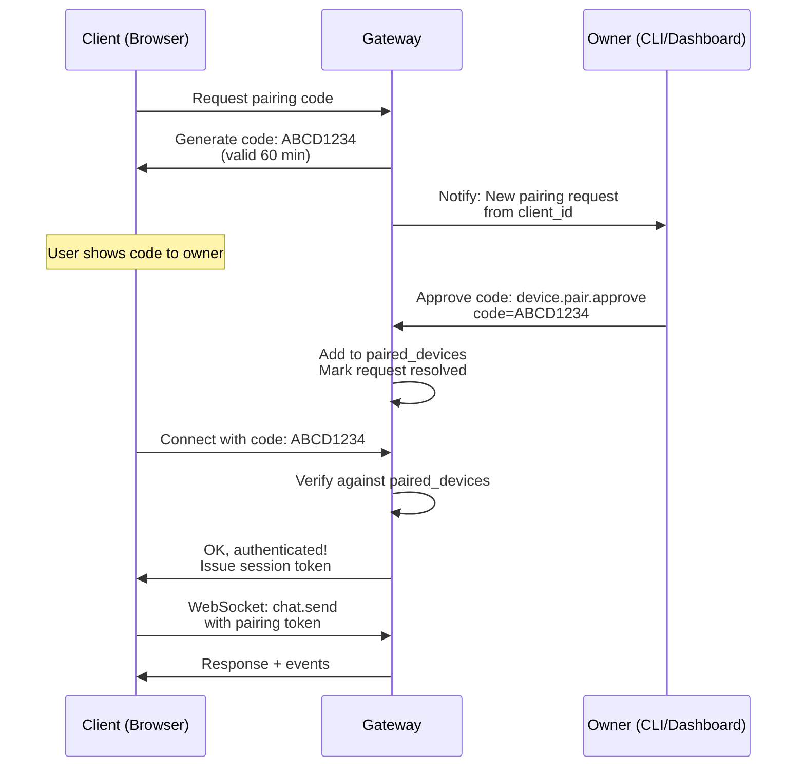

# Browser Pairing

Secure authentication flow for custom WebSocket clients using 8-character pairing codes. Ideal for private web apps and desktop clients that need to verify device identity.

## Pairing Flow



## Code Format

**Generation:**

- Length: 8 characters
- Alphabet: `ABCDEFGHJKLMNPQRSTUVWXYZ23456789` (excludes ambiguous: 0, O, 1, I, L)
- TTL: 60 minutes
- Max pending per account: 3

**Example codes:**
- `ABCD1234`
- `XY8PQRST`
- `2M5H9JKL`

## Implementation

### Step 1: Request Code (Client)

```bash
curl -X POST http://localhost:8080/v1/device/pair/request \
  -H "Content-Type: application/json" \
  -d '{
    "client_id": "browser_myclient_1",
    "device_name": "My Web App"
  }'
```

**Response:**

```json
{
  "code": "ABCD1234",
  "expires_at": 1709865000,
  "url": "http://localhost:8080/pair?code=ABCD1234"
}
```

Display code to user:

```
Please share this code with your gateway owner:

  ABCD1234

It expires in 60 minutes.
```

### Step 2: Approve Code (Owner)

Owner runs CLI command or uses dashboard to approve:

```bash
goclaw device.pair.approve --code ABCD1234
```

Or via WebSocket (admin only):

```json
{
  "type": "req",
  "id": "100",
  "method": "device.pair.approve",
  "params": {
    "code": "ABCD1234"
  }
}
```

**Response:**

```json
{
  "type": "res",
  "id": "100",
  "ok": true,
  "payload": {
    "client_id": "browser_myclient_1",
    "device_name": "My Web App",
    "paired_at": 1709864400
  }
}
```

### Step 3: Connect (Client)

Client uses the code to authenticate:

```json
{
  "type": "req",
  "id": "1",
  "method": "connect",
  "params": {
    "pairing_code": "ABCD1234",
    "user_id": "web_user_1"
  }
}
```

**Response:**

```json
{
  "type": "res",
  "id": "1",
  "ok": true,
  "payload": {
    "protocol": 3,
    "role": "operator",
    "user_id": "web_user_1",
    "session_token": "session_xyz..."
  }
}
```

Client stores `session_token` for future connections.

### Step 4: Use Session (Client)

On reconnect, use stored token:

```json
{
  "type": "req",
  "id": "1",
  "method": "connect",
  "params": {
    "session_token": "session_xyz...",
    "user_id": "web_user_1"
  }
}
```

## Security Properties

- **One-time use**: Each pairing code is used once and invalidated
- **Expiring**: Codes expire after 60 minutes
- **Limited pending**: Max 3 pending requests per account (prevents spam)
- **Owner approval**: Only gateway owner can approve codes (admin role required)
- **Session tokens**: Issued after approval; tied to device and user
- **Debouncing**: Pairing approval notifications debounced per sender (60 seconds)

## JavaScript Example

```javascript
class PairingClient {
  constructor(gatewayUrl) {
    this.url = gatewayUrl;
    this.ws = null;
    this.sessionToken = localStorage.getItem('goclaw_token');
  }

  async requestPairingCode() {
    const res = await fetch(`${this.url}/v1/device/pair/request`, {
      method: 'POST',
      headers: { 'Content-Type': 'application/json' },
      body: JSON.stringify({
        client_id: 'browser_' + Date.now(),
        device_name: navigator.userAgent
      })
    });
    const data = await res.json();
    return data.code;
  }

  connect() {
    this.ws = new WebSocket(this.url.replace('http', 'ws') + '/ws');
    this.ws.onopen = () => {
      if (this.sessionToken) {
        // Resume with token
        this.send('connect', {
          session_token: this.sessionToken,
          user_id: 'user_' + Date.now()
        });
      } else {
        console.log('No session token. Request pairing code first.');
      }
    };
    this.ws.onmessage = (e) => this.handleMessage(JSON.parse(e.data));
  }

  send(method, params) {
    this.ws.send(JSON.stringify({
      type: 'req',
      id: Date.now().toString(),
      method,
      params
    }));
  }

  handleMessage(frame) {
    if (frame.type === 'res' && frame.payload?.session_token) {
      localStorage.setItem('goclaw_token', frame.payload.session_token);
    }
    // Handle response...
  }
}
```

## Troubleshooting

| Issue | Solution |
|-------|----------|
| "Code expired" | Code is valid only 60 minutes. Request new code. |
| "Code not found" | Code never existed or already used. Request new code. |
| "Max pending exceeded" | Too many pending requests. Wait or have owner revoke old codes. |
| "Unauthorized" | Owner has not approved the code yet. Check with owner. |
| Session token invalid | Token may have expired or been revoked. Request new pairing code. |

## What's Next

- [Overview](/channels-overview) — Channel concepts and policies
- [WebSocket](/channel-websocket) — Direct RPC communication
- [Telegram](/channel-telegram) — Telegram setup
- [WebSocket Protocol](/websocket-protocol) — Full protocol reference

<!-- goclaw-source: 57754a5 | updated: 2026-03-18 -->
