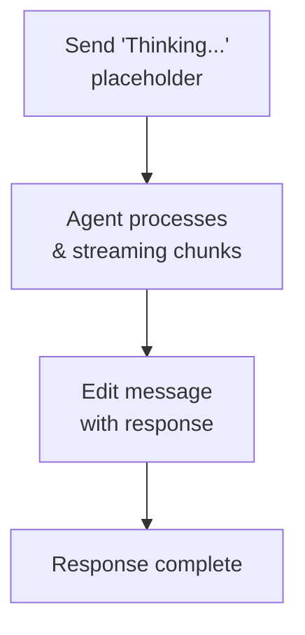

# Discord Channel

Discord bot integration via the Discord Gateway API. Supports DMs, servers, threads, and streaming responses via message editing.

## Setup

**Create a Discord Application:**
1. Go to https://discord.com/developers/applications
2. Click "New Application"
3. Go to "Bot" tab → "Add Bot"
4. Copy the token
5. Ensure `Message Content Intent` is enabled under "Privileged Gateway Intents"

**Add Bot to Server:**
1. OAuth2 → URL Generator
2. Select scopes: `bot`
3. Select permissions: `Send Messages`, `Read Message History`, `Read Messages/View Channels`
4. Copy the generated URL and open in browser

**Enable Discord:**

```json
{
  "channels": {
    "discord": {
      "enabled": true,
      "token": "YOUR_BOT_TOKEN",
      "dm_policy": "open",
      "group_policy": "open",
      "allow_from": ["alice_id", "bob_id"]
    }
  }
}
```

## Configuration

All config keys are in `channels.discord`:

| Key | Type | Default | Description |
|-----|------|---------|-------------|
| `enabled` | bool | false | Enable/disable channel |
| `token` | string | required | Bot token from Discord Developer Portal |
| `allow_from` | list | -- | User ID allowlist |
| `dm_policy` | string | `"open"` | `open`, `allowlist`, `pairing`, `disabled` |
| `group_policy` | string | `"open"` | `open`, `allowlist`, `disabled` |
| `require_mention` | bool | true | Require @bot mention in servers (channels) |
| `history_limit` | int | 50 | Pending messages per channel (0=disabled) |
| `block_reply` | bool | -- | Override gateway block_reply (nil=inherit) |

## Features

### Gateway Intents

Automatically requests `GuildMessages`, `DirectMessages`, and `MessageContent` intents on startup.

### Message Limits

Discord enforces 2,000 characters per message. Responses longer than this are split at newline boundaries.

### Placeholder Editing

Bot sends "Thinking..." placeholder immediately, then edits it with the actual response. This provides visual feedback while the agent processes.



### Mention Gating

In servers (channels), the bot requires being mentioned by default (`require_mention: true`). Pending messages are stored in a history buffer. When the bot is mentioned, history is included as context.

### Typing Indicator

While the agent processes, a typing indicator is shown (9-second keepalive). The typing indicator stops automatically after successful message delivery.

### Thread Support

The bot automatically detects and responds in Discord threads. Responses stay in the same thread.

### Media from Replied-to Messages

When a user replies to a message that contains media attachments, GoClaw extracts those attachments and includes them in the inbound message context. This lets the agent see and process media even when it was originally shared in a previous turn. Attachment source URLs are preserved in media tags, so agents can reference the original Discord CDN URL.

### Group Media History

Media files (images, video, audio) sent in group conversations are tracked in message history, allowing agents to reference previously shared media.

### Bot Identity

On startup, the bot fetches its own user ID via `@me` endpoint to avoid responding to its own messages.

### Allowlist and Pairing Policy

`dm_policy` and `group_policy` work as documented — `pairing`, `allowlist`, and `open` modes are handled exclusively by the policy evaluation layer. There is no additional allowlist gate after the policy check, so paired users are not wrongly rejected when an `allow_from` list is also configured. If a user is paired but also listed in `allow_from`, both conditions are satisfied and the message proceeds normally.

### Group File Writer Management

Discord supports slash-command-based management of group file writers (similar to Telegram's writer restriction). In server channels, write-sensitive operations can be restricted to designated writers:

| Command | Description |
|---------|-------------|
| `/addwriter` | Add a group file writer (reply to target user) |
| `/removewriter` | Remove a group file writer |
| `/writers` | List current group file writers |

Writers are managed per-group. The group ID format used internally is `group:discord:{channelID}`.

## Common Patterns

### Sending to a Channel

```go
manager.SendToChannel(ctx, "discord", "channel_id", "Hello!")
```

### Group Configuration

Per-guild/channel overrides are not yet supported in the Discord channel implementation. Use global `allow_from` and policies.

## Troubleshooting

| Issue | Solution |
|-------|----------|
| Bot doesn't respond | Check bot has necessary permissions. Verify `require_mention` setting. Ensure bot can read messages (`Message Content Intent` enabled). |
| "Unknown Application" error | Token is invalid or expired. Regenerate bot token. |
| Placeholder editing fails | Ensure bot has `Manage Messages` permission. Discord may revoke this during setup. |
| Message split incorrectly | Long responses are split at newlines. Control message length via model `max_tokens`. |
| Bot mentions itself | Check Discord permissions. Bot should not have `@everyone` or `@here` in responses. |

## What's Next

- [Overview](/channels-overview) — Channel concepts and policies
- [Telegram](/channel-telegram) — Telegram bot setup
- [Larksuite](/channel-feishu) — Larksuite integration with streaming cards
- [Browser Pairing](/channel-browser-pairing) — Pairing flow

<!-- goclaw-source: 29457bb3 | updated: 2026-04-25 -->
