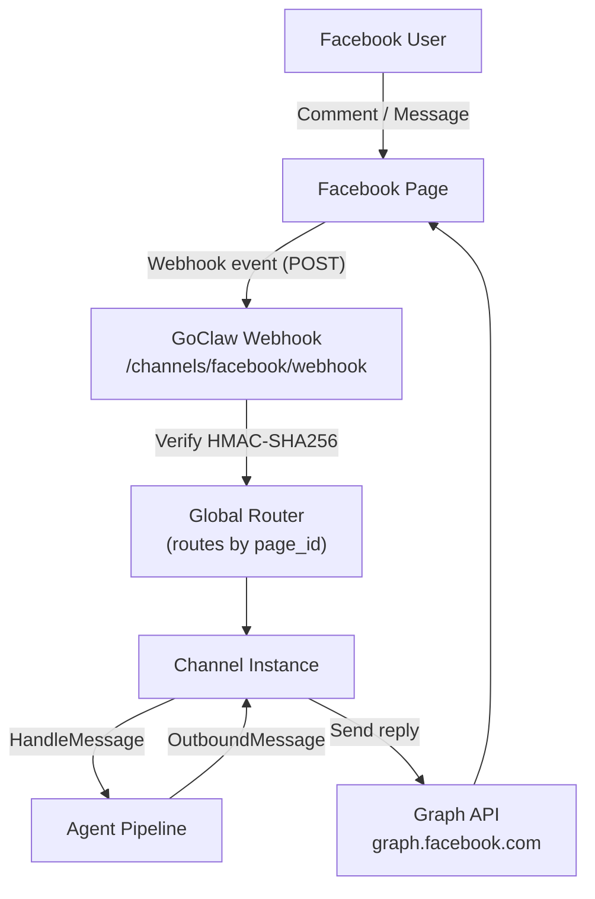

# Facebook Channel

Facebook Fanpage integration supporting Messenger inbox auto-reply, comment auto-reply, and first inbox DM via Facebook Graph API.

## Setup

### 1. Create a Facebook App

1. Go to [developers.facebook.com](https://developers.facebook.com) and create a new app
2. Choose **Business** type
3. Add the **Messenger** and **Webhooks** products
4. Under **Messenger Settings** → **Access Tokens** → generate a Page Access Token for your page
5. Copy your **App ID**, **App Secret**, and **Page Access Token**
6. Note your **Facebook Page ID** (visible in your page's About section or URL)

### 2. Configure the Webhook

In your Facebook App Dashboard → **Webhooks** → **Page**:

1. Set the callback URL: `https://your-goclaw-host/channels/facebook/webhook`
2. Set a verify token (any string you choose — use this as `verify_token` in GoClaw config)
3. Subscribe to these events: `messages`, `messaging_postbacks`, `feed`

### 3. Enable Facebook Channel

```json
{
  "channels": {
    "facebook": {
      "enabled": true,
      "instances": [
        {
          "name": "my-fanpage",
          "credentials": {
            "page_access_token": "YOUR_PAGE_ACCESS_TOKEN",
            "app_secret": "YOUR_APP_SECRET",
            "verify_token": "YOUR_VERIFY_TOKEN"
          },
          "config": {
            "page_id": "YOUR_PAGE_ID",
            "features": {
              "messenger_auto_reply": true,
              "comment_reply": false,
              "first_inbox": false
            }
          }
        }
      ]
    }
  }
}
```

## Configuration

### Credentials (encrypted)

| Key | Type | Description |
|-----|------|-------------|
| `page_access_token` | string | Page-level token from Facebook App Dashboard (required) |
| `app_secret` | string | App Secret for webhook signature verification (required) |
| `verify_token` | string | Token used to verify webhook endpoint ownership (required) |

### Instance Config

| Key | Type | Default | Description |
|-----|------|---------|-------------|
| `page_id` | string | required | Facebook Page ID |
| `features.messenger_auto_reply` | bool | false | Enable Messenger inbox auto-reply |
| `features.comment_reply` | bool | false | Enable comment auto-reply |
| `features.first_inbox` | bool | false | Send a one-time DM after first comment reply |
| `comment_reply_options.include_post_context` | bool | false | Fetch post content to enrich comment context |
| `comment_reply_options.max_thread_depth` | int | 10 | Max depth for fetching parent comment threads |
| `messenger_options.session_timeout` | string | -- | Override session timeout for Messenger conversations (e.g. `"30m"`) |
| `post_context_cache_ttl` | string | -- | Cache TTL for post content fetches (e.g. `"10m"`) |
| `first_inbox_message` | string | -- | Custom DM text sent after first comment reply (defaults to Vietnamese if empty) |
| `allow_from` | list | -- | Sender ID allowlist |

## Architecture



- **Single webhook endpoint** — all Facebook channel instances share `/channels/facebook/webhook`, routed by `page_id`
- **HMAC-SHA256 verification** — every webhook delivery is verified against `app_secret` via `X-Hub-Signature-256` header
- **Graph API v25.0** — all outbound calls use the versioned Graph API endpoint

## Features

### fb_mode: Page Mode vs Comment Mode

The `fb_mode` metadata field controls how the agent's reply is delivered:

| `fb_mode` | Trigger | Reply method |
|-----------|---------|--------------|
| `messenger` | Messenger inbox message | `POST /me/messages` to the sender |
| `comment` | Comment on a page post | `POST /{comment_id}/comments` reply |

The channel sets `fb_mode` automatically based on the event type. Agents can read this metadata to tailor their response style.

### Messenger Auto-Reply

When `features.messenger_auto_reply` is enabled:

- Responds to text messages and postbacks from users in Messenger
- Session key is `senderID` (1:1 channel-scoped conversations)
- Skips delivery/read receipts and attachment-only messages
- Long responses are automatically split at 2,000 characters

### Comment Auto-Reply

When `features.comment_reply` is enabled:

- Responds to new comments on the page's posts (`verb: "add"`)
- Ignores comment edits and deletions
- Session key: `{post_id}:{sender_id}` — groups all comments from the same user on the same post
- Optional: fetches post content and parent comment thread for richer context (see `comment_reply_options`)

### Admin Reply Detection

GoClaw automatically detects when a human page admin replies to a conversation and suppresses the bot's auto-reply for a **5-minute cooldown window**. This prevents the bot from sending a duplicate message after the admin has already responded.

Detection logic:
1. When a message from `sender_id == page_id` arrives, GoClaw records the recipient as admin-replied
2. Bot echo detection: if the bot itself just sent a message within a 15-second window, the "admin reply" is ignored (it's the bot's own echo)
3. Cooldown expires after 5 minutes — auto-reply resumes

### First Inbox DM

When `features.first_inbox` is enabled, GoClaw sends a one-time private Messenger DM to a user after the bot first replies to their comment:

- Sent at most once per user per process lifetime (in-memory dedup)
- Customize the message with `first_inbox_message`; defaults to Vietnamese if empty
- Best-effort: send failures are logged and retried on next comment

### Webhook Setup

The webhook handler:

1. **GET** — Verifies ownership by echoing `hub.challenge` when `hub.verify_token` matches
2. **POST** — Processes event delivery:
   - Validates `X-Hub-Signature-256` HMAC-SHA256 signature
   - Parses `feed` changes for comment events
   - Parses `messaging` events for Messenger events
   - Always returns HTTP 200 (non-2xx causes Facebook to retry for 24 hours)

Body size is capped at 4 MB. Oversized payloads are dropped with a warning.

### Message Deduplication

Facebook may deliver the same webhook event more than once. GoClaw deduplicates by event key:

- Messenger: `msg:{message_mid}`
- Postback: `postback:{sender_id}:{timestamp}:{payload}`
- Comment: `comment:{comment_id}`

Dedup entries expire after 24 hours (matching Facebook's max retry window). A background cleaner evicts stale entries every 5 minutes.

### Graph API

All outbound calls go through `graph.facebook.com/v25.0` with automatic retry:

- **3 retries** with exponential backoff (1s, 2s, 4s)
- **Rate limit handling**: parses `X-Business-Use-Case-Usage` header and respects `Retry-After`
- **Token passed via `Authorization: Bearer` header** (never in URL)
- **24h messaging window**: code 551 / subcode 2018109 are non-retryable (user has not messaged in 24h)

### Media Support

**Inbound** (Messenger): Attachment URLs are included in the message metadata. Types: `image`, `video`, `audio`, `file`.

**Outbound**: Text replies only. Media delivery from the agent is not currently supported for the native Facebook channel. Use [Pancake](/channel-pancake) for full media support across Facebook and other platforms.

## Troubleshooting

| Issue | Solution |
|-------|----------|
| Webhook verification fails | Check `verify_token` in GoClaw matches the token in Facebook App Dashboard. |
| `page_access_token is required` | Add `page_access_token` to credentials. |
| `page_id is required` | Add `page_id` to instance config. |
| Token verification failed on start | The `page_access_token` may be expired. Regenerate from Facebook App Dashboard. |
| No events received | Ensure webhook callback URL is publicly accessible. Check Facebook App → Webhooks subscriptions (`messages`, `feed`). |
| Signature invalid warnings | Ensure `app_secret` in GoClaw matches the App Secret in Facebook App Dashboard. |
| Bot replies after admin already responded | Expected — bot suppresses for 5 min after admin reply. Set `features.messenger_auto_reply: false` to disable entirely. |
| 24h messaging window error | The user hasn't sent a message in the last 24 hours. Facebook restricts bot-initiated messages outside this window. |
| Duplicate messages | Dedup handles this automatically. If persistent, check for multiple GoClaw instances with the same `page_id`. |

## What's Next

- [Overview](/channels-overview) — Channel concepts and policies
- [Pancake](/channel-pancake) — Multi-platform proxy (Facebook + Zalo + Instagram + more)
- [Zalo OA](/channel-zalo-oa) — Zalo Official Account
- [Telegram](/channel-telegram) — Telegram bot setup

<!-- goclaw-source: 050aafc9 | updated: 2026-04-15 -->
