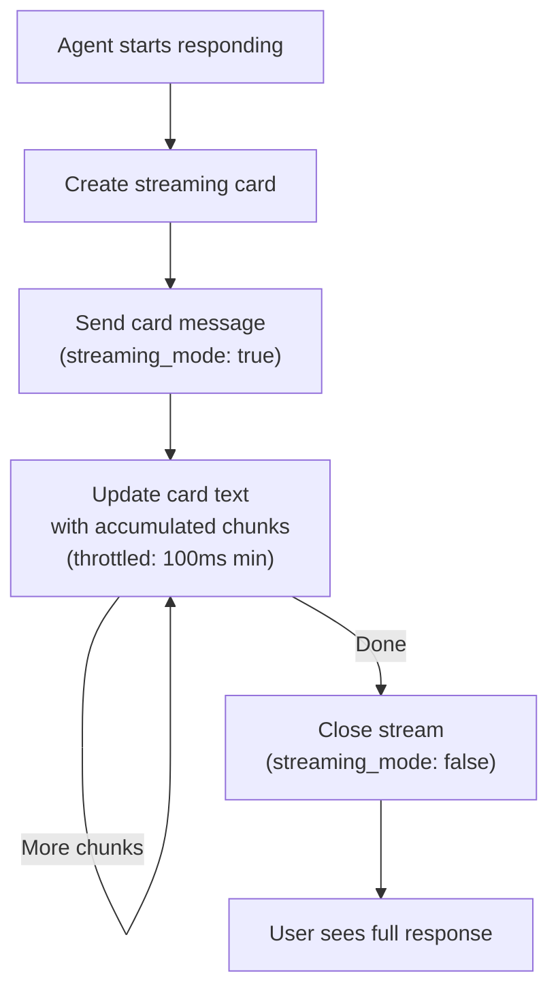

# Larksuite Channel

[Larksuite](https://www.larksuite.com/) messaging integration supporting DMs, groups, streaming cards, and real-time updates via WebSocket or webhook.

## Setup

**Create Larksuite App:**

1. Go to https://open.larksuite.com
2. Create custom app → fill Basic Information
3. Under "Bots" → enable "Bot" capability
4. Set bot name and avatar
5. Copy `App ID` and `App Secret`
6. Grant the required API scopes (see [Required API Scopes](#required-api-scopes) below)
7. Set Contact Range to **"All members"** under Permissions & Scopes → Contacts
8. Publish the app version (scopes take effect only after publishing)

**Enable Larksuite:**

```json
{
  "channels": {
    "feishu": {
      "enabled": true,
      "app_id": "YOUR_APP_ID",
      "app_secret": "YOUR_APP_SECRET",
      "connection_mode": "websocket",
      "domain": "lark",
      "dm_policy": "pairing",
      "group_policy": "open"
    }
  }
}
```

## Configuration

All config keys are in `channels.feishu`:

| Key | Type | Default | Description |
|-----|------|---------|-------------|
| `enabled` | bool | false | Enable/disable channel |
| `app_id` | string | required | App ID from Larksuite Developer Console |
| `app_secret` | string | required | App Secret from Larksuite Developer Console |
| `encrypt_key` | string | -- | Optional message encryption key |
| `verification_token` | string | -- | Optional webhook verification token |
| `domain` | string | `"lark"` | `"lark"` (Larksuite) or custom domain |
| `connection_mode` | string | `"websocket"` | `"websocket"` or `"webhook"` |
| `webhook_port` | int | 3000 | Port for webhook server (0=mount on gateway mux) |
| `webhook_path` | string | `"/feishu/events"` | Webhook endpoint path |
| `allow_from` | list | -- | User ID allowlist (DMs) |
| `dm_policy` | string | `"pairing"` | `pairing`, `allowlist`, `open`, `disabled` |
| `group_policy` | string | `"open"` | `open`, `allowlist`, `disabled` |
| `group_allow_from` | list | -- | Group ID allowlist |
| `require_mention` | bool | true | Require bot mention in groups |
| `topic_session_mode` | string | `"disabled"` | `"disabled"` or `"enabled"` for thread isolation |
| `text_chunk_limit` | int | 4000 | Max text characters per message |
| `media_max_mb` | int | 30 | Max media file size (MB) |
| `render_mode` | string | `"auto"` | `"auto"` (detect), `"card"`, `"raw"` |
| `streaming` | bool | true | Enable streaming card updates |
| `reaction_level` | string | `"off"` | `off`, `minimal` (⏳ only), `full` |

## Transport Modes

### WebSocket (Default)

Persistent connection with auto-reconnect. Recommended for low latency.

```json
{
  "connection_mode": "websocket"
}
```

### Webhook

Larksuite sends events via HTTP POST. Choose:

1. **Mount on gateway mux** (`webhook_port: 0`): Handler shares main gateway port
2. **Separate server** (`webhook_port: 3000`): Dedicated webhook listener

```json
{
  "connection_mode": "webhook",
  "webhook_port": 0,
  "webhook_path": "/feishu/events"
}
```

Then configure the webhook URL in Larksuite Developer Console:
- Gateway mux: `https://your-gateway.com/feishu/events`
- Separate server: `https://your-webhook-host:3000/feishu/events`

## Required API Scopes

Your Larksuite app needs these 15 scopes. The Dashboard shows the full list in a collapsible panel when creating or editing a Feishu channel.

| Scope | Purpose |
|-------|---------|
| `im:message` | Core messaging |
| `im:message:readonly` | Read messages (reply context) |
| `im:message.p2p_msg:send` | Send DMs |
| `im:message.group_msg:send` | Send group messages |
| `im:message.group_at_msg` | Send @-mention messages |
| `im:message.group_at_msg:readonly` | Read @-mention messages |
| `im:chat` | Chat management |
| `im:chat:readonly` | Read chat info |
| `im:resource` | Upload/download media |
| `contact:user.base:readonly` | Read user profiles |
| `contact:user.id:readonly` | Resolve user IDs |
| `contact:user.employee_id:readonly` | Resolve employee IDs |
| `contact:user.phone:readonly` | Resolve phone numbers |
| `contact:user.email:readonly` | Resolve emails |
| `contact:department.id:readonly` | Department lookup |

> **Important:** After granting scopes, set **Contact Range** to **"All members"** under Permissions & Scopes → Contacts, then publish a new app version. Without this, contact resolution returns empty names.

## Features

### Reply Context

When a user replies to a message in a DM, GoClaw includes the original message as context for the agent. In DMs, a `[From: sender_name]` annotation is prepended so the agent knows who sent the message.

### Streaming Cards

Real-time updates delivered as interactive card messages with animation:



Updates throttled to prevent rate limiting. Display uses 50ms animation frequency (2-character steps).

### Media Handling

**Inbound**: Images, files, audio, video, stickers auto-downloaded and saved:

| Type | Extension |
|------|-----------|
| Image | `.png` |
| File | Original extension |
| Audio | `.opus` |
| Video | `.mp4` |
| Sticker | `.png` |

Max 30 MB by default (`media_max_mb`).

**Outbound**: Files auto-detected and uploaded with correct type (opus, mp4, pdf, doc, xls, ppt, or stream).

**Rich post messages**: GoClaw also extracts images embedded in Lark rich-text `post` messages (not only standalone image messages). Images within a post body are downloaded and included alongside other media in the inbound message context.

### @Mention Support

The bot sends native Lark @mentions in group messages. When the agent response contains `@open_id` patterns (e.g. `@ou_abc123`), they are automatically converted to native Lark `at` elements that trigger real notifications to the mentioned user. This works in both `post` text messages and interactive card messages.

### Mention Resolution

Larksuite sends placeholder tokens (e.g., `@_user_1`). Bot parses mention list and resolves to `@DisplayName`.

### Thread Session Isolation

When `topic_session_mode: "enabled"`, each thread gets isolated conversation:

```
Session key: "{chatID}:topic:{rootMessageID}"
```

Different threads in same group maintain separate histories.

### list_group_members Tool

When connected to a Larksuite channel, agents have access to the `list_group_members` tool. It returns all members of the current group chat with their `open_id` and display name.

```
list_group_members(channel?, chat_id?) → { count, members: [{ member_id, name }] }
```

Use cases: checking who is in a group, identifying members before mentioning them, attendance tracking. To @mention a member in a reply, use `@member_id` (e.g. `@ou_abc123`) — the bot converts it to a native Lark mention with notification.

> This tool is only available on Feishu/Lark channels. It will not appear in the tool list for other channel types.

### Per-Topic Tool Allow List

Forum topics support their own tool whitelist. Configure under the agent's tool settings or channel metadata:

| Value | Behavior |
|-------|----------|
| `nil` (omit) | Inherit parent group's tool allow list |
| `[]` (empty) | No tools allowed in this topic |
| `["web_search", "group:fs"]` | Only these tools allowed |

The `group:fs` prefix selects all tools in the `fs` (Feishu/Lark) tool group. This follows the same `group:xxx` syntax used in Telegram topic config.

## Troubleshooting

| Issue | Solution |
|-------|----------|
| "Invalid app credentials" | Check app_id and app_secret. Ensure app is published. |
| Webhook not receiving events | Verify webhook URL is publicly accessible. Check Larksuite Developer Console event subscriptions. |
| WebSocket keeps disconnecting | Check network. Verify app has `im:message` permission. |
| Streaming cards not updating | Ensure `streaming: true`. Check `render_mode` (auto/card). Messages shorter than limit render as plain text. |
| Media upload fails | Verify file type matches. Check file size under `media_max_mb`. |
| Mention not parsed | Ensure bot is mentioned. Check mention list in webhook payload. |

## What's Next

- [Overview](/channels-overview) — Channel concepts and policies
- [Telegram](/channel-telegram) — Telegram bot setup
- [Zalo OA](/channel-zalo-oa) — Zalo Official Account
- [Browser Pairing](/channel-browser-pairing) — Pairing flow

<!-- goclaw-source: 120fc2d | updated: 2026-03-19 -->
