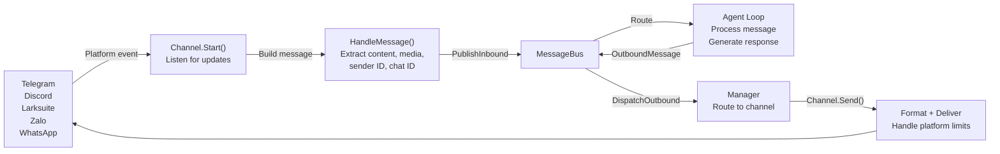
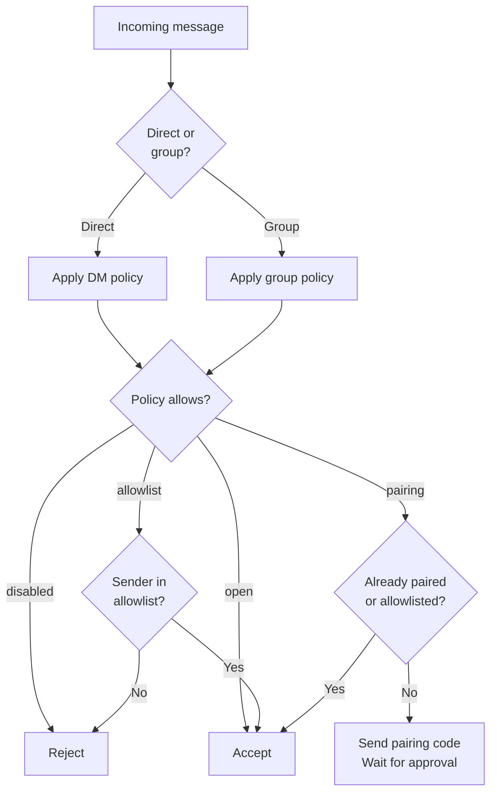

# Channels Overview

Channels connect messaging platforms (Telegram, Discord, Larksuite, etc.) to the GoClaw agent runtime via a unified message bus. Each channel translates platform-specific events into standardized `InboundMessage` objects and converts agent responses into platform-appropriate output.

## Message Flow



## Channel Policies

Control who can send messages via DM or group settings.

### DM Policies

| Policy | Behavior | Use Case |
|--------|----------|----------|
| `pairing` | Require 8-char code approval for new users | Secure, controlled access |
| `allowlist` | Only whitelisted senders accepted | Restricted group |
| `open` | Accept all DMs | Public bot |
| `disabled` | Reject all DMs | Groups only |

### Group Policies

| Policy | Behavior | Use Case |
|--------|----------|----------|
| `open` | Accept all group messages | Public groups |
| `allowlist` | Only whitelisted groups accepted | Restricted groups |
| `disabled` | No group messages | DMs only |

### Policy Evaluation Flow



## Session Key Format

Session keys identify unique conversations and threads across platforms.

| Context | Format | Example |
|---------|--------|---------|
| Telegram DM | Chat ID | `"123456"` |
| Telegram group | Chat ID + group | `"-12345"` |
| Telegram topic/thread | Chat + topic ID | `"-12345:topic:99"` |
| Larksuite DM/group | Conversation ID | `"oc_xyz..."` |
| Larksuite thread | Conversation + root message | `"oc_xyz:topic:{msg_id}"` |
| Discord DM/channel | Channel ID | `"987654"` |

## Channel Comparison

| Feature | Telegram | Discord | Larksuite | Zalo OA | Zalo Pers | WhatsApp |
|---------|----------|---------|--------|---------|-----------|----------|
| **Transport** | Long polling | Gateway events | WS/Webhook | Long polling | Internal proto | WS bridge |
| **DM support** | Yes | Yes | Yes | Yes | Yes | Yes |
| **Group support** | Yes | Yes | Yes | No | Yes | Yes |
| **Streaming** | Yes (typing) | Yes (edit) | Yes (card) | No | No | No |
| **Media** | Photos, voice, files | Files, embeds | Images, files | Images (5MB) | -- | JSON |
| **Rich format** | HTML | Markdown | Cards | Plain text | Plain text | Plain |
| **Reactions** | Yes | -- | Yes | -- | -- | -- |
| **Pairing** | Yes | Yes | Yes | Yes | Yes | Yes |
| **Message limit** | 4,096 | 2,000 | 4,000 | 2,000 | 2,000 | N/A |

## Implementation Checklist

When adding a new channel, implement these methods:

- **`Name()`** — Return channel identifier (e.g., `"telegram"`)
- **`Start(ctx)`** — Begin listening for messages
- **`Stop(ctx)`** — Graceful shutdown
- **`Send(ctx, msg)`** — Deliver message to platform
- **`IsRunning()`** — Report running status
- **`IsAllowed(senderID)`** — Check allowlist

Optional interfaces:

- **`StreamingChannel`** — Real-time message updates (chunks, typing indicators)
- **`ReactionChannel`** — Status emoji reactions (thinking, done, error)
- **`WebhookChannel`** — HTTP handler mountable on main gateway mux
- **`BlockReplyChannel`** — Override gateway block_reply setting

## Common Patterns

### Message Handling

All channels use `BaseChannel.HandleMessage()` to forward messages to the bus:

```go
ch.HandleMessage(
    senderID,        // "telegram:123" or "discord:456@guild"
    chatID,          // where to send responses
    content,         // user text
    media,           // file URLs/paths
    metadata,        // routing hints
    "direct",        // or "group"
)
```

### Allowlist Matching

Support compound sender IDs like `"123|username"`. Allowlist can contain:

- User IDs: `"123456"`
- Usernames: `"@alice"`
- Compound: `"123456|alice"`
- Wildcards: Not supported

### Rate Limiting

Channels may enforce per-user rate limits. Configure via channel settings or implement custom logic.

## Next Steps

- [Telegram](./telegram.md) — Full guide for Telegram integration
- [Discord](./discord.md) — Discord bot setup
- [Larksuite](./larksuite.md) — Larksuite integration with streaming cards
- [WebSocket](./websocket.md) — Direct agent API via WS
- [Browser Pairing](./browser-pairing.md) — 8-char code pairing flow
