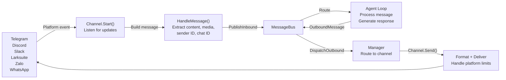
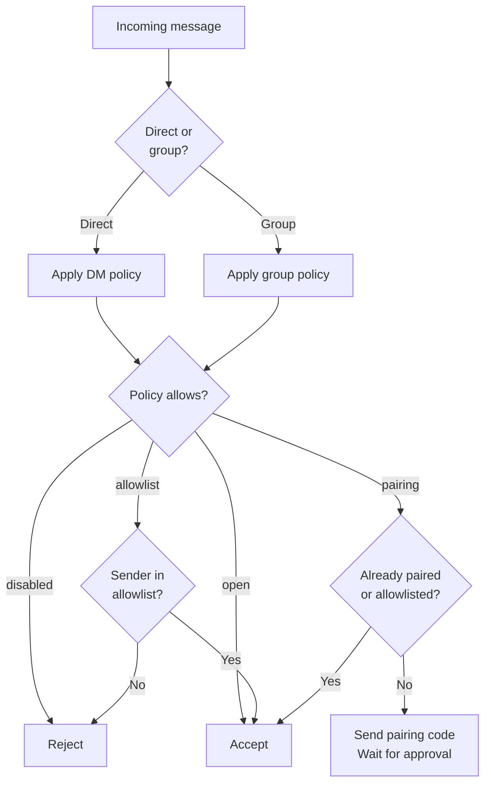

# Channels Overview

Channels connect messaging platforms (Telegram, Discord, Larksuite, etc.) to the GoClaw agent runtime via a unified message bus. Each channel translates platform-specific events into standardized `InboundMessage` objects and converts agent responses into platform-appropriate output.

## Message Flow



## Channel Policies

Control who can send messages via DM or group settings.

### DM Policies

| Policy | Behavior | Use Case |
|--------|----------|----------|
| `pairing` | Require 8-char code approval for new users | Secure, controlled access |
| `allowlist` | Only whitelisted senders accepted | Restricted group |
| `open` | Accept all DMs | Public bot |
| `disabled` | Reject all DMs | Groups only |

### Group Policies

| Policy | Behavior | Use Case |
|--------|----------|----------|
| `open` | Accept all group messages | Public groups |
| `allowlist` | Only whitelisted groups accepted | Restricted groups |
| `disabled` | No group messages | DMs only |

### Policy Evaluation Flow



## Session Key Format

Session keys identify unique conversations and threads across platforms. All keys follow the canonical format `agent:{agentId}:{rest}`.

| Context | Format | Example |
|---------|--------|---------|
| DM | `agent:{agentId}:{channel}:direct:{peerId}` | `agent:default:telegram:direct:386246614` |
| Group | `agent:{agentId}:{channel}:group:{groupId}` | `agent:default:telegram:group:-100123456` |
| Forum topic | `agent:{agentId}:{channel}:group:{groupId}:topic:{topicId}` | `agent:default:telegram:group:-100123456:topic:99` |
| DM thread | `agent:{agentId}:{channel}:direct:{peerId}:thread:{threadId}` | `agent:default:telegram:direct:386246614:thread:5` |
| Subagent | `agent:{agentId}:subagent:{label}` | `agent:default:subagent:my-task` |

## Media Handling Notes

### Media from Replied-to Messages

GoClaw extracts media attachments from the message being replied to across all channels that support replies. When a user replies to a message containing images or files, those attachments are automatically included in the agent's inbound message context — no extra steps required.

### Outbound Media Size Limit

The `media_max_bytes` config field enforces a per-channel limit on outbound media uploads sent by the agent. Files exceeding this limit are skipped with a log entry. Each channel sets its own default (e.g., 20 MB for Telegram, 30 MB for Feishu/Lark). Configure per channel if needed.

## Channel Comparison

| Feature | Telegram | Discord | Slack | Larksuite | Zalo OA | Zalo Pers | WhatsApp |
|---------|----------|---------|-------|--------|---------|-----------|----------|
| **Transport** | Long polling | Gateway events | Socket Mode (WS) | WS/Webhook | Long polling | Internal proto | WS bridge |
| **DM support** | Yes | Yes | Yes | Yes | Yes | Yes | Yes |
| **Group support** | Yes | Yes | Yes | Yes | No | Yes | Yes |
| **Streaming** | Yes (typing) | Yes (edit) | Yes (edit) | Yes (card) | No | No | No |
| **Media** | Photos, voice, files | Files, embeds | Files (20MB) | Images, files (30MB) | Images (5MB) | -- | JSON |
| **Reply media** | Yes | Yes | -- | Yes | -- | -- | -- |
| **Rich format** | HTML | Markdown | mrkdwn | Cards | Plain text | Plain text | Plain |
| **Thread support** | Yes | -- | -- | -- | -- | -- | -- |
| **Reactions** | Yes | -- | Yes | Yes | -- | -- | -- |
| **Pairing** | Yes | Yes | Yes | Yes | Yes | Yes | Yes |
| **Message limit** | 4,096 | 2,000 | 4,000 | 4,000 | 2,000 | 2,000 | N/A |

## Channel Health Diagnostics

GoClaw tracks the runtime health of each channel instance and provides actionable diagnostics when issues occur. Health state is exposed via the `channels.status` WebSocket method and the dashboard overview page.

### Health States

| State | Meaning |
|-------|---------|
| `registered` | Channel is configured but not yet started |
| `starting` | Channel is initializing |
| `healthy` | Running normally |
| `degraded` | Running with issues |
| `failed` | Stopped due to an error |
| `stopped` | Manually stopped |

### Failure Classification

When a channel fails, GoClaw classifies the error into one of four categories:

| Kind | Typical Cause | Remediation |
|------|---------------|-------------|
| `auth` | Invalid or expired token/secret | Review credentials or re-authenticate |
| `config` | Missing required settings, invalid proxy | Complete required fields in channel settings |
| `network` | Timeout, connection refused, DNS failure | Check upstream service reachability and proxy settings |
| `unknown` | Unrecognized error | Inspect server logs for the full error |

Each failure includes a **remediation hint** — a short operator instruction pointing to the specific UI surface (credentials panel, advanced settings, or details page) where the issue can be resolved. The dashboard surfaces these hints directly on channel cards.

### Health Tracking

The health system tracks failure history per channel:
- **Consecutive failures** — resets when the channel recovers
- **Total failure count** — lifetime counter
- **First/last failure timestamps** — for diagnosing intermittent issues
- **Last healthy timestamp** — when the channel was last operational

---

## Implementation Checklist

When adding a new channel, implement these methods:

- **`Name()`** — Return channel identifier (e.g., `"telegram"`)
- **`Start(ctx)`** — Begin listening for messages
- **`Stop(ctx)`** — Graceful shutdown
- **`Send(ctx, msg)`** — Deliver message to platform
- **`IsRunning()`** — Report running status
- **`IsAllowed(senderID)`** — Check allowlist

Optional interfaces:

- **`StreamingChannel`** — Real-time message updates (chunks, typing indicators)
- **`ReactionChannel`** — Status emoji reactions (thinking, done, error)
- **`WebhookChannel`** — HTTP handler mountable on main gateway mux
- **`BlockReplyChannel`** — Override gateway block_reply setting

## Common Patterns

### Message Handling

All channels use `BaseChannel.HandleMessage()` to forward messages to the bus:

```go
ch.HandleMessage(
    senderID,        // "telegram:123" or "discord:456@guild"
    chatID,          // where to send responses
    content,         // user text
    media,           // file URLs/paths
    metadata,        // routing hints
    "direct",        // or "group"
)
```

### Allowlist Matching

Support compound sender IDs like `"123|username"`. Allowlist can contain:

- User IDs: `"123456"`
- Usernames: `"@alice"`
- Compound: `"123456|alice"`
- Wildcards: Not supported

### Rate Limiting

Channels may enforce per-user rate limits. Configure via channel settings or implement custom logic.

## Next Steps

- [Telegram](/channel-telegram) — Full guide for Telegram integration
- [Discord](/channel-discord) — Discord bot setup
- [Slack](/channel-slack) — Slack Socket Mode integration
- [Larksuite](/channel-feishu) — Larksuite integration with streaming cards
- [WebSocket](/channel-websocket) — Direct agent API via WS
- [Browser Pairing](/channel-browser-pairing) — 8-char code pairing flow

<!-- goclaw-source: 050aafc9 | updated: 2026-04-09 -->
