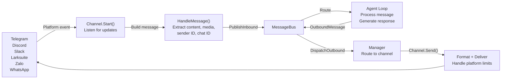
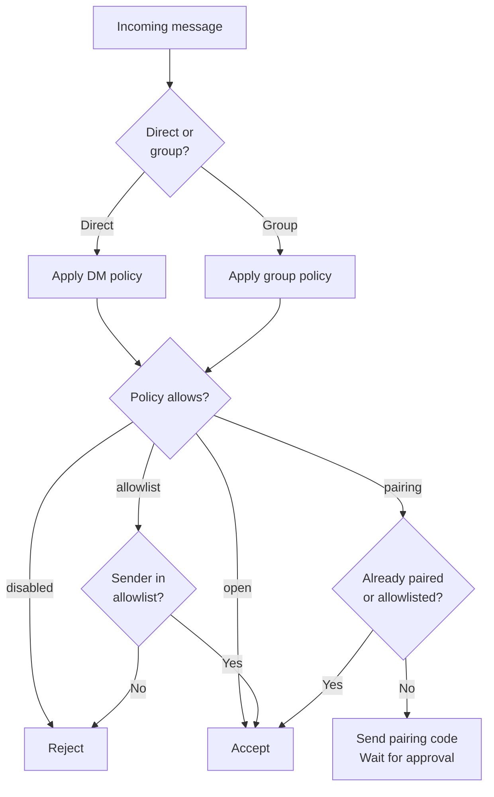

# Channels Overview

Channels connect messaging platforms (Telegram, Discord, Larksuite, etc.) to the GoClaw agent runtime via a unified message bus. Each channel translates platform-specific events into standardized `InboundMessage` objects and converts agent responses into platform-appropriate output.

## Message Flow


```mermaid
flowchart LR
    TG["Telegram<br/>Discord<br/>Slack<br/>Larksuite<br/>Zalo<br/>WhatsApp"]

    TG -->|"Platform event"| Listen["Channel.Start()<br/>Listen for updates"]
    Listen -->|"Build message"| Handle["HandleMessage()<br/>Extract content, media,<br/>sender ID, chat ID"]
    Handle -->|"PublishInbound"| Bus["MessageBus"]

    Bus -->|"Route"| Agent["Agent Loop<br/>Process message<br/>Generate response"]
    Agent -->|"OutboundMessage"| Bus

    Bus -->|"DispatchOutbound"| Manager["Manager<br/>Route to channel"]
    Manager -->|"Channel.Send()"| Send["Format + Deliver<br/>Handle platform limits"]
    Send --> TG
```

## Channel Policies

Control who can send messages via DM or group settings.

### DM Policies

| Policy | Behavior | Use Case |
|--------|----------|----------|
| `pairing` | Require 8-char code approval for new users | Secure, controlled access |
| `allowlist` | Only whitelisted senders accepted | Restricted group |
| `open` | Accept all DMs | Public bot |
| `disabled` | Reject all DMs | Groups only |

### Group Policies

| Policy | Behavior | Use Case |
|--------|----------|----------|
| `open` | Accept all group messages | Public groups |
| `allowlist` | Only whitelisted groups accepted | Restricted groups |
| `disabled` | No group messages | DMs only |

### Policy Evaluation Flow


```mermaid
flowchart TD
    MSG["Incoming message"] --> KIND{"Direct or<br/>group?"}
    KIND -->|Direct| DPOLICY["Apply DM policy"]
    KIND -->|Group| GPOLICY["Apply group policy"]

    DPOLICY --> CHECK{"Policy allows?"}
    GPOLICY --> CHECK

    CHECK -->|disabled| REJECT["Reject"]
    CHECK -->|open| ACCEPT["Accept"]
    CHECK -->|allowlist| ALLOWED{"Sender in<br/>allowlist?"}
    ALLOWED -->|Yes| ACCEPT
    ALLOWED -->|No| REJECT
    CHECK -->|pairing| PAIRED{"Already paired<br/>or allowlisted?"}
    PAIRED -->|Yes| ACCEPT
    PAIRED -->|No| SEND_CODE["Send pairing code<br/>Wait for approval"]
```

## Session Key Format

Session keys identify unique conversations and threads across platforms. All keys follow the canonical format `agent:{agentId}:{rest}`.

| Context | Format | Example |
|---------|--------|---------|
| DM | `agent:{agentId}:{channel}:direct:{peerId}` | `agent:default:telegram:direct:386246614` |
| Group | `agent:{agentId}:{channel}:group:{groupId}` | `agent:default:telegram:group:-100123456` |
| Forum topic | `agent:{agentId}:{channel}:group:{groupId}:topic:{topicId}` | `agent:default:telegram:group:-100123456:topic:99` |
| DM thread | `agent:{agentId}:{channel}:direct:{peerId}:thread:{threadId}` | `agent:default:telegram:direct:386246614:thread:5` |
| Subagent | `agent:{agentId}:subagent:{label}` | `agent:default:subagent:my-task` |

## Media Handling Notes

### Media from Replied-to Messages

GoClaw extracts media attachments from the message being replied to across all channels that support replies. When a user replies to a message containing images or files, those attachments are automatically included in the agent's inbound message context — no extra steps required.

### Outbound Media Size Limit

The `media_max_bytes` config field enforces a per-channel limit on outbound media uploads sent by the agent. Files exceeding this limit are skipped with a log entry. Each channel sets its own default (e.g., 20 MB for Telegram, 30 MB for Feishu/Lark). Configure per channel if needed.

### Multi-Attachment Delivery (Batching)

The `send_file` tool can deliver several existing workspace files in one go. Two forms are accepted:

- **Single file:** `path` (plus an optional `caption`).
- **Batch:** `attachments: [{ "path": "...", "caption": "..." }, ...]` — file order, MIME type, filename, and per-file captions are preserved.

How each channel groups a batch depends on what the platform supports:

| Channel | Grouping | Behavior |
|---------|----------|----------|
| Telegram | Album chunks | Compatible media are grouped into `sendMediaGroup` albums of **2–10** items. Photos/videos can share a chunk; documents group only with documents, audio only with audio. Voice-mode audio, singleton chunks, oversized images sent as documents, and incompatible runs fall back to ordered single-send. |
| Discord | Single message | Multiple files (plus optional text) are delivered in **one** message, up to 10 attachments. |
| Slack and other media-capable channels | Ordered fallback | Files are sent one after another in order unless the adapter advertises a stronger batch capability. |

## Inbound Debounce

When a user fires several messages in quick succession (or uploads multiple files at once), GoClaw merges them into a **single** inbound message before running the agent — one reply instead of one per fragment.

Set the silence window with `gateway.inbound_debounce_ms` (milliseconds):

```json
{
  "gateway": {
    "inbound_debounce_ms": 1500
  }
}
```

- Messages are buffered per `channel:chatID:senderID:agentID` key. The timer resets on every new message, so the merged message flushes only after the sender goes quiet for the configured window.
- `0` **disables** text debouncing — each message dispatches immediately.
- **Per-agent override:** an agent can set `inbound_debounce_ms` in its `agent_config` to use a different window than the gateway default.
- **`/stop` and `/reset` bypass the debouncer** — control commands are handled immediately and never buffered.
- **Media floor:** media-bearing messages no longer bypass debouncing. The effective window is `max(configured, media floor)`, so a multi-file upload always coalesces into one inbound even when text debouncing is set to `0`. (A non-zero agent override is honored verbatim — operators who set, say, `500` keep `500`, not the floor.) Messages synthesized internally by tools/subagents are exempt from the floor.

## Human-like Delivery

GoClaw can make channel replies feel more conversational — a quick acknowledgement before a long run, short progress notes while tools execute, and splitting a long final answer into a few natural messages. This is configured under `gateway.chat_behavior` and is **disabled by default**.

> These behaviors are **delivery-only**. Acknowledgements, progress notes, and split parts are never written to session history or sent back to the model as conversation — they only change what the human sees in the chat.

```json
{
  "gateway": {
    "chat_behavior": {
      "enabled": true,
      "quick_ack": { "enabled": true, "mode": "sidecar_generated" },
      "intermediate_replies": { "enabled": true },
      "final_split": { "enabled": true }
    }
  }
}
```

### The three sub-behaviors

| Sub-behavior | What it does |
|--------------|--------------|
| `quick_ack` | Sends one short receipt before a longer non-streaming run, so the user knows the bot is working. |
| `intermediate_replies` | Sends short progress updates while the agent is running tools. Independent from `quick_ack`. |
| `final_split` | Splits a long final reply into a small number of paragraph-sized messages. |

**`quick_ack` modes:**

| Mode | Behavior |
|------|----------|
| `sidecar_generated` | A bounded, separate LLM call writes a short, context-aware acknowledgement. |
| `llm_generated` | Backward-compatible alias; this is also the default resolved mode. |
| `fixed_template` | Sends the first string from `templates` (default `"Got it. Working on it..."`). |
| `off` | No acknowledgement. |

`quick_ack` fields: `enabled`, `mode`, `min_delay_ms` (default 1000), `provider`, `model`, `timeout_ms` (default 2500), `max_tokens` (default 40), `max_chars` (default 120), `templates`. When `provider`/`model` are unset, the agent's own provider/model are used.

**`intermediate_replies`** modes are `sidecar_generated` (default) or `off`. Fields: `enabled`, `mode`, `provider`, `model`, `timeout_ms` (2500), `max_tokens` (default 60), `max_chars` (default 180). The sidecar only receives bounded metadata (message preview, locale, channel/peer, agent label, current tool phase) — **never** session history, tool arguments/output, memory, or system prompts.

**`final_split`** fields: `enabled`, `min_chars` (default 1200), `max_messages` (default 3), `delay_ms` (default 500). Splitting is conservative — replies containing fenced code, tables, lists, quotes, JSON/XML-like blocks, or URL-only paragraphs stay as one message, and media or streaming deliveries are never split.

### Override order

`chat_behavior` can be set at three levels. The resolution order is **Channel > Agent > Workspace**:

1. **Workspace** — `gateway.chat_behavior` (the base).
2. **Agent** — `agents.other_config.delivery_behavior` overrides the workspace base.
3. **Channel** — `channels.<type>.chat_behavior` (or a channel instance's `chat_behavior`) has the final say.

Each level only overrides the fields it sets, so you can tune one knob per channel and inherit the rest.

> **Legacy `block_reply`.** The older `gateway.block_reply` (and per-channel `block_reply`) flags are still read as the inherited default for `intermediate_replies.enabled` when the newer field is unset.

### Channel support

Human-like delivery is implemented by channels that adopt the `ChatBehaviorChannel` interface: **Bitrix24, Discord, Feishu/Lark, Pancake, Slack, Telegram, WhatsApp, Zalo OA, and Zalo Personal**.

## Channel Comparison

| Feature | Telegram | Bitrix24 | Discord | Slack | Larksuite | Zalo OA | Zalo Pers | WhatsApp |
|---------|----------|----------|---------|-------|--------|---------|-----------|----------|
| **Transport** | Long polling | Webhook (OAuth) | Gateway events | Socket Mode (WS) | WS/Webhook | Long polling | Internal proto | WS bridge |
| **DM support** | Yes | Yes | Yes | Yes | Yes | Yes | Yes | Yes |
| **Group support** | Yes | Yes | Yes | Yes | Yes | No | Yes | Yes |
| **Streaming** | Yes (typing) | Yes | Yes (edit) | Yes (edit) | Yes (card) | No | No | No |
| **Media** | Photos, voice, files | Files (20MB) | Files, embeds | Files (20MB) | Images, files (30MB) | Images (5MB) | -- | JSON |
| **Reply media** | Yes | -- | Yes | -- | Yes | -- | -- | -- |
| **Rich format** | HTML | Text | Markdown | mrkdwn | Cards | Plain text | Plain text | Plain |
| **Thread support** | Yes | -- | -- | -- | -- | -- | -- | -- |
| **Reactions** | Yes | Yes | -- | Yes | Yes | -- | -- | -- |
| **Pairing** | Yes | Yes | Yes | Yes | Yes | Yes | Yes | Yes |
| **Message limit** | 4,096 | 4,000 | 2,000 | 4,000 | 4,000 | 2,000 | 2,000 | N/A |

## Channel Health Diagnostics

GoClaw tracks the runtime health of each channel instance and provides actionable diagnostics when issues occur. Health state is exposed via the `channels.status` WebSocket method and the dashboard overview page.

### Health States

| State | Meaning |
|-------|---------|
| `registered` | Channel is configured but not yet started |
| `starting` | Channel is initializing |
| `healthy` | Running normally |
| `degraded` | Running with issues |
| `failed` | Stopped due to an error |
| `stopped` | Manually stopped |

### Failure Classification

When a channel fails, GoClaw classifies the error into one of four categories:

| Kind | Typical Cause | Remediation |
|------|---------------|-------------|
| `auth` | Invalid or expired token/secret | Review credentials or re-authenticate |
| `config` | Missing required settings, invalid proxy | Complete required fields in channel settings |
| `network` | Timeout, connection refused, DNS failure | Check upstream service reachability and proxy settings |
| `unknown` | Unrecognized error | Inspect server logs for the full error |

Each failure includes a **remediation hint** — a short operator instruction pointing to the specific UI surface (credentials panel, advanced settings, or details page) where the issue can be resolved. The dashboard surfaces these hints directly on channel cards.

### Health Tracking

The health system tracks failure history per channel:
- **Consecutive failures** — resets when the channel recovers
- **Total failure count** — lifetime counter
- **First/last failure timestamps** — for diagnosing intermittent issues
- **Last healthy timestamp** — when the channel was last operational

---

## Implementation Checklist

When adding a new channel, implement these methods:

- **`Name()`** — Return channel identifier (e.g., `"telegram"`)
- **`Start(ctx)`** — Begin listening for messages
- **`Stop(ctx)`** — Graceful shutdown
- **`Send(ctx, msg)`** — Deliver message to platform
- **`IsRunning()`** — Report running status
- **`IsAllowed(senderID)`** — Check allowlist

Optional interfaces:

- **`StreamingChannel`** — Real-time message updates (chunks, typing indicators)
- **`ReactionChannel`** — Status emoji reactions (thinking, done, error)
- **`WebhookChannel`** — HTTP handler mountable on main gateway mux
- **`BlockReplyChannel`** — Override gateway block_reply setting
- **`ChatBehaviorChannel`** — [Human-like delivery](#human-like-delivery) (quick-ack, progress notes, final split). Implemented by Bitrix24, Discord, Feishu/Lark, Pancake, Slack, Telegram, WhatsApp, Zalo OA, and Zalo Personal.
- **`ReasoningDeliveryChannel`** — Control how model reasoning is surfaced in the chat. Currently implemented by Telegram only (see [Telegram › Reasoning Delivery](/channel-telegram#reasoning-delivery)).

## Common Patterns

### Message Handling

All channels use `BaseChannel.HandleMessage()` to forward messages to the bus:

```go
ch.HandleMessage(
    senderID,        // "telegram:123" or "discord:456@guild"
    chatID,          // where to send responses
    content,         // user text
    media,           // file URLs/paths
    metadata,        // routing hints
    "direct",        // or "group"
)
```

### Allowlist Matching

Support compound sender IDs like `"123|username"`. Allowlist can contain:

- User IDs: `"123456"`
- Usernames: `"@alice"`
- Compound: `"123456|alice"`
- Wildcards: Not supported

### Rate Limiting

Channels may enforce per-user rate limits. Configure via channel settings or implement custom logic.

## Next Steps

- [Telegram](/channel-telegram) — Full guide for Telegram integration
- [Bitrix24](/channel-bitrix24) — imbot OAuth portal integration
- [Discord](/channel-discord) — Discord bot setup
- [Slack](/channel-slack) — Slack Socket Mode integration
- [Larksuite](/channel-feishu) — Larksuite integration with streaming cards
- [WebSocket](/channel-websocket) — Direct agent API via WS
- [Browser Pairing](/channel-browser-pairing) — 8-char code pairing flow

<!-- goclaw-source: fabe86b3 | updated: 2026-06-28 -->
