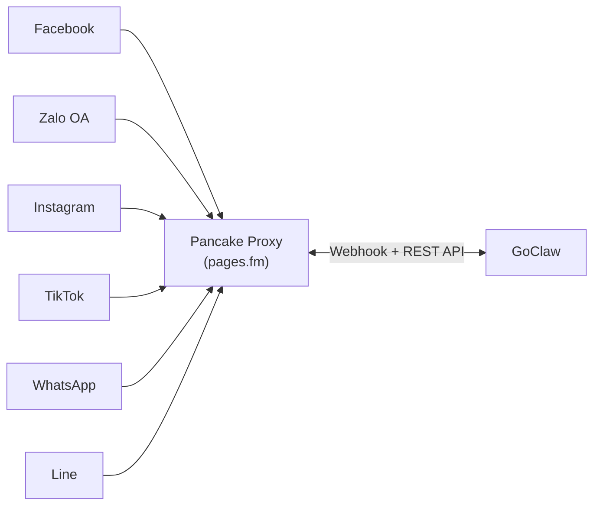

# Pancake Channel

Unified multi-platform channel proxy powered by Pancake (pages.fm). A single Pancake API key gives access to Facebook, Zalo OA, Instagram, TikTok, WhatsApp, and Line — no per-platform OAuth required.

## What is Pancake?

Pancake is a social commerce platform that provides a unified messaging proxy across multiple social networks. Instead of integrating with each platform's API individually, GoClaw connects to Pancake once and reaches users on all connected platforms through a single channel instance.

## Supported Platforms

| Platform | Max Message Length | Formatting |
|----------|-------------------|------------|
| Facebook | 2,000 | Plain text (strips markdown) |
| Zalo OA | 2,000 | Plain text (strips markdown) |
| Instagram | 1,000 | Plain text (strips markdown) |
| TikTok | 500 | Plain text, truncated at 500 chars |
| WhatsApp | 4,096 | WhatsApp-native (*bold*, _italic_) |
| Line | 5,000 | Plain text (strips markdown) |

## Setup

### Pancake-side Setup

1. Create a Pancake account at [pages.fm](https://pages.fm)
2. Connect your social pages (Facebook, Zalo OA, etc.) to Pancake
3. Generate a Pancake API key from your account settings
4. Note your Page ID from the Pancake dashboard

### GoClaw-side Setup

1. **Channels > Add Channel > Pancake**
2. Enter your credentials:
   - **API Key**: Your Pancake user-level API key
   - **Page Access Token**: Page-level token for all page APIs
   - **Page ID**: The Pancake page identifier
3. Optionally set a **Webhook Secret** for HMAC-SHA256 signature verification
4. Configure platform-specific features (inbox reply, comment reply)

That's it — one channel serves all platforms connected to that Pancake page.

### Config File Setup

For config-file-based channels (instead of DB instances):

```json
{
  "channels": {
    "pancake": {
      "enabled": true,
      "instances": [
        {
          "name": "my-facebook-page",
          "credentials": {
            "api_key": "your_pancake_api_key",
            "page_access_token": "your_page_access_token",
            "webhook_secret": "optional_hmac_secret"
          },
          "config": {
            "page_id": "your_page_id",
            "features": {
              "inbox_reply": true,
              "comment_reply": true,
              "first_inbox": true,
              "auto_react": false
            },
            "comment_reply_options": {
              "include_post_context": true,
              "filter": "all"
            }
          }
        }
      ]
    }
  }
}
```

## Configuration

| Key | Type | Default | Description |
|-----|------|---------|-------------|
| `api_key` | string | -- | User-level Pancake API key (required) |
| `page_access_token` | string | -- | Page-level token for all page APIs (required) |
| `webhook_secret` | string | -- | Optional HMAC-SHA256 verification secret |
| `page_id` | string | -- | Pancake page identifier (required) |
| `webhook_page_id` | string | -- | Native platform page ID sent in webhooks (if different from `page_id`) |
| `platform` | string | auto-detected | Platform override: facebook/zalo/instagram/tiktok/whatsapp/line |
| `features.inbox_reply` | bool | -- | Enable inbox message replies |
| `features.comment_reply` | bool | -- | Enable comment replies |
| `features.first_inbox` | bool | -- | Send a one-time DM to a commenter after their first comment reply |
| `features.auto_react` | bool | -- | Auto-like user comments on Facebook (Facebook only) |
| `auto_react_options.allow_post_ids` | list | -- | Only react to comments on these post IDs (nil = all posts) |
| `auto_react_options.deny_post_ids` | list | -- | Never react to comments on these post IDs (overrides allow) |
| `auto_react_options.allow_user_ids` | list | -- | Only react to comments from these user IDs (nil = all users) |
| `auto_react_options.deny_user_ids` | list | -- | Never react to comments from these user IDs (overrides allow) |
| `comment_reply_options.include_post_context` | bool | false | Prepend post text to comment content sent to the agent |
| `comment_reply_options.filter` | string | `"all"` | Comment filter mode: `"all"` or `"keyword"` |
| `comment_reply_options.keywords` | list | -- | Required when `filter="keyword"` — only process comments containing these keywords |
| `first_inbox_message` | string | built-in | Custom DM text sent for first-inbox feature |
| `post_context_cache_ttl` | string | `"15m"` | Cache TTL for post content fetched for comment context (e.g. `"30m"`) |
| `block_reply` | bool | -- | Override gateway block_reply (nil=inherit) |
| `allow_from` | list | -- | User/group ID allowlist |

## Architecture



- **One channel instance = one Pancake page** (serving multiple platforms)
- **Platform auto-detected** at Start() from Pancake page metadata
- **Webhook-based** — no polling, Pancake servers push events to GoClaw
- A single HTTP handler at `/channels/pancake/webhook` routes to the correct channel by page_id

## Features

### Multi-Platform Support

One Pancake channel instance can serve multiple platforms simultaneously. The platform is determined by the Pancake page metadata:

- At Start(), GoClaw calls `GET /pages` to list all pages and match the configured page_id
- The `platform` field (facebook/zalo/instagram/tiktok/whatsapp/line) is extracted from page metadata
- If platform is not configured or detection fails, defaults to "facebook" with 2,000 char limit

### Webhook Delivery

Pancake uses webhook push (not polling) for message delivery:

- GoClaw registers a single route: `POST /channels/pancake/webhook`
- All Pancake page webhooks route through one handler, dispatched by `page_id`
- Always returns HTTP 200 — Pancake suspends webhooks if >80% errors in a 30-min window
- HMAC-SHA256 signature verification via `X-Pancake-Signature` header (when `webhook_secret` is set)

Webhook payload structure:

```json
{
  "event_type": "messaging",
  "page_id": "your_page_id",
  "data": {
    "conversation": {
      "id": "pageID_senderID",
      "type": "INBOX",
      "from": { "id": "sender_id", "name": "Sender Name" },
      "assignee_ids": ["staff_id_1"]
    },
    "message": {
      "id": "msg_unique_id",
      "message": "Hello from customer",
      "attachments": [{ "type": "image", "url": "https://..." }]
    }
  }
}
```

Only `INBOX` conversation events are processed. `COMMENT` events are skipped unless `comment_reply` is enabled.

### Message Deduplication

Pancake uses at-least-once delivery, so duplicate webhook deliveries are expected:

- **Message dedup**: `sync.Map` keyed by `msg:{message_id}` with 24-hour TTL
- **Outbound echo detection**: Pre-stores message fingerprints before sending, suppresses webhook echoes of our own replies (45-second TTL)
- Background cleaner evicts stale entries every 5 minutes to prevent memory growth
- Messages missing `message_id` skip dedup (prevents shared slot collisions)

### Reply Loop Prevention

Multiple guards prevent the bot from responding to its own messages:

1. **Page self-message filter**: Skips messages where `sender_id == page_id`
2. **Staff assignee filter**: Skips messages from Pancake staff assigned to the conversation
3. **Outbound echo detection**: Matches inbound content against recently sent messages

### Media Support

**Inbound media**: Attachments arrive as URLs in the webhook payload. GoClaw includes them directly in the message content passed to the agent pipeline.

**Outbound media**: Files are uploaded via `POST /pages/{id}/upload_contents` (multipart/form-data), then sent as `content_ids` in a separate API call. Media and text are delivered sequentially:

1. Upload media files, collect attachment IDs
2. Send attachment message with content_ids
3. Follow with text message (if any)

If media upload fails, the text portion is sent anyway with a warning logged. Media paths must be absolute to prevent directory traversal.

### Message Formatting

LLM output is converted from Markdown to platform-appropriate formatting:

| Platform | Behavior |
|----------|----------|
| Facebook | Strips markdown, keeps plain text (Messenger doesn't support rich formatting) |
| WhatsApp | Converts `**bold**` to `*bold*`, `_italic_` preserved, headers stripped |
| TikTok | Strips markdown + truncates to 500 runes |
| Instagram / Zalo / Line | Strips all markdown, returns plain text |

Long messages are automatically split into chunks respecting each platform's character limit. Rune-based splitting (not byte-based) ensures multi-byte characters (CJK, Vietnamese, emoji) are not corrupted.

### Inbox vs Comment Modes

Pancake supports two conversation types:

- **INBOX**: Direct messages from users (default, always processed)
- **COMMENT**: Comments on social posts (controlled by `comment_reply` feature flag)

Conversation type is stored in message metadata as `pancake_mode` ("inbox" or "comment"), enabling agents to respond differently based on the source.

### Comment Features

When `features.comment_reply: true`, additional options control comment handling:

**Comment filter** (`comment_reply_options.filter`):
- `"all"` (default) — process all comments
- `"keyword"` — only process comments containing one of the configured `keywords`

**Post context** (`comment_reply_options.include_post_context: true`): fetches the original post text and prepends it to the comment content before sending to the agent. Useful when comments are too short to understand without context. Post content is cached (default TTL: 15 minutes, configurable via `post_context_cache_ttl`).

**Auto-react** (`features.auto_react: true`): automatically likes every valid incoming comment on Facebook (Facebook platform only). Fires independently of `comment_reply` — you can react without replying.

Scope the reactions further with `auto_react_options`:

| Field | Type | Behavior |
|-------|------|----------|
| `allow_post_ids` | list | React only on comments for these post IDs (nil = all posts) |
| `deny_post_ids` | list | Never react on these post IDs (overrides allow) |
| `allow_user_ids` | list | React only to comments from these user IDs (nil = all users) |
| `deny_user_ids` | list | Never react to comments from these user IDs (overrides allow) |

Deny lists always take precedence over allow lists. Omitting `auto_react_options` entirely means no scope filter (react to all valid comments).

**First inbox** (`features.first_inbox: true`): after replying to a comment, sends a one-time private DM to the commenter inviting them to continue via inbox. Only sent once per sender per session restart. Customize the DM text with `first_inbox_message`.

### Channel Health

API errors are mapped to channel health states:

| Error Type | HTTP Codes | Health State |
|------------|-----------|--------------|
| Auth failure | 401, 403, 4001, 4003 | Failed (token expired or invalid) |
| Rate limited | 429, 4029 | Degraded (recoverable) |
| Unknown API error | Others | Degraded (recoverable) |

Application-level failures (HTTP 200 with `success: false` in JSON body) are also detected and treated as send errors.

## Troubleshooting

| Issue | Solution |
|-------|----------|
| "api_key is required" on startup | Add `api_key` to credentials. Get it from your Pancake account settings. |
| "page_access_token is required" | Add `page_access_token` to credentials. This is the page-level token from Pancake. |
| "page_id is required" | Add `page_id` to config. Find it in your Pancake dashboard URL. |
| Token verification failed | The `page_access_token` may be expired or invalid. Regenerate from Pancake dashboard. |
| No messages received | Check Pancake webhook URL is configured: `https://your-goclaw-host/channels/pancake/webhook`. |
| Webhook signature mismatch | Verify `webhook_secret` matches the secret configured in Pancake dashboard. |
| "no channel instance for page_id" | The `page_id` in the webhook doesn't match any registered channel. Check config. |
| Platform shows as unknown | `platform` is auto-detected. Ensure the page is connected in Pancake. Can override manually. |
| Media upload fails | Media paths must be absolute. Check file exists and is readable. |
| Messages appear duplicated | This is normal — dedup handles it. If persistent, check Pancake webhook config isn't double-registered. |

## What's Next

- [Channel Overview](/channels-overview) — Channel concepts and policies
- [WhatsApp](/channel-whatsapp) — Direct WhatsApp integration
- [Telegram](/channel-telegram) — Telegram bot setup
- [Multi-Channel Setup](/recipe-multi-channel) — Configure multiple channels

<!-- goclaw-source: b9670555 | updated: 2026-04-19 -->
