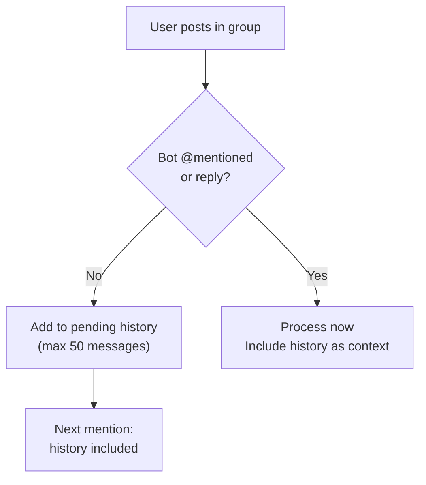

# Telegram Channel

Telegram bot integration via long polling (Bot API). Supports DMs, groups, forum topics, speech-to-text, and streaming responses.

## Setup

**Create a Telegram Bot:**
1. Message @BotFather on Telegram
2. `/newbot` → choose name and username
3. Copy the token (format: `123456:ABCDEFGHIJKLMNOPQRSTUVWxyz...`)

**Enable Telegram:**

```json
{
  "channels": {
    "telegram": {
      "enabled": true,
      "token": "YOUR_BOT_TOKEN",
      "dm_policy": "pairing",
      "group_policy": "open",
      "allow_from": ["alice", "bob"]
    }
  }
}
```

## Configuration

All config keys are in `channels.telegram`:

| Key | Type | Default | Description |
|-----|------|---------|-------------|
| `enabled` | bool | false | Enable/disable channel |
| `token` | string | required | Bot API token from BotFather |
| `proxy` | string | -- | HTTP proxy (e.g., `http://proxy:8080`) |
| `allow_from` | list | -- | User ID or username allowlist |
| `dm_policy` | string | `"pairing"` | `pairing`, `allowlist`, `open`, `disabled` |
| `group_policy` | string | `"open"` | `open`, `allowlist`, `disabled` |
| `require_mention` | bool | true | Require @bot mention in groups |
| `history_limit` | int | 50 | Pending messages per group (0=disabled) |
| `dm_stream` | bool | false | Enable streaming for DMs (edits placeholder) |
| `group_stream` | bool | false | Enable streaming for groups (new message) |
| `reaction_level` | string | `"off"` | `off`, `minimal` (⏳ only), `full` (⏳💬🛠️✅❌🔄) |
| `media_max_bytes` | int | 20MB | Max media file size |
| `link_preview` | bool | true | Show URL previews |
| `stt_proxy_url` | string | -- | STT service URL (for voice transcription) |
| `stt_api_key` | string | -- | Bearer token for STT proxy |
| `stt_timeout_seconds` | int | 30 | Timeout for STT transcription requests |
| `voice_agent_id` | string | -- | Route voice messages to specific agent |

## Group Configuration

Override per-group (and per-topic) settings using the `groups` object.

```json
{
  "channels": {
    "telegram": {
      "token": "...",
      "groups": {
        "-100123456789": {
          "group_policy": "allowlist",
          "allow_from": ["@alice", "@bob"],
          "require_mention": false,
          "topics": {
            "42": {
              "require_mention": true,
              "tools": ["web_search", "file_read"],
              "system_prompt": "You are a research assistant."
            }
          }
        },
        "*": {
          "system_prompt": "Global system prompt for all groups."
        }
      }
    }
  }
}
```

Group config keys:

- `group_policy` — Override group-level policy
- `allow_from` — Override allowlist
- `require_mention` — Override mention requirement
- `skills` — Whitelist skills (nil=all, []=none)
- `tools` — Whitelist tools (supports `group:xxx` syntax)
- `system_prompt` — Extra system prompt for this group
- `topics` — Per-topic overrides (key: topic/thread ID)

## Features

### Mention Gating

In groups, bot responds only to messages that mention it (default `require_mention: true`). When not mentioned, messages are stored in a pending history buffer (default 50 messages) and included as context when the bot is mentioned. Replying to a bot message counts as mentioning it.



### Forum Topics

Configure bot behavior per forum topic:

| Aspect | Key | Example |
|--------|-----|---------|
| Topic ID | Chat ID + topic ID | `-12345:topic:99` |
| Config lookup | Layered merge | Global → Wildcard → Group → Topic |
| Tool restrict | `tools: ["web_search"]` | Only web search in topic |
| Extra prompt | `system_prompt` | Topic-specific instructions |

### Message Formatting

Markdown output is converted to Telegram HTML with proper escaping:

```
LLM output (Markdown)
  → Extract tables/code → Convert Markdown to HTML
  → Restore placeholders → Chunk at 4,000 chars
  → Send as HTML (fallback: plain text)
```

Tables render as ASCII in `<pre>` tags. CJK characters counted as 2-column width.

### Speech-to-Text (STT)

Voice and audio messages can be transcribed:

```json
{
  "channels": {
    "telegram": {
      "stt_proxy_url": "https://stt.example.com",
      "stt_api_key": "sk-...",
      "stt_timeout_seconds": 30,
      "voice_agent_id": "voice_assistant"
    }
  }
}
```

When a user sends a voice message:
1. File is downloaded from Telegram
2. Sent to STT proxy as multipart (file + tenant_id)
3. Transcript prepended to message: `[audio: filename] Transcript: text`
4. Routed to `voice_agent_id` if configured, else default agent

### Streaming

Enable live response updates:

- **DMs** (`dm_stream`): Edits the "Thinking..." placeholder as chunks arrive
- **Groups** (`group_stream`): Sends placeholder, edits with full response

Disabled by default due to Telegram draft API issues.

### Reactions

Show emoji status on user messages. Set `reaction_level`:

- `off` — No reactions
- `minimal` — Only ⏳ (thinking)
- `full` — ⏳ (thinking) → 🛠️ (tool) → ✅ (done) or ❌ (error)

### Bot Commands

Commands processed before message enrichment:

| Command | Behavior | Restricted |
|---------|----------|-----------|
| `/help` | Show command list | -- |
| `/start` | Passthrough to agent | -- |
| `/stop` | Cancel current run | -- |
| `/stopall` | Cancel all runs | -- |
| `/reset` | Clear session history | Writers only |
| `/status` | Bot status + username | -- |
| `/tasks` | Team task list | -- |
| `/task_detail <id>` | View task | -- |
| `/addwriter` | Add group file writer | Writers only |
| `/removewriter` | Remove group file writer | Writers only |
| `/writers` | List group writers | -- |

Writers are group members allowed to run sensitive commands (`/reset`, file writes). Manage via `/addwriter` and `/removewriter` (reply to target user).

## Troubleshooting

| Issue | Solution |
|-------|----------|
| Bot not responding in groups | Check `require_mention=true` (default). Mention bot or reply to its message. |
| Media downloads fail | Verify bot has `Can read all group messages` in @BotFather settings. Check `media_max_bytes` limit. |
| STT transcription missing | Verify STT proxy URL and API key. Check logs for timeout. |
| Streaming not working | Enable `dm_stream` or `group_stream`. Ensure provider supports streaming. |
| Topic routing fails | Check topic ID in config keys (integer thread ID). Generic topic (ID=1) stripped in Telegram API. |

## What's Next

- [Overview](./overview.md) — Channel concepts and policies
- [Discord](./discord.md) — Discord bot setup
- [Browser Pairing](./browser-pairing.md) — Pairing flow
- [Session Management](../sessions.md) — Conversation history
