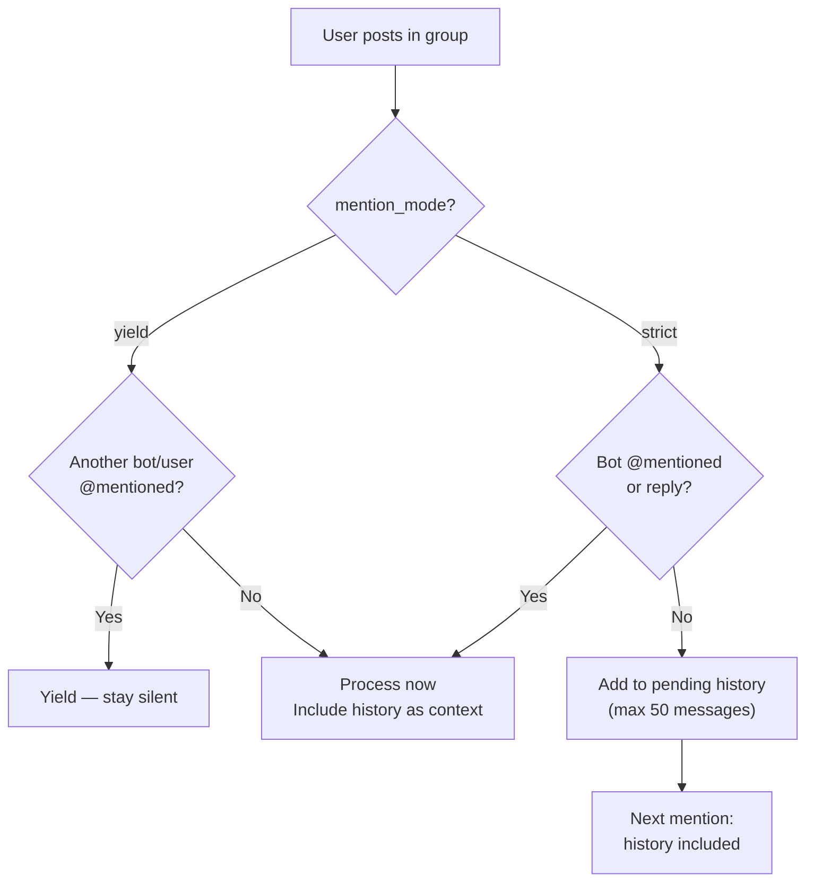

# Telegram Channel

Telegram bot integration via long polling (Bot API). Supports DMs, groups, forum topics, speech-to-text, and streaming responses.

## Setup

**Create a Telegram Bot:**
1. Message @BotFather on Telegram
2. `/newbot` → choose name and username
3. Copy the token (format: `123456:ABCDEFGHIJKLMNOPQRSTUVWxyz...`)

> **Important — Group Privacy Mode:** By default, Telegram bots run in **privacy mode** and can only see commands (`/`) and @mentions in groups. To let the bot read all group messages (required for history buffer, `require_mention: false`, and group context), message **@BotFather** → `/setprivacy` → select your bot → **Disable**. Without this, the bot will silently ignore most group messages.

**Enable Telegram:**

```json
{
  "channels": {
    "telegram": {
      "enabled": true,
      "token": "YOUR_BOT_TOKEN",
      "dm_policy": "pairing",
      "group_policy": "open",
      "allow_from": ["alice", "bob"]
    }
  }
}
```

## Configuration

All config keys are in `channels.telegram`:

| Key | Type | Default | Description |
|-----|------|---------|-------------|
| `enabled` | bool | false | Enable/disable channel |
| `token` | string | required | Bot API token from BotFather |
| `proxy` | string | -- | HTTP proxy (e.g., `http://proxy:8080`) |
| `allow_from` | list | -- | User ID or username allowlist |
| `dm_policy` | string | `"pairing"` | `pairing`, `allowlist`, `open`, `disabled` |
| `group_policy` | string | `"open"` | `open`, `allowlist`, `disabled` |
| `require_mention` | bool | true | Require @bot mention in groups |
| `mention_mode` | string | `"strict"` | `strict` = only respond when @mentioned; `yield` = respond unless another bot is @mentioned (multi-bot groups) |
| `history_limit` | int | 50 | Pending messages per group (0=disabled) |
| `dm_stream` | bool | false | Enable streaming for DMs (edits placeholder) |
| `group_stream` | bool | false | Enable streaming for groups (new message) |
| `draft_transport` | bool | false | Use `sendMessageDraft` for DM streaming (stealth preview, no per-edit notifications) |
| `reasoning_stream` | bool | true | Show reasoning tokens as a separate message before the answer |
| `block_reply` | bool | -- | Override gateway `block_reply` setting for this channel (nil = inherit) |
| `reaction_level` | string | `"off"` | `off`, `minimal` (⏳ only), `full` (⏳💬🛠️✅❌🔄) |
| `media_max_bytes` | int | 20MB | Max media file size |
| `link_preview` | bool | true | Show URL previews |
| `force_ipv4` | bool | false | Force IPv4 for all Telegram API connections |
| `api_server` | string | -- | Custom Telegram Bot API server URL (e.g. `http://localhost:8081`) |
| `stt_proxy_url` | string | -- | STT service URL (for voice transcription) |
| `stt_api_key` | string | -- | Bearer token for STT proxy |
| `stt_timeout_seconds` | int | 30 | Timeout for STT transcription requests |
| `voice_agent_id` | string | -- | Route voice messages to specific agent |

**Media upload size**: The `media_max_bytes` field enforces a hard limit on outbound media uploads sent by the agent (default 20 MB). Files exceeding this limit are silently skipped with a log entry. This does not affect inbound media received from users.

## Group Configuration

Override per-group (and per-topic) settings using the `groups` object.

```json
{
  "channels": {
    "telegram": {
      "token": "...",
      "groups": {
        "-100123456789": {
          "group_policy": "allowlist",
          "allow_from": ["@alice", "@bob"],
          "require_mention": false,
          "topics": {
            "42": {
              "require_mention": true,
              "tools": ["web_search", "file_read"],
              "system_prompt": "You are a research assistant."
            }
          }
        },
        "*": {
          "system_prompt": "Global system prompt for all groups."
        }
      }
    }
  }
}
```

Group config keys:

- `group_policy` — Override group-level policy
- `allow_from` — Override allowlist
- `require_mention` — Override mention requirement
- `mention_mode` — Override mention mode (`strict` or `yield`)
- `skills` — Whitelist skills (nil=all, []=none)
- `tools` — Whitelist tools (supports `group:xxx` syntax)
- `system_prompt` — Extra system prompt for this group
- `topics` — Per-topic overrides (key: topic/thread ID)

## Features

### Mention Gating

In groups, bot responds only to messages that mention it (default `require_mention: true`). When not mentioned, messages are stored in a pending history buffer (default 50 messages) and included as context when the bot is mentioned. Replying to a bot message counts as mentioning it.

#### Mention Modes

| Mode | Behavior | Use case |
|------|----------|----------|
| `strict` (default) | Only respond when @mentioned or replied to | Single-bot groups |
| `yield` | Respond to all messages UNLESS another bot/user is @mentioned | Multi-bot shared groups |

**Yield mode** enables multiple bots to coexist in one group without conflicts:
- Bot responds to all messages where no specific @mention targets another bot
- If a user @mentions a different bot, this bot stays silent (yields)
- Messages from other bots are automatically skipped to prevent infinite cross-bot loops
- Cross-bot @commands still work (e.g., `@my_bot help` sent by another bot)

```json
{
  "channels": {
    "telegram": {
      "mention_mode": "yield",
      "require_mention": false
    }
  }
}
```



### Group Message Annotation

In group chats, each message is prefixed with a `[From:]` annotation so the agent knows who is speaking:

```
[From: @username (Display Name)]
Message content here
```

The label format depends on available user data:
- Username + display name: `@username (Display Name)`
- Username only: `@username`
- Display name only: `Display Name`

This annotation is also added to DM messages for consistent sender identification.

### Group Concurrency

Group sessions support up to **3 concurrent agent runs**. When this limit is reached, additional messages are queued. This applies to all group and forum topic contexts.

### Forum Topics

Configure bot behavior per forum topic:

| Aspect | Key | Example |
|--------|-----|---------|
| Topic ID | Chat ID + topic ID | `-12345:topic:99` |
| Config lookup | Layered merge | Global → Wildcard → Group → Topic |
| Tool restrict | `tools: ["web_search"]` | Only web search in topic |
| Extra prompt | `system_prompt` | Topic-specific instructions |

### Message Formatting

Markdown output is converted to Telegram HTML with proper escaping:

```
LLM output (Markdown)
  → Extract tables/code → Convert Markdown to HTML
  → Restore placeholders → Chunk at 4,000 chars
  → Send as HTML (fallback: plain text)
```

Tables render as ASCII in `<pre>` tags. CJK characters counted as 2-column width.

### Speech-to-Text (STT)

Voice and audio messages can be transcribed:

```json
{
  "channels": {
    "telegram": {
      "stt_proxy_url": "https://stt.example.com",
      "stt_api_key": "sk-...",
      "stt_timeout_seconds": 30,
      "voice_agent_id": "voice_assistant"
    }
  }
}
```

When a user sends a voice message:
1. File is downloaded from Telegram
2. Sent to STT proxy as multipart (file + tenant_id)
3. Transcript prepended to message: `[audio: filename] Transcript: text`
4. Routed to `voice_agent_id` if configured, else default agent

### Streaming

Enable live response updates:

- **DMs** (`dm_stream`): Edits the "Thinking..." placeholder as chunks arrive. Uses `sendMessage+editMessageText` by default; set `draft_transport: true` to use `sendMessageDraft` (stealth preview, no per-edit notifications, but may cause "reply to deleted message" artifacts on some clients).
- **Groups** (`group_stream`): Sends placeholder, edits with full response

Disabled by default. When enabled with `reasoning_stream: true` (default), reasoning tokens appear as a separate message before the final answer.

### Reactions

Show emoji status on user messages. Set `reaction_level`:

- `off` — No reactions (default)
- `minimal` — Only terminal states (done/error)
- `full` — All status transitions with debouncing and stall detection

**Status → Emoji mapping** (use `/reactions` in chat to see this legend):

| Status | Emoji | Description |
|--------|-------|-------------|
| queued | 👀 | Waiting to process |
| thinking | 🤔 | Processing your request |
| tool | ✍ | Executing a tool |
| coding | 👨‍💻 | Running code |
| web | ⚡ | Browsing / API call |
| done | 👍 | Completed |
| error | 💔 | Something went wrong |
| stallSoft | 🥱 | No activity for 10s |
| stallHard | 😨 | No activity for 30s |

Each status has fallback emoji variants in case the primary emoji is restricted by the chat's allowed reactions. Intermediate states (thinking, tool, etc.) are debounced at 700ms to avoid reaction spam.

### Bot Commands

Commands processed before message enrichment:

| Command | Behavior | Restricted |
|---------|----------|-----------|
| `/help` | Show command list | -- |
| `/start` | Passthrough to agent | -- |
| `/stop` | Cancel current run | -- |
| `/stopall` | Cancel all runs | -- |
| `/reset` | Clear session history | Writers only |
| `/status` | Bot status + username | -- |
| `/tasks` | Team task list | -- |
| `/task_detail <id>` | View task | -- |
| `/subagents` | List all active subagent tasks with status | -- |
| `/subagent <id>` | Show detailed view of a subagent task (DB-backed) | -- |
| `/reactions` | Show reaction emoji legend (status → emoji mapping) | -- |
| `/addwriter` | Add group file writer | Writers only |
| `/removewriter` | Remove group file writer | Writers only |
| `/writers` | List group writers | -- |

Writers are group members allowed to run sensitive commands (`/reset`, file writes). Manage via `/addwriter` and `/removewriter` (reply to target user).

## Networking Isolation

Each Telegram instance maintains an isolated HTTP transport — no shared connection pools between bots. This prevents cross-bot contention and enables per-account network routing.

| Option | Default | Description |
|--------|---------|-------------|
| `force_ipv4` | false | Force IPv4 for all connections. Useful for sticky routing or when IPv6 is broken/blocked. |
| `proxy` | -- | HTTP proxy URL for this specific bot instance (e.g. `http://proxy:8080`). |
| `api_server` | -- | Custom Telegram Bot API server. Useful with local Bot API server or private deployments. |

**Sticky IPv4 fallback**: When `force_ipv4: true`, the dialer is locked to `tcp4` at startup, ensuring consistent source IP across all requests to Telegram. This helps with rate limit management in environments with unstable IPv6.

```json
{
  "channels": {
    "telegram": {
      "token": "...",
      "force_ipv4": true,
      "proxy": "http://proxy.example.com:8080",
      "api_server": "http://localhost:8081"
    }
  }
}
```

## Group-to-Supergroup Migration

When a Telegram group is upgraded to a supergroup, the chat ID changes. GoClaw handles this automatically:

- **Inbound detection** — When a `MigrateToChatID` message arrives, GoClaw updates all DB references (paired_devices, sessions, channel_contacts) atomically and invalidates in-memory caches
- **Send-path retry** — If a send fails because the group was migrated, GoClaw detects the new chat ID from the Telegram API error, updates DB, and retries the send automatically
- **Idempotent** — Safe to trigger multiple times; duplicate migrations are no-ops

No configuration needed. Check logs for `telegram: migrating group chat` entries if troubleshooting.

## Troubleshooting

| Issue | Solution |
|-------|----------|
| Bot not responding in groups | Ensure privacy mode is disabled via @BotFather (`/setprivacy` → Disable). Then check `require_mention=true` (default) — mention bot or reply to its message. For multi-bot groups, try `mention_mode: "yield"`. |
| Media downloads fail | Verify bot has `Can read all group messages` in @BotFather (`/setprivacy` → Disable). Check `media_max_bytes` limit. |
| STT transcription missing | Verify STT proxy URL and API key. Check logs for timeout. |
| Streaming not working | Enable `dm_stream` or `group_stream`. Ensure provider supports streaming. |
| Topic routing fails | Check topic ID in config keys (integer thread ID). Generic topic (ID=1) stripped in Telegram API. |

## What's Next

- [Overview](/channels-overview) — Channel concepts and policies
- [Discord](/channel-discord) — Discord bot setup
- [Browser Pairing](/channel-browser-pairing) — Pairing flow
- [Sessions & History](/sessions-and-history) — Conversation history

<!-- goclaw-source: 050aafc9 | updated: 2026-04-09 -->
