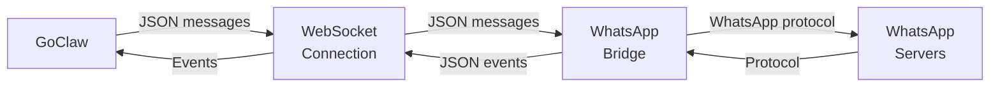

# WhatsApp Channel

WhatsApp integration via external WebSocket bridge. GoClaw connects to a bridge service (e.g., whatsapp-web.js) that handles the WhatsApp protocol.

## Setup

**Prerequisites:**
- Running WhatsApp bridge service (e.g., whatsapp-web.js)
- Bridge URL accessible to GoClaw

**Start WhatsApp Bridge:**

Example using whatsapp-web.js:

```bash
npm install -g whatsapp-web.js
# Start bridge server on localhost:3001
whatsapp-bridge --port 3001
```

Your bridge should expose a WebSocket endpoint (e.g., `ws://localhost:3001`).

**Enable WhatsApp:**

```json
{
  "channels": {
    "whatsapp": {
      "enabled": true,
      "bridge_url": "ws://localhost:3001",
      "dm_policy": "open",
      "group_policy": "open",
      "allow_from": []
    }
  }
}
```

## Configuration

All config keys are in `channels.whatsapp`:

| Key | Type | Default | Description |
|-----|------|---------|-------------|
| `enabled` | bool | false | Enable/disable channel |
| `bridge_url` | string | required | WebSocket URL to bridge (e.g., `ws://bridge:3001`) |
| `allow_from` | list | -- | User/group ID allowlist |
| `dm_policy` | string | `"open"` | `open`, `allowlist`, `pairing`, `disabled` |
| `group_policy` | string | `"open"` | `open`, `allowlist`, `disabled` |
| `block_reply` | bool | -- | Override gateway block_reply (nil=inherit) |

## Features

### Bridge Connection

GoClaw connects to the bridge via WebSocket and sends/receives JSON messages.



### DM and Group Support

Bridge detects group chats via `@g.us` suffix in chat ID:

- **DM**: `"1234567890@c.us"`
- **Group**: `"123-456@g.us"`

Policies apply accordingly (DM policy for DMs, group policy for groups).

In group chats, messages include a `[From:]` annotation with the sender's display name, allowing the agent to distinguish between participants.

### Message Format

Messages are JSON objects:

```json
{
  "from": "1234567890@c.us",
  "body": "Hello!",
  "type": "chat",
  "id": "message_id_123"
}
```

Media is passed as array of file paths:

```json
{
  "from": "1234567890@c.us",
  "body": "Photo",
  "media": ["/tmp/photo.jpg"],
  "type": "image"
}
```

### Auto-Reconnect

If bridge connection drops:
- Exponential backoff: 1s → 30s max
- Continuous retry attempts
- Logs warn on reconnect failures

## Common Patterns

### Sending to a Chat

```go
manager.SendToChannel(ctx, "whatsapp", "1234567890@c.us", "Hello!")
```

### Checking if Chat is a Group

```go
isGroup := strings.HasSuffix(chatID, "@g.us")
```

## Troubleshooting

| Issue | Solution |
|-------|----------|
| "Connection refused" | Verify bridge is running. Check `bridge_url` is correct and accessible. |
| "WebSocket: close normal closure" | Bridge shut down gracefully. Restart bridge service. |
| Continuous reconnect attempts | Bridge is down or unreachable. Check bridge logs. |
| Messages not received | Verify bridge is receiving WhatsApp events. Check bridge logs. |
| Group detection fails | Ensure chat ID ends with `@g.us` for groups, `@c.us` for DMs. |
| Media not sent | Ensure file paths are accessible to bridge. Check bridge supports media. |

## What's Next

- [Overview](/channels-overview) — Channel concepts and policies
- [Telegram](/channel-telegram) — Telegram bot setup
- [Larksuite](/channel-feishu) — Larksuite integration
- [Browser Pairing](/channel-browser-pairing) — Pairing flow

<!-- goclaw-source: a47d7f9f | updated: 2026-03-31 -->
