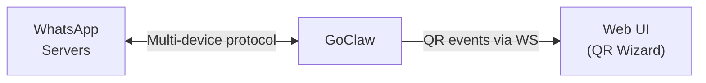

# WhatsApp Channel

Direct WhatsApp integration. GoClaw connects directly to WhatsApp's multi-device protocol — no external bridge or Node.js service required. Auth state is stored in the database (PostgreSQL or SQLite).

## Setup

1. **Channels > Add Channel > WhatsApp**
2. Choose an agent, click **Create & Scan QR**
3. Scan the QR code with WhatsApp (You > Linked Devices > Link a Device)
4. Configure DM/group policies as needed

That's it — no bridge to deploy, no extra containers.

### Config File Setup

For config-file-based channels (instead of DB instances):

```json
{
  "channels": {
    "whatsapp": {
      "enabled": true,
      "dm_policy": "pairing",
      "group_policy": "pairing"
    }
  }
}
```

## Configuration

All config keys are in `channels.whatsapp` (config file) or the instance config JSON (DB):

| Key | Type | Default | Description |
|-----|------|---------|-------------|
| `enabled` | bool | `false` | Enable/disable channel |
| `allow_from` | list | -- | User/group ID allowlist |
| `dm_policy` | string | `"pairing"` | `pairing`, `open`, `allowlist`, `disabled` |
| `group_policy` | string | `"pairing"` (DB) / `"open"` (config) | `pairing`, `open`, `allowlist`, `disabled` |
| `require_mention` | bool | `false` | Only respond in groups when bot is @mentioned |
| `history_limit` | int | `200` | Max pending group messages for context (0=disabled) |
| `block_reply` | bool | -- | Override gateway block_reply (nil=inherit) |

## Architecture



- **GoClaw** connects directly to WhatsApp servers via multi-device protocol
- Auth state is stored in the database — survives restarts
- One channel instance = one WhatsApp phone number
- No bridge, no Node.js, no shared volumes

## Features

### QR Code Authentication

WhatsApp requires QR code scanning to link a device. The flow:

1. GoClaw generates QR code for device linking
2. QR string is encoded as PNG (base64) and sent to the UI wizard via WS event
3. Web UI displays the QR image
4. User scans with WhatsApp (You > Linked Devices > Link a Device)
5. Connection confirmed via auth event

**Re-authentication**: Use the "Re-authenticate" button in the channels table to force a new QR scan (logs out the current WhatsApp session and deletes stored device credentials).

### DM and Group Policies

WhatsApp groups have chat IDs ending in `@g.us`:

- **DM**: `"1234567890@s.whatsapp.net"`
- **Group**: `"120363012345@g.us"`

Available policies:

| Policy | Behavior |
|--------|----------|
| `open` | Accept all messages |
| `pairing` | Require pairing code approval (default for DB instances) |
| `allowlist` | Only users in `allow_from` |
| `disabled` | Reject all messages |

Group `pairing` policy: unpaired groups receive a pairing code reply. Approve via `goclaw pairing approve <CODE>`.

### @Mention Gating

When `require_mention` is `true`, the bot only responds in group chats when explicitly @mentioned. Unmentioned messages are recorded for context — when the bot is mentioned, recent group history is prepended to the message.

Fails closed — if the bot's JID is unknown, messages are ignored.

### Media Support

GoClaw downloads incoming media directly (images, video, audio, documents, stickers) to temporary files, then passes them to the agent pipeline.

Supported inbound media types: image, video, audio, document, sticker (max 20 MB each).

Outbound media: GoClaw uploads files to WhatsApp's servers with proper encryption. Supports image, video, audio, and document types with captions.

### Message Formatting

LLM output is converted from Markdown to WhatsApp's native formatting:

| Markdown | WhatsApp | Rendered |
|----------|----------|----------|
| `**bold**` | `*bold*` | **bold** |
| `_italic_` | `_italic_` | _italic_ |
| `~~strikethrough~~` | `~strikethrough~` | ~~strikethrough~~ |
| `` `inline code` `` | `` `inline code` `` | `code` |
| `# Header` | `*Header*` | **Header** |
| `[text](url)` | `text url` | text url |
| `- list item` | `• list item` | • list item |

Fenced code blocks are preserved as ` ``` `. HTML tags from LLM output are pre-processed to Markdown equivalents before conversion. Long messages are automatically chunked at ~4096 characters, splitting at paragraph or line boundaries.

### Typing Indicators

GoClaw shows "typing..." in WhatsApp while the agent processes a message. WhatsApp clears the indicator after ~10 seconds, so GoClaw refreshes every 8 seconds until the reply is sent.

### Auto-Reconnect

Reconnection is handled automatically. If the connection drops:
- Built-in reconnect logic handles retry with exponential backoff
- Channel health status updated (degraded → healthy on reconnect)
- No manual reconnect loop needed

### LID Addressing

WhatsApp uses dual identity: phone JID (`@s.whatsapp.net`) and LID (`@lid`). Groups may use LID addressing. GoClaw normalizes to phone JID for consistent policy checks, pairing lookups, and allowlists.

## Troubleshooting

| Issue | Solution |
|-------|----------|
| No QR code appears | Check GoClaw logs. Ensure the server can reach WhatsApp servers (ports 443, 5222). |
| QR scanned but no auth | Auth state may be corrupted. Use "Re-authenticate" button or restart the channel. |
| Messages not received | Check `dm_policy` and `group_policy`. If `pairing`, the user/group needs approval via `goclaw pairing approve`. |
| Media not received | Check GoClaw logs for "media download failed". Ensure temp directory is writable. Max 20 MB per file. |
| Typing indicator stuck | GoClaw auto-cancels typing when reply is sent. If stuck, WhatsApp connection may have dropped — check channel health. |
| Group messages ignored | Check `group_policy`. If `pairing`, the group needs approval. If `require_mention` is true, @mention the bot. |
| "logged out" in logs | WhatsApp revoked the session. Use "Re-authenticate" button to scan a new QR code. |
| `bridge_url` error on startup | `bridge_url` is no longer supported. WhatsApp now runs natively — remove `bridge_url` from config/credentials. |

## Migrating from Bridge

If you previously used the Baileys bridge (`bridge_url` config):

1. Remove `bridge_url` from your channel config or credentials
2. Remove/stop the bridge container (no longer needed)
3. Delete the bridge shared volume (`wa_media`)
4. Re-authenticate via QR scan in the UI (existing bridge auth state is not compatible)

GoClaw will detect old `bridge_url` config and show a clear migration error.

## What's Next

- [Overview](/channels-overview) — Channel concepts and policies
- [Telegram](/channel-telegram) — Telegram bot setup
- [Larksuite](/channel-feishu) — Larksuite integration
- [Browser Pairing](/channel-browser-pairing) — Pairing flow

<!-- goclaw-source: whatsapp-direct | updated: 2026-04-07 -->
