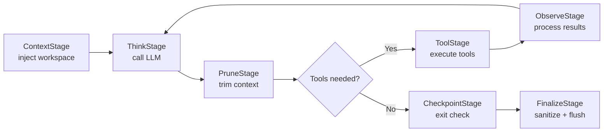
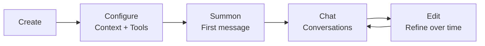

# Agents Explained

> What agents are, how they work, and the difference between open and predefined.

## Overview

An agent in GoClaw is an LLM with a personality, tools, and memory. You configure what it knows (context files), what it can do (tools), and which LLM powers it (provider + model). Each agent runs in its own pipeline, handling conversations independently.

## What Makes an Agent

An agent combines four things:

1. **LLM** — The language model that generates responses (provider + model)
2. **Context Files** — Markdown files that define personality, knowledge, and rules
3. **Tools** — What the agent can do (search, code, browse, etc.)
4. **Memory** — Long-term facts persisted across conversations

## How the Agent Pipeline Works

Every turn runs through the **8-stage pipeline** (context → think → prune → act → observe → checkpoint → memory → finalize). There is no legacy "think → act → observe" shortcut — all agents always use the full pipeline.



The loop repeats up to 20 iterations per turn. GoClaw detects tool loop patterns: a **warning** is raised after 3 identical consecutive calls, and the loop is **force-stopped** after 5 identical no-progress calls. `exec`/`bash` tools and MCP bridge tools (`mcp_*` prefix) are treated as **neutral** — they neither reset nor increment the read-only streak.

## Agent Types

GoClaw has two agent types with different sharing models:

### Open Agents

Each user gets their own complete copy of all context files. Every user can fully customize the agent's personality, instructions, and behavior — the agent adapts independently per user. Files persist across sessions.

- All 7 context files are per-user (including MEMORY.md)
- Users can read and edit any file (SOUL.md, IDENTITY.md, AGENTS.md, USER.md, etc.)
- New users start from agent-level templates, then diverge as they customize
- Best for: personal assistants, individual workflows, rapid prototyping and testing (each user can tweak personality without affecting others)

### Predefined Agents

The agent has a fixed, shared personality that no user can change through chat. Each user only gets personal profile files. Think of it as a company chatbot — same brand voice for everyone, but it knows who you are.

- 4 context files shared across all users (SOUL, IDENTITY, AGENTS, TOOLS) — read-only from chat
- 3 files per-user (USER.md, USER_PREDEFINED.md, BOOTSTRAP.md)
- Shared files can only be edited from the management dashboard (not through conversations)
- Best for: team bots, branded assistants, customer support where consistent personality matters

| Aspect | Open | Predefined |
|--------|------|-----------|
| Agent-level files | Templates (copied to each user) | 4 shared (SOUL, IDENTITY, AGENTS, TOOLS) |
| Per-user files | All 7 | 3 (USER.md, USER_PREDEFINED.md, BOOTSTRAP.md) |
| User can edit via chat | All files | USER.md only |
| Personality | Diverges per user | Fixed, same for everyone |
| Use case | Personal assistant | Team/company bot |

## Context Files

Every agent has up to 7 context files that shape its behavior:

| File | Purpose | Example Content |
|------|---------|----------------|
| `AGENTS.md` | Operating instructions, memory rules, safety guidelines | "Always save important facts to memory..." |
| `SOUL.md` | Personality and tone | "You are a friendly coding mentor..." |
| `IDENTITY.md` | Name, avatar, greeting | "Name: CodeBot, Emoji: 🤖" |
| `TOOLS.md` | Tool usage guidance *(loaded from filesystem only — not DB-routed, excluded from context file interceptor)* | "Use web_search for current events..." |
| `USER.md` | User profile, timezone, preferences | "Timezone: Asia/Saigon, Language: Vietnamese" |
| `USER_PREDEFINED.md` | Predefined agent user profile *(predefined agents only, replaces USER.md at agent level)* | "Team member info, shared preferences..." |
| `BOOTSTRAP.md` | First-run ritual (auto-deleted after completion) | "Introduce yourself and learn about the user..." |

Plus `MEMORY.md` — persistent notes auto-updated by the agent (routed to the memory system).

Context files are Markdown. Edit them via the web dashboard, API, or let the agent modify them during conversations.

### Truncation

Large context files are automatically truncated to fit the LLM's context window:
- Per-file limit: 20,000 characters
- Total budget: 24,000 characters
- Truncation keeps 70% from the start and 20% from the end

## Agent Lifecycle



1. **Create** — Define agent name, provider, model via dashboard or API
2. **Configure** — Write context files, set tool permissions
3. **Summon** — Send the first message; bootstrap files are seeded automatically
4. **Chat** — Ongoing conversations with memory and tool use
5. **Edit** — Refine context files, adjust settings as needed

## Agent Access Control

When a user tries to access an agent, GoClaw checks in order:

1. Does the agent exist?
2. Is it the default agent? → Allow (everyone can use the default)
3. Is the user the owner? → Allow with owner role
4. Does the user have a share record? → Allow with shared role

Roles: `admin` (full control), `operator` (use + edit), `viewer` (read-only)

## Agent Routing

The `bindings` config maps channels to agents:

```jsonc
{
  "bindings": {
    "telegram": {
      "direct": {
        "386246614": "code-helper"  // This user talks to code-helper
      },
      "group": {
        "-100123456": "team-bot"    // This group uses team-bot
      }
    }
  }
}
```

Unbound conversations go to the default agent.

## Common Issues

| Problem | Solution |
|---------|----------|
| Agent ignores instructions | Check SOUL.md and AGENTS.md content; ensure context files aren't truncated |
| "Agent not found" error | Verify agent exists in dashboard; check `agents.list` in config |
| Context files not updating | For predefined agents, shared files update for all users; per-user files need per-user edits |

## Agent Status

An agent can be in one of four states:

| Status | Meaning |
|--------|---------|
| `active` | Agent is running and accepting conversations |
| `inactive` | Agent is disabled; conversations are rejected |
| `summoning` | Agent is being initialized for the first time |
| `summon_failed` | Initialization failed; check provider config and model availability |

## Self-Evolution

Predefined agents with `self_evolve` enabled can update their own `SOUL.md` during conversations. This allows the agent's tone and style to evolve over time based on interactions. The update is applied at the agent level and affects all users. Other shared files (IDENTITY.md, AGENTS.md) remain protected and can only be edited from the dashboard.

In v3, evolution goes further: agents with `self_evolution_metrics` enabled track tool usage and retrieval patterns, and agents with `self_evolution_suggestions` enabled can auto-apply prompt/tool adaptations. See [Agent Evolution](/agent-evolution) for details.

## System Prompt Modes

GoClaw builds the system prompt in two modes:

- **PromptFull** — used for main agent runs. Includes all 19+ sections: skills, MCP tools, memory recall, user identity, messaging, silent-reply rules, and full context files.
- **PromptMinimal** — used for subagents (spawned via `spawn` tool) and cron jobs. Stripped-down context with only the essential sections (tooling, safety, workspace, bootstrap files). Reduces startup time and token usage for lightweight operations.

## NO_REPLY Suppression

Agents can signal `NO_REPLY` in their final response to suppress sending a visible reply to the user. GoClaw detects this string during response finalization and skips message delivery entirely — a "silent completion." This is used internally by the memory flush agent when it has nothing to store, and can be used in custom agent instructions for similar silent-operation scenarios.

## Mid-Loop Compaction

During long-running tasks, GoClaw triggers context compaction **mid-loop** — not just after a run completes. When prompt tokens exceed 75% of the context window (configurable via `MaxHistoryShare`, default `0.75`), the agent summarizes the first ~70% of in-memory messages, keeping the last ~30%, then continues iterating. This prevents context overflow without aborting the current task.

## Auto-Summarization and Memory Flush

After each conversation run, GoClaw evaluates whether to compact session history:

- **Trigger**: history exceeds 50 messages OR estimated tokens exceed 75% of context window
- **Memory flush first** (synchronous): agent writes important facts to `memory/YYYY-MM-DD.md` files before history is truncated
- **Summarize** (background): LLM summarizes older messages; history is truncated to the last 4 messages; summary is saved for the next session

In v3, the [3-Tier Memory](/memory-system) system adds async consolidation on top: episodic workers extract facts, semantic workers abstract them, and dreaming workers synthesize novel insights — all driven by the DomainEventBus.

## Identity Anchoring

Predefined agents have built-in protection against social engineering. If a user tries to convince the agent to ignore its SOUL.md or act outside its defined identity, the agent is designed to resist. Shared identity files are injected into the system prompt at a level that takes precedence over user instructions.

## Subagent Enhancements

When an agent spawns subagents via the `spawn` tool, the following capabilities apply:

### Per-Edition Rate Limiting

The `Edition` struct enforces two tenant-scoped limits on subagent usage:

| Field | Description |
|-------|-------------|
| `MaxSubagentConcurrent` | Max number of subagents running in parallel per tenant |
| `MaxSubagentDepth` | Max nesting depth — prevents unbounded delegation chains |

These are set per edition and enforced at spawn time.

### Token Cost Tracking

Each subagent accumulates per-call input and output token counts. Totals are persisted in the database and included in announce messages, giving the parent agent full visibility into delegation cost.

### WaitAll Orchestration

`spawn(action=wait, timeout=N)` blocks the parent until all previously spawned children complete. This enables fan-out/fan-in patterns without polling.

### Auto-Retry with Backoff

Configurable `MaxRetries` (default `2`) with linear backoff handles transient LLM failures automatically. The parent is only notified on permanent failure after all retries are exhausted.

### SubagentDenyAlways

Subagents cannot spawn nested subagents — the `team_tasks` tool is blocked in subagent context. All delegation must originate from a top-level agent.

### Producer-Consumer Announce Queue

Staggered subagent results are queued and merged into a single LLM run announcement on the parent side. This reduces unnecessary parent wake-ups when multiple subagents finish at different times.

## What's Next

- [Sessions and History](/sessions-and-history) — How conversations persist
- [Tools Overview](/tools-overview) — What tools agents can use
- [Memory System](/memory-system) — Long-term memory and search

<!-- goclaw-source: 050aafc9 | updated: 2026-04-09 -->
